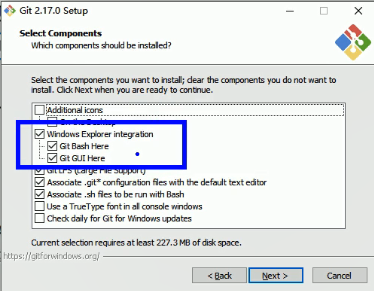
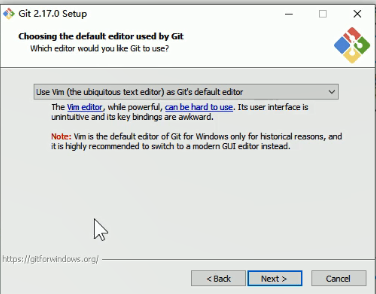
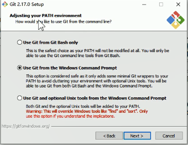
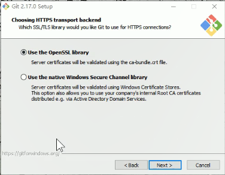
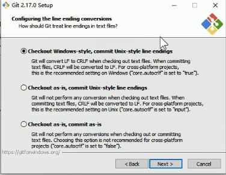
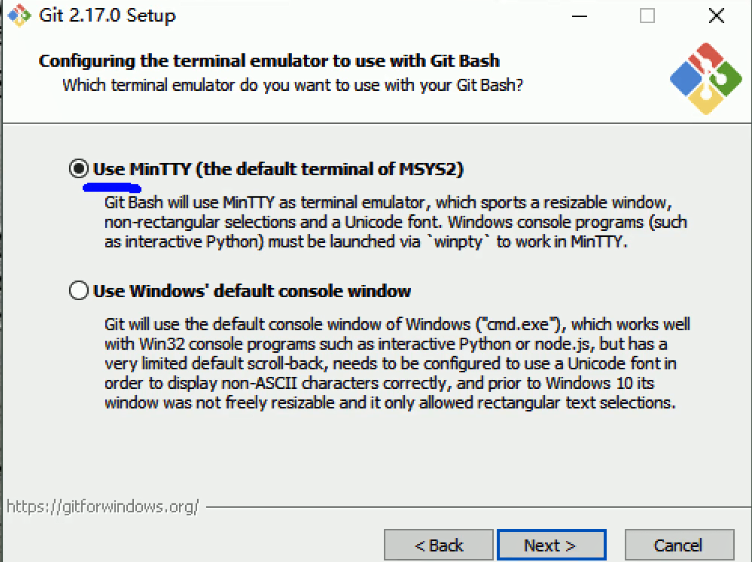

# 版本控制

应该具备的功能

1. 协同修改
   1. 多人并行的修改服务端的一个文件
2. 数据备份
3. 版本管理
4. 权限管理
5. 历史记录
6. 分支管理

# Git的优势

➢大部分操作在本地完成，不需要联网

➢完整性保证I

➢尽可能添加数据而不是删除或修改数据

➢分支操作非常快捷流畅

➢与Linux命令全面兼容

# 安装

集成右键菜单功能

`Git LFS` ：支持大文件

`Associate .git*` ：打开 Git 默认文件的文本编辑器

`Associate .sh xxx` ：允不允许 git 打开 .sh 的文件

保持默认设置就好了

这个是选择默认的文本编辑器 随意 

这一步是修改环境变量的

第一个选项：不修改环境变量，只能在 git bash 中使用 git 

第二个是修改环境变量：如果想要在 cmd 中使用 git 命令 就选这个

第三个选项：装一个 unix 适配器 ，不选这个

选择本地库与远程库的 链接方式

第一种：选上面这个就好了

配置换行符的地方

也是默认第一项

使用终端的样式

第一个：Git 默认的终端

第二个：windows 的 cmd 样式

选第一个 舒服一点

没截图的操作都是直接 next