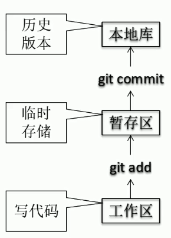
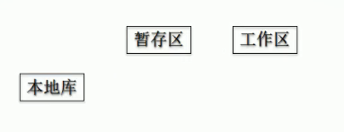

git 和代码托管中心

局域网环境下

* GitLab 服务器

外网环境

* GitHub
* 码云


---

# 查看配置文件

## 查看全局git配置文件


```shell
# 进入根目录
cd ~
pwd
# 找到全局的配置文件 文件名是  .gitconfig 
ls -lA|grep git*
# 查看也行 修改也行
cat .gitconfig
```


## 查看仓库配置文件

```shell
# 在仓库路径下
vim .git/config
cat .git/config
```


# 本地库初始化


```shell
git init
# 会生成一个 .git 隐藏文件。里面是一些配置
```

# 设置签名

假设：

用户名 ：tom

Email 地址 ：good@zfl.com

用户名 和 email 可以随便给

他们不是 登录时候用的用户名和密码

## 命令：

项目级别/仓库级别 ：仅在当前本地范围内有效

* `git config user.name tom`
* `git config user.email good@zfl.com`

操作系统用户级别 ：登录当前操作系统的用户的范围

* `git config --global user.name tom_glb`
* `git config --global user.email good@zfl.com`

## 优先级 

1. 就近原则
   1. 项目级别 优先于 系统用户级别 ，二者都有时 采用项目级别的签名
   2. 如果只有系统级别的签名 ，就以系统用户级别签名为准
2. 二者都没有是不允许的

## 信息保存位置

在当前仓库下

`cat .git/config`

```shell
$ cat .git/config
[core]
        repositoryformatversion = 0
        filemode = false
        bare = false
        logallrefupdates = true
        symlinks = false
        ignorecase = true
[user]
        name = tom
        email = good@zfl.com
```


# git add

`git add file` ：将文件保存到暂存区用的

file 可以是 `.`  表示所有被修改的文件


# git rm --cached filename

撤销文件的 add 操作


# git commit -m "提交的注释"

git commit 后面可以跟文件名，指定提交什么文件

`git commit -m "message" filename.txt`


# git log 

查看历史记录 ，可以查到提交的版本号，用来回滚

## `git log --pretty=oneline` 

将数据显示到一行内

```shell
Administrator@DESKTOP-PH53PIP MINGW64 /e/WeChat (master)
$ git log --pretty=oneline
#******************************************************
版本号  指针  版本信息
2a717423a9055432ef873bd434dc4b1e9c1c7f50 (HEAD -> master) four commit
8990cb230f8cc7f6ee9d11b3b5f8312aad97138c commit for the third time
86e709cd23753d0436a2568936c2ff0e392bec33 second commit
2c6ab1f347fcce987b951d3fd945ae45a8a2758b first commit
```


## `git log --oneline` 

更加简洁的方式显示日志信息

```shell
$ git log --oneline
2a71742 (HEAD -> master) four commit
8990cb2 commit for the third time
86e709c second commit
2c6ab1f first commit
```


## `git reflog`

`Head@{1}` 1 代表移动到这个版本需要移动多少 步

```shell
Administrator@DESKTOP-PH53PIP MINGW64 /e/WeChat (master)
$ git reflog
2a71742 (HEAD -> master) HEAD@{0}: commit: four commit
8990cb2 HEAD@{1}: commit: commit for the third time
86e709c HEAD@{2}: commit: second commit
2c6ab1f HEAD@{3}: commit (initial): first commit

```


# 版本替换

##  `git reset --hard 版本号`

这个是基于索引的操作  是推荐用法

```shell
# 随便一个获取日志的命令 反正能获取历史版本的版本号就行
$ git reflog
#*************************************
2c6ab1f (HEAD -> master) HEAD@{0}: reset: moving to 2c6ab1f
2a71742 HEAD@{1}: reset: moving to 2a71742
8990cb2 HEAD@{2}: reset: moving to 8990cb2
2a71742 HEAD@{3}: commit: four commit
8990cb2 HEAD@{4}: commit: commit for the third time
86e709c HEAD@{5}: commit: second commit
2c6ab1f (HEAD -> master) HEAD@{6}: commit (initial): first commit
#*************************************
# 比如说 当前版本是 (HEAD -> master) 这个 ，想要去某个版本 比如 HEAD@{3}: 这个版本 可以这样
git reset --hard 2z71742
```


## `git reset --hard HEAD^`

 只能用于版本后退，有多少个 `^` 就能回退多少个版本

## `git reset --hard HEAD~n`

表示后退 n 步的意思

也是只能用于版本后退

## reset 命令的三个参数对比

### `--soft`

* 仅仅在本地仓库移动 HEAD 指针



* 从上图所示， `--soft` 知识改变本地仓库指针的变化
* 查看当前状态会发现  有文件被 add 了 但是没有被 commit 到本地仓库

### `--mixed`

* 在本地仓库 移动 HEAD 指针
* 重置暂存区（就是 git add ）那个区


* 从上图所示，本地仓库和暂存区的 HEAD 指针变化了 ，那么就相当于工作区有了变化，因为他跟 本地仓库和暂存区不一致
* `git status` 查看状态可以看出 ，工作区有了变化  需要 add 一下

### `--hard`

* 在本地仓库移动 HEAD 指针
* 重置暂存区
* 重置工作区


# 找回删除文件

```shell
版本回退一下就好了 上面有具体操作
```

添加到暂存区的删除文件找回  就是被 `git add ` 过的

比如说

```shell
# 不小心删除了 或者修改了文件
rm a.txt
# 然后还不小心 提交到暂存区了
git add a.txt
# 如果想要取消这个操作的话   需要这样子做
git reset --hard HEAD
# 意思是将所有的指针指会当前版本
```

前提 ：删除前 ，文件存在时的状态提交到了本地库

* 意思就是创建了文件 如果没有 commit 到本地仓库的话 ，删除了就真的找不回来了
* 比如说  创建文件之后马上删除 ，git 是不能帮你恢复的
* 重点就是 一定要是 commit 过的文件才能被恢复

总结：`git reset ` 就是移动指针的操作


# 比较文件

## `git diff [filename]`

* 将工作区中的文件 和 暂存区 进行比较

`git diff [本地仓库中历史版本] [filename]` 

* 将工作区的文件和本地库的历史记录进行比较
* `git diff HEAD^ a.txt`

* 如果不加文件名就是比较所有文件