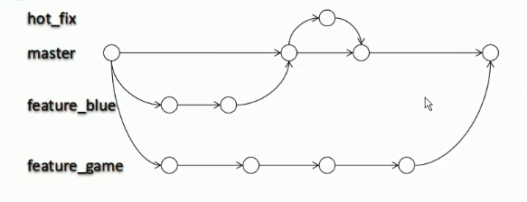

# 概述

在版本控制过程中 使用多条线同时推进多个任务



* `hot_fix`
  *  当线上的项目出现 bug 的时候，可以开一个分支来修复 bug  然后在合并会主分支
* `feature_xxx` ：代表着用来开发其他功能的分支，开发完成就合并到主分支上


## 分支的好处

1. 同时并行推进多个功能开发 ，提高开发效率
2. 各个分支在开发过程中 ，如果某一个分支开发失败 ，不会对其他分支有任何影响。失败的分支删除重新开始即可


# 分支操作

## 增删改查

### 创建分支

`git branch branch_name`

### 查看分支

`git branch -v`

### 切换分支

`git checkout branch_name`

### 删除分支


## 合并分支

1. 切换到 接受修改的 分支上（被合并，增加新内容）
2. 执行一个 merge 命令

`git merge branch_name`

```shell
# 切换到主分支
git checkout master
# 指定合并到主分支的分支
git merge hot_fix
```


## 合并冲突

### 分支冲突的表现

```txt
hello world                                                                               quick start
// 这个带 HEAD 的表示当前分支的内容  一直到等号结束
// ***********************************************
<<<<<<< HEAD                                                                             hot_fix update                                                                           =======              
// ***********************************************
// 这个呢 就是另一个分支的内容 >>>> 这一串符号后面的就是分支名字
master update                                                                             >>>>>>> master  
// ***********************************************
```

### 冲突的解决

1. 编辑文件，删除特殊符号
2. 把文件修改成满意的程度，修改完成后这个文件就可以合并
3. `git add filename`
4. `git commit -m"log"`
   1. 此时 ，commit 一定不能带文件名

比如说现在是  a.txt 合并时冲突了

```shell
# 将 a.txt 的特殊符号 删除之后，修改成最终版本
vim a.txt
#**************************
# 将最终手动合并的 txt 文件提交到本地仓库
git add a.txt
git commit -m"resolver conflict"
# 完成了解决冲突的操作
```


