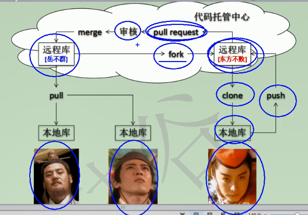
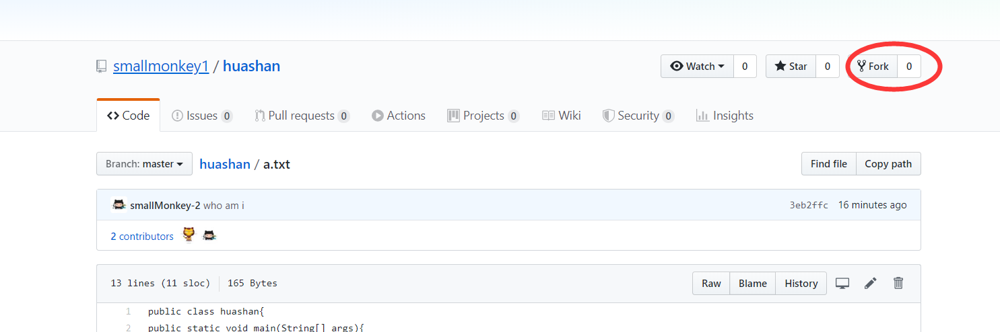
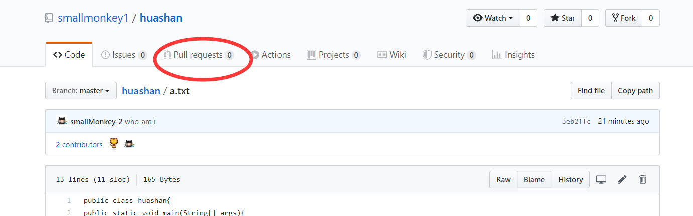
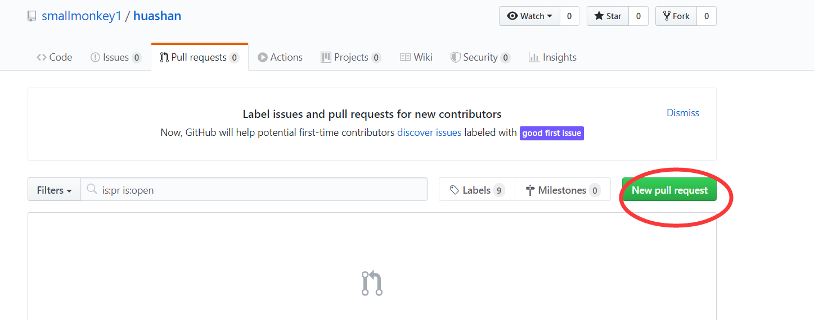
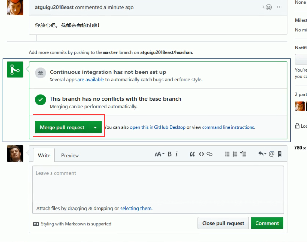

## `git remote`

`git remote -v`

* 查看当前本地仓库绑定的远程仓库位置

`git remote add name url`

* 与远程地址绑定
* name 就是远程地址的 别名 有时候是origin
* `gir remote add origin https://github.com/smallmonkey1/huashan.git`

`git remote remove name`

* 接触与远程仓库的绑定  比如说接触上面的绑定
* `git remote remove origin`


`git push`

`git push name branch_name`

* 将本地仓库同步到远程仓库
* `git push origin master`


## 克隆

`git clone url`

* 完整的把远程仓库下载到本地
  * 创建 origin 远程地址别名
  * 初始化本地库

```shell
$ git clone https://github.com/smallmonkey1/huashan.git
Cloning into 'huashan'...                                                                 remote: Enumerating objects: 6, done.                                                     remote: Counting objects: 100% (6/6), done.                                               remote: Compressing objects: 100% (4/4), done.                                           remote: Total 6 (delta 1), reused 2 (delta 0), pack-reused 0                             Receiving objects: 100% (6/6), done.                                                     Resolving deltas: 100% (1/1), done.  
```


## 邀请成员

应该懂了吧

---

# 远程仓库拉取

细节

`pull = fetch + merge`

`git fetch origin_name branch_name`

* `git fetch origin master`

* 从远程仓库拉取master分支的文件

`git checkout origin/master`

* 切换远端 master 分支
* 用来查看数据用的

流程

场景：

1. 团队内成员修改了代码
2. 我需要先 `fetch` 拉取下来 ，然后在 `merge` 合并

```shell
# 拉取了啵
git fetch origin master
cat a.txt
#*********************
# 这个时候 ，你会发现你的文件文本代码内容并没有变成其他成员修改过的东西
# 因为这只是拉取操作，并没有内容 合并
# ****************************
#这个时候想要看修改了的内容 ，需要切换分支  而且切换的是 远程的分支
git checkout origin/master
# 切换分支之后就可以看见被修改的文件了
cat a.txt

# 合并分支
git merge origin master
# 这个时候 ，如果没有发生合并冲突 就会合并成功
```


## pull 和 fetch+merge

如果确定拉取的文件没有冲突的话 ，用 pull 

如果项目很重要 ，最好先用 fetch 看看有什么冲突吗 如果没有就 merge 效果也一样 **更加谨慎**


## 远程拉取冲突

如果提交显示 因为冲突不能提交 

```shell
# 把文件拉下来 ，然后修改好
git pull
vim xx.txt
# 将修改好的版本添加到本地仓库
git add .
git commit -m"message"
# 推送到远端
git push origin master

```


# 跨团队协作




去比人的项目里面点击一下 `fork`  




然后将项目 `clone` 到本地仓库 ，修改之后如何提交？

1. 上传到远程仓库 `git push origin master`

2. `pull requests`







然后 `create pull request` 一下 ，


这个功能的作用就是给非团队成员的人提供提交代码的途径

只需要项目团队审核修改即可


项目团队应该做的操作：

检查文件的修改有没有问题  然后合并别人的提交



