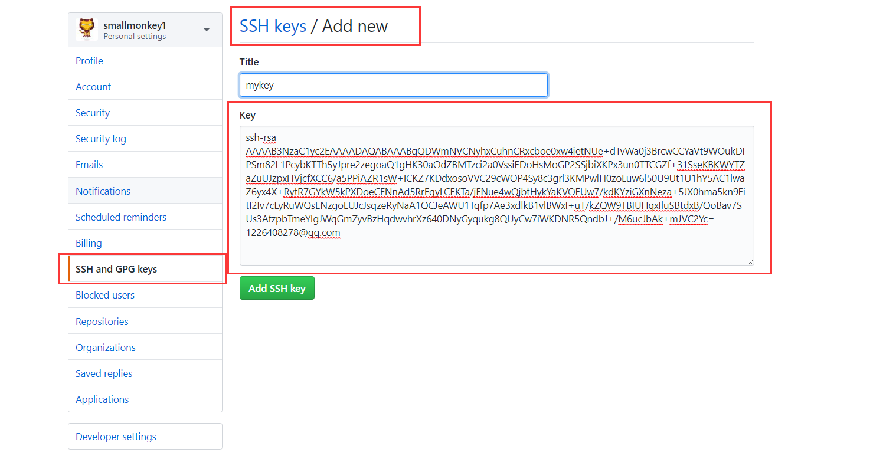
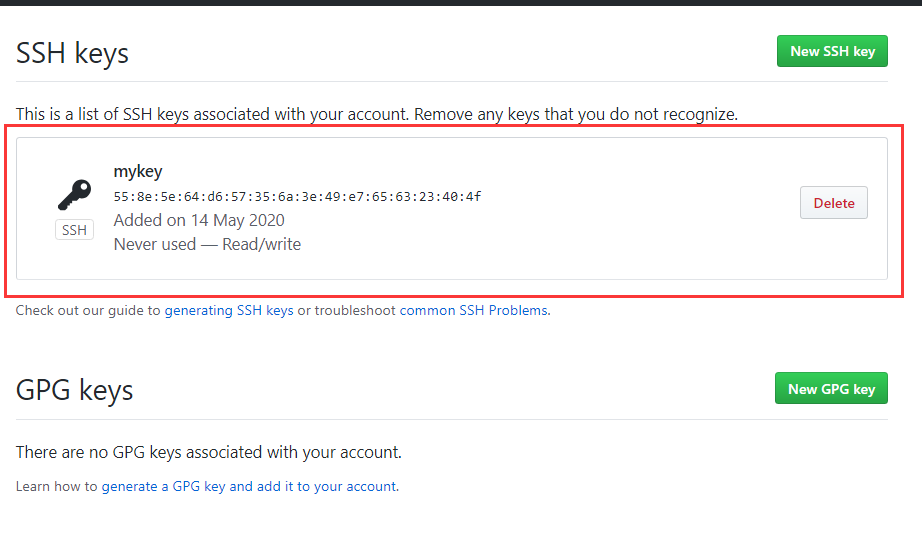
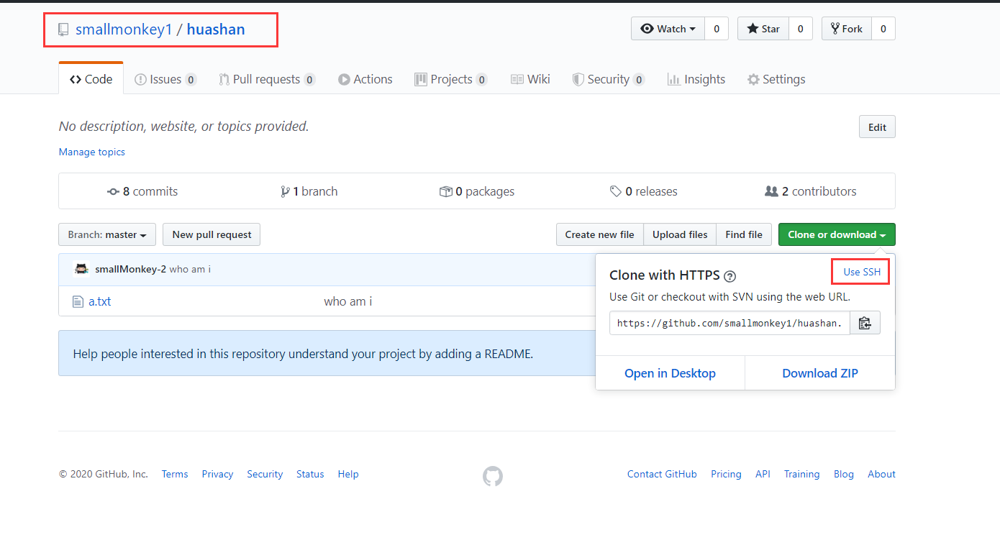

# 在本地生成SSH秘钥

打开 `git bash`

```shell
# 进入到根目录 ，因为 ssh 保存在根目录
cd ~
# 确保根目录没有 .ssh 文件，先删除一波
rm -r .ssh/

# 生成本地秘钥
ssh-keygen -t rsa -C 1226408278@qq.com
# 然后一直 回车 就行了，都是默认设置
```

解释一下：

`ssh-keygen -t rsa -C email`

`keygen`  是 秘钥生成的意思 `key gennerates` –> `key gen·`

`rsa` 是秘钥的类型

`-C` 表示添加邮箱

# 获取秘钥


```shell
# 进入 .ssh 文件夹，将 id_rsa.pub 文件里面的字符串复制下来，有用
cd .ssh/
cat id_rsa.pub
```


# 在远端保存本地秘钥信息

保存之后 ，每一登录就会检查 ssh 秘钥跟远端的秘钥一不一致， 代替密码验证功能




1. 进入 `github` ，找到 `settings`
2. 点击 `SSH and xxx` ，进去就会看见里面有个添加秘钥了  
3. 然后如上图所示 ，刚才获取到的秘钥粘贴进来
4. `title` 随便起
5. 点击 `add SSH key` 




显示这个页面就成功了 ，还能删除

---

# 实际使用

需要 本地添加多一个远程地址

这个 SSH 在 git 里面可以找到




进入到本地仓库对应的远程仓库，点击 `use SSH` 然后复制链接即可


```shell

git remote origin_ssh git@github.com:smallmonkey1/huashan.git  
```


然后 执行 `git push` 就能实现免密登陆