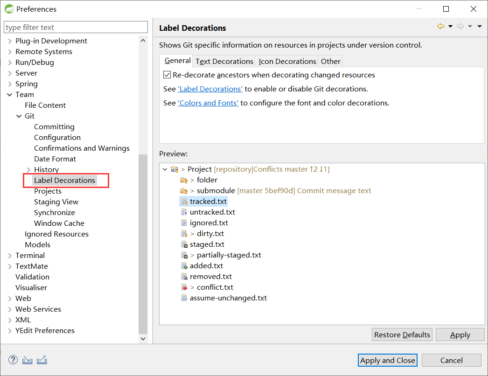

将 maven 的 web 工程创建好


# 将项目初始化成 git 仓库

工程 --》右键 --》 Team --》share Project--》Git


如果有装 SVN 的话不用选择 Git


---


现在到这里了 ↓↓↓↓↓↓↓↓↓↓↓↓↓↓↓↓


## 点击 `Use xxx` 


## 创建仓库


## 查看 `.git/config` 文件


## 添加项目签名


相当于 `git config user.name eclipse_user`

同理可得 `user.email` 也是这样子配置的


## eclipse的git项目的图标含义




像这种很小的问号啊 星号啊 什么什么的


# `.gitignore`


## eclipse中特定的文件

`.class .project .settings文件夹` 这些文件是可以被忽略的

这些跟项目无关的文件 只是为了 eclipse 方便管理我们的项目而维护的文件，和开发的代码没有直接关系

所以最好不要在 git 中进行追踪 ，要把他们忽略；

要不然idea 和 eclipse 用户会产生冲突


在 idea 中会自动生成 `gitignore` 文件 ，在eclipse似乎不会  

不管会不会，先记录一下把

可以再 git 的根目录写配置文件 ，也可以选择在项目中写配置文件

## 写个 `.gitignore` 文件

当然也可以去 github 上找

[gitignore规则](https://github.com/github/gitignore/)

`java.gitignore`

```java
# Compiled class file
*.class

# Log file
*.log

# BlueJ files
*.ctxt

# Mobile Tools for Java (J2ME)
.mtj.tmp/

# Package Files #
*.jar
*.war
*.nar
*.ear
*.zip
*.tar.gz
*.rar

# virtual machine crash logs, see http://www.java.com/en/download/help/error_hotspot.xml
hs_err_pid*

.classpath
.project
target
```


## 将 `ignore` 规则加入全局配置文件

打开 `~/.gitconfig` 文件

加入这一句

```shell
[core]
	excludesfile = C:/Users/Administrator/java.gitignore
```

注意：这里的路径遵循 linux的规则 需要使用 `/` 而不是 `\`   


也可将 `.gitignore` 文件加载项目路径下

就叫做 `.gitignore` 然后将 `[core] xxx` 上面的代码加到项目的配置文件 即可

---

## 重启 eclipse

如果看到项目中被忽略的文件没有了问号，或者其他特殊标记，就表示你的配置成功了

like this


# 推送到远程仓库

项目--》右键--》Team--》

然后一系列关于 git 的操作

add 和 commit 就不说了


把远程仓库的 `https` 地址复制下来


记一下 push 过程

右键打开远程操作


点 `push` 然后界面是这样的

- 直接把远程仓库的 `url` 粘贴打 `url` 的输入框就好了，下面的信息是自动的
- 账号密码填上
- `next`


这个红框框的意思是 检测所有分支 ，添加上去 spec 是检测的缩写

* 选的也是 红框框
* 然后 一直 `next` 就好了


远程仓库


# 切换分支

点这个


切换分支审查代码

如果远程有分支的话就会在 `Remote Tracking` 显示远程的分支 ，


