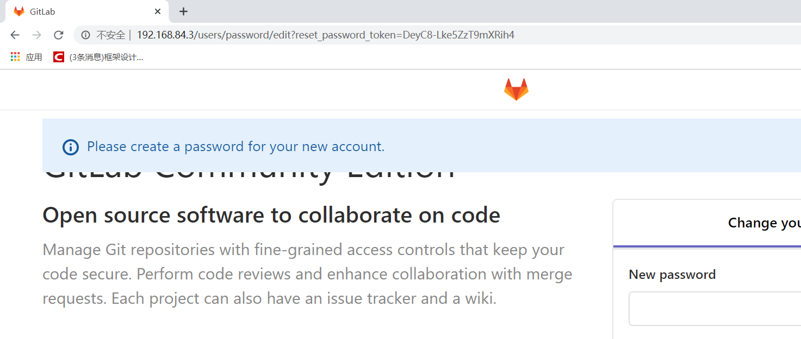

# 官网地址

首页 ：`https://about.gitlab.com`

安装说明 ：`https://about.gitlab.com/installation`

# 安装命令

```shell
sudo yum install -y curl policycoreutils-python openssh-server cronie
lokkit -s http -s ssh
yum install postfix
systemctl start postfix

```

# 先去下载一个 rpm 包

https://packages.gitlab.com/gitlab/gitlab-ee

要下载 el/7 版本的波

https://mirrors.tuna.tsinghua.edu.cn/gitlab-ee/yum/el7/

清华镜像更加快

# 安装

安装过程很复杂，可以写进 `.sh` 文件，让 sh 文件来执行

```shell
# 这个相当于配置 yum 源头，我是这么理解的
sudo rpm -ivh /opt/gitlab-ce-10.8.7.ce.0.el7.x86_64.rpm

sudo yum install -y curl policycoreutils-python openssh-server cronie
sudo firewall-cmd --permanent --add-service=http
sudo firewall-cmd --permanent --add-service=https
sudo systemctl --reload firewalld

sudo yum install postfix
sudo systemctl enable postfix
sudo systemctl start postfix
curl https://packages.gitlab.com/install/repositories/gitlab/gitlab-ce/script.rpm.sh | sudo bash 
sudo EXTERNAL_URL="https://gitlab.example.com" yum install -y gitlab-ce

```

遇到的问题：

直接执行上面的命令会看见 xxx 未找到什么的

不要理他  换一个 yum 源

```shell
[gitlab-ee]
name=Gitlab EE Repository
baseurl=https://mirrors.tuna.tsinghua.edu.cn/gitlab-ee/yum/el$releasever/
gpgcheck=0
enabled=1

[gitlab-ce]
name=Gitlab CE Repository
baseurl=https://mirrors.tuna.tsinghua.edu.cn/gitlab-ce/yum/el$releasever/
gpgcheck=0
enabled=1
```

然后再把上面的命令执行一遍，看起来像报错也不理他了

# gitlab服务器配置

## 初始化服务器

`gitlab-ctl reconfigure`

* 接下来就是等

## 启动gitlab服务

`gitlab-ctl start`

## 停止服务

`gitlab-ctl stop`


# 访问服务器

直接访问 IP 地址



访问不了的话可能是防火墙

然后设置密码 设置 email 登录

里面的操作跟 github 大同小异