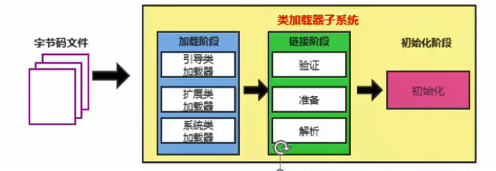
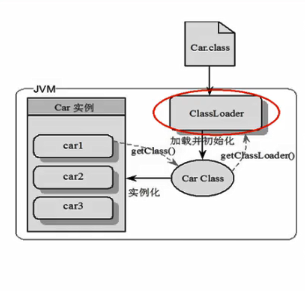
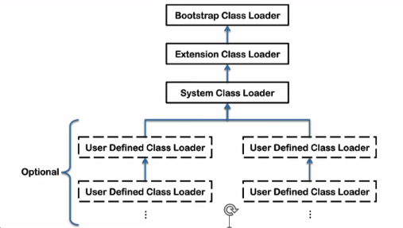
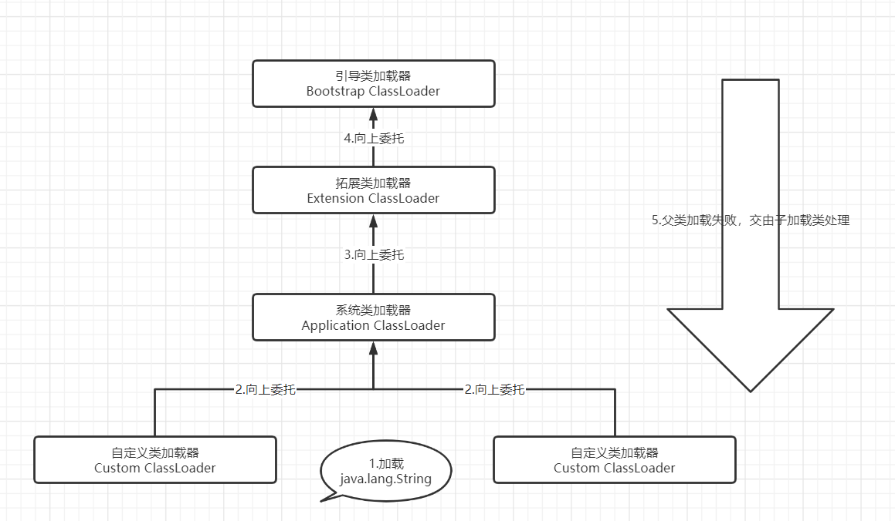

# 类加载器子系统作用





**类加载器子系统** 负责从 **文件系统** 或者 **网络中** 加载Class文件，class文件在文件开头有特定的文件标识。

ClassLoader **只负责** class文件的加载，至于它是否可以运行，则由Execution
Engine决定。

加载的类信息存放于一块称为 **方法区的内存空间** 。除了类的信息外，方法区中还会
存放 **运行时常量池信息** ，可能还包括 字符串字面量 和 数字常量 (这部分常量信息是
Class文件中常量池部分的内存映射)

# 类加载器ClassLoader角色



1. class file存在于本地硬盘上，可以理解为设计师画在纸上的模板，

而最终这个模板在执行的时候是要加载到JVM当中来根据这个文件实例化出n个一模-样的实例。

1. class file加载到JVM中,

被称为DNA元数据模板,

放在方法区。
3.在.class文件-> JVM ->最终成为元数据模板 ，此过程就要 一个运输工具(类装载器Class Loader) ,扮演一个快递员的角色。


# 类的加载过程

## 加载：

1. 通过一个类的全限定名获取定义此类的 **二进制字节流** 
2. 将这个字节流所代表的 **静态存储结构** 转化为方法区的 **运行时** 数据结构
3. ==在内存中生成一个代表这个类的 java.lang.Class 对象== ，作为方法区这个类的各种数据的访问入口

### 补充：加载.class文件的方式

* 从本地系统直接加载
* 通过网络获取，典型场景：Web Applet
* 从zip压缩包中读取，成为日后的jar、war格式的基础
* 运行时计算生成，使用最多的是 ：动态代理技术
* 由其他文件生成，典型场景 ：JSP应用
* 从专有数据库中提取.class ，比较少见
* 从加密文件中获取 ，典型的防止 Class 文件被反编译的保护措施

## 链接：

### 验证：

Verify:

* 目的在于确保 Class 文件的字节流中包含信息符合当前虚拟机要求 ，保证被加载类的正确性 ，不会危害虚拟机自身安全。
* 主要包括四种验证 ，文件格式验证、元数据验证、字节码验证过、符号引用验证。

### 准备-Prepare：

* 为类变量分配内存并且设置该类变量的默认初始值 ，即零值。
* 这里不包括含有 final 修饰的 static ，因为 fianl 在编译的时候就会被分配了 ，准备阶段是显式初始化；
* 这里不会为实例变量分配初始化 ，类变量会分配在方法区中 ，而实例变量是会随着对象一起分配到 Java 堆中。

### 解析-Resolve:

* 将常量池内的符号引用 转换为 直接引用 的过程。
* 事实上，解析操作往往伴随着 JVM 在执行 完成初始化 之后再执行。
* 符号引用 就是一组 符号来描述所引用的 目标。符号引用 的字面量形式明确定义了 《java虚拟机规范》的 Class 文件格式中。直接引用就是直接指向目标的指针、相对偏移量或一个间接定位到目标的句柄。
* 解析动作主要针对类或接口、字段、类方法、接口方法、方法类型等 。对应常量池中的 CONSTANT_Class_info 、CONSTANT_Fieldref_info、CONSTANT_Methodref_info等。

## 初始化：

初始化阶段就是执行 **类构造器方法** <clinit> ()的过程。

此方法不需定义，是javac编 译器 自动收集类 中的 **所有类变量的赋值动作** 和 **静态代码块中** 的语句 **合并而来**。

构造器方法中指令按语句在源文件中出现的 **顺序执行**。

<clinit> ()不同于类的构造器。(关联: 构造器是虚拟机视角下的<init>())

若该类具有父类，JVM会 保证子类的<clinit>()执行前，父类的<clinit>()已经执行完毕。

虚拟机必须保证一个类的<clinit> ()方法在多线程下被 **同步加锁**。


# 类加载器的分类

* JVM 支持两种类型的类加载器 ，分别为 引导类加载器（Bootstrap ClassLoader）和 自定义类加载器（User-Defined ClassLoader）。
* 从概念上来讲 ，自定义类加载器一般指的是程序中由开发人员自定义的一类 类加载器 ，但是 Java 虚拟机规范 却没有这么定义 ，而是 将所有派生于抽象各类 ClassLoader 的类加载器都划分为自定义类加载器。
* 无论类加载器的类型如何划分 ，在程序中我们最常见的类加载器始终只有3个 ，如下所示：



这里四种类加载器之间的关系是 包含关系，不是上下层关系，也不是父子 继承关系

Bootstrap 是 C和C++写的     其他都是 java 写的


```java
public static void main(String[] args) {
    // 获取系统类加载器
    ClassLoader systemClassLoader = ClassLoader.getSystemClassLoader();
    System.out.println(systemClassLoader);//sun.misc.Launcher $ AppClassLoader @18b4aac2

    // 获取其上层：扩展类加载器
    ClassLoader extLoader = systemClassLoader.getParent();
    System.out.println(extLoader);//sun.misc.Launcher$ExtClassLoader@1b6d3586

    // 获取其上层：获取不到引导类加载器
    ClassLoader bootstrapClassLoader = extLoader.getParent();
    System.out.println(bootstrapClassLoader); //null


    // 对于用户自定义类 : 默认使用系统类加载器进行加载
    ClassLoader classLoader = ClassLoaderTest.class.getClassLoader();
    System.out.println(classLoader); // sun.misc.Launcher$AppClassLoader@18b4aac2

    // String类使用引导类加载器进行加载的。--》java 的核心类库都是使用引导类加载器进行引导的
    ClassLoader classLoader1 = String.class.getClassLoader();
    System.out.println(classLoader1);// null

}
```


## 虚拟机自带的加载器

### 启动类加载器（引导类加载器，Bootstrap ClassLoader）

这个类加载器使用 **C/C++实现** ，嵌套在JVM内部。

他用来加载 Java 的核心库（JAVA_HOME/jre/lib/rt.jar、resources.jar或sun.boot.class.path路径下的内容），用于提供JVM自身需要的类

并不继承自java.lang.ClassLoader，没有父加载器。

加载扩展类和应用程序类加载器 ，并指定为他们的父类加载器。

处于安全考虑 ，Bootstrap 启动类加载器只加载包括包名为java、javax、sun等开头的类。

### 应用程序类加载器（系统类加载器，AppClassLoader）

java语言编写，由sun.misc.launcher$AppClassLoader实现

派生于ClassLoader类

父类加载器为 **扩展类加载器** ExtClassLoader

它负责加载环境变量 classpath 或系统属性 java.class.path 指定路径下的类库

**该类加载器是程序中默认的类加载器** ，一般来说，java 应用的类都是由它来完成加载。

通过 ClassLoader#getSystemClassLoader() 方法可以获取到该类加载器

### 用户自定义加载器

在Java的日常应用程序开发中，类的加载器几乎是由上述3中类加载器项目配合执行的 ，在必要时，我们还可以自定义类加载器，来定制类的加载方式。

为什么要自定义类加载器？

* 隔离加载类
* 修改类加载的方式
* 扩展加载源
* 防止源码泄漏


---


# 双亲委派机制

Java虚拟机对class文件采用的是 **按需加载的方式**，也就是说当需要使用该
类时才会将它的class文件加载到内存生成class对象。而且加载某个类的
class文件时，Java 虚拟机采用的是 **双亲委派模式**，即把请求交由父类处理,
它是一种任务委派模式。

## 工作原理

1)如果一个类加载器收到了 **类加载请求** ，它并不会 **自己** 先去加载，

而是把这个请求 **委托给父类** 的加载器去执行;

2)如果 **父类加载器** 还存在其父类加载器，

则进一步向上委托，

依次递归,

请求最终将到达 **顶层** 的启动类加载器;

3)如果父类加载器可以完成类加载任务，就成功返回，

倘若父类加载器无法完成此加载任务，

**子加载器才会** 尝试自己去加载，

这就是双亲委派模式。

 


好处：

避免类的重复加载

保护程序安全，防止核心API被随意篡改

## 沙箱安全机制

自定义String类，

但是在加载自定义String类的时候会率先使用 引导类加载器 加载，

而 引导类加载器 在加载的过程中会 先加载 jdk自带的文件
(rt .jar包中java\lang\String . class)

报错信息说没有main方法，

就是因为加载的是rt. jar包中的String类。

这样可以保证对java核心源代码的保护，

这就是 **沙箱安全机制**。 

# 其他

在JVM中表示两个class 对象是否为同一个类 的必要条件

* 类的完整类名比喻一直，包括包名。
* 加载这个类的ClassLoader指（ClassLoader实例对象）必须相同

换句话说，在JVM中，即使这两个类对象（class 对象）来源于同一个 Class 文件 ，被同一个虚拟机所加载，但只要加载他们的 ClassLoader 实例对象不同， 那么这两个类对象也是不相同的

## 对类加载器的引用

JM必须知道一个类型是由 启动加载器加载 的还是由 用户类加载器加载 的。如果一个类型是由用户类加载器加载的，

那么JVM会将 ==这个类加载器 的一个引用作为类型信息的一部分 **保存在方法区中**。==

当解析一个类型到另一个类型的引用的时候，JVM需要 **保证** 这两个类型的类加载器是 **相同** 的。

