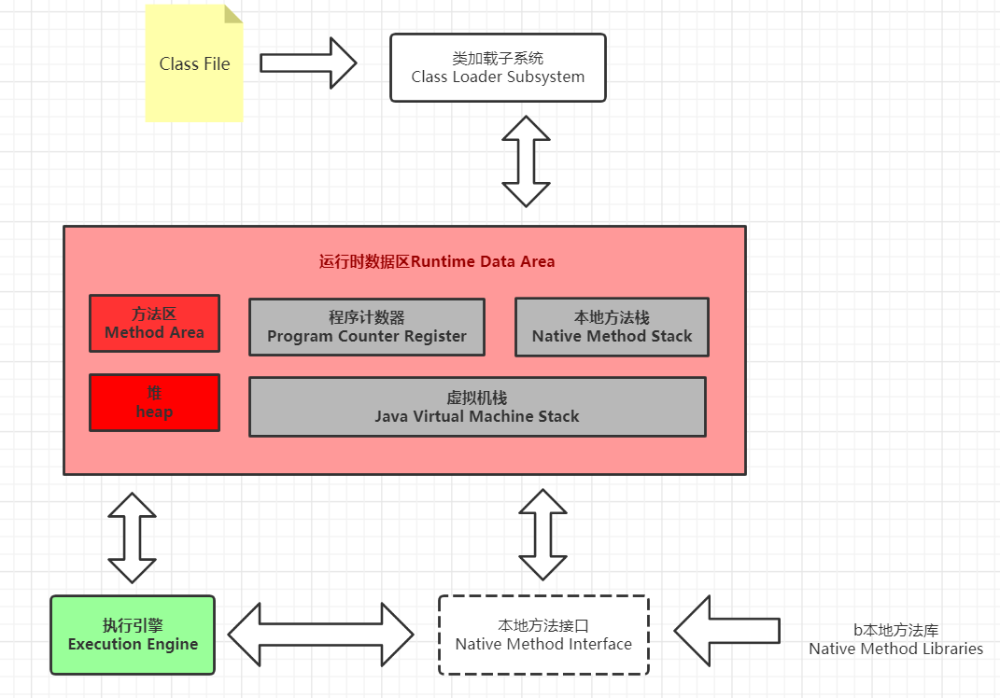
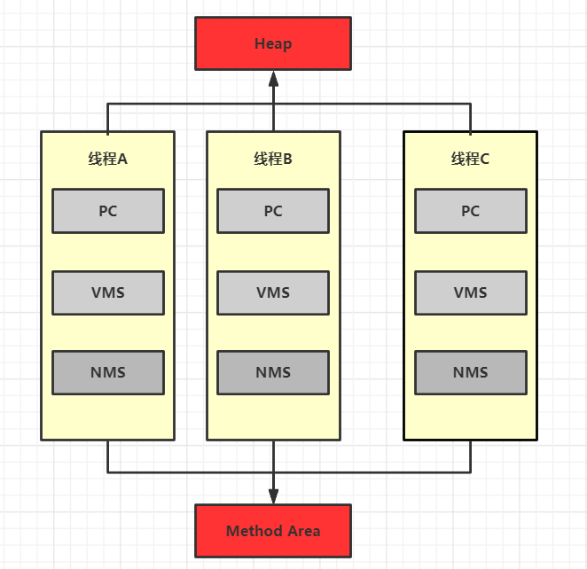
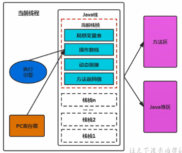
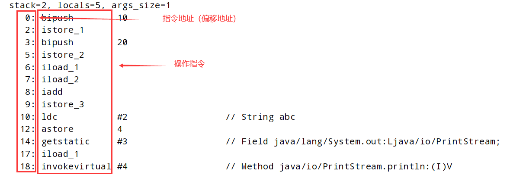
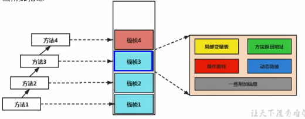
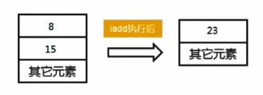

# 内部结构




内存是非常重要的系统资源，是硬盘和CPU的中间仓库及桥梁，承载着操作系统和应用程序的实时运行。

JVM内存布局规定了Java在运行过程中内存申请、分配、管理的策略，保证了JVM的高效稳定运行。

不同的JVM对于内存的划分方式和管理机制存在着部分差异。

结合JVM虚拟机规范，来探讨一下经典的JVM内存布局。


Java虛拟机定义了若干种程序运行期间会使用到的运行时数据区，

其中有一些会随着虚拟机启动而创建，随着虚拟机退出而销毁。

另外一些则是与线程一一对应的，这些与线程对应的数据区域会随着线程开始和结東而创建和销毁。

下图为例：

灰色的为单独线程私有 ，红色为多个线程共享，即：

每个线程：独立包括程序计数器、栈、本地栈。

线程间共享 ：堆、堆外内存（永久代或元空间、代码缓存）




# 程序计数器

Program Counter Register

JVM中的程序计数寄存器(Program Counter Register) 中，Register 的命名源于CPU的寄存器，寄存器存储指令相关的现场信息。

CPU只有把数据装载到寄存器才能够运行。

这里，并非是广义上所指的物理寄存器，

或许将其翻译为PC计数器(或指令计数器)会更加贴切( **也称为程序钩子**)，

并且也不容易引起一些不必要的误会。

JVM中的PC寄存器是对物理PC寄存器的一种抽象模拟。

## 作用：

PC寄存器用来存储指向下一条指令的地址，也即将要执行的指令代码。由执行引擎读取下一条指令。



它是一块很小的内存空间，几乎可以 **忽略不记**。也是运行速度 **最快** 的存储区域。

在JVM规范中，每个线程都有它 **自己的程序计数器**，是线程 **私有的**，生命周期与线程的生命周期保持一-致。

任何时间一一个线程都只有-一个方法在执行，也就是所谓的当前方法。程序计数器会存储当前线程正在执行的Java方法的JVM指令地址;或者，如果是在执行native方法，则是未指定值(undefned)。

## 介绍：

●它是程序控制流的指示器，分支、循环、跳转、异常处理、线程恢复等基础
功能都需要依赖这个计数器来完成。

●字节码解释器工作时就是通过改变这个计数器的值来选取下一条需要执行的
字节码指令。

●它是唯一 一个在Java虚拟机规范中没有规定任何OutotMemoryError
情况的区域。

一个简单程序反编译后的代码




## 常见问题

### 使用PC寄存器存储字节码指令地址有什么用？

### 为什么使用PC寄存器记录当前线程的执行地址？

因为CPU需要不停的切换各个线程，这时候切换回来以后，就得知道接着从哪开始继续执行。

JVM的字节码解释器就需要通过改变PC寄存器的值来明确下一条应该执行什么样的字节码指令。


### PC寄存器为什么会被设定为线程私有？

我们都知道所谓的多线程在一个 特定的时间段 内只会执行其中某一个线程的方法，

CPU会不停地做任务切换，这样必然导致经常中断或恢复，

如何保证分毫无差呢?

为了能够准确地记录各个线程正在执行的 **当前字节码指令地址**，

最好的办法自然是为每一个线程都分配一个PC寄存器，这样一来各个线程之间便可以进行独立计算，

从而不会出现相互干扰的情况。

由于CPU **时间片轮限制**，众多线程在并发执行过程中，任何一个确定的时刻，一个处理器或者多核处理器中的一个内核，只会执行某个线程中的一条指令。

这样必然导致 **经常中断或恢复**，

如何保证分毫无差呢?

每个线程在创建后，都会产生 **自己的** 程序计数器和栈帧，程序计数器在各个线程之间互不影响。


# 虚拟机栈

## 1.概述

### 虚拟机栈出现的背景

由于跨平台性的设计，Java的指令都是根据 **栈来设计** 的。不同平台CPU架构不同，所以不能设计为 **基于寄存器** 的。

优点是跨平台，**指令集小**，编译器容易实现，缺点是 **性能下降**，实现同样的功能需要更多的指令。

### 内存中的栈与堆

栈是运行时的单位，而堆是存储的单位。

即 ：

栈 解决程序的运行问题，即程序如何执行，或者说如何处理数据。

堆 解决的是 **数据存储** 的问题，即数据怎么放、放在哪儿。

### 基本内容

#### java虚拟机栈是什么

Java虚拟机栈(Java Virtual Machine Stalck) ，早期也叫Java栈。

**每个** 线程在创建时 **都会创建一个** 虚拟机栈，

其内部保存一一个个的栈帧(Stack Frame) ，对应着一次次的 **Java方法调用** 。

➢是线程私有的

#### 声明周期

生命周期与线程一致

#### 作用

主管java程序的运行 ，他保存方法的局部变量、部分结果 ，并参与方法的调用和返回 。

#### 栈的特点（优点）

栈是一种快速有效的分配存储方式 ，访问速度仅次于程序计数器。

JVM直接对 Java 栈的操作只有两个：

* 每个方法执行 ，伴随着进栈（入栈、压栈）
* 执行结束后的出栈工作

对于栈来说不存在垃圾回收问题

#### 设置栈内存大小

使用参数 `-Xss` 选项来设置线程的最大栈空间 ，栈的大小直接决定了函数调用合一到达的最大深度。


## 2.存储单位

### 栈中存储的是什么？

每个线程都有自己的栈，栈中的数据都是 **以栈帧(Stack Frame) 的格式存在** 。

在这个线程上正在执行的每个方法都各自 **对应** 一个栈帧(stack Frame) 。

栈帧是一个 **内存区块**，是一个 **数据集** ，维系着方法执行过程中的各种数据信息。

### 栈运行原理


1. 在一条活动线程中，一个时间点上，只会有一个活动的栈帧。
   即只有当前正在执行的方法的栈帧(栈顶栈帧)是有效的，这个栈帧被称为 **当前栈帧**(Current Frame) ，
   与当前栈帧相对应的方法就是 **当前方法**(CurrentMethod)，定义这个方法的类就是 **当前类**(Current Class)

2. 执行引擎运行的所有字节码指令只针对当前栈帧进行操作。

3. 如果在该方法中调用了其他方法，对应的新的栈帧会被创建出来，放在栈的顶端，成为新的当前帧。

4. 不同线程中所包含的栈帧是不允许存在 **相互引用** 的，即不可能在一个栈帧之中引用另外一个线程的栈帧。

5. 如果当前方法调用了其他方法，方法返回之际，当前栈帧会传回此方法的执行结果给前一个栈帧，
   接着，虚拟机会丢弃当前栈帧，
   使得前一个栈帧重新成为当前栈帧。

6. Java方法有两种返回函数的方式，一种是正常的函数返回，使用return指令;
   另外一种是抛出异常。不管使用哪种方式，都会导致 **栈帧被弹出**。

### 栈帧的内部结构

每个栈帧中存储着：

1. 局部变量表（Local Variables）
2. 操作数栈（Poerand Statck）（或表达式栈）
3. 动态链接（Dynamic Stack）（或指向运行时常量池的方法引用）
4. 方法返回地址（Return Address）（或方法正常退出或者异常退出的定义）
5. 一些附加信息




## 3.局部变量表

局部变量表也被称之为局部变量 **数组** 或本地变量表

定义为一个数字数组，主要用于存储 **方法参数** 和定义在 **方法体内** 的局部变量，
这些数据类型包括--》各类基本数据类型、对象引用(reference) ，以及return Address类型。

由于局部变量表是建立在 **线程的栈上**，是线程的 **私有** 数据，==因此 **不存在** 数据安全问题.==

==局部变量表所需的容量大小是在编译期确定下来的== ，并保存在方法的Code属性的maximum local variables数据项中。 
在方法运行期间是不会改变局部变量表的大小的。

方法嵌套调用的次数由栈的大小决定。
一般来说，**栈越大，方法嵌套调用次数越多** 。
对一个函数而言，它的参数和局部变量越多，使得局部变量表膨胀，它的栈帧就越大，
以满足方法调用所需传递的信息增大的需求。
进而函数调用就会占用更多的栈空间，
导致其嵌套调用次数就会减少。

局部变量表中的变量只在 **当前方法调用中有效**。
在方法执行时，虚拟机通过使用局部变量表完成参数值到参数变量列表的传递过程。
**当方法调用结束后,随着方法栈帧的销毁，局部变量表也会随之销毁。**

### 关于Slot的理解

参数值的存放总是在局部变量数组的index0开始，到数组长度- 1的索引结束。

* ==局部变量表， **最基本** 的存储单元是Slot (变量槽)== 
* 
* 局部变量表中存放编译期可知的各种基本数据类型(8种)，引用类型(reference)，returnAddress类型的变量。
* 在局部变量表里，**32位以内的类型只占用一个slot (包括returnAddress类型)，** 
  6**4位的类型(long和double) 占用两个slot。** 
  * byte、short 、char 在存储前被转换为int, 
    boolean 也被转换为int，
    0表示false，非0表示true。
  * long和double 则占据两个slot。

---

* JVM会为局部变量表中的每一个Slot都分配一一个 **访问索引** ，通过这个索引即可成功访问到局部变量表中 **指定** 的局部变量值
* 当一个实例方法 **被调用** 的时候，它的  方法参数  和  方法体内部定义的局部变量  将会按照 顺序 被 复制 到局部变量表中的每一个slot.上
* 如果需要访问局部变量表中一个64bit的局部变量值时，
  只需要使用 **前一个索引** 即可。
  (比如:访问long或double类型变量)
* 如果当前帧是由构造方法或者实例方法创建的，
  那么该对象引用this将会存放在index为0的slot处，
  其余的参数按照参数表顺序继续排列。

---

#### Slot的重复利用

栈帧中的局部变量表中的槽位是可以重用的，如果一个局部变量过了其作用域，

那么在其作用域之后申明的新的局部变量就很有可能会 **复用** 过期局部变量的槽位

从而达到节省资源的目的。

---

##### 举例：静态变量与局部变量对比

参数表分配完毕之后，再根据 方法体内定义的变量的顺序 和 作用域分配。

我们知道 类变量表 有 两次 初始化的机会，第一次是在“准备阶段”，**执行系统初始化**，对类变量设置零值，

另一次则是在“初始化”阶段，赋予程序员 **在代码中定义** 的初始值。

和类变量初始化 **不同的是**，局部变量表 **不存在** 系统初始化的过程，

这意味着一旦定义了局部变量则必须 **人为的初始化**，否则无法使用。

例如

```java
public void example(){
    int i;
    System.out.println(i);
}
```

这种代码是错误的 ，对应着第二次初始化

##### 变量的分类

按照数据类型分 ：基本数据类型--应用数据类型

按照在类中声明的位置 ：

1. 成员变量 ：在使用前都经历过默认初始化赋值
   1. 类变量 ：linking 的 prepare 阶段 ：给类变量默认赋值  ---》initial 阶段 ：给类变量显式赋值 也就是 静态代码块赋值
      1. 总之 prepare 阶段就是静态代码块统一初始化，给静态代码块中的变量赋值的操作
   2. 实例变量 ：随着对象的创建 ，会在堆空间中分配实例变量空间 ，进行 默认赋值
2. 局部变量 ：在使用前 ，必须要 显式赋值的  否则 编译不通过

---

### 补充说明

在栈帧中，与性能调优 **关系最为密切的部分** 就是前面提到的 **局部变量表**。

在方法执行时，虚拟机使用 局部变量表 完成 方法的传递。

局部变量表中的变量也是重要的 **垃圾回收根节点**，

只要被局部变量表中 直接或间接 引用的对象 **都不会被回收**。


---


## 4.操作数栈

每一个独立的 栈帧 中除了包含 局部变量表 以外，

还包含一个后进先出(Last- In-First-Out)的操作数栈，也可以称之为 表达式栈 (Expression Stack) 。

操作数栈，在方法执行过程中，根据 **字节码指令**，往栈中 写入数据 或 提取数据 ，即入栈(push) 、出栈(pop)。

1. 某些字节码指令将值压入操作数栈，其余的字节码指令将操作数取出栈。使用它们后再把结果压入栈。
2. 比如:执行复制、交换、求和等操作




---


如果被调用的方法带有返回值的话，其返回值将会被压入当前栈帧的操作数栈中，

并更新PC寄存器中 下一条 需要执行的字节码指令。

操作数栈中元素的 数据类型 必须与字节码指令的 **序列** 严格匹配，这由 编译器在编译器期间进行验证，

同时在类加载过程中的 类检验阶段 的 数据流分析阶段 要再次验证。

另外，我们说Java虚拟机的 解释引擎 是 **基于栈** 的 执行引擎，其中的栈指的就是操作数栈。

---

操作数栈，主要用于保存计算过程的 **中间结果**，

同时作为计算过程中变量 **临时** 的存储空间。

操作数栈就是JVM执行引擎的 **一个工作区**，当一个方法刚开始执行的时候，
一个新的栈帧也会随之被创建出来，这个方法的操作数栈是空的。

每一个操作数栈都会拥有一个 **明确的** 栈深度用于存储数值，

==其所需的 **最大深度** 在编译期就定义好了，保存在方法的Code属性中，为max_ stack的值。==

栈中的任何一个元素都是可以任意的Java数据类型。
➢32bit的类型占用一个栈单位深度
➢64bit的类型占用两个栈单位深度

操作数栈并非采用 **访问索引的方式** 来进行数据访问的，而是只能通过标准的入栈(push)和出栈(pop)操作来完成一次数据访问。

---


## 5.栈顶缓存技术

前面提过，基于 **栈式架构** 的虚拟机所使用的 **零地址指令更加紧凑** ，

但完成一项操作的时候必然需要使用 **更多的** 入栈和出栈指令，这同时也就意味着将需要更多的 **指令分派(instruction dispatch)次数** **和内存读/写次数** 。

由于操作数是 **存储在内存中** 的，因此 **频繁** 地执行内存读/写操作必然会影响执行速度。

为了解决这个问题，HotSpot JVM的 设计者们

提出了 **栈顶缓存(Tos， Top-of -Stack Cashing) 技术**，

将栈顶元素全部 **缓存** 在物理CPU的 **寄存器** 中，以此 **降低** 对内存的读/写次数，提升执行引擎的执行效率。


## 6.动态链接

每一个栈帧内部都包含一个 指向运行时常量池 中 **该栈帧所属** 方法的引用。
包含这个引用的 **目的就是** 为了支持 --》

==当前方法的代码能够实现动态链接(Dynamic Linking)。比如: invokedynamic指令== 

在Java源文件被 **编译到** 字节码文件 中时，所有的变量和方法引用 **都作为** 符号引用(symbolic Reference) **保存在** class文件的常量池里。

比如 ：描述一个方法调用了另外的其他方法时，就是通过 常量池 中指向 方法的 符号引用 **来表示的**，那么

动态链接的作用就是为了--》

将这些 **符号引用** 转换为 调用方法的 **直接引用** 。

### 总的来说-->

动态链接区域是虚拟机栈中的栈帧  中的  一个引用 指向某个方法引用的东西

每个栈帧有一个动态链接区 ，里面保存了当前栈帧 也可以说是当前方法 需要调用的其他方法 **的引用** ，大概就是这样了。

由于虚拟机栈存在于内存，所以不可能将所有被引用的类或者对象都保存到栈帧中，这样值会很占内存

比如说 ：`int a = 1;` 这一段代码 ，就需要使用到 int 的引用，而 `int` 是一个很大的对象 ，不可以没个栈帧存一份。所以只能保存这个类型的引用 。大概就是这么理解的！

---


## 7.方法的调用：解析与分派

在JVM中，<u>将符号引用 **转换为** 调用方法的 直接引用</u> 与 <u>方法的绑定机制相关</u> 

### 静态链接:

当一个字节码文件被装载进JVM内部时，如果  <u>**被调用的目标方法** 在编译期可知</u> 且 <u>运行期保持不变时</u>。

这种情况下将调用方法的符号引用转换为直接引用的过程 **称之为** 静态链接。

### 动态链接:

如果被调用的方法在编译期 **无法被确定** 下来，

也就是说，

只能够在 **程序运行期** 将<u>调用方法的符号引用</u> **转换为** <u>直接引用</u> ，

由于这种引用转换过程具备 **动态性**，因此也就被称之为动态链接。

---

由上所述

对应的方法的绑定机制为 ：早期绑定(Early Binding) 和晚期绑定(Late Binding) 。

绑定是一个 <u>字段、方法或者类</u> 在符号引用 **被替换为** <u>直接引用</u> 的过程，这仅仅发生 **一次**。


### 早期绑定:

早期绑定就是指 被调用的 **目标方法** 如果在 **编译期可知**，且运行期保持 **不变** 时,

即可将这个方法与所属的类型进行绑定，

这样一来，由于明确了被调用的目标方法究竟是哪一个，

因此也就可以使用 **静态链接** 的方式将符号引用 **转换为** 直接引用。


### 晚期绑定:

如果被调用的方法在编译期 **无法被确定** 下来，

只能够在程序运行期根据 **实际的类型绑定** 相关的方法，这种绑定方式也就被 **称之为** 晚期绑定。

### 虚方法

晚期绑定 动态链接 的方法

### 非虚方法

1. 如果方法在 **编译期** **就确定了** 具体的 调用版本 ，这个版本在运行时是 不变的 。
2. 静态方法、私有方法、final方法、实例构造器、父类方法 都是 **非虚方法** 。
3. 其他方法称为 **虚方法** 

### 子类对象多态性的使用前提 ：

1. 类的继承关系
2. 方法的重写

### 虚拟机提供的方法调用指令：

#### 普通调用指令

1. invokestatic ：调用静态方法 ，解析阶段确定唯一方法版本
2. invokespecial ：调用`<init>` 方法、私有方法、父类方法 ，**解析阶段** 确定唯一方法版本
3. invokevirtual ： 调用所有虚方法
4. invokeinterface ：调用接口方法

#### 动态调用指令：

5. invokedynamic ：动态解析出 需要调用的方法 ，然后执行 （1.7以后出的）


前4条指令固化在虚拟机内部 ，方法的调用执行不可人为干预 ，

而 invokedynamic 指令则 支持由用户确定方法版本 。

==其中 `invokestatic` 指令和 `invokespecial` 指令调用的方法称为非虚方法 ，其他的（final修饰的除外）**称为虚方法**。== 


### 虚方法表


在面向对象的编程中，会 **很频繁** 的使用到 **动态分派**，

如果在每次动态分派的过程中 **都要重新** 在类的方法 元数据 中 搜索 合适的目标 的话就可能影响到 执行效率。

因此，为了 **提高性能**，JVM采用在 <u>类的方法区</u> 建立一个 **虚方法表**(virtual method table) (非虚方法不会出现在表中)来实现。

使用索引表来代替查找。

每个类中都有一个 虛方法表，表中存放着 各个方法 的 **实际入口**。.

##### 那么虚方法表什么时候被创建?

虚方法表会在 <u>类加载的链接</u> **阶段** 被创建 并开始 初始化，类的变量 初始值 **准备完成之后**，JVM会把 <u>该类的方法表</u> 也初始化完毕。


# 常量池里面保存的是直接引用，也就是说 常量池中保存信息的形式类似于  `符号引用:直接引用` 这种键值对


## 8.方法返回地址

存放调用该方法的pc寄存器 **的值**。

一个方法的结束， 有两种方式:
➢正常执行完成
➢出现未处理的异常，非正常退出

无论通过哪种方式退出，在方法 退出后 都返回到该方法 **被调用的位置**。

方法正常退出时，

调用者的 <u>pc计数器的值</u> 作为返回地址，即调用 **该方法的指令** 的 **下一条指令的地址**。

而通过 **异常退出** 的，

返回地址是要通过 **异常表** 来确定，栈帧中一般不会保存这部分信息。

----

本质上，方法的退出就是当前 **栈帧出栈** 的过程。此时，

需要 **恢复上层方法** 的局部变量表、操作数栈、将 **返回值** 压入调用者栈帧的操作数栈、设置PC寄存器值等，

让调用者方法继续执行下去。

正常完成出口 和 异常完成出口 的 <u>区别在于</u> 

通过异常完成出口退出的 **不会** 给他的上层调用者 **产生任何的** 返回值。


---


## 9.栈的相关面试题

举例栈溢出的情况？（StackOverflowError）

* 递归调用超过最大栈深度
* 通过 `-Xss` 设置栈的大小；OOM

调整栈大小，能保证不出现溢出吗？

* 不能


分配的栈内存越大越好吗？

* 不是
* 内存就这么大 ，栈内存要多了  其他的内存相对就会变小


垃圾回收是否涉及虚拟机栈？

* 不会
* 栈只有入栈出栈操作，不需要垃圾回收。如果栈满了就报错 `StackOverflowError` 


方法中定义的局部变量是否线程安全？

* 不一定，如果实在方法中创建并且在方法中消亡的局部变量，那就是线程安全的
* 如果局部变量的范围逃逸 了 ，同时没有考虑到同步 `sychronized` 则是线程不安全的。


---


# 本地方法接口

1.


