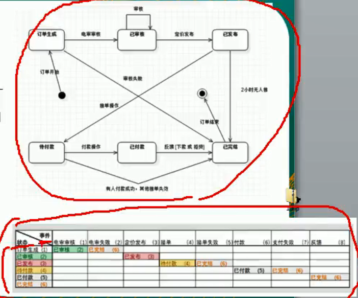
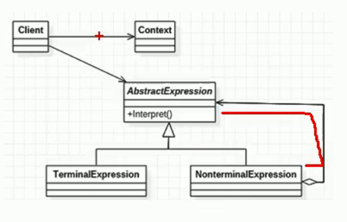

#### 原型设计模式问题：

1)有请使用UML类图画出原型模式核心角色

2)原型设计模式的深拷贝和浅拷贝是什么，并写出深拷贝的两种方式的源码(重写
clone方法实现深拷贝、使用序列化来实现深拷贝)

3)在Spring框架中哪 里使用到原型模式，并对源码进行分析

```java
beans.xml
<bean id="id01" class="com.atguigu.spring.bean.Monster" scope="prototype"/>
```

---

#### 先看几个经典的设计模式面试题

设计模式的七大原则:要求:

 1)七大设计原则核心思想

2)能够以类图的说明设计原则
3)在项目实际开发中，你在哪里使用到了ocp原则

### **设计模式常用的七大原则有:**

1)单一职责原则
2)接口隔离原则
3)依赖倒转原则
4)里氏替换原则
5)开闭原则ocp
6)迪米特法则
7)**合成复用原则**

---

#### 先看几个经典的设计模式面试题

金融借贷平台项目:借贷平台的订单，有 **审核-发布-抢单** 等等步骤，随着操作的不同，会改
变订单的状态 ，项目中的这个模块实现就会使用
到 **状态模式** ，请你使用状态模式进行设计，并
完成实际代码
**问题分析:**
这类代码难以应对变化，在添加一种状态时，
我们需要手动添加if/else，在添加一种功能时,
要对所有的状态进行判断。因此代码会变得越
来越臃肿，并且一旦没有处理某个状态，便会
发生极其严重的BUG，难以维护




---

#### 解释器设计模式

1)介绍解释器设计模式是什么?
2)画出解释器设计模式的UML类图,
分析设计模式中的各个角色是什
么?
3)请说明Spring的框架中，哪里
使用到了解释器设计模式，并
做源码级别的分析





---

#### 先看几个经典的设计模式面试题

单例设计模式一共有几种实现方式?请分别用代码实现，并说明各个实现方式的
优点和缺点?

单例设计模式一共有8种写法，后面我们会依次讲到
1)饿汉式两种
2) 懒汉式三种
3)双重检查
4)静态内部类
5)枚举

---