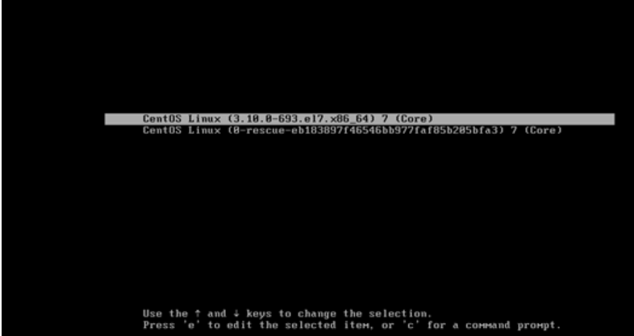
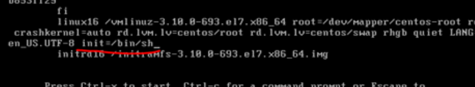

### 运行级别

* 0：关机；
* 1：单用户(找回丢失密码)；
* 2：多用户无网络服务
* 3：多用户有网络服务(用的最多)-**常用**
* 4：保留
* 5：图形界面-**常用**
* 6：重启

### 设置运行级别

* 系统的运行级别配置文件`/etc/inittab`   的 `id:5:initdefault`这一行中
  * CentOS7找不到了 ，反正在里面，自己分析
* 基本语法
  * init [0123456]


---

### ************面试题

* 如何找回root密码
  * 进入单用户模式，然后修改密码
    * 因为进入单用户模式，root不需要密码就可以登录
    * centOS7比较麻烦；
    * 首先进入到这样的页面



* 然后e,进入编辑，找到下面那行，末尾添加`init=/bin/sh`



* 然后就可以进入单用户模式进行各种修改密码的骚操作了，

* 加个搜索标签-修改root密码-忘记密码

* ************************************************************************

* 修改开机默认运行级别：vim /etc/inittab  修改--这是CentOS 6的方法

* 在CentOS7中，当你打开`/etc/inittab`文件，他就会告诉你，方法换了

```java
 multi-user.target类似于runlevel 3;
# graphical.target类似于runlevel5

#查看默认运行级别的方式为
systemctl get-default

#设置默认运行级别的方式
systemctl set-default TARGET.target
```

* 所以要在命令行运行`systemctl set-default multi-user.target`将开机后默认运行方式改成命令行模式----

---

---

---

### 帮助指令

* `man`：获取帮助信息
  * 基本语法
    * man [命令或配置文件](获取帮助信息)
* `help`-- help 命令

---

* 

---

### 时间日期类

* 基本语法

  * `date`：显示当前时间
  * `date +%Y`：年份(有空格，真的是加号，要大写)
  * `date +%m`：月
  * `date +%d`：日
  * `date "+%Y-%m-%d-%H-%M-%S"`，年月日时分秒

* #### 设置日期

  * `date -s 字符串时间`
  * `date -s "2012-10-10 11:22:22"`：设置

* #### 显示日历

  * `cal`


---

---

### 搜索查找类

* #### `find`指令

  * 将从**指定目录**向下递归的遍历其各个子目录，将满足条件的文件或目录显示在终端
  * `find [搜索范围] [选项]``--> find /home -? a.txt`
    * 搜索范围：目录
    * 常用选项：
    * `-name`按文件名字查
    * `-user`：按照文件所有用户查找-`find /hoem -user zfl`
    * `-size`：按照大小找`find /home -size +20M`
      * +：代表大于；-：代表小于；不输入是等于`20M`

* #### `locate`：指令

  * 快速定位文件路径，第一次运行前，必须使用`updatedb`更新数据库，才能使用
  * locate a.txt

* #### `grep和|`：管道
  * grep

    * ##### -n：显示匹配行和行号

    * `cat a.txt | grep yes-n`

    * ```shell
      6:yes
      ```

    * ##### -i：忽略大小写

    * `cat a.txt | grep yes -ni`

    * ```shell
      2:yes
      5:YES
      ```

    * 配合管道使用

---

---

### 压缩和解压类

* #### `gzip/gunzip`：指令

  * `gzip 文件名`：只能将文件压缩为*.gz文件
    * 压缩完后，原来文件不保留，直接替换成*.gz
  * `gunzip 文件名`：将*.gz解压

* #### `zip/unzip`：指令

  *  `zip`：在项目打包发布**很有用**
    * -r：可以递归压缩
    * `zip -r target.zip /home/zfl`：将/home/zfl目录下文件压缩并保存名为target.zip的文件
  * `unzip -d<目录>`:
    * `unzip -d /opt/tmp/ target.zip`：将.zip文件解压到指定目录

* `tar`：打包指令

  * 根据不同的参数决定压缩还是解压

  * 选项

  * | `-c`： |  产生tar打包文件   |
    | :----: | :----------------: |
    | `-v`： |    显示版本信息    |
    | `-f`： | 指定压缩后的文件名 |
    | `-z`： |    打包同时压缩    |
    | `-x`： |    解包tar文件     |

  * `tar -zcvf a.tar.gz a.txt b.txt`：将两个`txt`打包进`a.tar.gz`文件

  * `tar -zcvf myhome.tar.gz /home/`：对一个目录进行打包

---

---