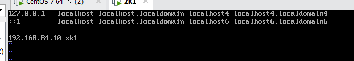
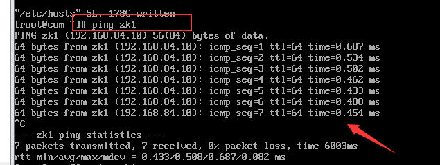

## 网络配置的原理

### Linux网络环境配置

* 第一种方式(自动获取)

  * linux的基本网络配置，自己蒙

* 第二种方式(指定固定的ip)

  * 直接修改配置文件来指定IP，并可以连接到外网

  * `vim /etc/sysconfig/network-scripts/if`cfg-ens

  * ##### 要求：将ip地址永久固定为 192.168.184.130

  * 不同版本的Linux访问路径不一样

  * 如果没有，就去`network-scripts`目录下找，应该可以看得出是哪个文件的

  * 在`ifcfg-ens`文件里加上或修改这几行

```shell
- IPADDR=一定要是网关下的IP
- GATEWAY=去虚拟机编辑那里查看
- DNS1=跟gateway一致 (或者114.114.114.114)
- NETMASK=255.255.255.0
- BOOTPROTO=static
- ONBOOT=yes
- 

```

# 修改网络映射名

进入配置文件`vim /etc/hosts`

将自己的IP和映射名字加进去



这时候已经完成了一半的工作了。

接下来，如果希望第二台机器能够通过**映射名**访问本主机，需要在另一台机器的**hosts文件**，添加上目标主机的IP和映射名的映射信息。



# 成功。

