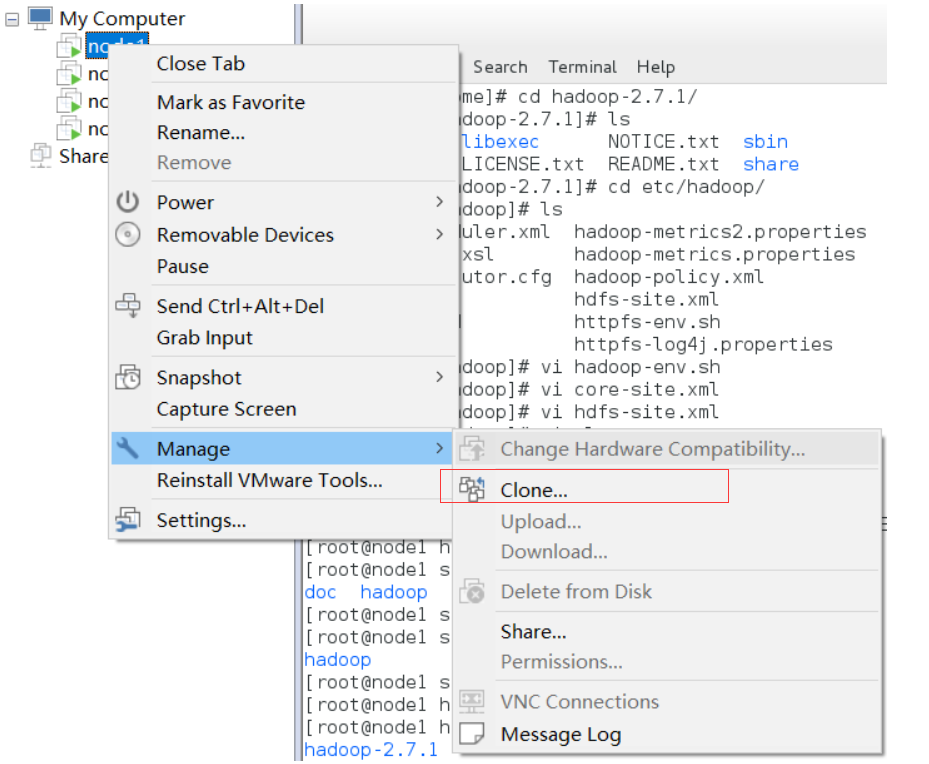
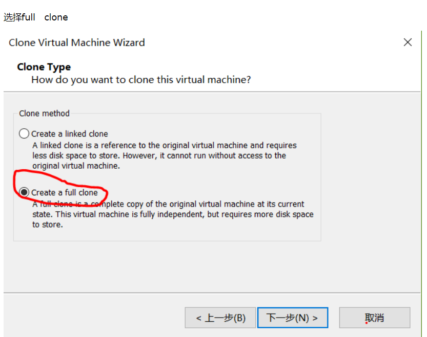
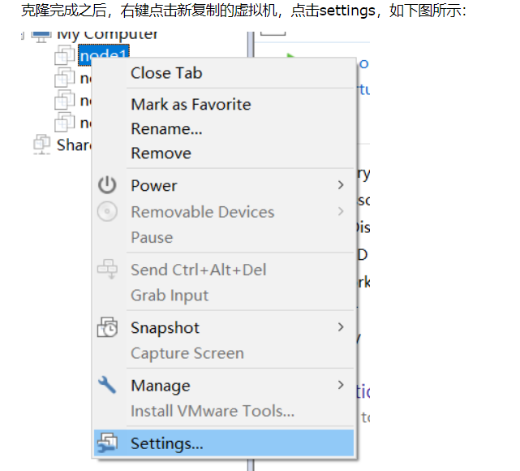
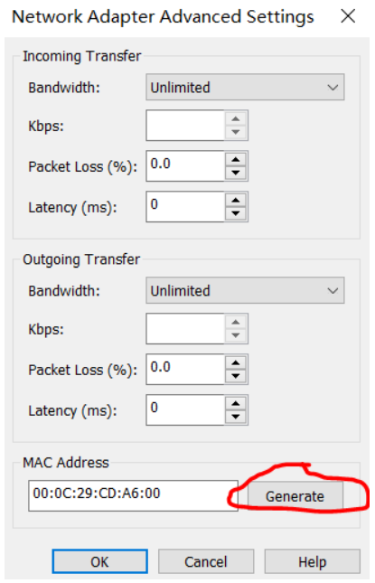
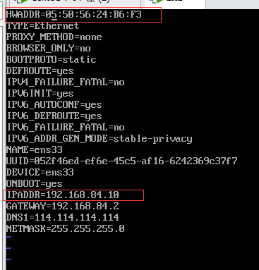

第一步：




第二步：




第三步：



第四步：

点击网络适配器，生成一个MAC地址



记录一下MAC地址：`00:50:56:24:B6:F3`

---

第五步：

打开新复制的虚拟机，输入命令ip addr，此条命令是查看虚拟机的IP地址以及MAC地址

`vim /etc/sysconfig/network-script/ifcfg-ens33`



加上硬件地址(MAC)`HWADDR=...`

修改一下IP地址

接下来，输入

`rm /etc/udev/rules.d/70-persistent-ipoib.rules`命令，删除这个.rules文件：

##### 最后，一定要记得重启网络服务，要不然成功不了`systemctl restart network`

---

### 第六步：


```shell
hostnamectl：查看主机名称，更多命令百度。可以查看静态名称hostnamectl --static

hostnamectl set-hostname xxx设置主机名字；

```

