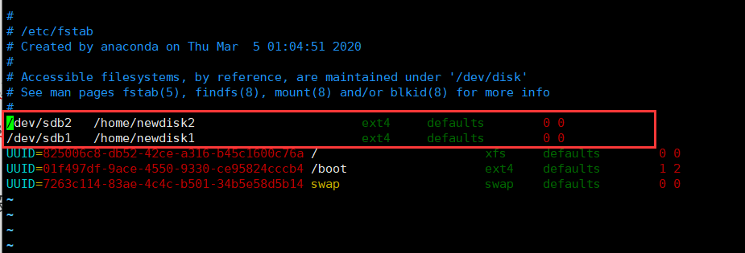

### 分区基础

#### 分区方式

* ##### mbr

  * 最多4个主分区
  * 系统只能安装在主分区
  * 扩展分区要占一个主分区
  * 最大只支持2TB，兼容性好

* ##### `gpt`分区

  * 支持无限多个主分区(操作系统可能会限制，win下128个)
  * 最大支持18EB容量
  * win7 64以后支持gpt

#### Linux分区

* 只有一个根目录

* 挂载：把分区和文件系统关联

* 卸载：解除关联

#### 硬盘说明

* Linux硬盘分IDE硬盘和SCSI硬盘，目前基本是SCSI硬盘
* 对于IDE硬盘，驱动器标识符为"hdx~"，
  * 其中`hd`表名分区所在的设备类型--IDE硬盘
  * x~：为盘号(a：基本盘，b：基本从属盘；c：辅助主盘；d：辅助从属盘)
  * ~：表示第几个分区
* 对于SCSI硬盘则标识为"sdx-"
  *  SCSI硬盘是用“`sdx~`"来表示分区所在设备的类型的，
  * 其余则和IDE硬盘的表示方法一样。

---

### 如何增加一块硬盘

#### 虚拟机添加硬盘

#### 分区

 fdisk /dev/sdb

分区号和扇区默认就行了，把大小设置一下，最后记得输入`w`保存；

分区之后输入`lsblk -f `是这样子的：sdb硬盘下面多了两个分区

#### 格式化

 mkfs -t ext4  /dev/sdb1

格式化之后如上图，UUID不为空，如果不格式化没用

#### 挂载

* 创建目录 mkdir /home/newdisk
* mount /dev/sdb1 /home/newdisk   
* mount 设备名 挂载目录
* 这是临时挂载，重启之后就没有挂载了

#### 设置可以自动挂载

* 重启后自动挂载
* vim /etc/fstab：在这个fstab文件里面操作
* 加多一条记录
* 设备名  挂载路径  文件格式 defaults 0 0
* `/dev/sdb1   /home/newdisk  ext4 defaults 0 0`

* 然后在用命令`mount -a`设置自动挂载，然后就能生效了

  

---

### 卸载操作

* `umount /dev/sdb1`：就可以了，不要再sdb1里面卸载sdb1

## 磁盘情况查询

* `lsblk -f`：查看磁盘挂载情况和系统的分区
  * 分区情况：分区类型：唯一标识分区的40位不重复的字符串：挂载点

### 查询系统整体磁盘使用情况

* `df -lh`：查询磁盘使用情况，系统整体的情况
* `du -h /目录`，查询某个目录的磁盘使用情况
  * `-s`：指定目录占用大小汇总
  * `-h`：带计量单位的
  * `-a`：含文件
  * `--max-depth=1 `子目录深度
  * `-c`：列出明细的同时，增加汇总值
* 查询`/opt`目录的磁盘占用情况，深度为1
  * `du -ach –max-depth=1 /opt`

####磁盘情况-工作实用情况

* 统计`/home`文件夹下文件的个数
  * `ls -l /home | grep "^-" | wc -l`
* 统计`/home`文件夹下目录的个数
  * `ls -l /home | grep "^d" | wc -l`
* 统计`/home`文件夹下文件的个数，包括子文件夹里的
  * `ls -lR /home | grep "^-" | wc -l`
* 统计文件夹下目录的个数，包括子文件夹里的
  * `ls -lR /home | grep "^d" | wc -l`
* 以树状显示目录结构
  * `yum install tree`：用yum安装tree指令
  * 直接输入tree就出现当前目录的树

