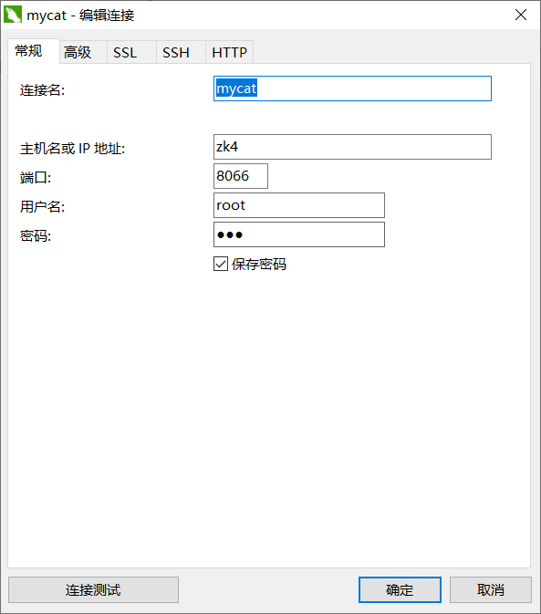

#  

数据库同步

两台机器先安装好 `mariadb`

## A机器-主库

### 修改配置文件

```shell
vim /etc/my.cnf 
[mysqld] 
log_bin = mylog #记录操作日志 
server_id = 4 #数据库集群中的每个节点 id 都要不同， 
#一般使用 IP 地址的最后段的数字，例如 192.168.200.129， server_id 就写 129 systemctl restart mariadb #重启数据库
```

配置完记得重启服务


### 配置数据库

#### 初始化数据库 

```shell

mysql_secure_installation #mysql安全配置向导 

Enter current password for root (enter for none): #输入密码,直接回车

Set root password? [Y/n] #设置root用户的密码吗? 回车 

New password: #输入设置的密码，输入000000 

Re-enter new password: #再次输入设置的密码，输入000000 

Remove anonymous users? [Y/n] #回车 删除匿名用户（选Y） 

Disallow root login remotely? [Y/n] #n 禁止root用户远程登录（选n） 

Remove test database and access to it? [Y/n] #回车 删除默认的 test 数据库（选 Y）

Reload privilege tables now? [Y/n] #回车 是否马上应用最新的设置（选 Y）

Thanks for using MariaDB! #欢迎使用MariaDB，完成 [root@localhost mnt]# 

总结起来，就是： 输入 mysql_secure_installation ， 

回车， 
回车， 
设置密码， 
确认密码，
回车

```


#### DB授权

先登录

```shell
[root@localhost mnt]# mysql -uroot -p000000 

MariaDB [(none)]> create database wordpress; #创建数据库wordpress Query OK, 1 row affected (0.01 sec) 

MariaDB [(none)]> grant all privileges on *.* to root@'%' identified by '000000'; 

#给root用户远程登陆的权限 
MariaDB [(none)]> grant replication slave on *.* to 'user'@'%' identified by '000000'; 

#在主节点上创建一个 用户user密码000000 允许连接，并赋予从节点同步主节点数据库的权 限。

MariaDB [(none)]> quit Bye
```

```
2.Mariadb 开启远程连接

2.1 使用“mysql -uroot -proot”命令可以连接到本地的mysql服务

2.2 使用“use mysql”命令，选择要使用的数据库

2.3 使用“GRANT ALL PRIVILEGES ON . TO 'root'@'%' IDENTIFIED BY 'root' WITH GRANT OPTION;”命令可以更改远程连接的设置。

2.4 使用“flush privileges;”命令刷新刚才修改的权限，使其生效。

2.5 使用“select host,user from user;”查看修改是否成功。

---

版权声明：本文为CSDN博主「Jevon-_-」的原创文章，遵循CC 4.0 BY-SA版权协议，转载请附上原文出处链接及本声明。
原文链接：https://blog.csdn.net/sfeng95/article/details/61624959

```


## B机器-从库

安装好

### 修改配置文件

```shell
vim /etc/my.cnf 
[mysqld] 
server_id = 5 #数据库集群中的每个节点 id 都要不同， 
#一般使用 IP 地址的最后段的数字，例如 192.168.200.129， server_id 就写 129 systemctl restart mariadb #重启数据库
```


### 配置数据库

初始化同上，跳过

```shell
【2】创建网站需要用的数据库 

[root@localhost mnt]# mysql -uroot -p111 

MariaDB [(none)]> change master to master_host='zk4',master_user='user',master_password='111'; 
#配置从节点连接主节点的连接信息。master_host 为主节点192.168.84.13，master_user 为上一 步中创建的用户 user 

MariaDB [(none)]> start slave; 
#开启从节点服务。 

MariaDB [(none)]> show slave status\G; 
#查看从节点服务状态，如果 Slave_IO_Running 和 Slave_SQL_Running 的状态都为 YES，则从节点服务开启成功。

```

## 测试

主库建库，看从库有没有被创建的数据库


---


## 额外操作


```shell
# 启用读锁
FLUSH TABLES WITH READ LOCK;
# 解锁
unlock tables;
```


# 读写分离

## 下载mycat

下载到  `/sur/local/`

```shell
cd /usr/local/
# 授权、
chmod -R 777 /usr/local/mycat
# 修改配置
vim /usr/local/conf/schema.xml
# 内容如下
//****************************************************
<writeHost host="hostM1" url="写数据库的IP:3306" user="root" password="111"/> 
# url="localhost:3306"
读的数据库地址： 
<readHost host="hostS1" url="读数据库的IP:3306" user="root" password="111" />
#url="zk5:3306"

<schema name="USERDB" checkSQLschema="true" sqlMaxLimit="100" dataNode="dn1"> </schema> 

<dataNode name="dn1" dataHost="localhost1" database="wordpress" />

//***********************************************************************************
```

## 启动mycat

可以配置一下环境变量

```shell
vim /etc/profile
export MYCAT_HOME=/usr/local/mycat/bin
xxxxxx
# 刷新配置文件
source /etc/profile
```

启动

```shell
cd /usr/local/mycat/bin
./mycat start
# 看一下端口有没有监听
netstat -ntpl|grep 8066

```

## 看一下账号密码


```shell
vim /usr/local/mycat/conf/server.xml
------------------------------------------------

        <user name="root">
                <property name="password">111</property>
                <property name="schemas">USERDB</property>

                <!-- 表级 DML 权限设置 -->
                <!--            
                <privileges check="false">
                        <schema name="TESTDB" dml="0110" >
                                <table name="tb01" dml="0000"></table>
                                <table name="tb02" dml="1111"></table>
                        </schema>
                </privileges>           
                 -->
        </user>

--------------------------------------------------------------
```

## 看一下日志文件


```shell
vim /usr/local/mycat/logs/mycat.log
```


## 登录

在win端用 WorkBench 不能登录的 ，要用其他的工具登录，比如说 `Navicat for MySQL`




## 看一下修改记录

在装了 `mycat` 的服务器执行


```shell
mysql -uroot -p111 -P9066 -h127.0.0.1 
----------------------------------------------
MySQL [(none)]> show @@datasource\G
----------------------------------------------
*************************** 1. row ***************************
  DATANODE: dn1
      NAME: hostM1
      TYPE: mysql
      HOST: 127.0.0.1
      PORT: 3306
       W/R: W
    ACTIVE: 0
      IDLE: 10
      SIZE: 1000
   EXECUTE: 278
 READ_LOAD: 0
WRITE_LOAD: 3
*************************** 2. row ***************************
  DATANODE: dn1
      NAME: hostS1
      TYPE: mysql
      HOST: zk5
      PORT: 3306
       W/R: R
    ACTIVE: 0
      IDLE: 9
      SIZE: 1000
   EXECUTE: 329
 READ_LOAD: 56 # 读次数
WRITE_LOAD: 0  # 写次数
2 rows in set (0.00 sec)

```

