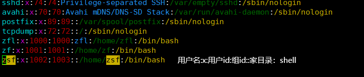
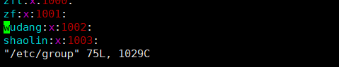

### 关机和重启命令

```shell


- shutdown
  - shutdown -h now：立即关机
  - shutdown -h 1：一分钟后关机
  - shutdown -r now：立即重启
- halt直接使用，效果等价于关机
- reboot：重启
- sync：把内存的数据同步到磁盘，防止数据丢失，(细节)

```


### 用户登录和注销

* `logout`：注销，退出
  * 在图形界面运行无效，就是在窗口进的终端

---

###用户管理

#### **添加用户**

```shell
useradd 用户名：创建一个目录，将文件放到默认路径/home下

useradd -d 路径 用户名：将用户的目录创建到指定目录

passwd：给用户指定，或者修改密码-

例如：passwd 用户名--然后就可以开始修改密码了

```

#### **删除用户**

```shell
#有两种

##把用户删除，并且不保留他的/home

userdel -r 用户名

#把用户删除，保留/home

userdel user

#删除用户一般不会把家目录给删掉***

```

#### **查询用户信息**

```shell
id 用户名-产生3个参数

uid：用户id号；gid：所在组的ID号；组：组名
```

#### **切换用户**

```shell
su - 用户名：横线后面是有空格的
```

#### **查看当前用户是谁**

```shell
whoami/who am i
```

#### 查看所有用户

```shell
cat /etc/passwd
```


### **用户组**

系统对多个共性的多个用户进行统一管理

#### **创建**组：

```shell
groupadd  组名
```

#### **删除**组：

```shell
groupdel 组名
```

#### **增加**用户时直接加上组

```shell
useradd -g 用户组 用户名
```

#### 将用户**移动**到用户组

```shell
usermod -g 用户组 用户名
```

###  扩展

* 用户配置文件--->存放用户信息：`/etc/passwd`
  * 是长这样子的
  * `zsf:x:1002:1003::/home/zsf:/bin/bash` vvv统一格式
  * 用户名​：x：​用户id:组id::家目录:shell​

* 

  * 组配置文件----->存放组信息：`/etc/group`
    * 组名：x：组的id

* 

  * 口令配置文------>存放密码和丁路信息，加密的：`/etc/shadow`
  * 

---

### 查看当前版本(CentOS7)

```shell
centOS版本

cat /etc/redhat-release

```


