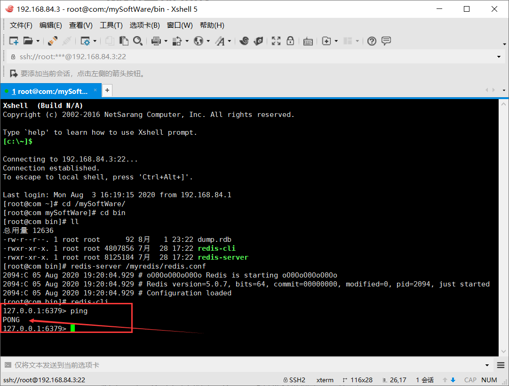

# 步骤

大部分技术都是按照下列过程使用

安装-->配置-->启动

# 1.下载安装到Linux

* 下载tar.gz包，放在/opt下
* 在/opt下解压，出现redis…
* 进入redis目录
* 在redis目录下执行make命令
* 如果make报错，安装gcc
  * gcc：是C程序的编译工具
    * GCC-GNU Compiler Collection
  * 安装方式：
    * 联网安装：`yum install gcc-c++`
    * 离线安装：
* 如果make完成后，继续执行make install
* 查看默认安装目录：usr/local/bin

---

# 2.配置一下

在`/`目录下创建`myredis`目录

将`/opt/redis`目录下的`/redis.conf`文件备份到`/myredis`中

* `cp /opt/redis/redis.conf  /myredis` 
* 修改配置文件前最好先备份！备份！备份！

修改/myredis下的配置文件

* 用`/搜索条件`定位到daemonize选项
* 将它改成yes

回到`/usr/local/bin`

查看后台redis服务有没有起来

* `ps -ef|grep redis`

启动服务

* `redis-server /myredis/redis.conf`

测试是否启动成功：`redis-cli -p 6379`

* 默认端口是6379

提示符变化，并且输入`ping`命令，返回`PONG`结果，就代表启动成功了



# 3.启动：


```shell
redis-server redis的配置文件位置
redis-server /myredis/redis.conf
```

## 3.1测试：

打开redis客户端

```shell
redis-cli
# 如果有当前服务器有多个redis服务，可以指定端口开区分不同的redis客户端
redis-cli -p xxxx
```

用-`ps -ef|grep redis`查看服务，会看见redis-server启动了

测试

```shell
set k1 hello
get k1
结果："hello"
```


# 4.关闭Redis

在`redis-cli -p 6379`里面使用

在redis客户端中

```shell
shutdown #是停止服务
exit #只输入exit是退出当前窗口

```


