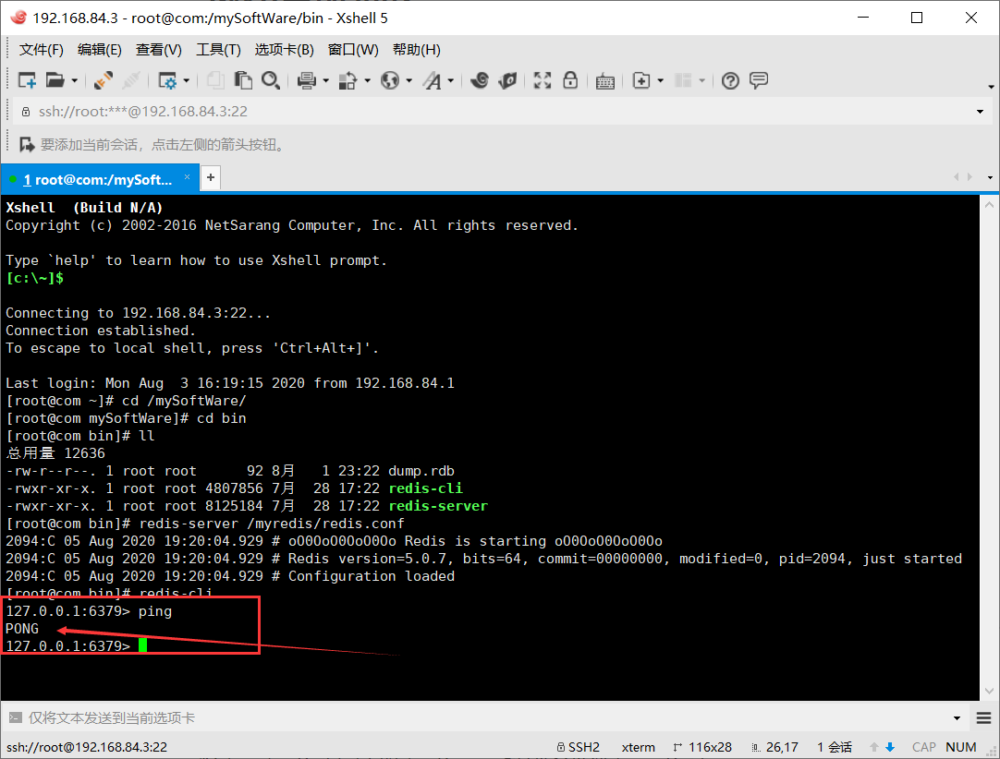

### 下载安装到Linux

* 下载tar.gz包，放在/opt下
* 在/opt下解压，出现redis…
* 进入redis目录
* 在redis目录下执行make命令
* 如果make报错，安装gcc
  * gcc：是C程序的编译工具
    * GCC-GNU Compiler Collection
  * 安装方式：
    * 联网安装：`yum install gcc-c++`
    * 离线安装：
* 如果make完成后，继续执行make install
* 查看默认安装目录：usr/local/bin
* 启动
* HelloWorld
* 关闭

---

### 配置一下

在`/`目录下创建`myredis`目录

将`/opt/redis`目录下的`/redis.conf`文件备份到`/myredis`中

* `cp /opt/redis/redis.conf  /myredis`

修改/myredis下的配置文件

* 用`/搜索条件`定位到daemonize选项
* 将它改成yes

回到`/usr/local/bin`

查看后台redis服务有没有起来

* `ps -ef|grep redis`

启动服务

* `redis-server /myredis/redis.conf`

测试是否启动成功：`redis-cli -p 6379`

* 默认端口是6379

提示符变化，并且输入`ping`命令，返回`PONG`结果，就代表启动成功了



##### 测试：

```shell
set k1 hello
get k1
结果："hello"
```

用-`ps -ef|grep redis`查看服务，会看见redis-server启动了

### 关闭Redis

在`redis-cli -p 6379`里面使用

* `shutdown` 是停止服务
* 只输入`exit`是退出当前窗口