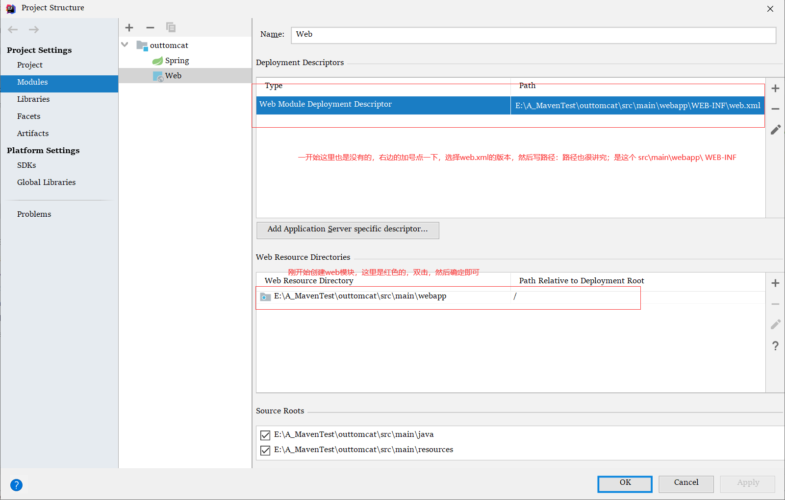

# 关闭双击shift全局搜索功能

Ctrl+Shift+a --》输入 `registry` --》Ctrl+f --》输入 `double.click.handler` --》勾选单选框

# 没有热部署的情况下如何不重启服务器刷新前端

全局配置文件禁用 `thymeleaf` 的缓存

```properties
spring.thymeleaf.cache=false
```

修改页面后要重新编译

build–>build project  一般快捷键是 `Ctrl+F9` 

# 生成 `web.xml` web模块



# Maven工程模块之间依赖爆红

原因1：被依赖的模块没有安装到本地仓库

操作：被依赖的工程--》右键--》add Maven xxxxx

# Maven 父子工程创建细节

创建空工程--》创建模块1--》模块2--》xxxxx

模块一选择项目文件夹的时候一定要注意，是放在空工程(父工程) 下面，而不是父工程里面

目录结构应该是 

```shell
fatherProject
--|model-1
--|model-2
--|model-3
--|model-4
#如果不看仔细模块一的构建路径，直接默认的话会出现这种情况
model-1
--|model-2
--|model-3
--|xxxx
```

