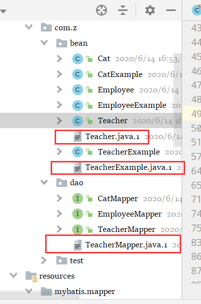

终于遇到第一个解决起来有点难的错误了。特此记录；

# Mybatis

## 01.error

### **关键词：** 

PersistenceException、构造函数、入参顺序

### 描述

是这样子的。一个通过 ==MBG== 错误，刚开始接触 MBG 有点盲目的相信他的配置。生成的 POJO(Teacher.java) 构造函数顺序错了；

正常情况下，数据库的列名顺序应该和构造函数的入参顺序一一对应；

#### 首先 ：

teacher表可能是被针对了



生成了一些奇奇怪怪的 `.1` 文件；

#### 其次

 数据库里面的列名顺序是这样的


但是生成的POJO构造函数入参顺序确实这样的

```java
public Teacher(Integer id, String address, Date birthDate, String className, String teachername) {
    }
```

#### 导致了出现这种报错

```
org.apache.ibatis.exceptions.PersistenceException: 
### Error querying database.  Cause: org.apache.ibatis.reflection.ReflectionException: Error instantiating class com.z.bean.Teacher 
with invalid types (Integer,String,String,String,Date)  人家要求是这样子的
or values (1,tomcat,语文,宝安区,Sun Jan 01 08:00:00 CST 2012). 
Cause: java.lang.NoSuchMethodException: 
com.z.bean.Teacher.<init>(java.lang.Integer, java.lang.String, java.lang.String, java.lang.String, java.util.Date) 人家要求是这样子的
```

#### 发现：

`.1` 里面的文件才是正确的，mapper 里面的也是 `xxx.1` 正确，把原来的删掉，然后用 `xxx.1` 替换即可


# mybatis plus 一直找不到映射文件

环境 springboot mybatis plus 

namespace 正确

application.properties 也配置了 mapper 地址

一切正常，还是不行

##### 关于idea 中使用mybastis报出 Invalid bound statement (not found)的错误解决方案

## 解决

需要在pom.xml 中加入

```xml
<resources>
    <resource>
        <directory>src/main/java</directory>
        <includes>
            <include>**/*.xml</include>
            <include>**/*.properties</include>
        </includes>
        <filtering>true</filtering>
    </resource>
    <resource>
        <directory>src/main/resources</directory>
        <includes>
            <include>**/*.xml</include>
            <include>**/*.properties</include>
        </includes>
        <filtering>true</filtering>
    </resource>
</resources>
```


# swagger异常

# [解决 Illegal DefaultValue null for parameter type integer 异常](https://www.cnblogs.com/zhangzhonghui/p/11562095.html)

该异常是由 swagger 引起的

swagger 版本 1.9.2

 

解决原因：重新导入 swagger-annotations 和 swagger-models 版本 为 1.5.21

pom.xml 加入 相关依赖 

```xml
<!--  解决 Illegal DefaultValue null for parameter type integer    异常  -->
<dependency>

    <groupId>io.springfox</groupId>

    <artifactId>springfox-swagger2</artifactId>

    <version>2.9.2</version>

    <exclusions>

        <exclusion>

            <groupId>io.swagger</groupId>

            <artifactId>swagger-annotations</artifactId>

        </exclusion>

        <exclusion>

            <groupId>io.swagger</groupId>

            <artifactId>swagger-models</artifactId>

        </exclusion>

    </exclusions>

</dependency>
<dependency>

    <groupId>io.swagger</groupId>

    <artifactId>swagger-annotations</artifactId>

    <version>1.5.21</version>

</dependency>

<dependency>

    <groupId>io.swagger</groupId>

    <artifactId>swagger-models</artifactId>

    <version>1.5.21</version>

</dependency>
```

# Mybatis plus 小错误

只有字符串才能这样判断 `test="str !=null and str != ''"` ，日期类型、数字类型都不可以用  `!= ''` 这种方式

```xml
<if test="condition.ordersState != null">
    AND orders.state = #{condition.ordersState}
</if>
```

