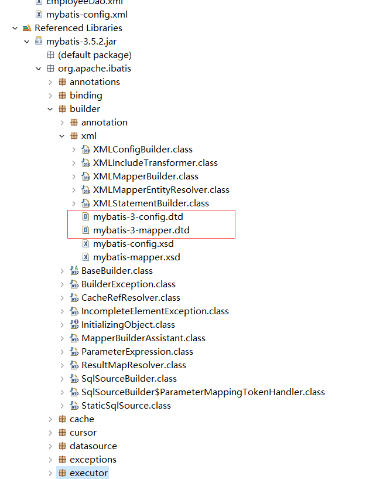
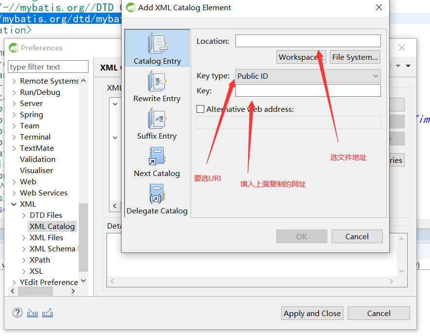

# MyBatisHelloWorld

## 导包

1. mybatis-3.5.2.jar
2. mysql-connector-java-8.0.16.jar
3. 导入日志包：关键环节会有日志打印
4. log4j-1.2.17.jar
   1. 依赖一个log4j.xml配置文件

**写配置** 

（两个：全局配置文件-知道Mybatis运行；dao接口的实现文件-描述dao接口每个方法怎么工作）

### 第一个配置文件

1. （成为mybatis的全局配置文件，指导mybatis如何正确运行，比如链接向哪个数据库）

```xml
<?xml version="1.0" encoding="UTF-8" ?> <!DOCTYPE configuration   PUBLIC "-//mybatis.org//DTD Config 3.0//EN"   "http://mybatis.org/dtd/mybatis-3-config.dtd"> 
<configuration>  
    <environments default="development">     
        <environment id="development">       
            <transactionManager type="JDBC"/>       
            <!-- 配置连接池 -->       
            <dataSource type="POOLED">         
                <property name="driver" value="com.mysql.cj.jdbc.Driver"/>         						<property name="url" value="jdbc:mysql://localhost:3306/mybatisdb?serverTimezone=UTC"/>         
                <property name="username" value="root"/>         
                <property name="password" value="123456"/>       
            </dataSource>     
        </environment>   
    </environments>   
   <!--
 <mappers>     
        <mapper resource="org/mybatis/example/BlogMapper.xml"/>   
    </mappers> 
    
写的dao接口的实现稳健，MyBatis默认是不知道的， 需要在全局配置文件中注册
-->
<!-- 引入自己编写的每一个接口的实现文件 -->  
<mappers>  
    <!-- resource：表示从类路径下找资源 -->    
    <mapper resource="EmployeeDao.xml"/>  
</mappers>
</configuration>
```

---

### **第二个配置文件**：

1. （编写每一个方法都如何向数据库发送SQL语句，如何执行.....相当于接口的实现类）
   1.  将mapper的namespace属性改为接口的全类名
   2.  **错过：select中的id写的是接口的方法名**
   3.  配置细节

```xml
<?xml version="1.0" encoding="UTF-8" ?> <!DOCTYPE mapper  PUBLIC "-//mybatis.org//DTD Mapper 3.0//EN"  "http://mybatis.org/dtd/mybatis-3-mapper.dtd">  
<!-- namespace:名称空间：写接口的全类名；相当于告诉MyBatis这个配置文件是实现哪个接口的 --> 
<mapper namespace="com.z.dao.EmployeeDao"> 
    <!-- 	public Employee getEmpById(Integer id); --> 
    <!-- select：用来定义一个查询操作 	
		id:方法名，相当于这个配置时对于某个方法的实现 	
		resultType：指定方法运行后的返回值类型：（查询操作必须指定） 	
		#{属性名}：代表取出传递过来的某个参数的值  -->  
    <select id="getEmpById" 错误的-id="selectBlog" resultType="com.z.bean.Employee">    select * from t_employee where id=#{id}  
    </select> 
</mapper>


```

## 测试

### 根据全局配置文件创建一个

```java
String resource = "mybatis-config.xml"; 	
InputStream inputStream = Resources.getResourceAsStream(resource); 
SqlSessionFactory sessionFactory = new SqlSessionFactoryBuilder().build(inputStream);
```

### SqlSessionFactory 

获取SqlSession对象操作数据库

```java
Employee empById=null;
SqlSession openSession = sessionFactory.openSession(); 
try { 		
    //3.使用SqlSession操作数据库;获取到Dao接口的实现 		
    EmployeeDao employeeDao = openSession.getMapper(EmployeeDao.class); 	
    empById = employeeDao.getEmpById(1); 	
} finally {openSession.close();} 	
System.out.println(empById);
```

---

# 算是个重要的点

mybatis断网的情况下导入 dtd 约束；获取提示功能


```xml
<?xml version="1.0" encoding="UTF-8" ?>
<!DOCTYPE configuration
  PUBLIC "-//mybatis.org//DTD Config 3.0//EN"
  "http://mybatis.org/dtd/mybatis-3-config.dtd">
<configuration>

```

那么这个约束怎么来的呢  ，mybatis 的 jar 包自带的 ，

## 找到约束文件

路径是 `org.apache.ibatis.builder.xml.mybatis-[0-9]-[config|mapper].dtd`



这两个文件在这里。

将它们解压出来，然后导入 eclipse

## 导入

赋值DTD的引用网址，`mybatis-config.xml` 全局配置文件的

```xml
http://mybatis.org/dtd/mybatis-3-config.dtd
```

window–>preferences–>XML–>XML Catalog–>add–>



