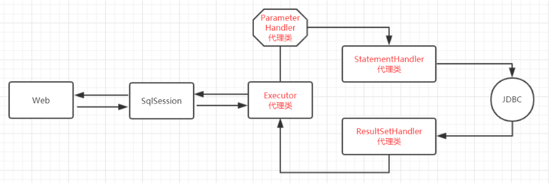

# 工程的其他文件

employee.java

```java
public class Employee {
	private Integer id;
	private String empName;
	private String email;
	private Integer gender;
}
```

employeeDao.java

```java
package com.z.dao;

import com.z.bean.Employee;

/*
@author author ZFL:
@version time:2020年1月8日下午4:15:08
*/
public interface EmployeeDao {

	// 按照员工id查询员工
	public Employee getEmpById(Integer id);

	public int updateEmployee(Employee employee);

	public int deleteEmployee(Integer id);

	public int insertEmployee(Employee employee);
	
	public int insertEmployee2(Employee employee);
}

```


# 写配置

全局配置文件就不记录了

从 xxxMapper.xml 开始

* sql语句不要写分号
* 增删改不用写返回值类型 ：
  * 增删改是返回影响多少行
  * Mybatis 会自动判断，
  * 如果是数字（int,long）
  * 如果是boolean(影响0行自动封装为false，否则true)

```xml
<?xml version="1.0" encoding="UTF-8" ?>
<!DOCTYPE mapper
  PUBLIC "-//mybatis.org//DTD Mapper 3.0//EN"
  "http://mybatis.org/dtd/mybatis-3-mapper.dtd">
<mapper namespace="com.z.dao.EmployeeDao">
    <!-- public Employee getEmpById(Integer id);参数类型(parameterType)不用写 -->
    <select id="getEmpById" resultType="com.z.bean.Employee">
        <!-- sql语句不要写分号 -->
        select
        *
        from
        t_employee
        where
        id = #{id}
    </select>
    <!-- 增删改不用写返回值类型 ：增删改是返回影响多少行
   Mybatis 会自动判断，如果是数字（int,long）
   如果是boolean(影响0行自动封装为false，否则true)

   #{属性名}直接从传入的参数对象中取出对应属性的值
  -->
    <!-- public int updateEmployee(Employee employee); -->
    <update id="updateEmployee" >
        update 
        t_employee
        set
        empname = #{empName},gender = #{gender},email = #{email}
        where
        id = #{id}
    </update>
    <!-- public int deleteEmployee(Integer id); -->
    <delete id="deleteEmployee">
        delete from
        t_employee
        where 
        id = #{id}
    </delete>
    <!-- public int insertEmployee(Employee employee); -->
    <insert id="insertEmployee">
        insert into
        t_employee(empname,gender,email)
        values(#{empName},#{gender},#{email})
    </insert>
</mapper>
```


# 测试

`import org.apache.ibatis.io.Resources;` 

Resources 中还有很多方法，可以关注一下

## 查询操作

```java
public class MyTest{
    @Test
    void test01(){
        //1.根据全局配置文件得到SqlSessionFactory对象
        String resource = "mybatis-config.xml";
        InputStream is = Resources.getResourceAsStream(resource);
		SqlSessionFactory ssf = new SqlSessionFactoryBuilder().builder(is);
        //2.得到SqlSession对象
        SqlSession session = ssf.openSession();
        //3.获取dao接口的实现（映射器）
        UserDao dao = session.getMapper(UserDao.class);
        
		try {
			Employee emp = dao.getEmpById(1);
			System.out.println(emp);
		}finally {
            // 需要手动关闭mybatis的对话，释放内存和CPU
			session.close();
		}
	}
    }
}
```

## 插入操作

方法运行前的初始化，测试环境 JUnit5 `@BeforeEach`

```java
SqlSessionFactory ssf = null;
	@BeforeEach
	public void initSqlSessionFactory() throws IOException {
		System.out.println("initsqlsessionFactory");
		String resource = "mybatis-config.xml";
		InputStream is = Resources.getResourceAsStream(resource);
		ssf = new SqlSessionFactoryBuilder().build(is);
	}
```

测试主体

```java
@Test
	void testInsert() {
		SqlSession session = ssf.openSession();
		EmployeeDao dao = session.getMapper(EmployeeDao.class);
		try {
			int i = dao.insertEmployee(new Employee(null,"6-13人","12309iu@qq.com",1));
			System.out.println(i);
		}finally {
			session.close();
		}
	}
```

方法执行，发现方法执行成功，影响行数 i 被成功返回，但是数据库并未改变；

原因是：除了查询方法，增删改操作 都需要手动进行提交

方式一：

```java
finally{
    session.commit();
    session.close();
}
```

方式二：

设置自动提交

```java
//SessionFactory.openSession();中可以传参，
//xxx.openSession(boolean arg0);  这个布尔值就表示是否自动提交，默认为false ，不自动提交
SqlSessionFactory.oppenSession(true);
```

## 删除、修改测试

大体同上，需要手动提交或者设置自动提交是 **重点** 

---

# 细节

两个文件：

1. 全局配置文件：mybatis-config.xml ；知道mybatis正确运行一些全局配置；
2. SQL映射文件 ：xxxDao.xml ；相当于是对Dao接口的一个实现描述；


1. SqlSession.getMapper() 获取到的是接口的代理对象 ；mybatis 自动创建的 ；
2. SqlSessionFactory 创建 SqlSession 对象 ；Factory 创建一次就行了
   1. SqlSession ：相当于 connection 和 数据库 进行交互 ，和数据库的一次会话 ，就应该每次创建一个 SqlSession ；


---

# 全局配置文件

http://www.mybatis.cn/680.html

https://mybatis.org/mybatis-3/zh/configuration.html

来自mybatis中文官网的介绍

## 结构：

configuration（配置）

- properties（属性）
- settings（设置）
- typeAliases（类型别名）
- typeHandlers（类型处理器）
- objectFactory（对象工厂）
- plugins（插件）

environments（环境配置）

- environment（环境变量）
  - transactionManager（事务管理器）
  - dataSource（数据源）

    - databaseIdProvider（数据库厂商标识）

mappers（映射器）


```xml
<?xml version="1.0" encoding="UTF-8" ?>
<!DOCTYPE configuration
PUBLIC "-//mybatis.org//DTD Config 3.0//EN"
"http://mybatis.org/dtd/mybatis-3-config.dtd">
<!-- 配置文件的根元素 -->
<configuration>
    <!-- 属性：定义配置外在化 -->
    <!-- 1、和Spring的context:property-placeholder一样：引用外部配置文件 -->
	<!-- 
		resource作用：从类路径下开始引用
		url：可以引用磁盘路径或者网络路径的资源
	 -->
    <properties></properties>
    <!-- 设置：定义mybatis的一些全局性设置 -->
    <settings>
        <!-- 具体的参数名和参数值 -->
        <setting name="" value=""/> 
    </settings>
    <!-- 类型名称：为一些类定义别名 -->
    <typeAliases></typeAliases>
    <!-- 类型处理器：定义Java类型与数据库中的数据类型之间的转换关系 -->
    <typeHandlers></typeHandlers>
    <!-- 对象工厂 -->
    <objectFactory type=""></objectFactory>
    <!-- 插件：mybatis的插件,插件可以修改mybatis的内部运行规则 -->
    <plugins>
        <plugin interceptor=""></plugin>
    </plugins>
    <!-- 环境：配置mybatis的环境 -->
    <environments default="">
        <!-- 环境变量：可以配置多个环境变量，比如使用多数据源时，就需要配置多个环境变量 -->
        <environment id="">
            <!-- 事务管理器 -->
            <transactionManager type=""></transactionManager>
            <!-- 数据源 -->
            <dataSource type=""></dataSource>
        </environment> 
    </environments>
    <!-- 数据库厂商标识 -->
    <databaseIdProvider type=""></databaseIdProvider>
    <!-- 映射器：指定映射文件或者映射类 -->
    <mappers></mappers>
</configuration>
```

## 属性(properties)

这些属性都是可外部配置且可动态替换的，既可以在典型的 Java 属性文件中配置，亦可通过 properties 元素的子元素来传递。例如：

```xml
<properties resource="org/mybatis/example/config.properties">
  <property name="username" value="root"/>
  <property name="password" value="root"/>
</properties>
<!-- 例如 -->
<dataSource type="POOLED">
  <property name="driver" value="${driver}"/>
  <property name="url" value="${url}"/>
  <property name="username" value="${username}"/>
  <property name="password" value="${password}"/>
</dataSource>
```

从  ==**MyBatis 3.4.2**==开始，你可以为占位符指定一个默认值。例如：

```java
<dataSource type="POOLED">
  <!-- ... -->
  <property name="username" value="${username:root}"/> <!-- 如果属性 'username' 没有被配置，'username' 属性的值将为 'root' -->
</dataSource>
```

但是，这个特性 ==默认是关闭的==。如果你想为占位符指定一个 ==默认值== ， 你应该添加一个指定的属性来开启这个特性。例如：

```xml
<properties resource="org/mybatis/example/config.properties">
  <!-- ... -->
  <property name="org.apache.ibatis.parsing.PropertyParser.enable-default-value" value="true"/> <!-- 启用默认值特性 -->
</properties>
```

## 设置(settings)


| 设置参数              | 描述            | 有效值      | 默认值 |
| --------------------- | --------------- | ----------- | ------ |
| lazyLodingEnable      | 延迟加载        | false\|true | false  |
| aggressiveLazyLoading | false：按需加载 |             |        |
|                       |                 |             |        |
|                       |                 |             |        |
|                       |                 |             |        |
|                       |                 |             |        |
|                       |                 |             |        |
|                       |                 |             |        |
|                       |                 |             |        |
|                       |                 |             |        |
|                       |                 |             |        |
|                       |                 |             |        |
|                       |                 |             |        |


## 类型别名(typeAliases)

类型别名是为Java类型设置的一个短的名字。它只和XML配置有关，存在的意义仅在于用来减少类完全限定名的冗余。

```xml
<typeAliases>
    <!-- typeAlias ：就是为一个 javaBean 起别名；
		 如果不指定 alias；那么别名默认就是类名（不区分大小写，亲测）
 	-->
<typeAlias alias="user" type="cn.mybatis.domain.User"/>
</typeAliases>

```

当这样配置时，user可以用在任何使用cn.mybatis.domain.User的地方。

也可以指定一个包名，MyBatis会在包名下面搜索需要的JavaBean

```xml
<typeAliases>
<!-- 批量起别名
    name="" 指定包；包下的类的别名如上描述
-->
<package name="cn.mybatis.domain"/>
</typeAliases>
```

每一个在包cn.mybatis.domain中的Java Bean，在没有 **注解** 的情况下，会使用Bean的 **首字母小写** 的非限定类名来作为它的别名。比如cn.mybatis.domain.User的别名为user。**若有注解**，则别名为其注解值。

```java
@Alias ("user")
public class User {
...
}
```

### 推荐

不用别名了，用全类名；提高了可读性，可以直接看出 `com.z.bean.Employee` 在哪里；而别名还需要查找

---

## 类型处理器(typeHandlers)


原生jdbc执行sql；或者封装结果集是这样的

```java
Connection conn = dataSource.getConnection();
String sql = "insert into t_employee(empname,email,gender) values(?,?,?)";
PreparedStatement ps = conn.preparedStatement(sql);
ps.setString(0,"admin");
ps.setString(1,"aa@qq.com");
ps.setInt(2,1);
int i = ps.executeUpdate();
//ps.close();conn.close();
```

类型处理器就是解决java数据类型和数据库数据类型之间的映射问题，比如 int 到数据库就要转换成数据库的 int ；

自定义类型处理器；

实现org.apache.ibatis.type.TypeHandler接口，或继承一个很便利的类org.apache.ibatis.type.BaseTypeHandler,然后可以选择性地将它映射到一个JDBC类型。

然后注册到mybatis全局配置的 `<typeHandlers>` 标签里面


## MyBatis插件

MyBatis允许用户在已映射语句执行过程中的某一点进行拦截调用。MyBatis使用插件来拦截的方法调用，故此MyBatis插件通常称为：Mybatis **拦截器** 。默认情况下，MyBatis允许使用插件来拦截的对象包括下面的四大金刚：

- Executor
- ParameterHandler
- ResultSetHandler
- StatementHandler

> 说明：Mybatis可以对这四个接口中所有的方法进行拦截。

通过动态代理，当写好插件以后，mybatis 会通过动态代理将四大组件中被拦截的组件，代理，在这些组件的前后左右执行操作

### MyBatis插件（代理类）示例图



>  如上图所示：MyBatis系统最终会将插件包装成代理类，通过代理类来执行插件里面的功能。


## 环境(environments)

应用场景：开发的时候用的是本机的数据源，`<enviroments>` 标签中的 `default` 属性通过 `<enviroment>` 的id 唯一确定开发环境。比如说下面有两个环境，一个是开发环境 `<enviroment id="development">` 一个是测试环境 `<enviroment id="testDev">` ；开发环境的数据源跟测试环境用的数据源是不一样的，所以开发人员就可以通过 `enviroment` 的id切换开发环境


```xml
<!-- default="development"就是默认使用哪个环境 -->
<environments default="development">
    <!-- id="development"是当前环境的唯一标识 -->
    <environment id="development">
        <transactionManager type="JDBC" />
        <!-- 配置连接池 -->
        <dataSource type="POOLED">
            <property name="driver" value="${jdbc.driver}" />
            <property name="url" value="${jdbc.url}" />
            <property name="username" value="${jdbc.user}" />
            <property name="password" value="${jdbc.password}" />
        </dataSource>
    </environment>

    <environment id="testDev">
        <transactionManager type="JDBC" />
        <!-- 配置连接池 -->
        <dataSource type="POOLED">
            <property name="driver" value="${jdbc.driver}" />
            <property name="url" value="${jdbc.url}" />
            <property name="username" value="${jdbc.user}" />
            <property name="password" value="${jdbc.password}" />
        </dataSource>
    </environment>

</environments>
```


## 数据库标识(databaseIdProvider)

了解即可

```xml
<databaseIdProvider type="DB_VENDOR">
    <property name="SQL Server" value="sqlserver"/>
    <property name="DB2" value="db2"/>
    <property name="Oracle" value="oracle" />
    <property name="MySQL" value="mysql"/>
</databaseIdProvider>
```

应用

```xml
<!-- 默认sql语句是不区分数据库环境的 -->
<select id="getEmpById" resultType="EMPLOYEE" databaseId="mysql">
    select
    *
    from
    t_employee
    where
    id = #{id}
</select>
<!-- databaseId="" 就是选择数据库厂商标识；也就是databaseIdProvider 里面的值 -->
<select id="getEmpById" resultType="EMPLOYEE" databaseId="oracle">
    select
    *
    from
    t_employee
    where
    id = #{id}
</select>
```

## mappers

使用相对于 ==类路径== 的资源引用

``` xml
<!-- 使用相对于类路径的资源引用 -->
<mappers>
  <mapper resource="org/mybatis/builder/AuthorMapper.xml"/>

  <mapper resource="org/mybatis/builder/BlogMapper.xml"/>
  <mapper resource="org/mybatis/builder/PostMapper.xml"/>
</mappers>
```


```xml
<!-- 使用完全限定资源定位符（URL） -->
<mappers>
  <mapper url="file:///var/mappers/AuthorMapper.xml"/>
  <mapper url="file:///var/mappers/BlogMapper.xml"/>
  <mapper url="file:///var/mappers/PostMapper.xml"/>
</mappers>
```


如果是用全类名的方式注册mapper，可能会报错；报错的原因：映射文件和接口文件不再同一个文件夹。所以mybatis 不知道哪个接口能够被映射文件实现；

解决：将映射文件和接口放在同一目录下，至少目录结构必须一样，位置可以不同

```xml
<!-- 使用映射器接口实现类的完全限定类名 -->
<mappers>
  <mapper class="org.mybatis.builder.AuthorMapper"/>
  <mapper class="org.mybatis.builder.BlogMapper"/>
  <mapper class="org.mybatis.builder.PostMapper"/>
</mappers>
```


```xml
<!-- 将包内的映射器接口实现全部注册为映射器 -->
<mappers>
  <package name="org.mybatis.builder"/>
</mappers>
```


---


