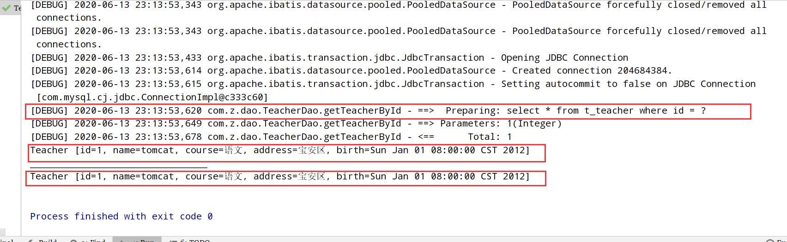
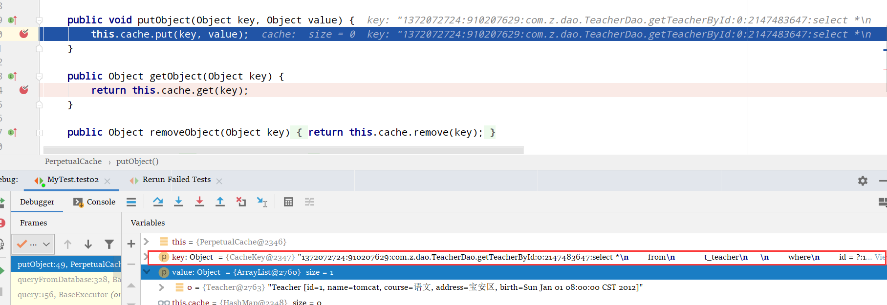
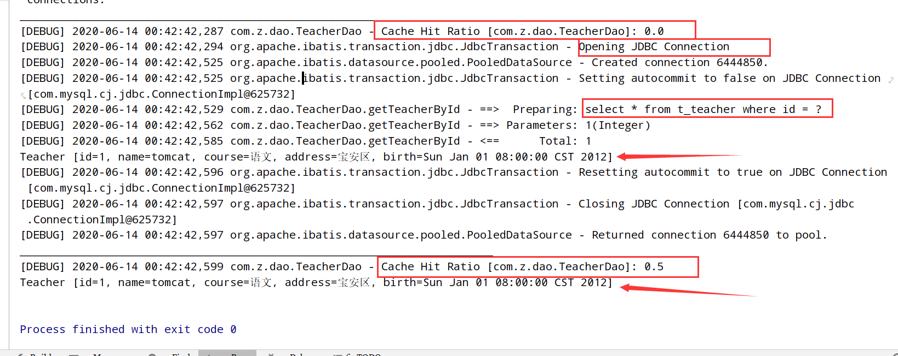

缓存：暂时存储一些数据；就是为了加快系统的查询速度…..

MyBatis 缓存机制 ：Map ；能够保存一些查出来的数据 有两级缓存

一级缓存：

* 线程级别的缓存；
* 本地缓存
* SqlSession 级别的缓存

二级缓存；

* 全局范围的缓存；
* 除了当前线程能用之外；
* 其他的 SqlSession 也能用


# 一级缓存

SqlSession级别的缓存  ；默认存在的

只要之前查询过的数据，mybatis就会保存在一个缓存（map）；



可以看出，查询了两次一样的信息，但是只执行了一次sql语句；


## 缓存失效

一级缓存失效的几种情况；

一级缓存是SqlSession 级别的缓存

1. 不同的sqlSession ，使用不同的一级缓存
   1. 只有在同一个 SqlSession 期间查询到的数据会保存在这个sqlSession 的缓存中；
   2. 下次使用这个 sqlSession 查询会从缓存拿

2. 同一个方法，不同查询数据，由于之前可能没查过，所以 还会执行新的sql语句；

3. 在这个 sqlSession 期间执行任何增删改操作，那么一级缓存会被清空，以至于再次查询相同数据不命中

4. 手动清空了缓存；
   1. 每次查询，先看一级缓存有没有，如果没有就执行sql语句

```java

@Test
void test02(){
    // 第一个会话
    SqlSession session = ssf.openSession();
    TeacherDao dao1 = session.getMapper(TeacherDao.class);
    System.out.println("---------------------------------------------------------------------");
    Teacher t1 = dao1.getTeacherById(1);
    System.out.println(t1);

    // 第二个会话
    //        SqlSession session2 = ssf.openSession();
    //        TeacherDao dao2 = session2.getMapper(TeacherDao.class);
    //        Teacher t2 = dao2.getTeacherById(1);
    //        System.out.println(t2);
    // 执行任何一个增删改操作
    System.out.println("------------------------------------------------------");
    //        dao1.updateTeacher(new Teacher(2,"haha", null, null, null));
    //        session.commit();
    //        session.clearCache();
    //        System.out.println("clear cache");
    System.out.println("_---------------------------------");
    Teacher teacher3 = dao1.getTeacherById(1);
    session.close();
    //        session2.close();

}
```

跟踪一下mybatis源码，看看缓存用的map

路径：

这个 cache 是 mybatis 的cache —>`org.apache.ibatis.cache` 

cache –>PerpetualCache(cache的实现类)

可以看出，这个Map的key 很长





## 总结

一级缓存，也就是本地缓存；不能被关闭，只能被清空

# 二级缓存

全局范围的缓存，多个会话(sqlSession)可以共用

二级缓存默认不开启，需要手动配置

二级缓存在 SqlSession 关闭或者提交后 才会生效

* 一级缓存的数据会放在二级缓存中

## 使用步骤描述

* 全局配置文件中开启二级缓存
  * `<setting name="cacheEnable" value="true"/>`
* 需要使用二级缓存的映射文件使用 `cache` 配置缓存
  * `<cache/>` 写在 `<mapper>` 标签下
* **注意** ：POJO 需要实现 Serializable 接口 --》序列化

## 效果

```java
@Test
void test03(){
    SqlSession session = ssf.openSession();
    SqlSession session1 = ssf.openSession();

    System.out.println("___________________________________________________________________");
    TeacherDao dao1 = session.getMapper(TeacherDao.class);
    TeacherDao dao2 = session1.getMapper(TeacherDao.class);

    // 1. 第一个 dao 查询1号
    Teacher tea1 = dao1.getTeacherById(1);
    System.out.println(tea1);
    session.close();
    System.out.println("________________________________________________________________________");
    Teacher tea2 = dao2.getTeacherById(1);
    System.out.println(tea2);
    session1.close();
}
```




第一次查询，缓存未命中；连接数据库查询数据，加入缓存

第二次查询，缓存命中；直接返回数据；

两次查询不在同一个 sqlSession 中

## 注意：

一定要将对象序列化

---

# 缓存查询顺序

```
/**
 * @Author: zfl
 * @Date: 2020/6/14 0:52
 * 1、一级缓存和二级缓存中同时拥有一个数据；
 *      二级缓存中：一级缓存关闭才会将一级缓存的数据存入二级缓存；
 *      一级缓存中：只有当二级缓存中没有数据才会查一级缓存，一级缓存也没有才去查数据库
 * 2、任何时候都是先看二级缓存、再看一级缓存，如果都没有才去查数据库
 */
```

总的来说，就是二级缓存优先访问；如果二级没有才去看一级缓存；

先查全局缓存，再查线程缓存


# 缓存有关的属性

## select标签中的缓存

表示这个select语句使用 二级缓存 

这个属性设置与否，对一级缓存没有影响

```xml
<select id="" resultMap="" useCache="true">
xxxx
</select>
```

## 增删改中的flushCache

只要执行该sql语句，就会同时清空一级和二级缓存

## sqlSession.clearCache()

清理一级缓存

# 第三方缓存

想尝试和 redis 整合，但是感觉今晚时间不够，算了。整合一下 EHCache 吧

## 整合ehcache

ehcache 是2017年非常专业的java进程内的缓存框架。比redis简单

### 导包


```xml
<!-- https://mvnrepository.com/artifact/net.sf.ehcache/ehcache-core （核心包）-->
<dependency>
    <groupId>net.sf.ehcache</groupId>
    <artifactId>ehcache-core</artifactId>
    <version>2.6.8</version>
</dependency>
<!-- https://mvnrepository.com/artifact/org.mybatis.caches/mybatis-ehcache （整合包）-->
<dependency>
    <groupId>org.mybatis.caches</groupId>
    <artifactId>mybatis-ehcache</artifactId>
    <version>1.0.3</version>
</dependency>
<!-- 依赖的日志包 -->
<!-- https://mvnrepository.com/artifact/org.slf4j/slf4j-api -->
<dependency>
    <groupId>org.slf4j</groupId>
    <artifactId>slf4j-api</artifactId>
    <version>1.7.25</version>
</dependency>
<!-- https://mvnrepository.com/artifact/org.slf4j/slf4j-log4j12 -->
<dependency>
    <groupId>org.slf4j</groupId>
    <artifactId>slf4j-log4j12</artifactId>
    <version>1.7.25</version>
    <scope>test</scope>
</dependency>
```


### 写ehcache的配置

文件名一定要叫做  `ehcache.xml` 放在类路径的根目录下

```xml
<?xml version="1.0" encoding="UTF-8"?>
<ehcache xmlns:xsi="http://www.w3.org/2001/XMLSchema-instance"
         xsi:noNamespaceSchemaLocation="../config/ehcache.xsd">
    <!-- 磁盘保存路径 -->
    <diskStore path="E:\desktop\mybatis_log\ehcache" />

    <defaultCache
                  内存中最大存储量
                  maxElementsInMemory="1"
                  磁盘中最大存储量
                  maxElementsOnDisk="10000000"
                  eternal="false"
                  overflow 是溢出的意思，溢出后是否保存到磁盘
                  overflowToDisk="true"
                  timeToIdleSeconds="120"
                  timeToLiveSeconds="120"
                  diskExpiryThreadIntervalSeconds="120"
                  memoryStoreEvictionPolicy="LRU">
    </defaultCache>
</ehcache>

```


```

<!--
属性说明：
 diskStore：当内存中不够存储时，存储到指定数据在磁盘中的存储位置。
 defaultCache：当借助CacheManager.add("demoCache")创建Cache时，EhCache便会采用<defalutCache/>指定的的管理策略

以下属性是必须的：
 maxElementsInMemory - 在内存中缓存的element的最大数目
 maxElementsOnDisk - 在磁盘上缓存的element的最大数目，若是0表示无穷大
 eternal - 设定缓存的elements是否永远不过期。如果为true，则缓存的数据始终有效，如果为false那么还要根据timeToIdleSeconds，timeToLiveSeconds判断
 overflowToDisk - 设定当内存缓存溢出的时候是否将过期的element缓存到磁盘上

以下属性是可选的：
 timeToIdleSeconds - 当缓存在EhCache中的数据前后两次访问的时间超过timeToIdleSeconds的属性取值时，这些数据便会删除，默认值是0,也就是可闲置时间无穷大
 timeToLiveSeconds - 缓存element的有效生命期，默认是0.,也就是element存活时间无穷大
diskSpoolBufferSizeMB 这个参数设置DiskStore(磁盘缓存)的缓存区大小.默认是30MB.每个Cache都应该有自己的一个缓冲区.
 diskPersistent - 在VM重启的时候是否启用磁盘保存EhCache中的数据，默认是false。
 diskExpiryThreadIntervalSeconds - 磁盘缓存的清理线程运行间隔，默认是120秒。每个120s，相应的线程会进行一次EhCache中数据的清理工作
 memoryStoreEvictionPolicy - 当内存缓存达到最大，有新的element加入的时候， 移除缓存中element的策略。默认是LRU（最近最少使用），可选的有LFU（最不常使用）和FIFO（先进先出）
-->
```

在需要缓存的 映射文件写配置

`org.mybatis.caches.ehcache.EhcacheCache` 

```xml
<?xml version="1.0" encoding="UTF-8" ?>
<!DOCTYPE mapper
        PUBLIC "-//mybatis.org//DTD Mapper 3.0//EN"
        "http://mybatis.org/dtd/mybatis-3-mapper.dtd">
<mapper namespace="com.z.dao.TeacherDao">
    <cache type="org.mybatis.caches.ehcache.EhcacheCache"/>
    <cache-ref namespace="com.z.dao.EmpDao"/>
</mapper>
```

如果别的dao也需要用缓存，继续配置这一句就行了

也可以跟其他Dao共用一个二级缓存区 `cache-ref` 

```xml
<?xml version="1.0" encoding="UTF-8" ?>
<!DOCTYPE mapper
        PUBLIC "-//mybatis.org//DTD Mapper 3.0//EN"
        "http://mybatis.org/dtd/mybatis-3-mapper.dtd">
<mapper namespace="com.z.dao.TeacherDao">
    <cache-ref namespace="com.z.dao.EmpDao"/>
</mapper>
```


### 测试

```java
@Test
void test04(){
    SqlSession session = ssf.openSession();
    TeacherDao dao = session.getMapper(TeacherDao.class);
    Teacher teacher = dao.getTeacherById(1);
    System.out.println(teacher);
    System.out.println("________________________________");
    Teacher t2 = dao.getTeacherById(1);
    System.out.println(t2);
    session.close();

    SqlSession s1 = ssf.openSession();
    TeacherDao mapper = s1.getMapper(TeacherDao.class);
    Teacher teacher1 = mapper.getTeacherById(1);
    System.out.println(teacher1);
    s1.close();

    SqlSession s3 = ssf.openSession();
    TeacherDao mapper1 = s3.getMapper(TeacherDao.class);
    Teacher teacher2 = mapper1.getTeacherById(1);
    System.out.println(teacher2);
    s1.close();

}
```


### 总结

整合ehcache的好处是，被保存的对象不用事先 `Serializable` 接口了


