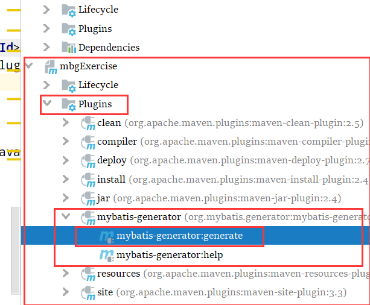

[官方文档](http://mybatis.org/generator/) 

# 使用MBG

## 导包

### 方式1：

用 maven 方式，只需要加入插件；可以不导包

```xml
<build>
    <plugins>
        <!--注入MBG插件-->
        <plugin>
            <groupId>org.mybatis.generator</groupId>
            <artifactId>mybatis-generator-maven-plugin</artifactId>
            <version>1.4.0</version>
            <dependencies>
                <dependency>
                    <groupId>mysql</groupId>
                    <artifactId>mysql-connector-java</artifactId>
                    <version>8.0.19</version>
                </dependency>
            </dependencies>
        </plugin>
    </plugins>
</build>
```

效果



在idea中可以找到相关的插件被加载，点击 `mybatis-generator:generate` 即可生成（前提是配置文件写好了）

### 方式二：

只导包，可以用maven ，也可以不用 maven ；导包的话要自己写命令来启动 MBG


## 写配置

mbg.xml

```xml
<!DOCTYPE generatorConfiguration PUBLIC
        "-//mybatis.org//DTD MyBatis Generator Configuration 1.0//EN"
        "http://mybatis.org/dtd/mybatis-generator-config_1_0.dtd">
<generatorConfiguration>
    <context id="MysqlTable" targetRuntime="Mybatis3">
        <!-- jdbcConnection ：指导连接到哪个数据库 -->
        <jdbcConnection driverClass="com.mysql.cj.jdbc.Driver"
                        connectionURL="jdbc.url=jdbc:mysql://localhost:3306/mybatisdb?serverTimezone=UTC&useSSL=false"
                        password="123456"
                        userId="root"/>

        <!-- javaModelGenerator ：生成POJO(javaBean)
             targetPackage ：生成的pojo放在哪个包
             targetProject ：放在哪个工程下
         -->
        <javaModelGenerator targetPackage="com.z.bean" targetProject="src/main/java">
            <property name="enableSubPackages" value="true"/>
            <property name="trimStrings" value="true"/>
        </javaModelGenerator>
        <!-- sqlMapGenerator ：sql映射文件生成器，指定xml生成的地方 -->
        <sqlMapGenerator targetPackage="mybatis.mapper" targetProject="src/main/resources">
            <property name="enableSubPackages" value="true"/>
        </sqlMapGenerator>

        <!-- javaClientGenerator ：dao接口生成的地方 -->
        <javaClientGenerator targetPackage="com.z.dao" targetProject="src/main/java" type="XMLMAPPER">
        </javaClientGenerator>

        <!-- 一个table指定要逆向生成的表
            tableName ：表名
            domainObjectName ：这个表对应的POJO对象名
         -->
        <table tableName="t_employee" domainObjectName="Employee"></table>
        <table tableName="t_teacher" domainObjectName="Teacher"/>
        <table tableName="t_cat" domainObjectName="Cat"/>
    </context>
</generatorConfiguration>
```

## 标签

### context

|                  |                                                      |      |
| ---------------- | ---------------------------------------------------- | ---- |
| id               | 唯一标识符，随便写                                   |      |
| targetRuntime    | 只有两个选择：MyBatis3\|MyBatis3Simple；其他的不用理 |      |
| javaFileEncoding | java文件的编码                                       |      |
|                  |                                                      |      |

### javaModelGenerator

targetPackage targetProject 这两个属性就不说了，看例子就能明白，无非就是生成的东西在哪里罢了

主要记一下 `<property>` 的属性

|                   |                                                              |      |
| ----------------- | ------------------------------------------------------------ | ---- |
| constructorBased  | 默认为false：设置为true会给POJO生成有参构造器                |      |
| enableSubPackages | 不是很懂，可以不设置，默认false                              |      |
| trimStrings       | 添加了这个属性，对象会自动对传进来的值进行去除空格操作；默认false |      |
| immutable         | 只生成构造函数，不生成getter/setter；如果这个设置为true，那么constructorBased 会默认为 true |      |


### sqlMapGenerator

property 子标签中只有一个属性 `enableSubPackages` 


### javaClientGenerator

`type` 的值固定写 `XMLMAPPER` 就行了

|                   |                                |      |
| ----------------- | ------------------------------ | ---- |
| enableSubPackages | 同上；测试过感觉没有什么乱用， |      |
| rootInterface     | 指定父类；value要填全类名      |      |
|                   |                                |      |


### table


  有ByExample 后缀的都是动态sql语句

|                          |                                                              |          |
| ------------------------ | ------------------------------------------------------------ | -------- |
| domainObjectName         | 根据数据表生成的对象名；不写就是自动生成；                   |          |
| mapperName               | 指定mapper的名字                                             |          |
| enableInsert             | 是否生成插入语句：                                           | 默认true |
| enableSelectByPrimaryKey | 是否生成根据主键查找，如果这个表没有主键就不会生成该语句     | 默认true |
| enableSelectByExample    | 是否生成动态查询                                             | 默认true |
| enableUpdateByPrimaryKey |                                                              | 默认true |
| enableDeleteByPrimaryKey |                                                              | 默认true |
| enableDeleteByExample    | 有ByExample 后缀的都是动态sql语句                            | 默认true |
| enableCountByExample     | 计算行数的语句                                               | 默认true |
| enableUpdateByExample    |                                                              | 默认true |
| escapeWildcards          | 表示在搜索列时是否应转义架构和tableName中的SQL通配符(“_”和“%”)。如果模式或tableName包含SQL通配符(例如，如果表名为my_table，则某些驱动程序要求转义下划线字符)，则某些驱动程序需要这样做。 | 默认true |


### commnetGenerator

`type` 指定用户自定义注释生成器的类名

子元素 `<property>` 的可选属性

suppress 抑制；禁止的意思

|                     |                                                      |      |
| ------------------- | ---------------------------------------------------- | ---- |
| suppressAllComments | 默认为false；设置为true将禁止所有文件生成注释        |      |
| suppressDate        | 注释不生成时间；默认为false                          |      |
| addRemarkComments   | 是否生成数据表中的注释；默认为false                  |      |
| dateFormat          | 日期格式；猜测他的value是这样的：yyyy-mm-dd HH:mm:ss |      |


## 测试

```java
private SqlSessionFactory ssf;
@BeforeEach
void init() throws IOException {
    String resoure = "mybatis-config.xml";
    InputStream is = Resources.getResourceAsStream(resoure);
    ssf = new SqlSessionFactoryBuilder().build(is);
}

@Test
void test02(){
    SqlSession session = ssf.openSession();
    EmployeeMapper mapper = session.getMapper(EmployeeMapper.class);
    EmployeeExample example = new EmployeeExample();
    example.createCriteria().andIdIn(Arrays.asList(1,4,8,12));
    List<Employee> cats = mapper.selectByExample(example);
    cats.forEach(System.out::println);
}

@Test
void test01(){
    SqlSession session = ssf.openSession();
    CatMapper mapper = session.getMapper(CatMapper.class);
    CatExample example = new CatExample();
    List<Cat> cats = mapper.selectByExample(example);
    cats.forEach(System.out::println);
}
```


如果实在是忘记了只能去找一下这个工程了

```xml
<parent>
        <artifactId>cache</artifactId>
        <groupId>com.exercise.mybatis</groupId>
        <version>1.0-SNAPSHOT</version>
    </parent>
    <modelVersion>4.0.0</modelVersion>

    <artifactId>mbgExercise</artifactId>
```

如果这个工程也不见了 ，应该这个时候看得懂了吧 


---

# 补充一点方法

xxxExample 中的方法

setOrderByClause()--》括号里面填的是字段名字，如果想要升序降序的话在字段后面加 desc 或者 xxx 就行了

* 例如：TeacherExample.setOrderByClause("id DESC")；按照id升序还是降序来着？

createCriteria 是按条件查询的意思，里面有很多条件，就不一一看了  使用方法

* TeacherExample.createCriteria().andIdIn(Arrays.asList(1,2,3))；查询id的值在 1,2,3 范围内的数据；


