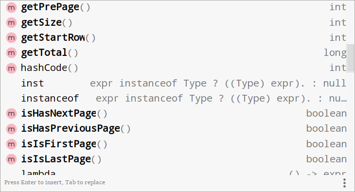
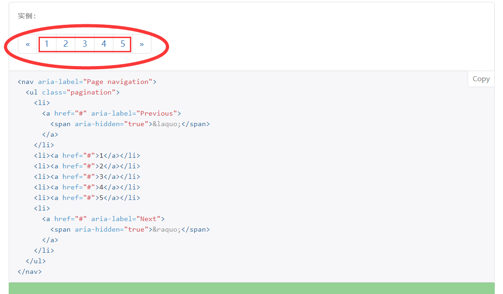

[官方文档](https://apidoc.gitee.com/free/Mybatis_PageHelper/) 

[API](https://apidoc.gitee.com/free/Mybatis_PageHelper/) 

# 使用步骤

## 导包

需要导两个包，pageHelper 和 jsqlParser 

```xml
<!-- 分页插件 -->
<dependency>
    <groupId>com.github.pagehelper</groupId>
    <artifactId>pagehelper</artifactId>
    <version>5.1.1</version>
</dependency>
<!-- pageHelper 的依赖 -->
<dependency>
    <groupId>com.github.jsqlparser</groupId>
    <artifactId>jsqlparser</artifactId>
    <version>3.1</version>
</dependency>
```


## 写配置

需要在 `Mybatis-config.xml` 总配置文件中加入插件

放在什么位置试一下就知道了；目前记得的顺序就是：`properties、settings、xxx......xxx、mappers`

```xml
<plugins>
    <plugin interceptor="com.github.pagehelper.PageInterceptor">
        <!-- config params as the following -->
        <property name="param1" value="value1"/>
    </plugin>
</plugins>
```

## 测试

```java
@Test
void testPageHelper() {
    SqlSession session = ssf.openSession();
    TeacherMapper mapper = session.getMapper(TeacherMapper.class);
    //PageHelper.startPage(2,10);
    // 紧跟他的查询就是一个分页查询
    Page<Object> objects = PageHelper.startPage(1, 10, true);
    List<Teacher> teachers = mapper.selectByExample(new TeacherExample());
    System.out.println(objects.getPageSize());
    teachers.forEach(System.out::println);
}
```


## startPage()属性详解

```java
public static <E> Page<E> startPage(int pageNum,
                                    int pageSize,
                                    boolean count,
                                    Boolean reasonable,
                                    Boolean pageSizeZero)

```


**Parameters:**

`pageNum` - 页码

`pageSize` - 每页显示数量

`count` - 是否进行count查询

`reasonable` - 分页合理化,null时用默认配置

`pageSizeZero` - true且pageSize=0时返回全部结果，false时分页,null时用默认配置

---

# 更强大的功能

将查出来的数据封装到 `PageInfo` 对象中，`PageInfo` 可以提供很多强大的功能

```java
@Test
void testPageHelper() {
    SqlSession session = ssf.openSession();
    TeacherMapper mapper = session.getMapper(TeacherMapper.class);
    //PageHelper.startPage(2,10);
    Page<Object> objects = PageHelper.startPage(12, 10, true);
    List<Teacher> teachers = mapper.selectByExample(new TeacherExample());
    // 可以将查询的结果封装起来,这个pageInfo就有非常多实用的功能
    PageInfo<Teacher> info = new PageInfo<>(teachers);
    System.out.println("当前页码 " + info.getPageNum());
    System.out.println("总页码 " + info.getPages());
    System.out.println("总记录数 " + info.getTotal());
    System.out.println("当前页有几条记录" + info.getPageSize());
    System.out.println("前一页" + info.getPrePage());
    teachers.forEach(System.out::println);
}
```


PageInfo



可以满足网页开发的许多需求

## 使用步骤

Controller

```java
@RequestMapping("/allTeacher?pNum=1&pSize=10")
public String getAll(
    Model model,
    @Param(value="pNum",defaultValue=0,required=false)pNum,
     @Param(value="pSize",defaultValue=10,required=false)pSize,
){
	PageHelper.start(pNum,pSize);
    List<Teacher> teachers = teacherService.getAll();
    PageInfo<Teacher> info = new PageInfo<>(list);
    model.addAttribute("info",info);
    return "showTeacher";
}
```

showTeacher.jsp

```xml
<c:forEach item="${info.list}" var="tea">
${tea.id} ......
</c:forEach>
<!-- 分页导航栏 -->
<td>
<a href="xxxProject/allTeacher?pNum=0">首页</a>
<a href="xxxProject/allTeacher?pNum=${info.prePage}">上一页</a>
  ${info.pageNum}  
<a href="xxxProject/allTeacher?pNum=${info.nextPage}">下一页</a>
<ahref="xxxProject/allTeacher?pNum=${info.pages}">尾页 </a>
</td>
```

# 连续分页

```java
public PageInfo(List<T> list, int navigatePages) {}
```

PageInfo 的另一个强大功能

可以连续展示多个分页



就像这种效果

## 后端实现

controller

```java
@RequestMapping("/allTeacher?pNum=1&pSize=10")
public String getAll(
    Model model,
    @Param(value="pNum",defaultValue=0,required=false)pNum,
     @Param(value="pSize",defaultValue=10,required=false)pSize,
){
	PageHelper.start(pNum,pSize);
    List<Teacher> teachers = teacherService.getAll();
    // 需要导航栏显示多少页，list后面的值就写多少；比如说上面的图是有5个导航；这里就写5
    PageInfo<Teacher> info = new PageInfo<>(list,5);
    model.addAttribute("info",info);
    return "showTeacher";
}
```


## 前端实现

```html
<c:forEach item="${info.list}" var="tea">
${tea.id} ......
</c:forEach>
<!-- 分页导航栏 -->
<td>
<a href="xxxProject/allTeacher?pNum=0">首页</a>
<a href="xxxProject/allTeacher?pNum=${info.prePage}">上一页</a>
//****************************************************************************
  <!-- ${info.pageNum} 把当前页码替换掉-->
	<c:foreach item="${info.navigatepageNums}" var="num">
        <!-- 意思是如果是当前页码，就显示加粗，并且不可选，要不然就按照超链接形式出现 -->
    <c:if test="${num == info.pageNum}">
       【${num}】
	</c:if>
   		 <a href="xxxProject/allTeacher?pNum=${num}">${num}</a>
    </c:foreach>
//****************************************************************************
<a href="xxxProject/allTeacher?pNum=${info.nextPage}">下一页</a>
<ahref="xxxProject/allTeacher?pNum=${info.pages}">尾页 </a>
</td>
```

