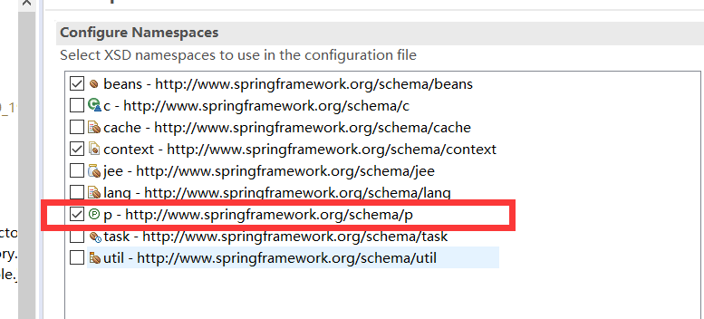

### IOC-(Inversion Of Control)

## 介绍

控制：获取资源方式；

* 主动式：
  * `Student std = new Student()`
  * 就是自己去创建对象
* 被动式：
  * 资源的获取不是程序员创建的，而是交给一个容器来创建的 

容器：

* 管理所有的组件（有功能的类）
* 假设，Student 受容器管理，StudentService 也受容器管理
* 容器可以自动监听出哪些组件（类）需要用到另一些组件
* 容器替我们创建 StudentService 对象，并把 StudentService 对象注入到某个组件中

容器比喻：

* 婚介所，
* 主动找女朋友，变成被动的接受

DI：(Dependency Injection) 依赖注入

* 容器能知道哪个组件运行的时候，需要另一个类；
* 容器通过反射的形式，将容器中准备好的组件注入到 另一个组件

只要组件管理的组件，都能使用容器提供的强大功能；

---

## HelloWorld

导包

写配置

测试

---

### 写配置

配置文件名：ioc.xml

#### 注册一个组件

```xml
<!-- 注册Person对象 -->
<!-- 一个bean注册一个对象 -->
<!-- id唯一表示 -->
<bean id="person01" class="com.bean.Person" >
    <!--属性赋值  -->
    <property name="lastName" value="张三"></property>
    <property name="age" value="18"></property>
    <property name="email" value="zangdsh@qq.com"></property>
    <property name="gender" value="男"></property>
</bean>

<!-- 第二个人 -->
<bean id="person02" class="com.bean.Person" >
    <property name="lastName" value="zz三"></property>
</bean>
```

#### 组件赋值的多种方式

##### 通过 setter 方式

```xml
<bean id="person01" class="com.bean.Person" >
    <!--属性赋值  -->
    <property name="lastName" value="张三"></property>
    <property name="age" value="18"></property>
    <property name="email" value="zangdsh@qq.com"></property>
    <property name="gender" value="男"></property>
</bean>
<!--属性赋值  -->
	<!-- property中的name获取的属性名由getter//setter决定，截取g//s后面的，首字母小写 -->
```

##### 有参构造器

```xml
<!-- 	有参构造器赋值 -->
<bean id="person03" class="com.bean.Person">
    <!-- public Person(String lastName, Integer age, String gender, String email) -->
    <constructor-arg name="lastName" value="小明"></constructor-arg>
    <constructor-arg name="email" value="sldjf@qq.com"></constructor-arg>
    <constructor-arg name="gender" value="男"></constructor-arg>
    <constructor-arg name="age" value="12"></constructor-arg>
</bean>

<!-- 有参构造器赋值2   可以省略name属性，但是赋值顺序必须严格按照参数列表写 -->
// 如果不想按构造器的参数列表来赋值，那么可以指定索引
<!-- 构造器重载的情况下，可以通过配置 type + index 的方式指定某一个构造器 -->
<bean id="person04" class="com.bean.Person">
    <constructor-arg value="person04"></constructor-arg>
    <constructor-arg value="16" index="1"></constructor-arg>
    <constructor-arg value="男"></constructor-arg>
    <constructor-arg value="enfen@qqcom"></constructor-arg>
</bean>
```

##### 通过名称空间赋值

导入 `p` 名称空间才能用这个方式赋值




```xml
<!-- 通过名称空间赋值 -->
<!-- 名称空间，防止xml标签重复 -->
<bean class="com.bean.Person" id="person06"
      p:age="16" p:email="aslkfdj@qq.com" p:lastName="haha" p:gender="男">
</bean>
```

#### 给各种复杂属性赋值

##### 类结构

```java
public class Person{
    //基本类型
    private String lastName;
    private Integer age;
    private String gender;
    private String email;

    private Car car;
    private List<Book> books;
    private Map<String,Object> maps;
    private Properties properties;
}
```


```xml


<bean id="book01" class="com.bean.Book">
    <property name="bookName" value="东游记"></property>
</bean>

<!-- 引用 util 创建出来的 Map -->
<bean class="com.bean.Person">
    <property name="maps" ref="myMap"></property>
</bean>
```

##### ref赋值

```xml
<bean id="car01" class="com.bean.Car">
    <property name="carName" value="宝马"></property>
    <property name="color" value="绿色"></property>
    <property name="price" value="300000"></property>
</bean>

<bean class="com.bean.Person" id="person01">
    <!-- 为属性赋值空 -->
    <property name="lastName">
        <null></null>
    </property>
    
    <!-- ref引用外面的值 引用外部bean -->
    <property name="car" ref="car01"></property> 
    <property name="car">
        
        <!-- 引用内部bean  -->
        <bean id="carInner" class="com.bean.Car">
            <property name="carName" value="自行车"></property>
        </bean>
    </property>
</bean>
```

##### 给 list 赋值

```xml
<bean class="com.bean.Person" id="person02">
    <!-- 如何为list类型赋值 -->
    <property name="books">
        <!-- 相当于 books = new ArrayList<Book>(); -->
        <list>
            <!--list标签体中添加每一个元素  -->
            <bean class="com.bean.Book" p:bookName="西游记"></bean>
            <ref bean="book01"/>
        </list>
    </property>
</bean>
```

##### 给 map 赋值

```xml
<bean class="com.bean.Person" id="person02">
    <!-- map赋值 -->
    <property name="maps">
        <!-- 相当于 maps = new LinkedHashMap<>(); -->
        <map>
            <!-- 一个entry代表一个键值对 -->
            <entry key="key01" value="张三"></entry>
            <entry key="key02" value="16"></entry>
            <entry key="key03" value-ref="book01"></entry>
            <entry key="key04">
                <bean class="com.bean.Car">
                    <property name="carName" value="宝马"></property>
                </bean>
            </entry>
            <entry key="key05">
                <map></map>
            </entry>
        </map>
    </property>
</bean>
```

##### 给 properties 赋值

```xml
<bean class="com.bean.Person" id="person02">
    <property name="properties">
        <!-- 相当于 properties=new Properties();所有的kv都是string -->

        <props>
            <!-- kv都是string；值直接写在标签体重 -->
            <prop key="username">root</prop>
            <prop key="password">123456</prop>
        </props>

    </property>
</bean>
```

##### util名称空间创建集合类型

```xml
<!-- util名称空间创建集合类型的bean 
  方便别人引用
 -->
<util:map id="myMap">
    <!-- 添加元素 -->
    <entry key="key01" value="张三"></entry>
    <entry key="key02" value="18"></entry>
    <entry key="key03" value-ref="book01"></entry>
    <entry key="key04">
        <bean class="com.bean.Car">
            <property name="carName" value="宝马"></property>
        </bean>
    </entry>
    <entry key="key05">
        <value>李四</value>
    </entry>
</util:map>

<util:list id="myList">
    <list></list>
    <bean class="com.bean.Person"></bean>
    <value>12</value>
    <ref bean="myMap"/>
</util:list>
```

##### 级联属性赋值

```xml
<!-- 级联属性赋值,  级联属性：属性的属性 -->
<bean id="person04" class="com.bean.Person">
    <!-- 为car赋值时，改变car的价格 -->
    <property name="car" ref="car01"></property>
    <!--  -->
    <property name="car.price" value="900000"></property>
</bean>
```

##### 继承实现bean配置信息的重用

```xml
<!-- 通过继承实现bean配置信息的重用 -->
<!-- abstract="ture"：说明这个bean的配置是一个抽象的，不能实例，只能被别人继承 -->
<bean id="person05" class="com.bean.Person" abstract="true">
    <property name="lastName" value="张三"></property>
    <property name="age" value="18"></property>
    <property name="gender" value="男"></property>
    <property name="email" value="sldjfl;@qq.com"></property>
</bean>

<!-- parent:指定当前bean的配置继承于哪个 ,class可以省-->
<bean id="person06" parent="person05">
    <property name="lastName" value="李四"></property>
</bean>
```

---

#### bean 之间的依赖

了解一下就好了，没有使用场景

```xml
<!-- 
按照配置顺序创建bean:
就是说写在前面的 bean ，会先被 ioc 容器加载
 -->
<!-- 
改变bean的创建顺序：
可以通过 bean 中的 `depends-on`属性设置启动顺序，被依赖的先创建，例如
<bean id="person" class="com.bean.Person" depends-on="car,book"></bean>
于是，创建顺序就是 car book person
 -->
<!--
 bean之间的依赖，只是改变创建顺序 没有其他作用
-->
<bean id="person" class="com.bean.Person" ></bean>
<bean id="book" class="com.bean.Book"></bean>
<bean id="car" class="com.bean.Car"></bean>
```


#### bean 的作用域


```xml
<!-- 测试bean的作用域，分别创建单实例和多实例的bean
		bean的作用域：指定bean是否单实例，xxx;默认，单实例
		prototype:多实例的
			1)、容器启动默认不创建实例，就是容器启动的时候一般都会加载 bean ,但是 prototype不会被加载，而是等到用的时候才加载，也就是懒加载

			2)、每次获取创建一个新的对象；
		singleton:单实例的，默认：
			1)、在容器启动完成之前就已经创建好对象，保存在容器中。
			2)、任何时候获取，都是获取之前创建好的对象；
			
		request:在Web环境下，同一次请求创建一个Bean实例（没用）
		session:在Web环境下，同一次会话创建一个Bean实例（没用）
	 -->
	<bean id="book" class="com.bean.Book" scope="prototype"/>
```

#### 工厂

工厂模式：工厂帮我们创建对象；有一个专门帮我们创建对象的类，这个类就是工厂

静态工厂：

* 工厂本身不用创建对象；
* 通过静态方法调用，`工厂类.工厂方法名()；`

实例工厂：

- 工厂本身需要创建对象；
- `工厂类 对象 = new 工厂类();`

```xml
<!-- 配置通过静态工厂方法创建的bean、实例工厂方法创建的bean、FactoryBean -->
<!-- bean的创建默认就是框架利用反射new的bean实例 -->
<!-- 静态工厂(不需要创建工厂本身)；factory-method="getAirPlane"指定哪个方法是工厂方法
  class:指定静态方法全类名
  factory.method:指定类中的方法名
  constructor-arg:传参
  -->
<bean id="airPlane01" class="com.factory.AirPlaneStaticFactory"
      factory-method="getAirPlane">
    <!-- 为方法指定参数 -->
    <constructor-arg value="李四"></constructor-arg>
</bean>

<!-- 实例工厂使用 -->
<bean id="airPlaneInstanceFactory" 
      class="com.factory.AirPlaneInstanceFactory"></bean>

<!-- factory-bean:指定当前对象创建使用哪个工厂 
   1.先配置出实例工厂对象
   2.配置我们要创建的AirPlane使用哪个工厂创建
    1)、factory-bean:指定哪个工厂实例
    2)、factory-method:指定哪个工厂方法
 -->
<bean id="airPlane02" class="com.bean.AirPlane"
      factory-bean="airPlaneInstanceFactory"
      factory-method="getAirPlane">
    <constructor-arg value="王五"></constructor-arg>
</bean>	
	
<!-- FactoryBean(是spring规定的一个接口)；
 只要是这个接口的实现类，Spring都认为是一个工厂; 
 1.ioc容器启动的时候不会创建这个实例
 2.FactoryBean：获取的时候才创建对象
 -->
<bean id="myFactoryBeanImple"
      class="com.factory.MyFactoryBeanImple">
</bean>

<bean id="HelloDaoImpl" class="com.bean.HelloDaoImpl">

</bean>
```


### 测试


```java
@Test
void test2() {
    //ClassPathXmlApplicationContext代表当前的xml配置文件在ClassPath下
    //根据Spring的配置文件得到ioc容器对象
    ApplicationContext ioc = ClassPathXmlApplicationContext("ioc.xml");
    System.out.println("容器启动完成。。。。");
    Person bean=(Person) ioc.getBean("person01");
    Object bean2 = ioc.getBean("person01");
    System.out.println(bean);
    System.out.println(bean==bean2);

}
```

#### 从容器中获取对象的多种方式

##### 通过字符串

参数是 配置文件中的 id 

```java
Person bean=(Person) ioc.getBean("person01");
 System.out.println(bean);
```

##### 通过类名获取

* 如果 ioc 容器中，这个 bean 的类型有多个(就是有多个 id ) ，用这种方法就会报错

```java
Person bean = ioc.getBean(Person.getClass());
<!-- example -->
// 有两个 id 指向一个实例，还通过类名获取，就会报错
<bean id="person1"></bean>
<bean id="person2"></bean>
```


---


## 细节

1. 同一个组件，在 ioc 容器中，默认是单例的；创建多次对象只能拿到同一个对象
2. `property` 赋值时通过 `setter` 赋值的，可以在 `setter` 加一句输出，就可以验证了
3. `javaBean` 的属性名是 `getter/setter` 决定的，而不是 `bean` 中的属性；

---

## IOC2

### bean的生命周期

生命周期：bean的创建到销毁；

- (容器启动)构造器---》初始化方法---》(容器关闭)销毁方法

ioc容器中注册的bean;

- 单例bean：容器启动的时候就会创建好，容器关闭也会销毁
- 多实例bean：获取的时候才创建；

我们可以为bean自定义一些生命周期方法：

- spring在 创建 和 销毁 的时候就会调用 指定的方法 ；

- 自定义 初始化方法 和 销毁方法；
- 这两个方法不能带参数，但是可以输出、抛出异常

```xml
<!-- applicationContext.xml -->
// 指定初始化方法和销毁方法 myDestory myInit
<bean id="book01" class="com.bean.Book"
      destroy-method="myDestory" init-method="myInit"
      ></bean>

```

Book.java

```java
public class Book {
    private String bookName;
    private String author;
    public void myInit() {
        System.out.println("这是图书的初始化方法.....");
    }
    public void myDestory() {
        System.out.println("这是图书的销毁方法......");
    }
}
```

### 后置处理器

可以再 bean 初始化的时候做一点小动作，增强 bean 的功能

* (容器启动)构造器---》后置处理器before---》初始化方法---》后置处理器after---》初始化完成
* 无论 bean 是否有初始化方法；后置处理器都会默认他有

```xml

<!-- 11.测试bean的后置处理器：
   Spring有一个接口：后置处理器：可以再bean的初始化前后调用方法；
  -->
注册一下已经实现 后置处理器 的实现类
<bean id="myBeanPostProcessor" class="com.bean.myBeanPostProcessor"></bean>
```


实现后置处理器接口

```java
package com.bean;
public class myBeanPostProcessor implements BeanPostProcessor {
	/*
	 * postProcessBeforeInitalization:
	 * 		初始化之前调用
	 * Object bean:将要初始化的bean
	 * */
	@Override
	public Object postProcessBeforeInitialization(Object bean, String beanName) throws BeansException {
		// TODO Auto-generated method stub
		System.out.println(beanName+"bean将要调用初始化方法了....这个bean是这样的："+bean);
		// 处理一下 bean
		//返回传入的bean
		return bean;
	}
	/*
	 *postProcessAfterInitialization:初始化之后调用
	 *
	 *Object bean
	 *String beanName
	 **/
	@Override
	public Object postProcessAfterInitialization(Object bean, String beanName) throws BeansException {
		// TODO Auto-generated method stub
		System.out.println(beanName+"bean初始化方法调用完了>...postProcessAfterInitialization.");
		return bean;
	}
}

```


