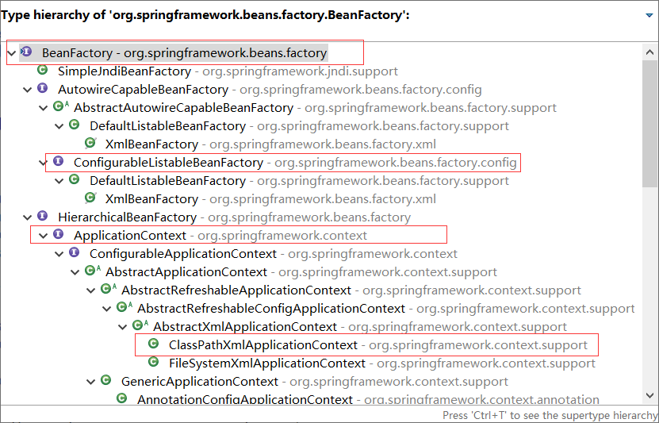
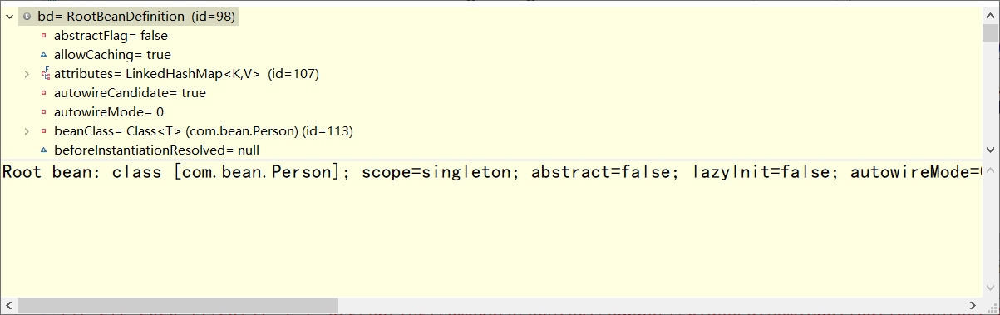
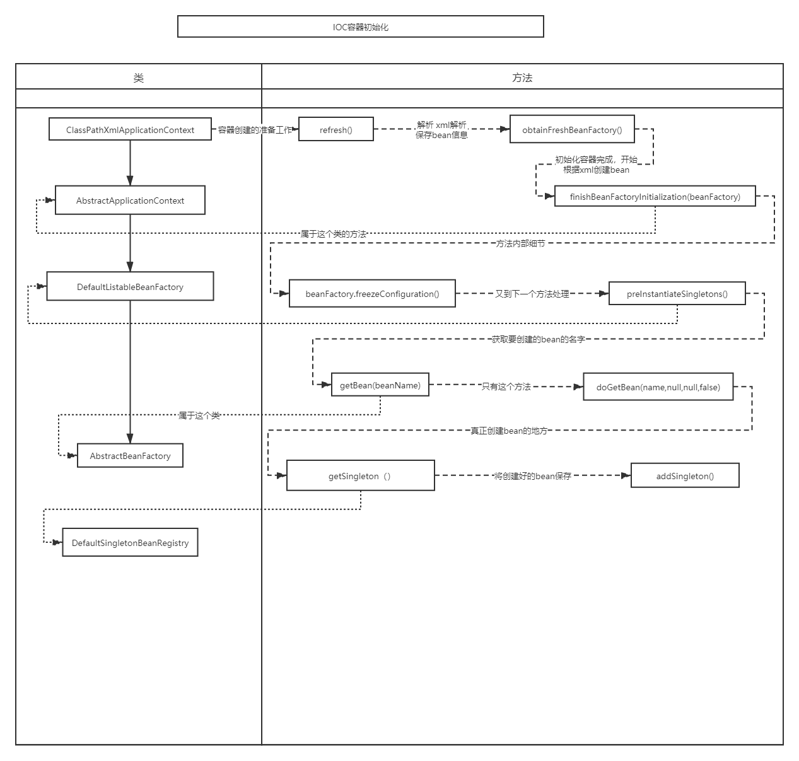

IOC 是一个容器，帮我们管理所有组件

* 依赖注入：@Autowire 自动赋值
* 某个组件使用 Spring 提供的更多 IOC、AOP 必须加入到容器中

#### 体会

- 容器启动，创建所有 bean **默认单例** 的

- autowired 自动装配，从容器中找到符合要求的 bean

- 容器中包括了所有的 bean 

* 调试 spring的源码，容器其实就是一个 Map

- 这个Map中保存了所有创建好的 bean ，并提供外界获取功能

#### 源码调试思路：

helloWorld 开始，给helloWorld 每个关键步骤打上断点，进去看看有什么

怎么知道这些方法是干什么的

* 翻译这个方法，见名知意
* 看控制台

---

## Spring-IOC（源码）

IOC是一个容器

容器启动的时候创建所有单实例对象

SpringIOC关注点：

* IOC容器的启动过程？启动期间做了什么（什么时候创建所有单实例 bean）
* IOC 是如何创建这些单实例 bean ，并如何管理；到底保存到哪里？

思路：

### 从helloworld开始

---

#### ClassPathXmlContext 构造器

ApplicationContext ioc = new ClassPathXmlContext("ioc.xml");

`this(new String[] {configLocation}, true, null);`

```java
public ClassPathXmlApplicationContext(String[] configLocations, boolean refresh, ApplicationContext parent)
			throws BeansException {

		super(parent);
		setConfigLocations(configLocations);
		if (refresh) {
            // 手动变色：重点
            // 所有单实例 bean 创建完成
			refresh();
		}
	}
```




#### BeanFactory ：Bean 工厂

往下看，在 `refresh()` 中有用到

#### refresh()实现

重点提取：

`ConfigurableListableBeanFactory beanFactory = obtainFreshBeanFactory();`

* 可以查看 Spring 解析 XML 的过程

`initMessageSource();`

* 用来支持国际化功能的

`onRefresh()`

* 留给子类的方法，可一个你自己写一个 IOC 容器

`finishBeanFactoryInitialization(beanFactory)`

* 重点关注
* 初始化所有单实例 bean 的地方

```java
@Override
public void refresh() throws BeansException, IllegalStateException {
    // 这个同步锁保证对象只被创建一次
    synchronized (this.startupShutdownMonitor) {
        // Prepare this context for refreshing.
        prepareRefresh();

        // Tell the subclass to refresh the internal bean factory.
        // Spring 解析 xml 配置文件，将要创建的所有 bean 配置信息保存起来
        ConfigurableListableBeanFactory beanFactory = obtainFreshBeanFactory();

        // Prepare the bean factory for use in this context.
        prepareBeanFactory(beanFactory);

        try {
            // Allows post-processing of the bean factory in context subclasses.
            postProcessBeanFactory(beanFactory);

            // Invoke factory processors registered as beans in the context.
            invokeBeanFactoryPostProcessors(beanFactory);

            // Register bean processors that intercept bean creation.
            registerBeanPostProcessors(beanFactory);

            // Initialize message source for this context.
            initMessageSource();

            // Initialize event multicaster for this context.
            initApplicationEventMulticaster();

            // Initialize other special beans in specific context subclasses.
            onRefresh();

            // Check for listener beans and register them.
            registerListeners();

            // Instantiate all remaining (non-lazy-init) singletons.
            // 手动变色，重点
            finishBeanFactoryInitialization(beanFactory);

            // Last step: publish corresponding event.
            finishRefresh();
        }

        catch (BeansException ex) {
            if (logger.isWarnEnabled()) {
                logger.warn("Exception encountered during context initialization - " +
                            "cancelling refresh attempt: " + ex);
            }

            // Destroy already created singletons to avoid dangling resources.
            destroyBeans();

            // Reset 'active' flag.
            cancelRefresh(ex);

            // Propagate exception to caller.
            throw ex;
        }

        finally {
            // Reset common introspection caches in Spring's core, since we
            // might not ever need metadata for singleton beans anymore...
            resetCommonCaches();
        }
    }
}
```

#### `finishBeanFactoryInitialization(beanFactory)`实现

进入到一个 `AbstractApplicationContext`:

`beanFactory.preInstantiateSingletons()`

* 初始化所有单实例 bean 看名字读出来的--预加载单实例s

```java
protected void finishBeanFactoryInitialization(ConfigurableListableBeanFactory beanFactory) {
    // Initialize conversion service for this context.
    // 这个是用来做自定义类型转换的，不用管
    if (beanFactory.containsBean(CONVERSION_SERVICE_BEAN_NAME) &&
        beanFactory.isTypeMatch(CONVERSION_SERVICE_BEAN_NAME, ConversionService.class)) {
        beanFactory.setConversionService(
            beanFactory.getBean(CONVERSION_SERVICE_BEAN_NAME, ConversionService.class));
    }

    // Register a default embedded value resolver if no bean post-processor
    // (such as a PropertyPlaceholderConfigurer bean) registered any before:
    // at this point, primarily for resolution in annotation attribute values.
    if (!beanFactory.hasEmbeddedValueResolver()) {
        beanFactory.addEmbeddedValueResolver(new StringValueResolver() {
            @Override
            public String resolveStringValue(String strVal) {
                return getEnvironment().resolvePlaceholders(strVal);
            }
        });
    }

    // Initialize LoadTimeWeaverAware beans early to allow for registering their transformers early.
    // 这个属于 @Autowired 的东西
    String[] weaverAwareNames = beanFactory.getBeanNamesForType(LoadTimeWeaverAware.class, false, false);
    for (String weaverAwareName : weaverAwareNames) {
        getBean(weaverAwareName);
    }

    // Stop using the temporary ClassLoader for type matching.
    beanFactory.setTempClassLoader(null);

    // Allow for caching all bean definition metadata, not expecting further changes.
    // freeze 冻结，读起来就是 冻结配置的意思，等于是设置不允许修改配置了
    beanFactory.freezeConfiguration();

    // Instantiate all remaining (non-lazy-init) singletons.
    // 手动重点
    beanFactory.preInstantiateSingletons();
}
```


#### `preInstantiateSingletons()`

进入了 `DefaultListableBeanFactory` 这个类

* 是一个 bean 工厂，用来创建 bean 的

`List<String> beanNames=new ArrayList<String>(this.beanDefinitionNames);`

* 拿到所有要创建的 bean 的名字

`for(String beanName:beanNames)` 

* 按顺序创建 bean

* 创建 bean 的工作都在这里，从这个 for 循环可以看出，为什么创建 bean 都是顺序创建的

##### 创建Bean的过程

* 拿到 bean 的详细信息
  * 通过 `getMergedLocalBeanDefinition(beanName)` 拿到的
  * 这个 beanName 是 bean 的ID



* `if (!bd.isAbstract() && bd.isSingleton() && !bd.isLazyInit()) {`
  * 验证了 ioc 初始化阶段只会创建单实例 bean 

== `getBean(beanName);`==

* 创建==不是抽象类型&&是单实例bean&&不是懒加载&&不是工厂bean==  的bean 就是这个方法

```java
@Override
public void preInstantiateSingletons() throws BeansException {
    if (this.logger.isDebugEnabled()) {
        this.logger.debug("Pre-instantiating singletons in " + this);
    }

    // Iterate over a copy to allow for init methods which in turn register new bean definitions.
    // While this may not be part of the regular factory bootstrap, it does otherwise work fine.
    // 手动加标签
    List<String> beanNames = new ArrayList<String>(this.beanDefinitionNames);

    // Trigger initialization of all non-lazy singleton beans...
    // 手动加标签
    for (String beanName : beanNames) {
        // 手动标签
        RootBeanDefinition bd = getMergedLocalBeanDefinition(beanName);
        
        // 判断要创建的对象；只有 不是抽象类型&&是单实例的&&不是懒加载的 才会被创建出来
        if (!bd.isAbstract() && bd.isSingleton() && !bd.isLazyInit()) {
// #############################################################################
            // 判断是不是工厂bean,如果是，做以下操作
            // 手动标签
            if (isFactoryBean(beanName)) {
                final FactoryBean<?> factory = (FactoryBean<?>) getBean(FACTORY_BEAN_PREFIX + beanName);
                boolean isEagerInit;
                if (System.getSecurityManager() != null && factory instanceof SmartFactoryBean) {
                    isEagerInit = AccessController.doPrivileged(new PrivilegedAction<Boolean>() {
                        @Override
                        public Boolean run() {
                            return ((SmartFactoryBean<?>) factory).isEagerInit();
                        }
                    }, getAccessControlContext());
                }
                else {
                    isEagerInit = (factory instanceof SmartFactoryBean &&
                                   ((SmartFactoryBean<?>) factory).isEagerInit());
                }
                if (isEagerInit) {
                    getBean(beanName);
                }
            }
            else {
                getBean(beanName);
            }
        }
// ##########################################################################
    }

    // Trigger post-initialization callback for all applicable beans...
    for (String beanName : beanNames) {
        Object singletonInstance = getSingleton(beanName);
        if (singletonInstance instanceof SmartInitializingSingleton) {
            final SmartInitializingSingleton smartSingleton = (SmartInitializingSingleton) singletonInstance;
            if (System.getSecurityManager() != null) {
                AccessController.doPrivileged(new PrivilegedAction<Object>() {
                    @Override
                    public Object run() {
                        smartSingleton.afterSingletonsInstantiated();
                        return null;
                    }
                }, getAccessControlContext());
            }
            else {
                smartSingleton.afterSingletonsInstantiated();
            }
        }
    }
}
```

 

#### `getBean(beanName)` 

实现创建 bean 的细节

来自于 `AbstractBeanFactory` 继承于 `BeanFactory` 顶级接口

```java
public Object getBean(String name) throws BeansException {
    	// 所有 bean 的创建都是通过 doGetBean(name,null,null, false);
		return doGetBean(name, null, null, false);
	}
```


#### `doGetBean()`细节

* `Object sharedInstance=getSingleton(beanName)`
  * 检查缓存
* ` String[] dependsOn = mbd.getDependsOn();`
  * 获取有没有依赖加载
* `sharedInstance = getSingleton(beanName,ObjectFactory)`
  * 创建 bean 

```java
@SuppressWarnings("unchecked")
protected <T> T doGetBean(
    final String name, final Class<T> requiredType, final Object[] args, boolean typeCheckOnly)
    throws BeansException {

    final String beanName = transformedBeanName(name);
    Object bean;

    // Eagerly check singleton cache for manually registered singletons.
    // 手动标签
    // 检查已经注册的单实例 bean 里面有没有这个 bean;
    // 第一次创建 bean 是没有的
    Object sharedInstance = getSingleton(beanName);
    if (sharedInstance != null && args == null) {
        if (logger.isDebugEnabled()) {
            if (isSingletonCurrentlyInCreation(beanName)) {
                logger.debug("Returning eagerly cached instance of singleton bean '" + beanName +
                             "' that is not fully initialized yet - a consequence of a circular reference");
            }
            else {
                logger.debug("Returning cached instance of singleton bean '" + beanName + "'");
            }
        }
        bean = getObjectForBeanInstance(sharedInstance, name, beanName, null);
    }

    else {
        // Fail if we're already creating this bean instance:
        // We're assumably within a circular reference.
        if (isPrototypeCurrentlyInCreation(beanName)) {
            throw new BeanCurrentlyInCreationException(beanName);
        }

        // Check if bean definition exists in this factory.
        BeanFactory parentBeanFactory = getParentBeanFactory();
        if (parentBeanFactory != null && !containsBeanDefinition(beanName)) { 
            // Not found -> check parent.
            String nameToLookup = originalBeanName(name);
            if (args != null) {
                // Delegation to parent with explicit args.
                return (T) parentBeanFactory.getBean(nameToLookup, args);
            }
            else {
                // No args -> delegate to standard getBean method.
                return parentBeanFactory.getBean(nameToLookup, requiredType);
            }
        }

        if (!typeCheckOnly) {
            
            markBeanAsCreated(beanName);
        }

        try {
            final RootBeanDefinition mbd = getMergedLocalBeanDefinition(beanName);
            checkMergedBeanDefinition(mbd, beanName, args);

            // Guarantee initialization of beans that the current bean depends on.
            // 手动标签
            // 拿到创建当前 bean 之前需要提前创建的 bean。也就是 depends-on;属性
            String[] dependsOn = mbd.getDependsOn();
            if (dependsOn != null) {
                for (String dep : dependsOn) {
                    if (isDependent(beanName, dep)) {
                        throw new BeanCreationException(mbd.getResourceDescription(), beanName,
                                                        "Circular depends-on relationship between '" + beanName + "' and '" + dep + "'");
                    }
                    registerDependentBean(dep, beanName);
                    getBean(dep);
                }
            }
			// 手动标签
            // Create bean instance.创建 bean 实例
            if (mbd.isSingleton()) {
                sharedInstance = getSingleton(beanName, new ObjectFactory<Object>() {
                    @Override
                    public Object getObject() throws BeansException {
                        try {
                            return createBean(beanName, mbd, args);
                        }
                        catch (BeansException ex) {
                            // Explicitly remove instance from singleton cache: It might have been put there
                            // eagerly by the creation process, to allow for circular reference resolution.
                            // Also remove any beans that received a temporary reference to the bean.
                            destroySingleton(beanName);
                            throw ex;
                        }
                    }
                });
                bean = getObjectForBeanInstance(sharedInstance, name, beanName, mbd);
            }

            else if (mbd.isPrototype()) {
                // It's a prototype -> create a new instance.
                Object prototypeInstance = null;
                try {
                    beforePrototypeCreation(beanName);
                    prototypeInstance = createBean(beanName, mbd, args);
                }
                finally {
                    afterPrototypeCreation(beanName);
                }
                bean = getObjectForBeanInstance(prototypeInstance, name, beanName, mbd);
            }

            else {
                String scopeName = mbd.getScope();
                final Scope scope = this.scopes.get(scopeName);
                if (scope == null) {
                    throw new IllegalStateException("No Scope registered for scope name '" + scopeName + "'");
                }
                try {
                    Object scopedInstance = scope.get(beanName, new ObjectFactory<Object>() {
                        @Override
                        public Object getObject() throws BeansException {
                            beforePrototypeCreation(beanName);
                            try {
                                return createBean(beanName, mbd, args);
                            }
                            finally {
                                afterPrototypeCreation(beanName);
                            }
                        }
                    });
                    bean = getObjectForBeanInstance(scopedInstance, name, beanName, mbd);
                }
                catch (IllegalStateException ex) {
                    throw new BeanCreationException(beanName,
                                                    "Scope '" + scopeName + "' is not active for the current thread; consider " +
                                                    "defining a scoped proxy for this bean if you intend to refer to it from a singleton",
                                                    ex);
                }
            }
        }
        catch (BeansException ex) {
            cleanupAfterBeanCreationFailure(beanName);
            throw ex;
        }
    }

    // Check if required type matches the type of the actual bean instance.
    if (requiredType != null && bean != null && !requiredType.isAssignableFrom(bean.getClass())) {
        try {
            return getTypeConverter().convertIfNecessary(bean, requiredType);
        }
        catch (TypeMismatchException ex) {
            if (logger.isDebugEnabled()) {
                logger.debug("Failed to convert bean '" + name + "' to required type '" +
                             ClassUtils.getQualifiedName(requiredType) + "'", ex);
            }
            throw new BeanNotOfRequiredTypeException(name, requiredType, bean.getClass());
        }
    }
    return (T) bean;
}
```


#### `getSingleton()` 细节

在 `DefaultSingletonBeanRegistry` 类中

* `Object singletonObject=this.singletonObjects.get(beanName)`
* ==singletonObject=singletonFatory.getObject()== 
  * 真真正正创建 bean 的地方

```java
public Object getSingleton(String beanName, ObjectFactory<?> singletonFactory) {
    Assert.notNull(beanName, "'beanName' must not be null");
    synchronized (this.singletonObjects) {
        // 先从一个地方将这个 bean get出来
        Object singletonObject = this.singletonObjects.get(beanName);
        if (singletonObject == null) {
            if (this.singletonsCurrentlyInDestruction) {
                throw new BeanCreationNotAllowedException(beanName,
                                                          "Singleton bean creation not allowed while singletons of this factory are in destruction " +"(Do not request a bean from a BeanFactory in a destroy method implementation!)");
            }
            if (logger.isDebugEnabled()) {
                logger.debug("Creating shared instance of singleton bean '" + beanName + "'");
            }
            beforeSingletonCreation(beanName);
            boolean newSingleton = false;
            boolean recordSuppressedExceptions = (this.suppressedExceptions == null);
            if (recordSuppressedExceptions) {
                this.suppressedExceptions = new LinkedHashSet<Exception>();
            }
            try {
                // 手动标签
                // 创建 bean
                singletonObject = singletonFactory.getObject();
                newSingleton = true;
            }
            catch (IllegalStateException ex) {
                // Has the singleton object implicitly appeared in the meantime ->
                // if yes, proceed with it since the exception indicates that state.
                singletonObject = this.singletonObjects.get(beanName);
                if (singletonObject == null) {
                    throw ex;
                }
            }
            catch (BeanCreationException ex) {
                if (recordSuppressedExceptions) {
                    for (Exception suppressedException : this.suppressedExceptions) {
                        ex.addRelatedCause(suppressedException);
                    }
                }
                throw ex;
            }
            finally {
                if (recordSuppressedExceptions) {
                    this.suppressedExceptions = null;
                }
                afterSingletonCreation(beanName);
            }
            if (newSingleton) {
                // 手动标签
                // 添加被创建的 bean
                addSingleton(beanName, singletonObject);
            }
        }
        return (singletonObject != NULL_OBJECT ? singletonObject : null);
    }
}
```


#### `addSingleton(beanName, singletonObject)`细节

与 `getSingleton()` 同类中

作用：

* 在创建好 bean 之后，在 `singletonObjects` 这个集合中，将 bean 保存好，以 bean 的id为 key ，以 bean 作为 value


```java
protected void addSingleton(String beanName, Object singletonObject) {
    synchronized (this.singletonObjects) {
        this.singletonObjects.put(beanName, (singletonObject != null ? singletonObject : NULL_OBJECT));
        this.singletonFactories.remove(beanName);
        this.earlySingletonObjects.remove(beanName);
        this.registeredSingletons.add(beanName);
    }
}
```

在本类中，用来缓存所有单实例对象的 map

IOC容器之一：

* 保存单实例 bean 的地方
* ioc 就是一个容器，单实例 bean 保存在一个 map 中

```java
/** Cache of singleton objects: bean name --> bean instance */
private final Map<String, Object> singletonObjects = new ConcurrentHashMap<String, Object>(256);
```

---


```java
public static void main(String[] args) {
    // ioc容器的创建
    ioc = new ClassPathXmlApplicationContext("ioc.xml");
    Object bean = ioc.getBean("person03");
    System.out.println(bean);
}
```

ioc.getBean("person03")

* 这个方法也会调用 AbstractApplicationContext 的 getBean() 方法
* 最终会去 `singletonObjects` 这个集合里面找，如果找到了单实例 bean 就返回，找不到就报错


---

## 总结

这是一个曾经的面试题

`BeanFactory` 和 `ApplicationContext` 的区别：

* `ApplicationContext` 是 `BeanFactory` 的子接口

`BeanFactory` 

- 是一个 bean 工厂

- 负责创建 bean
- Spring 最底层的接口

`ApplicationContext`

* 是容器接口
* 更多的是负责容器功能的实现，比如 各种 map 的增删改查
* 可以基于 beanFactory 创建好的对象之上，完成强大的容器功能
* 容器里面保存的所有单例 bean 其实是一个 Map
* 容器可以从 Map 中获取这些 bean ，并且 AOP 。DI 是在 ApplicationContext 接口下的实现类里面


答题；

BeanFactory 最底层的接口，ApplicationContext 留给程序员使用的 ioc 容器接口；ApplicationContext 是 BeanFactory 的子接口

Spring 里面最大的模式就是 工厂模式

* 通过 xml 把参数交给工厂，然后工厂就会自动创建一个对象，

画一个调用过程图


