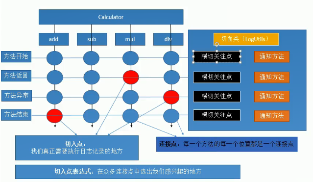

	Aspect Oriented Programming

面向切面编程：

* 面向切面编程:基于OOP基础之上新的编程思想;
* 指在程序运行期间,将 某段代码 动态 的切入到 指定方法 的 指定位置 进行运行的这种编程方式,面向切面编程

场景：

* 计算器运行计算方法进行日志记录
  * 直接编写在方法内部；不推荐

```java
// 动态代理
package com.z.proxy;
/*
 * 帮Calculator.java生成代理对象的类
 * Object newProxyInstance
 * (ClassLoader loader,Class<?>[] interfaces,InvocationHandler h)
 * */
public class CalculatorProxy {
	/*
	 * 为传入的参数对象创建一个动态代理对象
	 * 
	 * Calculator calculaor:被代理对象
	 */
	public static Calculator getProxy(final Calculator calculator) {
		// TODO Auto-generated method stub

		// 方法执行器：帮我们目标对象执行目标方法
		InvocationHandler h = new InvocationHandler() {
			/*
			 * Object proxy:代理对象；给jdk使用的，任何时候都不要动这个对象 Method method：当前将要执行的目标对象的方法 Object[]
			 * args：这个方法调用时，外界传入的参数值
			 */
			@Override
			public Object invoke(Object proxy, Method method, Object[] args) throws Throwable {
				// 利用反射执行目标方法
				// 目标方法执行后的返回值

				Object result = null;
				try {
					LogUtils.logStart(method, args);
					result = method.invoke(calculator, args);
					LogUtils.logReturn(method, result);
				} catch (Exception e) {
					// TODO Auto-generated catch block
					LogUtils.logException(method, e);
				} finally {
					LogUtils.logEnd(method);

				}

				// 返回值必须返回出去，外界才能拿到真正执行后的返回值
				return result;
			}
		};
		Class<?>[] interfaces = calculator.getClass().getInterfaces();
		ClassLoader loader = calculator.getClass().getClassLoader();

		// Proxy为目标对象创建代理对象；
		Object proxy = Proxy.newProxyInstance(loader, interfaces, h);
		return (Calculator) proxy;
	}

}
// 调用
void test() {
    //如果拿到了代理对象，用代理对象执行加减乘除
    Calculator proxy=CalculatorProxy.getProxy(calculator);
    //代理对象和被代理对象唯一能产生的关联就是实现了同一个接口
    proxy.add(2, 1);
    proxy.div(2, 0);
    // 实际上 proxy 就是 calculator 类的增强版
}
```


### 动态代理

- 写起来难
- jdk默认的动态代理，如果目标对象没有实现任何接口，是无法为他创建代理对象的;

Spring 动态代理难；Spring 实现了 AOP 功能；底层就是动态代理

* 可以利用 Spring 依据代码都不写的去创建动态代理
  * 实现简单，没有强制要求目标对象必须实现接口

将某段代码(日志) **动态的切入**(不把日志代码写死在业务逻辑方法中) 到 **指定方法**(Calculator的加减乘除方法) 的 **指定位置**(方法的开始、结束、异常。。。) 进行运行的这种编程方式（Spring 简化了面向切面编程）

---

### AOP 的专业术语



---


## AOP 配置

AOP写配置

* 将目标类和切面类（封装了通知方法（在目标方法执行前后执行的方法））加入到IOC容器中
* 还应该告诉Spring到底哪个是切面类@Aspect
* 告诉Spring，切面类里面的每一个方法，都是何时何地运行；			注解
* 开启基于注解的AOP功能

```xml-dtd
<context:component-scan base-package="com.z"></context:component-scan>

<!-- 4)、开启基于注解的AOP功能：aop名称空间 -->
<aop:aspectj-autoproxy></aop:aspectj-autoproxy>

```


### 基于注解配置

在通知日志类中加上注解，告诉日志方法需要在什么方法切入

```java
@Aspect
@Component
public class ValidateApsect {
	
	@Before("execution(public int com.z.impl.MyMathCalculator.*(int, int))")
	public void logStart(JoinPoint j) {
		Object[] args = j.getArgs();
		Signature signature = j.getSignature();
		String name = signature.getName();
		System.out.println("【"+name+"】方法开始执行，用的参数列表【"+Arrays.asList(args)+"】");
	}
	
	@AfterReturning(value = "execution(public int com.z.impl.MyMathCalculator.*(int, int))",returning = "result")
	public void logReturn(JoinPoint j,Object result) {
		Signature signature = j.getSignature();
		String name = signature.getName();
		System.out.println("【"+name+"】方法正常执行完成，计算机结果是："+result);
	}
	
	@AfterThrowing(value = "execution(public int com.z.impl.MyMathCalculator.*(int, int))",throwing = "exception")
	public static void logException(JoinPoint joinPoint,Exception exception) {
		System.out.println("【"+joinPoint.getSignature().getName()+"】方法执行出现异常了，异常信息是："+exception+";这个异常已经通知测试小组进行排查");
	}
	
	@After(value = "execution(public int com.z.impl.MyMathCalculator.*(int, int))")
	public static void logEnd(JoinPoint j) {
		
		System.out.println("【"+j.getSignature().getName()+"】方法最终结束");
		
	}
}
```


#### 5个通知注解

@Before:之前							                                 前置通知
@After:目标方法运行结束之后					             后置通知

@AfterReturning:在目标方法正常返回之后		   正常通知
@AfterThrowing:目标方法抛出异常之后执行		异常通知

@Around:								                                  环绕通知

#### 切入点表达式的写法

```java
/*
	 * 切入点表达式的写法：
	 * 固定格式：execution(访问权限符 返回值类型 方法全类名(参数表))
	 		execution(public int com.z.dao.userDao.adduser(int,String))
	 * 
	 * 通配符：	
	 * 		*:匹配一个或者多个字符
	 * 		  匹配任意一个参数
	 * 		..:
	 * 			匹配任意多个参数
	 * 			匹配任意多层路径
	 * 
	 * 告诉Spring这个result是返回值
	 * */
```

#### @Before

```java
//想在执行目标方法之前运行，写切入点表达式
//execution(访问权限服 返回值类型 方法签名)
@Before("execution(public int com.z.impl.MyMathCalculator.*(int, int))")
public static void logStart(JoinPoint j) {
    //获取到目标方法运行时使用的参数
    Object[] args = j.getArgs();
    //获取方法签名
    Signature signature = j.getSignature();
    String name = signature.getName();
    System.out.println("[logUtils]【"+name+"】方法开始执行，用的参数列表【"+Arrays.asList(args)+"】");
}
```

其他注解同理可得

#### @AfterRuturning

```java
//告诉Spring这个result是返回值
    //想在目标方法正常执行之后执行
@AfterReturning(value = "execution(public int com.z.impl.MyMathCalculator.*(int, int))",returning = "result")
public static void logReturn(JoinPoint j,Object result) {
    Signature signature = j.getSignature();
    String name = signature.getName();
    System.out.println("[logUtils]【"+name+"】方法正常执行完成，计算机结果是："+result);
}
```

#### JoinPoint

```java
//想在执行目标方法之前运行，写切入点表达式
	//execution(访问权限服 返回值类型 方法签名)
	@Before("execution(public int com.z.impl.MyMathCalculator.*(int, int))")
	public static void logStart(JoinPoint j) {
		//获取到目标方法运行时使用的参数
		Object[] args = j.getArgs();
		//获取方法签名
		Signature signature = j.getSignature();
		String name = signature.getName();
		System.out.println("[logUtils]【"+name+"】方法开始执行，用的参数列表【"+Arrays.asList(args)+"】");
	}
```

#### @After

```java
//想在目标方法结束的时候执行
	/*
	 * Spring对通知方法 的要求不严格
	 * 唯一要求就是方法的参数列表一定不能乱写
	 * 	通知方法是Spring利用反射调用，每次方法调用得确定这个方法的参数表的值
	 * 	参数表上的每一个参数，Spring都得知道是什么？
	 * JoinPoint:认识
	 * 不知道的参数一定告诉Spring这个是什么
	 * */
	@After(value = "execution(public int com.z.impl.MyMathCalculator.*(int, int))")
	public static void logEnd(JoinPoint j) {
		
		System.out.println("[logUtils]【"+j.getSignature().getName()+"】方法最终结束");
		
	}
```


```java
/*抽取可重用的切入点表达式：
	 * 1.随便声明一个没有实现的返回void的空方法(haha())
	 * 2.给方法上标注@Pointcut注解
	 * */
@Pointcut("execution(public int com.z.impl.MyMathCalculator.*(int, int))")
public void haha() {};
```


#### 通知方法执行顺序

正常执行：@Before(前置通知)---》After(后置通知）---》@AfterReturning(正常返回);
异常执行：@Before(前置通知) ---》@After(后置通知)====@AfterThrowing(方法异常)


#### 注意：

用注解方式使用 AOP 需要加 @Aspect 注解

### AOP 的使用场景

* AOP 加日志保存到数据库
* AOP 做权限验证
* AOP 做安全检查
* AOP 做事务控制

### 基于 XML 配置

基于注解的AOP步骤

* 将目标类和切面类都加入到ioc容器中@Compnent
* 还应该告诉Spring到底哪个是切面类@Aspect

* 在切面类中使用5个通知注解配置切面中的这些通知方法都何时何地运行
* 开启基于注解的AOP功能：**aop名称空间**

```xml
<!-- 基于配置的AOP --> 加入 容器 中
<bean id="myMathCalculator" class="com.z.impl.MyMathCalculator"></bean>
<bean id="validateApsect" class="com.z.utils.ValidateApsect"></bean>
<bean id="logUtils" class="com.z.utils.LogUtils"></bean>

<aop:config>
    <!-- 指定切面  :@Aspect-->
    <aop:aspect  ref="logUtils">
        <!-- 配置哪个方法是前置通知：method指定方法名 -->
        <aop:pointcut expression="execution(* com.z.impl.*.*(..))" id="mypoint"/>
        <aop:before method="logStart" pointcut="execution(* com.z.impl.*.*(..))"/>
        <aop:after-returning method="logReturn" pointcut-ref="mypoint" returning="result"/>
        <aop:after-throwing method="logException" pointcut-ref="mypoint" throwing="exception"/>
    </aop:aspect>
    
    <aop:aspect ref="validateApsect">

    </aop:aspect>
</aop:config>
```


