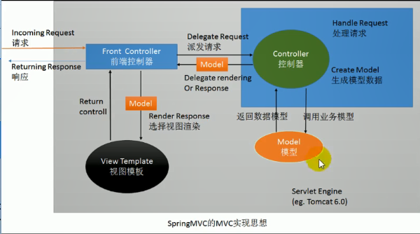

Spring 实现 Web 模块，简化 Web 开发

POJO ：Plain Ordinary Java Object

SpringMVC 比传统的 MVC 多了个 **前端控制器**

+


## 校验：JSR303

- ### 导包

```java
classmate-1.3.4.jar

hibernate-validator-6.1.0.Final.jar

hibernate-validator-annotation-processor-6.1.0.Final.jar

hibernate-validator-cdi-6.1.0.Final.jar

jakarta.validation-api-2.0.2.jar

jboss-logging-3.3.2.Final.jar

```

- ### 给bean加注解

```java
@NotEmpty
@Length(min=6,max = 18)
private String lastName;
```

- ### 给处理方法加注解

```java
public String addEmp(@Validated Employee employee,BindingResult result) {
		System.out.println("要添加的员工："+employee);
		//获取是否有校验错误
		boolean hasErrors = result.hasErrors();
		if(hasErrors) {
			System.out.println("有校验错误");
			return "add";
		}else {
			employeeDao.save(employee);
			//直接重定向到查询所有员工请求；
			return "redirect:/emps";
		}
	}
```

---

- ### 给表单加提示

```java
<form:errors path="lastName"></form:errors>
    
<form:form action="${ctp }/emp" method="POST" modelAttribute="employee">
	<!-- path就是原来html-input标签的name：需要些 -->
	lastName:<form:input path="lastName" />
	<form:errors path="lastName"></form:errors>
	<hr>
	email:<form:input path="email"/>
	<form:errors path="email"></form:errors>
	<hr>
	gender:男：<form:radiobutton path="gender" value="1" />++女：
		<form:radiobutton path="gender" value="0"/>
	<hr>
	dept:
	<form:select path="department.id" items="${depts }"
	itemLabel="departmentName" itemValue="id"
	>
	
	</form:select>
	<hr>
	<input type="submit" value="submit"/>
</form:form>
```

---

- jsp文件头部需要加上

```jsp
<%@taglib prefix="c" uri="http://java.sun.com/jsp/jstl/core" %>
<%@taglib prefix="form" uri="http://www.springframework.org/tags/form" %>
```

---

## 第二种校验

- ### 将错误信息加到Map,然后在表单拿

```java
public String addEmp(@Validated Employee employee,BindingResult result,Model model) {
Map<String,Object> errorsMap=new HashMap<String,Object>();
boolean hasErrors = result.hasErrors();
		if(hasErrors) {
			List<FieldError> allErrors = result.getFieldErrors();
			for(FieldError e:allErrors) {
				errorsMap.put(e.getField(), e.getDefaultMessage());
			}
			model.addAttribute("errorInfo", errorsMap);
```

---

- ### 在jsp拿出

```java
${errorInfo.lastName }
```

---

​		文件下载用原生API

## 文件上传

- ### 文件上传表单准备；enctype="multipart/form-data"

```jsp
<form action="${ctp }/upload" enctype="multipart/form-data" method="post">
```

- ### 导包

```java
commons-fileupload-1.4.jar
commons-io-2.6.jar
```

- ### 在springmvc.xml写配置

```xml
<!-- 配置文件上传解析器 -->
	<bean id="multipartResolver" class="org.springframework.web.multipart.commons.CommonsMultipartResolver">
		<property name="maxUploadSize" value="#{1024*1024*24}"></property>
		<property name="defaultEncoding" value="utf-8"></property>
	</bean>
```

* ### 再写处理器

```java
@RequestMapping(value = "/upload")
	public String upload(
			@RequestParam(value="username",required = false)String username,
			@RequestParam("headerimg")MultipartFile file,
			Model model
			) {
       
		System.out.println("input的name字段："+file.getName());
		System.out.println("文件的名字："+file.getOriginalFilename());
		//文件保存
		try {
			file.transferTo(
   new File("E:\\haha\\"+file.getOriginalFilename()));
			model.addAttribute("msg","文件上传成功了！");
		} catch (IllegalStateException | IOException e) {
			// TODO Auto-generated catch block
			model.addAttribute("msg","文件上传失败了！"+e.getMessage());
			e.printStackTrace();
		}
		return "forward:/index.jsp";
	}
```

---

* ### 多文件上传

```java
	public String mulUpload(
			@RequestParam(value="username",required = false)String username,
			@RequestParam("headerimg")MultipartFile[] file,
			Model model
			) {
		for (MultipartFile multipartFile : file) {
			if(!multipartFile.isEmpty()) {
				//文件保存
				try {
					multipartFile.transferTo(
							new File("E:\\haha\\"+multipartFile.getOriginalFilename())
							);	
				} catch (Exception e) {
				}
			}
		}
		return "forward:/index.jsp";
	}
```

---

* 

  ## 拦截器--（过滤器的升级版）

##### SpringMVC提供了拦截器机制；允许目标方法运行之前进行一些拦截工作，或者目标方法运行之后进行一些其他处理；

```java
/*
 * 1.实现接口 HandlerInterceptor
 * 2.在SpringMVC配置文件注册拦截器
 * 		配置这个拦截器来拦截哪些请求的目标方法
 * */
public class MyFirstInterceptor implements HandlerInterceptor {
```

* ### 在SpringMVC.xml配置拦截器

```xml
<!-- 配置拦截器 -->
	<mvc:interceptors>
		<!-- 配置某一个拦截器：默认拦截所有请求； -->
		<bean class="com.z.controller.MyFirstInterceptor"></bean>
		<!-- 配置某个拦截器更详细的信息 -->
		<mvc:interceptor >
			<!-- 只拦截test01 -->
			<mvc:mapping path="/test01"/>
			<bean class="com.z.controller.MySecondInterceptor"></bean>
		</mvc:interceptor>
	</mvc:interceptors> 
```

---

---

---


