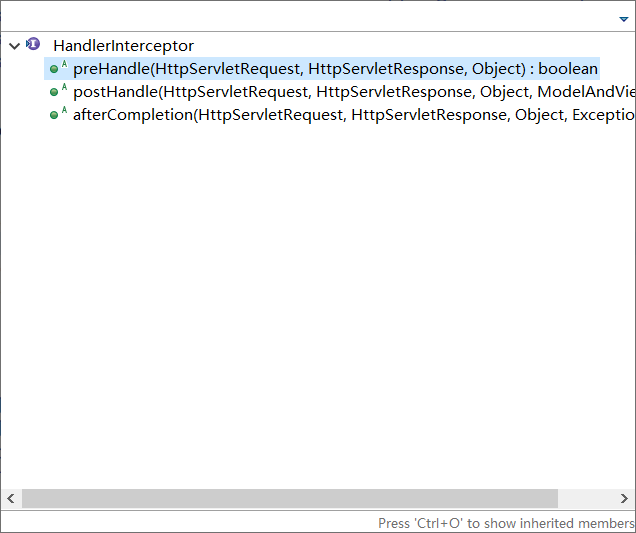
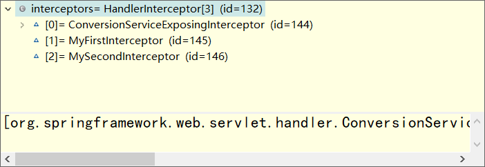
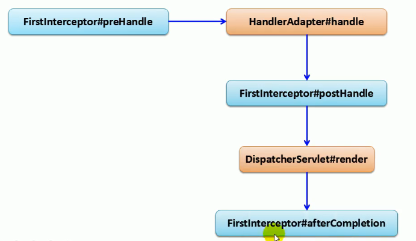
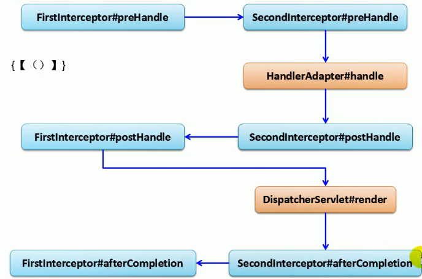

SpringMVC 提供了拦截器机制；允许运行目标方法之前 ，进行一些拦截工作 ，或者目标方法运行之后 ，进行一些收尾工作

Filter ：是javaWeb的

拦截器(HandlerInterceptor) ：SpringMVC的东西

其实跟Filter差不多




preHandle ：目标方法运行之前执行；返回 boolean；

* return true；（chain.doFilter()) 放行
* return false ；不放行

postHandle ：目标方法运行之后调用的；

* 目标方法调用之后

afterCompletion ：在请求(DispatcherServlet)整个完成之后执行；就是来到目标页面之后

* 相当于 chain.doFiter() 放行
* 资源响应之后

---

# 拦截器

## 实现流程概述

1. 拦截器是一个接口
2. 拦截器需要实现 `HandlerInterceptor` 接口
3. 在 `springmvc.xml` 中配置拦截器

## 执行流程

### 拦截器的 **正常运行流程**

1. 拦截器的前置方法 `prehHndle` 执行
2. 目标方法执行
3. `postHanle` 执行
4. 来到页面
5. `afterCompletion` 

### 其他流程：

1. 只要 `prehandle` 不放行 ，后面的都不能执行
2. 只要放行了 ，`afterCompletion` 都会执行

### 多拦截器的流程

1. 执行顺序与配置顺序有关


```java
MyFirstInterceptor..preHandle..
MySecondInterceptor..preHandle..
test01..invoke..
MySecondInterceptor..postHandle..
MyFirstInterceptor..postHandle...
success.jsp.....
MySecondInterceptor..afterCompletion..
MyFirstInterceptor..afterCompletion...
12t21t21
```

### 异常执行流程：

1. 不放行的情况下
   1. `MySecondInterceptor` 不放行
   2. 但是前面 **已经放行的拦截器的 afterCompletion 还是会执行** 

拦截器整个执行流程跟filter流程一样

拦截器的 `preHandle` ：按顺序执行

拦截器的 `postHandle` ：按照逆序执行

拦截器的 `afterCompletion` ：按照逆序执行

已经放行的拦截器的 `afterCompletion` 总是会执行

* 就像 try-catch 中的 finally 一样 ，


# 自定义拦截器

## 实现

### 导包

不需要


### 写拦截器

MyFirstInterceptor


```java
public class MyFirstInterceptor implements HandlerInterceptor {
    @Override
    public boolean perHandle(HttpServletRequest req, HttpServletResponse rep, Object handler) throws Exception {
        
    }
    @Override
    public void postHandle(HttpServletRequest req, HttpServletResponse rep,Object handle, ModelAndView model) throws Exception {
        
    }
    
    @Override
    public void afterCompletion(HttpServletRequest req, HttpServletResponse rep,Ojbect handle,Exception ex) throws Exception {
        
    }
}
```


### 写配置

springmvc.xml


```xml
<!-- 配置拦截器 -->
<!-- 两种方式 -->
<mvc:interceptors>
    <!-- 配置某一个拦截器，如果没有配置拦截什么的话：默认拦截所有请求； -->
    <bean class="com.z.controller.MyFirstInterceptor"></bean>
</mvc:interceptors>

<mvc:interceptors>

    <!-- 配置某个拦截器更详细的信息 -->
    <mvc:interceptor >
        <!-- 只拦截test01
   mvc:mapping 映射哪个请求 -->
        <mvc:mapping path="/test01"/>
        <bean class="com.z.controller.MySecondInterceptor"></bean>
    </mvc:interceptor>
    
    <!-- 多个拦截器 -->
    <mvc:interceptor >
        <!-- 只拦截test01 -->
        <mvc:mapping path="/test01"/>
        <bean class="com.z.controller.MySecondInterceptor"></bean>
    </mvc:interceptor>
</mvc:interceptors> 
```


### 使用


---


# 源码


## 拦截器的执行位置

dispatcherServlet.class 中的 doDispatcher 方法

```java
try {
    ModelAndView mv = null;
    Exception dispatchException = null;

    try {
        processedRequest = checkMultipart(request);
        multipartRequestParsed = (processedRequest != request);

        // Determine handler for the current request.
        // 拿到方法的 执行链，包含 拦截器
        mappedHandler = getHandler(processedRequest);
        if (mappedHandler == null || mappedHandler.getHandler() == null) {
            noHandlerFound(processedRequest, response);
            return;
        }

        // Determine handler adapter for the current request.
        HandlerAdapter ha = getHandlerAdapter(mappedHandler.getHandler());

        // Process last-modified header, if supported by the handler.
        String method = request.getMethod();
        boolean isGet = "GET".equals(method);
        if (isGet || "HEAD".equals(method)) {
            long lastModified = ha.getLastModified(request, mappedHandler.getHandler());
            if (logger.isDebugEnabled()) {
                logger.debug("Last-Modified value for [" + getRequestUri(request) + "] is: " + lastModified);
            }
            if (new ServletWebRequest(request, response).checkNotModified(lastModified) && isGet) {
                return;
            }
        }
// ***********************************************************
        // 拦截器的 prehandle 执行位置
        if (!mappedHandler.applyPreHandle(processedRequest, response)) {
            return;
        }
// ***********************************************************
        // Actually invoke the handler.
        // 适配器执行目标方法
        mv = ha.handle(processedRequest, response, mappedHandler.getHandler());

        if (asyncManager.isConcurrentHandlingStarted()) {
            return;
        }

        applyDefaultViewName(processedRequest, mv);
// ***********************************************************
        //执行postHandle方法的地方，目标方法正常了才执行这里
        mappedHandler.applyPostHandle(processedRequest, response, mv);
// ***********************************************************
    }
    catch (Exception ex) {
        dispatchException = ex;
    }
    catch (Throwable err) {
        // As of 4.3, we're processing Errors thrown from handler methods as well,
        // making them available for @ExceptionHandler methods and other scenarios.
        dispatchException = new NestedServletException("Handler dispatch failed", err);
    }
    // 页面渲染；如果完蛋也是直接跳到 triggerAfterCompletion
    processDispatchResult(processedRequest, response, mappedHandler, mv, dispatchException);
}
catch (Exception ex) {
    triggerAfterCompletion(processedRequest, response, mappedHandler, ex);
}
catch (Throwable err) {
    triggerAfterCompletion(processedRequest, response, mappedHandler,
                           new NestedServletException("Handler processing failed", err));
}
finally {
    if (asyncManager.isConcurrentHandlingStarted()) {
        // Instead of postHandle and afterCompletion
        if (mappedHandler != null) {
            mappedHandler.applyAfterConcurrentHandlingStarted(processedRequest, response);
        }
    }
    else {
        // Clean up any resources used by a multipart request.
        if (multipartRequestParsed) {
            cleanupMultipart(processedRequest);
        }
    }
}
```


## applyPreHandle() 方法内部

顺序执行前置处理

```java
boolean applyPreHandle(HttpServletRequest request, HttpServletResponse response) throws Exception {
    HandlerInterceptor[] interceptors = getInterceptors();
    if (!ObjectUtils.isEmpty(interceptors)) {
        for (int i = 0; i < interceptors.length; i++) {
            HandlerInterceptor interceptor = interceptors[i];
//************************************************************************************
            if (!interceptor.preHandle(request, response, this.handler)) {
                // 执行完 afterCompletion();
                triggerAfterCompletion(request, response, null);
                //返回一个false
                return false;
            }
            // 记录已经执行的拦截器的索引
            this.interceptorIndex = i;
        }
    }
    return true;
}
```


## postHandle()

倒序执行 postHandle()

```java
void applyPostHandle(HttpServletRequest request, HttpServletResponse response, ModelAndView mv) throws Exception {
    HandlerInterceptor[] interceptors = getInterceptors();
    if (!ObjectUtils.isEmpty(interceptors)) {
        //逆序执行每一个拦截器的postHandle()
        for (int i = interceptors.length - 1; i >= 0; i--) {
            HandlerInterceptor interceptor = interceptors[i];
            interceptor.postHandle(request, response, this.handler, mv);
        }
    }
}
```


## 页面渲染

```java
private void processDispatchResult(HttpServletRequest request, HttpServletResponse response,
                                   HandlerExecutionChain mappedHandler, ModelAndView mv, Exception exception) throws Exception {

    boolean errorView = false;

    if (exception != null) {
        if (exception instanceof ModelAndViewDefiningException) {
            logger.debug("ModelAndViewDefiningException encountered", exception);
            mv = ((ModelAndViewDefiningException) exception).getModelAndView();
        }
        else {
            Object handler = (mappedHandler != null ? mappedHandler.getHandler() : null);
            mv = processHandlerException(request, response, handler, exception);
            errorView = (mv != null);
        }
    }

    // Did the handler return a view to render?
    if (mv != null && !mv.wasCleared()) {
		//渲染页面
        render(mv, request, response);
        if (errorView) {
            WebUtils.clearErrorRequestAttributes(request);
        }
    }
    else {
        if (logger.isDebugEnabled()) {
            logger.debug("Null ModelAndView returned to DispatcherServlet with name '" + getServletName() +
                         "': assuming HandlerAdapter completed request handling");
        }
    }

    if (WebAsyncUtils.getAsyncManager(request).isConcurrentHandlingStarted()) {
        // Concurrent handling started during a forward
        return;
    }

    if (mappedHandler != null) {
        // 页面正常,执行afterComplition()；即使每周到这，afterCompletion() 也会自行
        mappedHandler.triggerAfterCompletion(request, response, null);
    }
}
```


## afterHandle()


```java
void triggerAfterCompletion(HttpServletRequest request, HttpServletResponse response, Exception ex)
    throws Exception {

    HandlerInterceptor[] interceptors = getInterceptors();
    if (!ObjectUtils.isEmpty(interceptors)) {
        //interceptorIndex 记录了放行拦截器的索引，从它开始，把之前所有放行的拦截器的afterCompletion都执行
        for (int i = this.interceptorIndex; i >= 0; i--) {
            HandlerInterceptor interceptor = interceptors[i];
            try {
                interceptor.afterCompletion(request, response, this.handler, ex);
            }
            catch (Throwable ex2) {
                logger.error("HandlerInterceptor.afterCompletion threw exception", ex2);
            }
        }
    }
}
```


---

## 测试2

环境：

自己写两个拦截器，将第二个拦截器的 preHandle() 返回 false

运行流程

直接到 applyPreHandle() 方法




### PreHandle()

applyPreHandle() 内

```java
第一次for循环 ：ConversionServiceExposingInterceptor	interceptorIndex=0;
第二次：MyFirstInterceptor							 interceptorIndex=1;
第三次：MySecondInterceptor							 interceptorIndex=2;
已经放行的拦截器的 afterCompletion 一定会执行
```

afterCompletion 的执行

```java
for (int i = this.interceptorIndex; i >= 0; i--) {
    HandlerInterceptor interceptor = interceptors[i];
    try {
        interceptor.afterCompletion(request, response, this.handler, ex);
    }
    catch (Throwable ex2) {
        logger.error("HandlerInterceptor.afterCompletion threw exception", ex2);
    }
}
```


## 单个拦截器的执行顺序




## 多个拦截器的执行顺序




如果 `SecondInterceptor` 的 preHandle 返回 false ，那么程序会直接执行到 `FirstInterceptor` 的 `afterComletion` 


---

# Filter 和 Interceptor

什么时候用Filter，什么时候用拦截器？

如果某些功能；需要其他组件配合完成，我们就使用拦截器；

其他情况，可以写 filter ：


