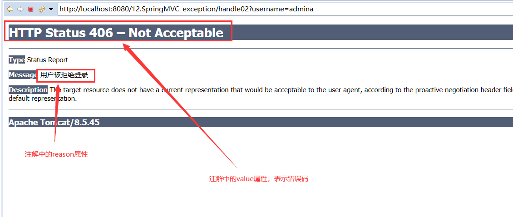
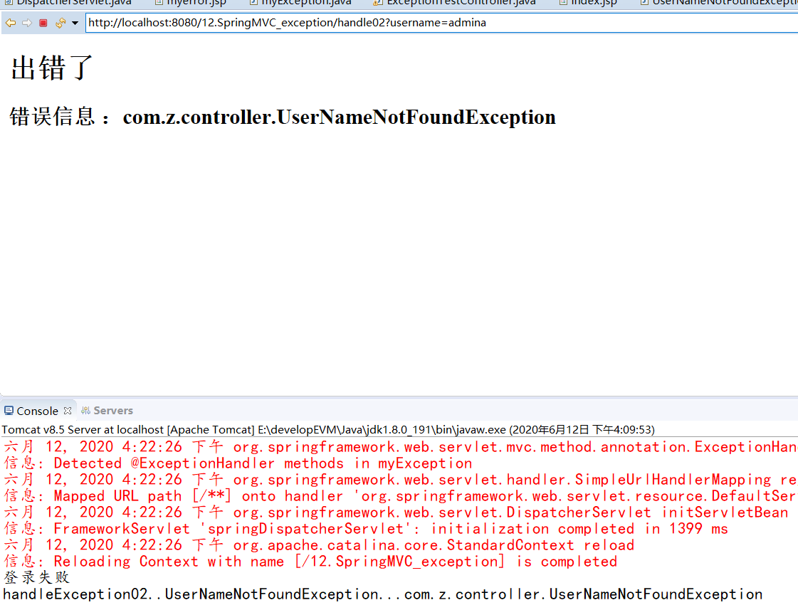
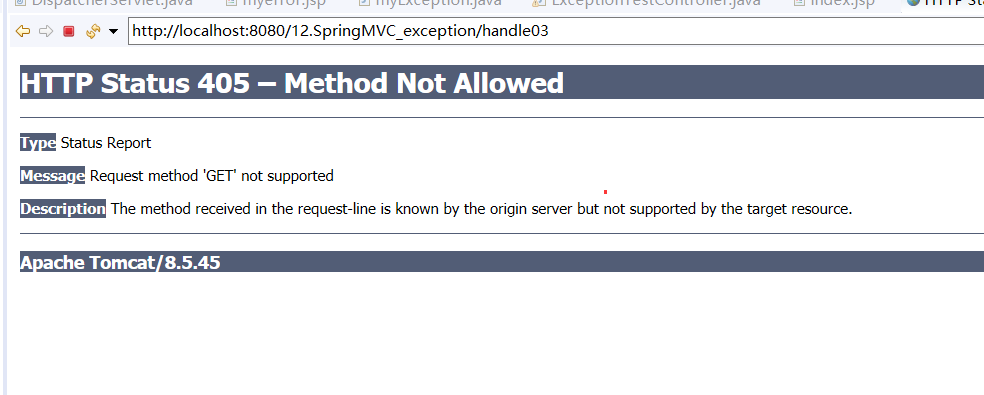
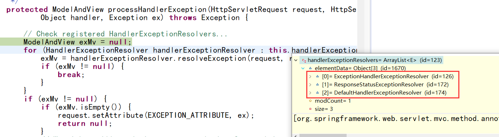
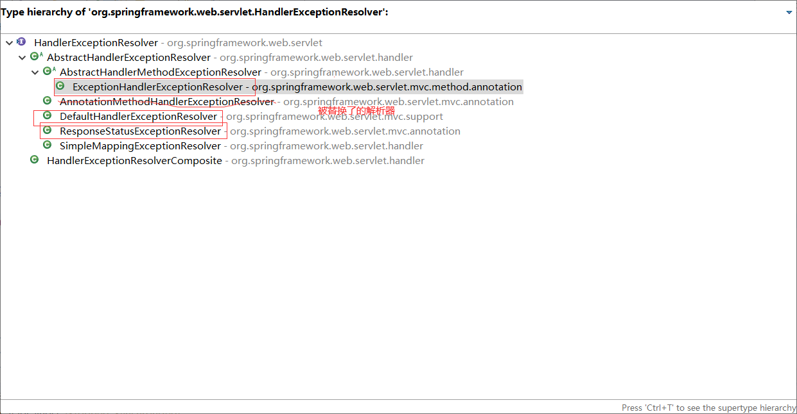
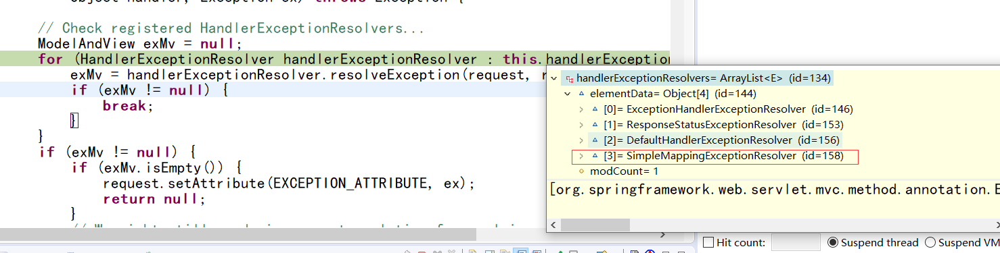

属于SpringMVC九大组件之一   --》HandleExceptionResolver

其中，

### 默认的异常处理器

在/org/springframework/web/servlet/DispatcherServlet.properties 下找的默认组件配置文件

如果加上了 `<mvc:annotation-driven/>` 那么默认加载的 异常处理器 就是下面这几个

```properties
# 默认使用这个异常处理器，但是自从招了高级程序员（<mvc:annotation-driven/>）之后就不用这个处理器了。
AnnotationMethodHandlerExceptionResolver(已被替换)
#在BeanDefinitionParser类，这个类就是上面标签的实现。在这个类中，异常处理器注册的是 下面这个处理器
# 多的不介绍了，看笔记8，有注册过程详解。主要是他的子类实现了各种高级功能（AnnotationDrivenBVeanDefinitionParser）
ExceptionHandler ExceptionResolver
ResponseStatus   ExceptionResolver
DefaultHandler   ExceptionResolver
```


# 异常处理流程


`DispatcherServlet` 类中的 `doDispatcher` 方法里面异常处理流程

```java
private void processDispatchResult(HttpServletRequest request, HttpServletResponse response,
                                   HandlerExecutionChain mappedHandler, ModelAndView mv, Exception exception) throws Exception {

    boolean errorView = false;

    // 手动标签：如果有异常
    if (exception != null) {
        if (exception instanceof ModelAndViewDefiningException) {
            logger.debug("ModelAndViewDefiningException encountered", exception);
            mv = ((ModelAndViewDefiningException) exception).getModelAndView();
        }
        // 处理异常
        else {
            Object handler = (mappedHandler != null ? mappedHandler.getHandler() : null);
            // 遍历已注册的异常解析器，看看有没有能处理当前异常类型的解析器
            // 如果异常解析器都不能处理，就把异常抛出去
            mv = processHandlerException(request, response, handler, exception);
            errorView = (mv != null);
        }
    }

    // Did the handler return a view to render?
    if (mv != null && !mv.wasCleared()) {
        //手动标签
        // 来到页面，页面渲染
        render(mv, request, response);
        
        if (errorView) {
            WebUtils.clearErrorRequestAttributes(request);
        }
    }
    else {
        if (logger.isDebugEnabled()) {
            logger.debug("Null ModelAndView returned to DispatcherServlet with name '" + getServletName() +
                         "': assuming HandlerAdapter completed request handling");
        }
    }

    if (WebAsyncUtils.getAsyncManager(request).isConcurrentHandlingStarted()) {
        // Concurrent handling started during a forward
        return;
    }

    if (mappedHandler != null) {
        mappedHandler.triggerAfterCompletion(request, response, null);
    }
}
```

## 遍历异常解析器

所有异常解析器尝试解析，解析完成进行后续方法，解析失败：下一个解析器。

```java
protected ModelAndView processHandlerException(HttpServletRequest request, HttpServletResponse response,
                                               Object handler, Exception ex) throws Exception {

    // Check registered HandlerExceptionResolvers...
    ModelAndView exMv = null;
    // 手动标签，看看哪个异常解析器能处理
    for (HandlerExceptionResolver handlerExceptionResolver : this.handlerExceptionResolvers) {
        exMv = handlerExceptionResolver.resolveException(request, response, handler, ex);
        if (exMv != null) {
            break;
        }
    }
    if (exMv != null) {
        if (exMv.isEmpty()) {
            request.setAttribute(EXCEPTION_ATTRIBUTE, ex);
            return null;
        }
        // We might still need view name translation for a plain error model...
        if (!exMv.hasView()) {
            exMv.setViewName(getDefaultViewName(request));
        }
        if (logger.isDebugEnabled()) {
            logger.debug("Handler execution resulted in exception - forwarding to resolved error view: " + exMv, ex);
        }
        WebUtils.exposeErrorRequestAttributes(request, ex, getServletName());
        return exMv;
    }
	// 抛出异常给tomcat
    throw ex;
}
```


## 三个默认异常解析器能处理的异常

ExceptionHandler ExceptionResolver ：@ExceptionHandler
ResponseStatus   ExceptionResolver ：@ResponseStatus

给自定义异常上标注的；不能标注在方法上


DefaultHandler   ExceptionResolver ：判断是否是SpringMVC自带的异常

---

# 异常解析器的使用场景

## @ExceptionHandler

自定义异常处理的使用

在控制器中写自定义异常处理

比如说本次的案例，当后端出现算术异常时，自定义异常处理

### 1.在控制器写处理方法

这个方法会被异常处理解析器扫描器扫描到，判断能处理算数异常之后，将会直接执行该方法，然后返回页面（视图渲染）

经过测试只能写在出现错误的控制器类内，

测试内容：创建一个新的类：加上@Controller @ExceptionHandler 注解 ，并不能被扫描到这个异常处理方法

至少目前是这样，还没开始尝试其他可能

```java
@Controller
public class ExceptionTestController {

	/*
	前端的请求：xxx/xxx/handle01?id=0
	*/
    @RequestMapping("/handle01")
    public String handle01(@RequestParam(value = "id")Integer i) {
        System.out.println("handle01...");
        System.out.println(10/i);
        return "success";
    }
    /**
	 * 告诉SpringMVC这个方法专门处理这个类发生的异常
	 * 1.给方法上随便写上 Exception,用来接受发生的异常
	 * 2.要携带异常信息，不能给参数位置写Model；
	 * 3.需要返回一个 ModelAndView
	 */
    @ExceptionHandler({ArithmeticException.class})
    public ModelAndView handleException02(Exception exception) {
        System.out.println("handleException02....." + exception);
        //
        ModelAndView view = new ModelAndView("myerror");
        view.addObject("ex", exception);
        // 试图解析器拼串
        return view;
    }


}
```

然后前端访问。测试；

## 多个异常处理器

如果 多个ExceptionHandler都能处理这个异常，精确优先

例如 `@ExceptionHandler(ArithmeticException.class)` 和 `@ExceptionHandler(Exception.class)` 都能处理算数异常，那么优先执行第一个；


全局异常处理和本类的异常处理：本类优先（就是出错的类里面写的异常处理）

即使全局异常处理比本类的异常处理范围精确，也是本类优先

## 全局异常处理

其实上面将所有异常处理写成一个类的想法是可以实现的，只不过将异常处理类加入到IOC容器的方法不是已知的任何一个注解，而是 `@ControllerAdvice` 注解

写一个全局异常处理类，告诉spring这个类是用来处理异常的 


```java
/**
 * 集中处理所有异常
 * @author zfl
 * @version time: 2020年6月12日 下午3:30:06
 * 
 * 1、集中处理异常的类要加入到IOC容器中
 * 2、@ControllerAdvice 专门处理异常的类
 */
@ControllerAdvice
public class myException {

    @ExceptionHandler(value = {NullPointerException.class})
    public ModelAndView handleException01(Exception exception) {
        System.out.println("handleException01....." + exception);
        //
        ModelAndView view = new ModelAndView("myerror");
        view.addObject("ex", exception);
        // 试图解析器拼串
        return view;
    }

}
```


## @ResponseStatus

不能标注在方法上

用法是标注在自定义异常上

应用场景：当发生指定错误的时候，页面跳转至自定义的错误页面；下面举个例子

### 自定义异常类

```java
// 错误原因和状态码要给上
@ResponseStatus(reason = "用户被拒绝登录", value = HttpStatus.NOT_ACCEPTABLE)
// 继承运行时异常是自定义异常的标准写法把？
public class UserNameNotFoundException extends RuntimeException{

    /**
	 * 
	 */
    private static final long serialVersionUID = 1L;

    /**
	 * 
	 */

}
```

### 抛出异常

当需要使用到自定义异常的时候，抛出即可

不一定只能在控制器层面抛出

```java
@Controller
public class ExceptionTestController {

    @RequestMapping("/handle02")
    public String handle02(@RequestParam("username")String username) {
        if(!"admin".equals(username)) {
            System.out.println("登录失败");
            throw new UserNameNotFoundException();
        }
        System.out.println("登陆成功。。。");
        return "success";
    }
}
```

### 效果



当然，出现这种情况的前提是：`UserNameNotFoundException` 异常没有解析器能够处理。

如果在全局异常处理类中有一个方法 `@ExceptionHandler(value = {UserNameNotFoundException.class})` ，那么会优先执行 `@ExceptionHandler()` 


比如说现在加了一个异常处理类来处理 `UserNameNotFoundException` 异常

```java
@ControllerAdvice
public class myExceptionHandler{
@ExceptionHandler(value = {UserNameNotFoundException.class})
	public ModelAndView handleException03(Exception exception) {
		System.out.println("handleException02..UserNameNotFoundException..." + exception);
		//
		ModelAndView view = new ModelAndView("myerror");
		view.addObject("ex", exception);
		// 试图解析器拼串
		return view;
	} 
}
```


运行效果




### DefaultHandlerExceptionResolver

判断是不是SpringMVC自带的异常

如果是自带的异常：如 `handleHttpRequestMethodNotSupported` 

如果没人处理这些自带异常的话，就会返回默认的视图



找到第一个能够处理当前异常的解析器，发现前两个都没有能处理 `handleHttpRequestMethodNotSupported` 的解析器。所以轮到了默认的异常解析器




### SpringMVC默认的异常

在 `DefaultHandlerExceptionResolver` 类中

doDispatcher()–>processDispatchResult()–>processHandlerException()–>resolveException()–>**doResolveException**()

```java
protected ModelAndView doResolveException(HttpServletRequest request, HttpServletResponse response,
                                          Object handler, Exception ex) {

    try {
        if (ex instanceof org.springframework.web.servlet.mvc.multiaction.NoSuchRequestHandlingMethodException) {
            return handleNoSuchRequestHandlingMethod((org.springframework.web.servlet.mvc.multiaction.NoSuchRequestHandlingMethodException) ex,
                                                     request, response, handler);
        }
        // 这里，可以点进去看看它的处理流程，无非就是设置响应头，状态码，错误信息而已；
        else if (ex instanceof HttpRequestMethodNotSupportedException) {
            return handleHttpRequestMethodNotSupported((HttpRequestMethodNotSupportedException) ex, request,
                                                       response, handler);
        }
        else if (ex instanceof HttpMediaTypeNotSupportedException) {
            return handleHttpMediaTypeNotSupported((HttpMediaTypeNotSupportedException) ex, request, response,
                                                   handler);
        }
        else if (ex instanceof HttpMediaTypeNotAcceptableException) {
            return handleHttpMediaTypeNotAcceptable((HttpMediaTypeNotAcceptableException) ex, request, response,
                                                    handler);
        }
        else if (ex instanceof MissingPathVariableException) {
            return handleMissingPathVariable((MissingPathVariableException) ex, request,
                                             response, handler);
        }
        else if (ex instanceof MissingServletRequestParameterException) {
            return handleMissingServletRequestParameter((MissingServletRequestParameterException) ex, request,
                                                        response, handler);
        }
        else if (ex instanceof ServletRequestBindingException) {
            return handleServletRequestBindingException((ServletRequestBindingException) ex, request, response,
                                                        handler);
        }
        else if (ex instanceof ConversionNotSupportedException) {
            return handleConversionNotSupported((ConversionNotSupportedException) ex, request, response, handler);
        }
        else if (ex instanceof TypeMismatchException) {
            return handleTypeMismatch((TypeMismatchException) ex, request, response, handler);
        }
        else if (ex instanceof HttpMessageNotReadableException) {
            return handleHttpMessageNotReadable((HttpMessageNotReadableException) ex, request, response, handler);
        }
        else if (ex instanceof HttpMessageNotWritableException) {
            return handleHttpMessageNotWritable((HttpMessageNotWritableException) ex, request, response, handler);
        }
        else if (ex instanceof MethodArgumentNotValidException) {
            return handleMethodArgumentNotValidException((MethodArgumentNotValidException) ex, request, response,
                                                         handler);
        }
        else if (ex instanceof MissingServletRequestPartException) {
            return handleMissingServletRequestPartException((MissingServletRequestPartException) ex, request,
                                                            response, handler);
        }
        else if (ex instanceof BindException) {
            return handleBindException((BindException) ex, request, response, handler);
        }
        else if (ex instanceof NoHandlerFoundException) {
            return handleNoHandlerFoundException((NoHandlerFoundException) ex, request, response, handler);
        }
        else if (ex instanceof AsyncRequestTimeoutException) {
            return handleAsyncRequestTimeoutException(
                (AsyncRequestTimeoutException) ex, request, response, handler);
        }
    }
    catch (Exception handlerException) {
        if (logger.isWarnEnabled()) {
            logger.warn("Handling of [" + ex.getClass().getName() + "] resulted in Exception", handlerException);
        }
    }
    return null;
}
```


# HandlerExceptionResolver



Spring提供了很多异常解析器


# 通过配置的方式进行异常处理

## SimpleMappingExceptionResolver 使用

配置方式

SpringMVC.xml

```xml
<bean class="org.springframework.web.servlet.handler.SimpleMappingExceptionResolver">
    <!-- exceptionMappings ：配置哪些异常去哪些页面 -->
    <property name="exceptionMappings">
        <props>
            <!-- key ：异常全类名;value ：要去的页面视图名 -->
            <prop key="java.lang.NullPointerException">myerror</prop>
        </props>
    </property>
    <!-- 指定错误信息取出时用处的key -->
    <property name="exceptionAttribute" value="ex"></property>
</bean>
```

结果就是当出现 `NullPointerException` 异常时，会通过配置文件配置的信息跳转到 xx 视图


## SimpleMappingExceptionResolver的优先级：



从上图可以看出，simplexxx 解析器的优先级是最低的，所以当有全局异常处理出现的时候，并不会执行配置文件里面配置的异常解析器。


