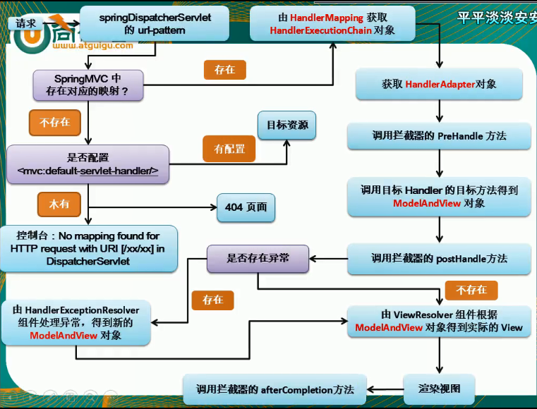

# SPringMVC 运行流程

**1、所有请求--》前端控制器（DispatcherServlet）收到请求--》doDispatch**

**2、根据 HandlerMapping 中保存的请求映射信息找到，能出里该请求的处理器执行链（包含了拦截器）**

**3、根据当前处理器找到他的 HandlerAdapter（适配器）**

**4、拦截器的 preHandle 先执行**

**5、适配器执行目标方法**

1. ModelAttribute 注解方法提前运行
2. 执行目标方法的时候（确定目标方法的参数）
   1. 有注解：
   2. 没注解：
      1. 看是否是 Model、Map以及其他的
      2. 如果是自定义类型：
         1. 看看隐含模型中有没有，如果有就从隐含模型中拿
         2. 如果没有，再看是否是 SessionAttributes 标注的属性，如果是，从 Session 中拿，如果拿不到会抛异常
         3. 如果都不是以上的，就利用反射创建对象

**6、拦截器的 postHandle 执行**

**7、处理结果；（页面渲染流程都在这）**

1. **如果有异常，使用异常解析器处理异常；处理完后，还是会返回一个 ModelAndView**
2. **调用 render 进行页面渲染**
   1. 视图解析器 根据视图名得到视图对象
   2. 视图对象调用 render 方法
3. **执行拦截器的 afterCompletion** 

源码调试的断点导出在本笔记目录中：spring版本4.3.9.RELEASE

 [springmvc.bkpt](springmvc.bkpt) 

# 隐含模型

隐含模型就是 `@ModelAttribute` 提前执行后，被保存起来的数据模型。如果有隐含模型，那么处理请求的时候将会对隐含模型进行处理。比如说前端传进来一个 user 对象，如果已经存在一个隐含模型，那么这个user对象就不会在创建一个user，而是将user对象的值覆盖隐含模型。如果忘记了的话就看一下视频[SSM隐含模型](https://www.bilibili.com/video/BV1uE411C7CW?p=155&spm_id_from=333.788.b_6d756c74695f70616765.155) 1:59s 处；SSM-雷丰阳-P155-数据输出ModelAttribute原理