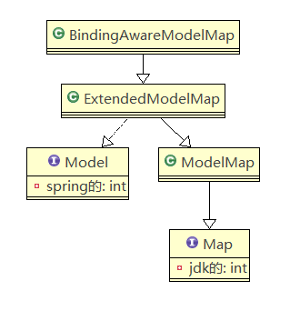
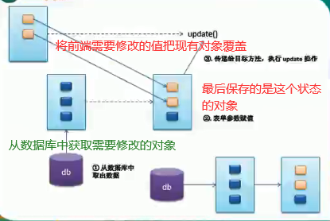
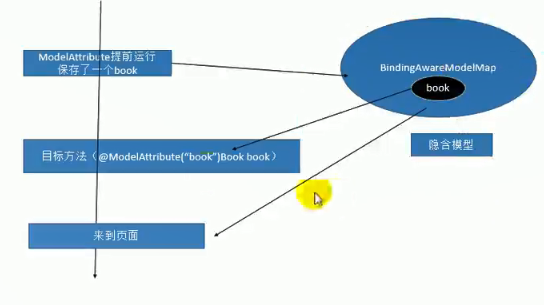

SpringMVC除了在方法上传入原生的request和sesion外还能怎样把数据带给页面

1)、可以在方法处传入Map、或者Model或者ModelMap，给这些参数里面保存的所有数据都会放在狱中，可以再页面获取

# 三种方式最终都放在request中

### Map

```java
@RequestMapping("/handle01")
public String handle01(Map<String,Object> map) {
    map.put("msg", "你好");
    System.out.println(map.getClass());
    return "success";
}
```


### Model

```java
@RequestMapping("/handle02")
public String handle02(Model model) {
    model.addAttribute("msg","你好坏");
    System.out.println(model.getClass());
    return "success";
}
```


### ModeMap

```java
@RequestMapping("/handle03")
public String handle03(ModelMap model) {
    model.addAttribute("msg","你好坏啊");
    System.out.println(model.getClass());
    return "success";
}
```


### ModelAndView

返回值是 `ModelAndView`，可以为页面携带数据

方法的返回值可以变成 ModelAndView 类型 ：

- 既包含 视图信息（页面地址） 也包含模型数据（给页面带的数据）；
- 而且数据是放在 `requestScope` （请求域中）
- 因为 requestScope 用的最多，所以 springmvc 将返回值放进 request 中

```java
@RequestMapping(value = "/handle04")
public ModelAndView handle04() {
    // 之前的返回值就叫视图名
    ModelAndView view = new ModelAndView();
    view.setViewName("success");
    view.addObject("haha", "你好骚啊");
    view.addObject("msg", "你好骚啊modelandivew");
    return view;
}
```


### Session域传值

`@SessionAttributes`注解

* 只能在类上使用

```java
@Target({ElementType.TYPE})
@Retention(RetentionPolicy.RUNTIME)
@Inherited
@Documented
public @interface SessionAttributes {
    @AliasFor("names")
	String[] value() default {};
    
    @AliasFor("value")
	String[] names() default {};

	Class<?>[] types() default {};
}
-------------------------------------------------
```

#### 属性解释：

* `value` 属性 ：指定保存数据时，要保存到 session 中的数据
* `type` 属性 ：指定保存到 session 中的类型，意味着只要传了字符串去前端页面，就会被保存到session中

#### 示例：

```java
@SessionAttributes(value = { "msg", "haha" }, type={String.class})

@SessionAttributes(value="msg") : 
//给 BindingAwareModelMap 中保存的数据 ，同时给 session 中放一份

@Controller
public class OutputController {

    @RequestMapping(value = "/handle04")
    public ModelAndView handle04() {
        // 之前的返回值就叫视图名
        ModelAndView view = new ModelAndView();
        view.setViewName("success");
        view.addObject("haha", "你好骚啊");
        view.addObject("msg", "你好骚啊modelandivew");
        return view;
    }

}
```

#### 推荐：

`@SessionAttributes` 就不要用了 ，可能会引发异常；

给 `Session` 中放数据 ，请使用原生 API 


### 关系

Map、Model、ModelMap ：最终都是 BindingAwareModelMap 在工作 ；相当于给 BindingAwareModelMap 中保存的东西都会放进请求域中

`Map(interface)`  

`Model(interface(spring的))` 

`ModelMap(class)`



### 了解

#### `@ModelAttribute` 注解

* 方法入参标注该注解后 ，入参的对象就会放到数据模型中

##### 使用场景

书城的图书修改为例：

* 页面端：
  
  * 显示要修改的图书的信息，图书的所有字段都在
  
* servlet 收到修改请求，调用 dao

* 实际场景
  * 并不是全部字段都修改；只会修改部分字段，以修改用户信息为例
  * username password address
  * 一般不修改的字段不要在页面展示（比如 ：username）
  * 为了简单，Controller 直接在参数位置来写 Book 对象
  * SpringMVC 为我们自动封装 Book ；（没从前端传过来的值就是 null）
  * 如果执行全字段的DAO操作，会将其他字段变为 null
  
* 如何能保证全字段更新的时候，只更新需要更新的数据

  * 修改 dao ，代价太大；；；；

  

  #### 希望的样子：

  




SpringMVC 要封装请求参数的 Book 对象不应该是自己 new 出来的；而是【从数据库中】获取出来的

再来使用这个对象封装请求参数

@ModelAttribute 会提前于目标方法执行，将数据库中的对象获取出来，交给 SpringMVC 

参数：

方法位置：这个方法就会提前于目标方法运行

* 我们可以在这里提前查出数据库中图书的信息
* 将这个图书信息保存起来（方便下一个还能使用）

@ModelAttribute 标注的方法里面 map 和 updateBook 中的 model **是同一个对象**

```java
class BookController{
    @RequestMapping("/updateBook")
    // 取出 ModelAttribute 保存好的 book 对象
    public String updateBook(@ModelAttribute("book") Book book,Model model){
        
        return "target";
    }
    
    // 加了ModelAttribute 的方法会提前执行
    @ModelAttribute
    public void AfterUpdate(Map<String,Object> map){
        Book book = bookDao.queryById(1);
        // 保存图书信息
        map.put("book",book);
        
    }
}
```




这个图解释了 BindingAwareModelMap 在 SpringMVC 中的作用，从请求开始到请求结束，都存在这个容器的身影


