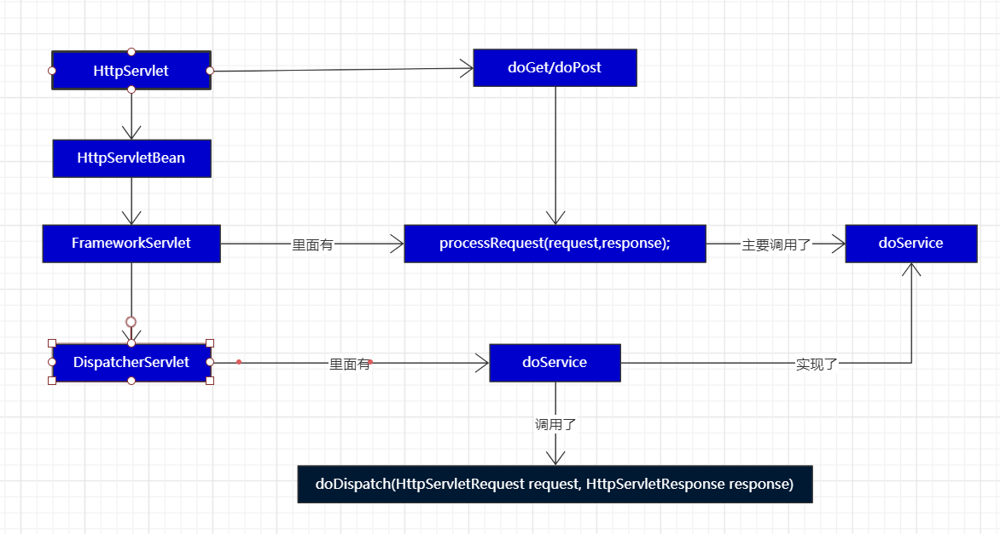
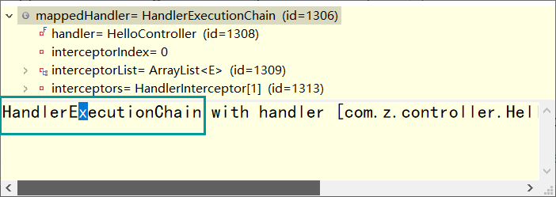
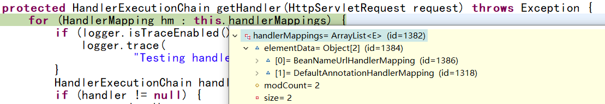
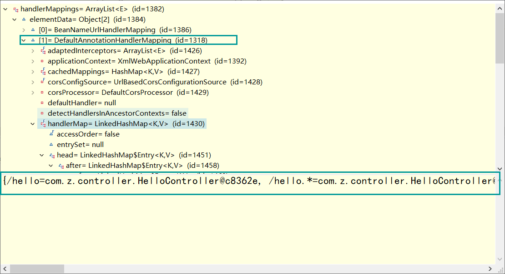
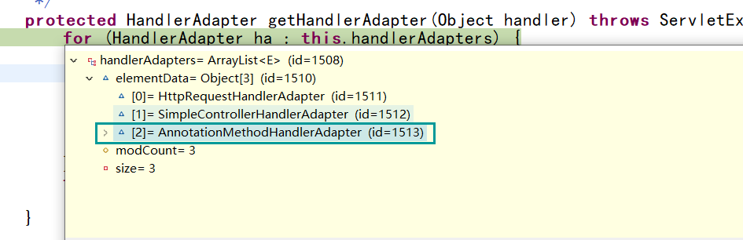
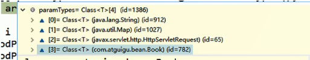

# DispatcherServlet 结构分析

**也就是前端控制器**

前端控制器处理请求大致流程




## `doDispatcher()` 细节

### 主要处理

`mv = ha.handle();`

* 这个方法过后，控制器就会被执行

`processDispatchResult()`

* 转发到目标页面

### 其他处理

`checkMultipart(request);`

* 文件上传相关

`getHandler()`

* 获取控制器 `xxxController`

`noHandlerFound` 

* 如果没有找到能处理 本次请求 的控制器就执行这个方法

`getHandlerAdapter()` 

* 找到一个能实现该 控制器 的反射类工具 ，需要的反射类工具是不同的


```java
protected void doDispatch(HttpServletRequest request, HttpServletResponse response) throws Exception {
    HttpServletRequest processedRequest = request;
    HandlerExecutionChain mappedHandler = null;
    boolean multipartRequestParsed = false;

    WebAsyncManager asyncManager = WebAsyncUtils.getAsyncManager(request);

    try {
        ModelAndView mv = null;
        Exception dispatchException = null;

        try {
            // 1.检查是否文件上传请求
            processedRequest = checkMultipart(request);
            multipartRequestParsed = (processedRequest != request);

            // Determine handler for the current request.
            // 手动标签
            // 2.根据当前的请求地址找到那个类能处理；还有拦截器
            mappedHandler = getHandler(processedRequest);
            
            // 3.如果没有找到哪个处理器（控制器）能处理这个请求就404，或者抛异常
            if (mappedHandler == null || mappedHandler.getHandler() == null) {
                noHandlerFound(processedRequest, response);
                return;
            }

            // Determine handler adapter for the current request.
            // 手动标签
            // 4.拿到能执行这个类的所有方法的适配器；(反射工具 AnnotationMethodHandlerAdapter )
            // 这是个接口，他有很多子类
            HandlerAdapter ha = getHandlerAdapter(mappedHandler.getHandler());

            // Process last-modified header, if supported by the handler.
            String method = request.getMethod();
            boolean isGet = "GET".equals(method);
            if (isGet || "HEAD".equals(method)) {
                long lastModified = ha.getLastModified(request, mappedHandler.getHandler());
                if (logger.isDebugEnabled()) {
                    logger.debug("Last-Modified value for [" + getRequestUri(request) + "] is: " + lastModified);
                }
                if (new ServletWebRequest(request, response).checkNotModified(lastModified) && isGet) {
                    return;
                }
            }
			
            // 执行所有拦截器的 preHandle()
            if (!mappedHandler.applyPreHandle(processedRequest, response)) {
                return;
            }

            // Actually invoke the handler.
            // 手动标签
            // 处理器（控制器）的方法被调用了
            // 控制器（Controller），处理器（Handler）
            
            // 5.适配器来执行目标方法：将目标方法执行完成后的返回值作为视图名，设置保存到 ModelAndView 中
            // 目标方法无论怎么写，最终适配器执行完成以后都会将执行后的信息封装合成 ModelAndView
            mv = ha.handle(processedRequest, response, mappedHandler.getHandler());

            if (asyncManager.isConcurrentHandlingStarted()) {
                return;
            }

            // 如果没有视图名，设置一个默认的视图名
            applyDefaultViewName(processedRequest, mv);
            mappedHandler.applyPostHandle(processedRequest, response, mv);
        }
        catch (Exception ex) {
            dispatchException = ex;
        }
        catch (Throwable err) {
            // As of 4.3, we're processing Errors thrown from handler methods as well,
            // making them available for @ExceptionHandler methods and other scenarios.
            dispatchException = new NestedServletException("Handler dispatch failed", err);
        }
        // 手动标签
        // 转发到页面目标
        
        // 6.根据方法最终执行完成后封装的 ModelAndView ：转发到对应页面，而且ModelAndView中的数据可以从请求域中获取
        processDispatchResult(processedRequest, response, mappedHandler, mv, dispatchException);
    }
    catch (Exception ex) {
        triggerAfterCompletion(processedRequest, response, mappedHandler, ex);
    }
    catch (Throwable err) {
        triggerAfterCompletion(processedRequest, response, mappedHandler,
                               new NestedServletException("Handler processing failed", err));
    }
    finally {
        if (asyncManager.isConcurrentHandlingStarted()) {
            // Instead of postHandle and afterCompletion
            if (mappedHandler != null) {
                mappedHandler.applyAfterConcurrentHandlingStarted(processedRequest, response);
            }
        }
        else {
            // Clean up any resources used by a multipart request.
            if (multipartRequestParsed) {
                cleanupMultipart(processedRequest);
            }
        }
    }
}
```

### 流程总结

1. 所有请求过来 `DispatcherServlet` 收到请求，
2. 调用 `doDispatch()` 方法进行处理
   1. `getHandler()` 根据当前请求地址找到能处理这个请求的 **目标处理器类**（控制器）
      1. 根据当前请求在 HandlerMapping 中找到这个请求的映射信息 ，获取到 目标处理器类
   2. `getHandlerAdapter()` 根据当前 处理器类 获取到能执行这个方法的 **适配器类**
      1. 根据 当前处理器类 ，找到当前类的 HandlerAdapter （适配器）
   3. 使用刚才获取到的 **适配器(AnnotationMethodHandlerAdapter)** 执行目标方法
   4. 目标方法执行后会返回一个 `ModelAndView` 对象
   5. 根据 `ModelAndView` 的信息转发到 **具体的页面** ，并可以在请求域中取出 `ModelAndView` 中的 **模型数据**


---


### `getHandler()` 细节


`getHandler()` 会返回 目标处理器 的 **执行链**




#### HandlerMapping ：

- 处理器映射；
- 它里面保存了 **每一个处理器** 能处理的




`DefaultAnnotationHandlerMapping`  中保存了哪个方法能处理哪个请求的映射

`handlerMaps` ：容器初始化之后就将 处理器和对应的请求 ，保存到 `HandlerMapping` 的 `handlerMap` 属性中 ，下一次请求过来，就过来看看哪个 HandlerMapping 中有这个控制器 ，有没有 能处理这个请求的 控制器




```java
protected HandlerExecutionChain getHandler(HttpServletRequest request) throws Exception {
    // 找到一个 HandlerMapping ，里面包含能处理当前请求的处理器
    for (HandlerMapping hm : this.handlerMappings) {
        if (logger.isTraceEnabled()) {
            logger.trace(
                "Testing handler map [" + hm + "] in DispatcherServlet with name '" + getServletName() + "'");
        }
        HandlerExecutionChain handler = hm.getHandler(request);
        if (handler != null) {
            return handler;
        }
    }
    return null;
}
```


---


### `getHandlerAdapter()` 细节


* 要拿适配器 去执行目标方法

  

```java
protected HandlerAdapter getHandlerAdapter(Object handler) throws ServletException {
    for (HandlerAdapter ha : this.handlerAdapters) {
        if (logger.isTraceEnabled()) {
            logger.trace("Testing handler adapter [" + ha + "]");
        }
        if (ha.supports(handler)) {
            return ha;
        }
    }
    throw new ServletException("No adapter for handler [" + handler +
                               "]: The DispatcherServlet configuration needs to include a HandlerAdapter that supports this handler");
}
```


#### handlerAdapters

handlerAdapters 中保存着各种适配器

AnnotaionMethodHandlerAdapter ：能解析注解方法的适配器

在自己写的控制器中 ，只要有标了注解的这些方法就用这个 适配器 调用方法




# DispatcherServlet流程分析

1. DispatcherServlet

2. doDispathcer

3. 怎么根据 当前请求 就能找到 哪个类 能来处理
   1. getHeadler()
4. 如何找到目标处理器类的适配器
   1. getHandlerAdapter()

---


# MVC-九大组件

在 `DispatcherServlet.class` 中

SpringMVC 在工作的时候 ，关键位置都是由这些 **组件** 完成的

共同点：

* 九大组件 全都是接口 ：
  * 接口就是规范
  * 提供了强大的 扩展性


SpringMVC 的九大组件工作原理

```java
/** 文件上传 解析器 */
private MultipartResolver multipartResolver;

/** 区域信息 解析器（国际化） */
private LocaleResolver localeResolver;

/** 主题解析器：强大的主题效果更换；基本没人用 */
private ThemeResolver themeResolver;

/** Handler 映射信息：HandlerMapping */
private List<HandlerMapping> handlerMappings;

/** Handler 的适配器 */
private List<HandlerAdapter> handlerAdapters;

/** SpringMVC 支持强大的 异常解析 功能：异常解析器 */
private List<HandlerExceptionResolver> handlerExceptionResolvers;

/** 将请求地址转换成视图名，没用 */
private RequestToViewNameTranslator viewNameTranslator;

/** SpringMVC 中运行重定向携带数据的功能 */
private FlashMapManager flashMapManager;

/** 视图解析器： */
private List<ViewResolver> viewResolvers;
```


## 九大组件初始化

在 DispatcherServlet 中的 onRefresh()

```java
protected void initStrategies(ApplicationContext context) {
    initMultipartResolver(context);
    initLocaleResolver(context);
    initThemeResolver(context);
    initHandlerMappings(context);
    initHandlerAdapters(context);
    initHandlerExceptionResolvers(context);
    initRequestToViewNameTranslator(context);
    initViewResolvers(context);
    initFlashMapManager(context);
}
```

### 组件的初始化：

* 去容器中找这个组件 ，如果没找到就用 默认的配置

* 有些组件在容器中用类型找 ，有些组件使用 ID 找的

  

### initHandlerMappings()

初始化 HandlerMappings

```java
private void initHandlerMappings(ApplicationContext context) {
    this.handlerMappings = null;

    if (this.detectAllHandlerMappings) {
        // Find all HandlerMappings in the ApplicationContext, including ancestor contexts.
        Map<String, HandlerMapping> matchingBeans =
            BeanFactoryUtils.beansOfTypeIncludingAncestors(context, HandlerMapping.class, true, false);
        if (!matchingBeans.isEmpty()) {
            this.handlerMappings = new ArrayList<HandlerMapping>(matchingBeans.values());
            // We keep HandlerMappings in sorted order.
            AnnotationAwareOrderComparator.sort(this.handlerMappings);
        }
    }
    else {
        try {
            HandlerMapping hm = context.getBean(HANDLER_MAPPING_BEAN_NAME, HandlerMapping.class);
            this.handlerMappings = Collections.singletonList(hm);
        }
        catch (NoSuchBeanDefinitionException ex) {
            // Ignore, we'll add a default HandlerMapping later.
        }
    }

    // Ensure we have at least one HandlerMapping, by registering
    // a default HandlerMapping if no other mappings are found.
    if (this.handlerMappings == null) {
        this.handlerMappings = getDefaultStrategies(context, HandlerMapping.class);
        if (logger.isDebugEnabled()) {
            logger.debug("No HandlerMappings found in servlet '" + getServletName() + "': using default");
        }
    }
}
```


# 流程总结-5 解析

如何通过反射锁定到目标方法的执行


```java
@RequestMapping("/updatebook")
public String updateBook(
@RequestParam(Value="author")String author,
Map<String, Object> model,
HttpServletRequest req,
@ModelAttribute("haha")Book book
)
{
    
}
```


## 代码跟踪

### doDispatch()

```java
protected void doDispatch(HttpServletRequest request, HttpServletResponse response) throws Exception {
    ModelAndView mv = null;
    //.....
    // 4.拿到能执行这个类的所有方法的适配器；(反射工具 AnnotationMethodHandlerAdapter )
    HandlerAdapter ha = getHandlerAdapter(mappedHandler.getHandler());
    //....
    mv = ha.handle(processedRequest, response, mappedHandler.getHandler());
}
```

### handle()

在`AnnotationMethodHandlerAdapter.class`

主要看 `invokeHandlerMethod()` 方法；在下面的 手动标签

```java
@Override
public ModelAndView handle(HttpServletRequest request, HttpServletResponse response, Object handler)
    throws Exception {

    Class<?> clazz = ClassUtils.getUserClass(handler);
    Boolean annotatedWithSessionAttributes = this.sessionAnnotatedClassesCache.get(clazz);
    if (annotatedWithSessionAttributes == null) {
        annotatedWithSessionAttributes = (AnnotationUtils.findAnnotation(clazz, SessionAttributes.class) != null);
        this.sessionAnnotatedClassesCache.put(clazz, annotatedWithSessionAttributes);
    }

    if (annotatedWithSessionAttributes) {
        checkAndPrepare(request, response, this.cacheSecondsForSessionAttributeHandlers, true);
    }
    else {
        checkAndPrepare(request, response, true);
    }

    // Execute invokeHandlerMethod in synchronized block if required.
    if (this.synchronizeOnSession) {
        HttpSession session = request.getSession(false);
        if (session != null) {
            Object mutex = WebUtils.getSessionMutex(session);
            synchronized (mutex) {
                return invokeHandlerMethod(request, response, handler);
            }
        }
    }
	
    // 手动标签
    return invokeHandlerMethod(request, response, handler);
}
```


### `invokeHandlerMethod()`

在 `AnnotationMethodHandlerAdapter.class` 中

作用：

- 执行目标方法的细节

重点：

* `methodInvoker.invokeHandlerMethod()`

```java
// invokeHandlerMethod()
protected ModelAndView invokeHandlerMethod(HttpServletRequest request, HttpServletResponse response, Object handler)
    throws Exception {
	//拿到方法的解析器
    ServletHandlerMethodResolver methodResolver = getMethodResolver(handler);
    // 方法解析器 根据当前地址找到真正的 目标方法
    Method handlerMethod = methodResolver.resolveHandlerMethod(request);
    //创建一个方法执行器
    ServletHandlerMethodInvoker methodInvoker = new ServletHandlerMethodInvoker(methodResolver);
    //原装的request,response 重新包装一下
    ServletWebRequest webRequest = new ServletWebRequest(request, response);
    
    //手动标签，非常重要
    // 创建了一个 BindingAwareModelMap 隐含模型 (implicit--隐含的)
    ExtendedModelMap implicitModel = new BindingAwareModelMap();
    
    // 就是这里波，重点波
	// 又是一个真正利用 反射 执行目标方法的地方
    // 目标方法利用反射执行期间 确定参数值，提前执行 modelAttribute 等所有的操作都在这个方法中；
    Object result = methodInvoker.invokeHandlerMethod(handlerMethod, handler, webRequest, implicitModel);
    
    ModelAndView mav =
        methodInvoker.getModelAndView(handlerMethod, handler.getClass(), result, implicitModel, webRequest);
    methodInvoker.updateModelAttributes(handler, (mav != null ? mav.getModel() : null), implicitModel, webRequest);
    return mav;
}
```

### `invokeHandlerMethod()`

在 `HandlerMethodInvoker.class` 中

在上面的`methodInvoker.invokeHandlerMethod()`细节

```java
public final Object invokeHandlerMethod(Method handlerMethod, Object handler,
                                        NativeWebRequest webRequest, ExtendedModelMap implicitModel) throws Exception {

    Method handlerMethodToInvoke = BridgeMethodResolver.findBridgedMethod(handlerMethod);
    try {
        boolean debug = logger.isDebugEnabled();
        for (String attrName : this.methodResolver.getActualSessionAttributeNames()) {
            Object attrValue = this.sessionAttributeStore.retrieveAttribute(webRequest, attrName);
            if (attrValue != null) {
                implicitModel.addAttribute(attrName, attrValue);
            }
        }

        // 手动标签
        // 找到所有 ModelAttribute 注解标注的方法，提前运行
        for (Method attributeMethod : this.methodResolver.getModelAttributeMethods()) {
            Method attributeMethodToInvoke = BridgeMethodResolver.findBridgedMethod(attributeMethod);

            // 手动标签
            // 先确定 ModelAttribute 方法执行时要使用的每一个参数的值
            // 第一次解析 modelAttribute 中参数的值
            Object[] args = resolveHandlerArguments(attributeMethodToInvoke, handler, webRequest, implicitModel);
            if (debug) {
                logger.debug("Invoking model attribute method: " + attributeMethodToInvoke);
            }
            
            // 下面有解释
            // 这里获取 key
            String attrName = AnnotationUtils.findAnnotation(attributeMethod, ModelAttribute.class).value();
            if (!"".equals(attrName) && implicitModel.containsAttribute(attrName)) {
                continue;
            }
            ReflectionUtils.makeAccessible(attributeMethodToInvoke);
            // 这里获取值
            Object attrValue = attributeMethodToInvoke.invoke(handler, args);
            if ("".equals(attrName)) {
                Class<?> resolvedType = GenericTypeResolver.resolveReturnType(attributeMethodToInvoke, handler.getClass());
                attrName = Conventions.getVariableNameForReturnType(attributeMethodToInvoke, resolvedType, attrValue);
            }
            
            // 手动标签
            // 把提前运行的 ModelAttribute 方法的返回值也放在 隐含模型 中
            if (!implicitModel.containsAttribute(attrName)) {
                implicitModel.addAttribute(attrName, attrValue);
            }
        }
        
        // 再次解析目标方法参数的值
        Object[] args = resolveHandlerArguments(handlerMethodToInvoke, handler, webRequest, implicitModel);
        
        if (debug) {
            logger.debug("Invoking request handler method: " + handlerMethodToInvoke);
        }
        ReflectionUtils.makeAccessible(handlerMethodToInvoke);
        
        // 手动标签
        // 真正执行目标方法的地方
        return handlerMethodToInvoke.invoke(handler, args);
    }
    catch (IllegalStateException ex) {
        // Internal assertion failed (e.g. invalid signature):
        // throw exception with full handler method context...
        throw new HandlerMethodInvocationException(handlerMethodToInvoke, ex);
    }
    catch (InvocationTargetException ex) {
        // User-defined @ModelAttribute/@InitBinder/@RequestMapping method threw an exception...
        ReflectionUtils.rethrowException(ex.getTargetException());
        return null;
    }
}
```


#### `resolveHandlerArguments()`

在 `HandlerMethodInvoker.class`


这个方法就是用来确定方法运行时 使用的每一个参数的值

```java
private Object[] resolveHandlerArguments(Method handlerMethod, Object handler,
                                         NativeWebRequest webRequest, ExtendedModelMap implicitModel) throws Exception {

    Class<?>[] paramTypes = handlerMethod.getParameterTypes();
    
    // 创建了一个 和参数个数一样多的数组，用来保存每一个参数的值
    Object[] args = new Object[paramTypes.length];

    for (int i = 0; i < args.length; i++) {
        MethodParameter methodParam = new SynthesizingMethodParameter(handlerMethod, i);
        methodParam.initParameterNameDiscovery(this.parameterNameDiscoverer);
        GenericTypeResolver.resolveParameterType(methodParam, handler.getClass());
        String paramName = null;
        String headerName = null;
        boolean requestBodyFound = false;
        String cookieName = null;
        String pathVarName = null;
        String attrName = null;
        boolean required = false;
        String defaultValue = null;
        boolean validate = false;
        Object[] validationHints = null;
        int annotationsFound = 0;
        Annotation[] paramAnns = methodParam.getParameterAnnotations();

        // 找到目标方法这个参数的所有注解，如果有注解就解析并保存注解的信息
        for (Annotation paramAnn : paramAnns) {
            if (RequestParam.class.isInstance(paramAnn)) {
                RequestParam requestParam = (RequestParam) paramAnn;
                paramName = requestParam.name();
                required = requestParam.required();
                defaultValue = parseDefaultValueAttribute(requestParam.defaultValue());
                annotationsFound++;
            }
            else if (RequestHeader.class.isInstance(paramAnn)) {
                RequestHeader requestHeader = (RequestHeader) paramAnn;
                headerName = requestHeader.name();
                required = requestHeader.required();
                defaultValue = parseDefaultValueAttribute(requestHeader.defaultValue());
                annotationsFound++;
            }
            else if (RequestBody.class.isInstance(paramAnn)) {
                requestBodyFound = true;
                annotationsFound++;
            }
            else if (CookieValue.class.isInstance(paramAnn)) {
                CookieValue cookieValue = (CookieValue) paramAnn;
                cookieName = cookieValue.name();
                required = cookieValue.required();
                defaultValue = parseDefaultValueAttribute(cookieValue.defaultValue());
                annotationsFound++;
            }
            else if (PathVariable.class.isInstance(paramAnn)) {
                PathVariable pathVar = (PathVariable) paramAnn;
                pathVarName = pathVar.value();
                annotationsFound++;
            }
            else if (ModelAttribute.class.isInstance(paramAnn)) {
                ModelAttribute attr = (ModelAttribute) paramAnn;
                attrName = attr.value();
                annotationsFound++;
            }
            else if (Value.class.isInstance(paramAnn)) {
                defaultValue = ((Value) paramAnn).value();
            }
            else {
                Validated validatedAnn = AnnotationUtils.getAnnotation(paramAnn, Validated.class);
                if (validatedAnn != null || paramAnn.annotationType().getSimpleName().startsWith("Valid")) {
                    validate = true;
                    Object hints = (validatedAnn != null ? validatedAnn.value() : AnnotationUtils.getValue(paramAnn));
                    validationHints = (hints instanceof Object[] ? (Object[]) hints : new Object[]{hints});
                }
            }
        }
		
        // 表示只能标上面注解中的 一个注解 ，多的就报异常
        if (annotationsFound > 1) {
            throw new IllegalStateException("Handler parameter annotations are exclusive choices - " +
                                            "do not specify more than one such annotation on the same parameter: " + handlerMethod);
        }

		// 没有找到注解的情况
        if (annotationsFound == 0) {
            // 手动标签
            // 解析普通参数，进去之后会调用
            // resolveStandardArgument 解析标准参数，这个方法
            Object argValue = resolveCommonArgument(methodParam, webRequest);
            
            // 下面解释
            if (argValue != WebArgumentResolver.UNRESOLVED) {
                args[i] = argValue;
            }
            else if (defaultValue != null) {
                args[i] = resolveDefaultValue(defaultValue);
            }
            else {
                Class<?> paramType = methodParam.getParameterType();
                if (Model.class.isAssignableFrom(paramType) || Map.class.isAssignableFrom(paramType)) {
                    if (!paramType.isAssignableFrom(implicitModel.getClass())) {
                        throw new IllegalStateException("Argument [" + paramType.getSimpleName() + "] is of type " +
                                                        "Model or Map but is not assignable from the actual model. You may need to switch " +
                                                        "newer MVC infrastructure classes to use this argument.");
                    }
                    args[i] = implicitModel;
                }
                else if (SessionStatus.class.isAssignableFrom(paramType)) {
                    args[i] = this.sessionStatus;
                }
                else if (HttpEntity.class.isAssignableFrom(paramType)) {
                    args[i] = resolveHttpEntityRequest(methodParam, webRequest);
                }
                else if (Errors.class.isAssignableFrom(paramType)) {
                    throw new IllegalStateException("Errors/BindingResult argument declared " +
                                                    "without preceding model attribute. Check your handler method signature!");
                }
                else if (BeanUtils.isSimpleProperty(paramType)) {
                    paramName = "";
                }
                else {
                    attrName = "";
                }
            }
        }
		
        // 手动标签，确定每个参数的值-目标方法中
        if (paramName != null) {
            args[i] = resolveRequestParam(paramName, required, defaultValue, methodParam, webRequest, handler);
        }
        else if (headerName != null) {
            args[i] = resolveRequestHeader(headerName, required, defaultValue, methodParam, webRequest, handler);
        }
        else if (requestBodyFound) {
            args[i] = resolveRequestBody(methodParam, webRequest, handler);
        }
        else if (cookieName != null) {
            args[i] = resolveCookieValue(cookieName, required, defaultValue, methodParam, webRequest, handler);
        }
        else if (pathVarName != null) {
            args[i] = resolvePathVariable(pathVarName, methodParam, webRequest, handler);
        }
        
        // 手动标签
        // 确定自定义类型参数的值；还要将请求中的每一个参数赋值给这个对象
        else if (attrName != null) {
            
            // 手动标签，源码在下面，确定参数的值-目标方法中
            // 【POJO对象创建三部曲】
            WebDataBinder binder =
                resolveModelAttribute(attrName, methodParam, implicitModel, webRequest, handler);
            boolean assignBindingResult = (args.length > i + 1 && Errors.class.isAssignableFrom(paramTypes[i + 1]));
            if (binder.getTarget() != null) {
                
                // 【将请求参数中提交的每一个属性和 javaBean 进行绑定】
                doBind(binder, webRequest, validate, validationHints, !assignBindingResult);
            }
            args[i] = binder.getTarget();
            if (assignBindingResult) {
                args[i + 1] = binder.getBindingResult();
                i++;
            }
            implicitModel.putAll(binder.getBindingResult().getModel());
        }
    }

    return args;
}
```


#### `resolverCommonArgument()`

也是在 `HandlerMethodInvoker.class`

第一步

如果被调用的方法上的参数 没有注解：

- 先看是否 **普通参数** ，就是确定当前的参数 是否是 **原生API** 

解析普通参数

```java
protected Object resolveStandardArgument(Class<?> parameterType, NativeWebRequest webRequest) throws Exception {
    HttpServletRequest request = webRequest.getNativeRequest(HttpServletRequest.class);
    HttpServletResponse response = webRequest.getNativeResponse(HttpServletResponse.class);

    if (ServletRequest.class.isAssignableFrom(parameterType) ||
        MultipartRequest.class.isAssignableFrom(parameterType)) {
        Object nativeRequest = webRequest.getNativeRequest(parameterType);
        if (nativeRequest == null) {
            throw new IllegalStateException(
                "Current request is not of type [" + parameterType.getName() + "]: " + request);
        }
        return nativeRequest;
    }
    else if (ServletResponse.class.isAssignableFrom(parameterType)) {
        this.responseArgumentUsed = true;
        Object nativeResponse = webRequest.getNativeResponse(parameterType);
        if (nativeResponse == null) {
            throw new IllegalStateException(
                "Current response is not of type [" + parameterType.getName() + "]: " + response);
        }
        return nativeResponse;
    }
    else if (HttpSession.class.isAssignableFrom(parameterType)) {
        return request.getSession();
    }
    else if (Principal.class.isAssignableFrom(parameterType)) {
        return request.getUserPrincipal();
    }
    else if (Locale.class == parameterType) {
        return RequestContextUtils.getLocale(request);
    }
    else if (InputStream.class.isAssignableFrom(parameterType)) {
        return request.getInputStream();
    }
    else if (Reader.class.isAssignableFrom(parameterType)) {
        return request.getReader();
    }
    else if (OutputStream.class.isAssignableFrom(parameterType)) {
        this.responseArgumentUsed = true;
        return response.getOutputStream();
    }
    else if (Writer.class.isAssignableFrom(parameterType)) {
        this.responseArgumentUsed = true;
        return response.getWriter();
    }
    return super.resolveStandardArgument(parameterType, webRequest);
}
```

#### 解释

如果不是原生 API ，继续判断 是否是 Model 或者 Map 的实现类 ，如果是就将之前创建的 **隐含模型** (implicitModel) 直接赋值给arg[i


---


方法上标注的 `@ModelAttribute` 注解如果有 value 值 ，

```java
@ModelAttrubite("abc")
myModelAttribute(){}
```

- 标了 ：attrName = abc

- 没标 ：attrName = ""；attrName 就会变为返回值类型 首字母小写，比如void ，或者book

**【@ModelAttribute 标在方法上的另一个作用；可以把方法运行后的返回值按照方法上 @ModelAttribute("abc") 指定的 key 放在隐含模型中；**

**如果没有指定这个key；就用返回值类型的首字母小写】**


### 确定每个参数的值-目标方法


```java
@RequestMapping("/updatebook")
public String updateBook(@RequestParam(value="author")String author,
                        Map<String,Object> map,
                         HttpServletRequest req,
                         @ModelAttribute("book")Book book
                        )
{
    
}
```


然后在解析参数的步骤中可以看到

```java
private Object[] resolveHandlerArguments(Method handlerMethod, Object handler,
			NativeWebRequest webRequest, ExtendedModelMap implicitModel) throws Exception {
		// 就是这里
		Class<?>[] paramTypes = handlerMethod.getParameterTypes();
		Object[] args = new Object[paramTypes.length];
}
```




详细代码看上面 ：`resolveHandlerArguments()`

#### 参数上有注解

保存是哪个注解的详细信息

如果 参数 有 ModelAttribute 注解：

* 拿到 ModelAttribute 的value 的值

####  参数上无注解

1. 先看是否普通参数（是否原生API）
   1. 再看是否Model或Map ，如果是就传入 **隐含模型**
2. 如果自定义类型的参数没有 ModelAttribute 注解；
   1. 先看是否原生 API 
   2. 再看是否 Model 或 Map
   3. 是否是其他类型的，比如：SessionStatus、HttpEntity、Errors
   4. 是否简单类型的属性，比如是否 Integer、String，等基本类型
      1. `else if (BeanUtils.isSimpleProperty(paramType))`
      2. 如果是，paramName=""
   5. attrName="";

如果是自定义类型对象，最终会产生两个效果，

1. 如果这个参数标注了ModelAttribute 注解就给 arrtName 赋值为这个注解的 value 值

2. 如果这个参数没有 ModelAttribute 注解，就给 attrName 赋值为 空 ("")

   1. ```java
      // 确定
      else if (attrName != null) {
          // 源码如下
          WebDataBinder binder =
              resolveModelAttribute(attrName, methodParam, implicitModel, webRequest, handler);
          boolean assignBindingResult = (args.length > i + 1 && Errors.class.isAssignableFrom(paramTypes[i + 1]));
          if (binder.getTarget() != null) {
              doBind(binder, webRequest, validate, validationHints, !assignBindingResult);
          }
          args[i] = binder.getTarget();
          if (assignBindingResult) {
              args[i + 1] = binder.getBindingResult();
              i++;
          }
          implicitModel.putAll(binder.getBindingResult().getModel());
      }
      ```

   2. 确定自定义类型参数的值


#### resolveModelAttribute()

这是一个绑定步骤，将数据绑定给对象

调用者是 `resolveHandlerArguments()`

```java
private WebDataBinder resolveModelAttribute(String attrName, MethodParameter methodParam,
                                            ExtendedModelMap implicitModel, NativeWebRequest webRequest, Object handler) throws Exception {

    // Bind request parameter onto object...
    String name = attrName;
    if ("".equals(name)) {
        // 如果 attrName 是空串 ，就将属性类型的首字母小写作为值：Book-->book
        name = Conventions.getVariableNameForParameter(methodParam);
    }
    Class<?> paramType = methodParam.getParameterType();
//**************************************************
    // 手划重点，松动标签
    // 确定目标对象的值
    Object bindObject;
    if (implicitModel.containsKey(name)) {
        bindObject = implicitModel.get(name);
    }
    else if (this.methodResolver.isSessionAttribute(name, paramType)) {
        bindObject = this.sessionAttributeStore.retrieveAttribute(webRequest, name);
        if (bindObject == null) {
            raiseSessionRequiredException("Session attribute '" + name + "' required - not found in session");
        }
    }
    else {
        bindObject = BeanUtils.instantiateClass(paramType);
    }
//**************************************************
    WebDataBinder binder = createBinder(webRequest, bindObject, name);
    initBinder(handler, name, binder, webRequest);
    return binder;
}
```

#### SpringMVC确定POJO步骤

1. 如果隐含模型中 有这个 attrName 指定的值
   1. 如果有，将这个值赋值给 `bindObject`
2. 如果是 `SessionAttributes` 标注的属性，就从 Session 中拿对象
3. 如果 都不是
   1. 利用反射 创建一个对象


---

两件事

1. 运行流程简单版
2. 确定方法每个参数的值
   1. 标了注解：保存注解信息；最终得到这个注解应该对应解析的值
   2. 没标注解：
      1. 看 是否是 原生API
      2. 看 是否是 Model或者Map，xxx
      3. 如果都不是，看 是否是 简单类型；如果是简单类型---》paramName会被赋值
      4. 给 attrName 赋值；attrName(参数标了@ModelAttribute() 就是指定的；没标就是“”)
         1. 确定自定义类型参数（主要）
            1. attrName 使用参数的类型首字母小写，或者使用之前@ModelAttribute("") 的值
            2. 先看 **隐含模型** 中有没有这个 attrName 作为 key 对应的值；如果有就从 隐含模型 中获取并赋值
            3. 看是否是 @SessionAttributes(value="abc") ；标注的属性，如果是 从 Session 中拿
               1. 如果拿不到，就抛异常，所以不推荐使用 SpringMVC 中的 @SessionAttributes 注解
            4. 不是 @SessionAttributes 标注的，利用反射创建对象
      5. 拿到之前创建好的对象 ，使用数据绑定器（WebDataBinder）将请求中每个数据绑定到 **这个对象** 中


---


