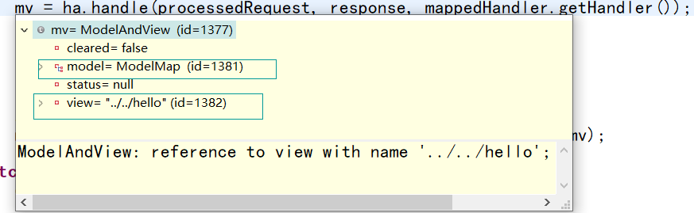
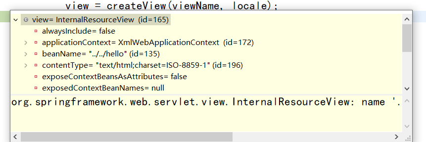
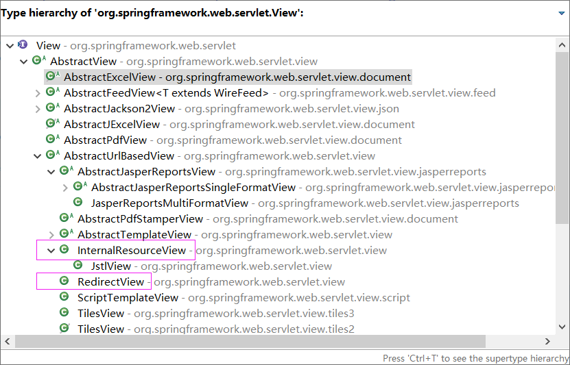
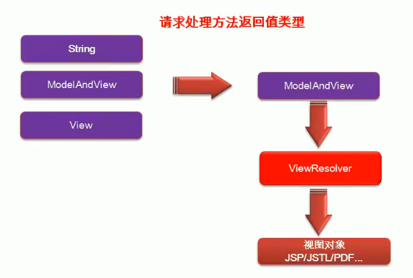
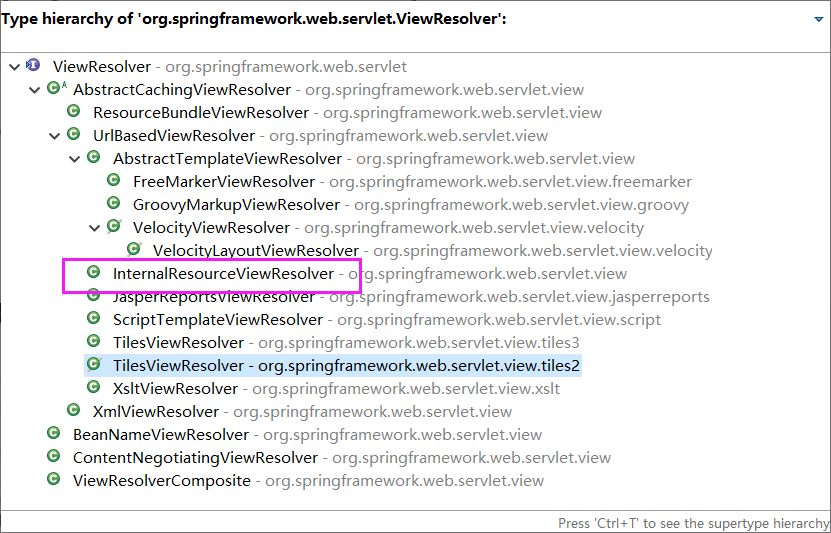

# 转发、重定向

```java
package com.z.controller;

import org.springframework.stereotype.Controller;
import org.springframework.web.bind.annotation.RequestMapping;

@Controller
public class HelloController {

	@RequestMapping(value = "/hello")
	public String hello() {
		System.out.println("hello......");
		return "../../hello";
	}
	
	/*
	 * forward:转发到当前项目下
	 * */
	@RequestMapping(value = "/handle01")
	public String handle01() {
		
		return "forward:/hello.jsp";
	}
	
	/*
	 * 重定向
	 多重重定向
	 * */
	@RequestMapping("/handle03")
	public String handle03() {
		System.out.println("重定向handle03......");
		return "redirect:/hello";
	}
	
	@RequestMapping("/handle04")
	public String handle04() {
		System.out.println("重定向handle04......");
		return "redirect:/handle03";
	}
}

```


SpringMVC视图解析；

* 方法执行后的返回值会作为页面地址参考，转发或重定向到页面
* 视图解析器可能会进行页面地址的拼串


---

# 源码

迅速步入源码阶段

主要内容-都是 `doDispatch()` 中的

* 任何方法的返回值，最终都会被包装秤 ModelAndView 对象




* `processDispatchResult(processedRequest, response, mappedHandler, mv, dispatchException);` 来到页面的方法
  * 视图渲染流程：将域中的数据在页面展示；页面就是用来渲染模型数据的；
* 调用 `render()`


# 主菜

跳过 doDispatch() 源码，详情看第五章笔记

## processDispatchResult()

重点方法

* `render()` 调用 render() 渲染页面；

```java
private void processDispatchResult(HttpServletRequest request, HttpServletResponse response,
                                   HandlerExecutionChain mappedHandler, ModelAndView mv, Exception exception) throws Exception {

    boolean errorView = false;

    if (exception != null) {
        if (exception instanceof ModelAndViewDefiningException) {
            logger.debug("ModelAndViewDefiningException encountered", exception);
            mv = ((ModelAndViewDefiningException) exception).getModelAndView();
        }
        else {
            Object handler = (mappedHandler != null ? mappedHandler.getHandler() : null);
            mv = processHandlerException(request, response, handler, exception);
            errorView = (mv != null);
        }
    }

    // Did the handler return a view to render?
    if (mv != null && !mv.wasCleared()) {
        
        // 手动标签，重点在这里
        render(mv, request, response);
        if (errorView) {
            WebUtils.clearErrorRequestAttributes(request);
        }
    }
    else {
        if (logger.isDebugEnabled()) {
            logger.debug("Null ModelAndView returned to DispatcherServlet with name '" + getServletName() +
                         "': assuming HandlerAdapter completed request handling");
        }
    }

    if (WebAsyncUtils.getAsyncManager(request).isConcurrentHandlingStarted()) {
        // Concurrent handling started during a forward
        return;
    }

    if (mappedHandler != null) {
        mappedHandler.triggerAfterCompletion(request, response, null);
    }
}
```

## render()

View 和 ViewResolver 区别

* ViewResolver 的作用是 根据视图名（方法的返回值）得到 View 对象

```java
protected void render(ModelAndView mv, HttpServletRequest request, HttpServletResponse response) throws Exception {
    // Determine locale for request and apply it to the response.
    Locale locale = this.localeResolver.resolveLocale(request);
    response.setLocale(locale);

    View view;
    if (mv.isReference()) {
        // We need to resolve the view name.
        // 手动标签
        view = resolveViewName(mv.getViewName(), mv.getModelInternal(), locale, request);
        if (view == null) {
            throw new ServletException("Could not resolve view with name '" + mv.getViewName() +
                                       "' in servlet with name '" + getServletName() + "'");
        }
    }
    else {
        // No need to lookup: the ModelAndView object contains the actual View object.
        view = mv.getView();
        if (view == null) {
            throw new ServletException("ModelAndView [" + mv + "] neither contains a view name nor a " +
                                       "View object in servlet with name '" + getServletName() + "'");
        }
    }

    // Delegate to the View object for rendering.
    if (logger.isDebugEnabled()) {
        logger.debug("Rendering view [" + view + "] in DispatcherServlet with name '" + getServletName() + "'");
    }
    try {
        if (mv.getStatus() != null) {
            response.setStatus(mv.getStatus().value());
        }
        view.render(mv.getModelInternal(), request, response);
    }
    catch (Exception ex) {
        if (logger.isDebugEnabled()) {
            logger.debug("Error rendering view [" + view + "] in DispatcherServlet with name '" +
                         getServletName() + "'", ex);
        }
        throw ex;
    }
}
```


## resolveViewName()

在 `DispatcherServlet.class` 中

如何根据方法的返回值（视图名）得到 View 对象？


```java
protected View resolveViewName(String viewName, Map<String, Object> model, Locale locale,
                               HttpServletRequest request) throws Exception {

    // 手动标签，手写重点
    // 遍历所有的 ViewResolver 
    for (ViewResolver viewResolver : this.viewResolvers) {
        // ViewResolver 视图解析器根据方法的返回值，得到一个 View 对象
        View view = viewResolver.resolveViewName(viewName, locale);
        if (view != null) {
            return view;
        }
    }
    return null;
}
```


### resolveViewName()

在 `AbstractCachingViewResolver.class` 中

resolveViewName() 实现

```java
public View resolveViewName(String viewName, Locale locale) throws Exception {
    if (!isCache()) {
        return createView(viewName, locale);
    }
    else {
        Object cacheKey = getCacheKey(viewName, locale);
        View view = this.viewAccessCache.get(cacheKey);
        if (view == null) {
            synchronized (this.viewCreationCache) {
                view = this.viewCreationCache.get(cacheKey);
                if (view == null) {
                    // Ask the subclass to create the View object.
                    
                    // 手动标签
                    // 很明显这里传了一个视图名，要创建 View 对象
                    // 根据方法的返回值创建出视图对象（View对象）
                    view = createView(viewName, locale);
                    if (view == null && this.cacheUnresolved) {
                        view = UNRESOLVED_VIEW;
                    }
                    if (view != null) {
                        this.viewAccessCache.put(cacheKey, view);
                        this.viewCreationCache.put(cacheKey, view);
                        if (logger.isTraceEnabled()) {
                            logger.trace("Cached view [" + cacheKey + "]");
                        }
                    }
                }
            }
        }
        return (view != UNRESOLVED_VIEW ? view : null);
    }
}
```


## 真正创建View

`UrlBasedViewResolver.class` 中的方法


```java
protected View createView(String viewName, Locale locale) throws Exception {
    // If this resolver is not supposed to handle the given view,
    // return null to pass on to the next resolver in the chain.
    if (!canHandle(viewName, locale)) {
        return null;
    }
    // Check for special "redirect:" prefix.
    
    // 手动标签 ***重要
    if (viewName.startsWith(REDIRECT_URL_PREFIX)) {
        String redirectUrl = viewName.substring(REDIRECT_URL_PREFIX.length());
        RedirectView view = new RedirectView(redirectUrl, isRedirectContextRelative(), isRedirectHttp10Compatible());
        view.setHosts(getRedirectHosts());
        return applyLifecycleMethods(viewName, view);
    }
    // Check for special "forward:" prefix.
    if (viewName.startsWith(FORWARD_URL_PREFIX)) {
        String forwardUrl = viewName.substring(FORWARD_URL_PREFIX.length());
        return new InternalResourceView(forwardUrl);
    }
    
    // 如果返回值没有前缀，使用父类默认的 createView() 创建一个 View；
    // Else fall back to superclass implementation: calling loadView.
    return super.createView(viewName, locale);
}
```

解析完之后会得到一个 view 对象 




## render()的最终实现

在上面 render() 方法中的 render() 方法

属于 AbstractView.class 中的

上面的 render() 属于 DispatcherServlet.class


```java
public void render(Map<String, ?> model, HttpServletRequest request, HttpServletResponse response) throws Exception {
    if (logger.isTraceEnabled()) {
        logger.trace("Rendering view with name '" + this.beanName + "' with model " + model +
                     " and static attributes " + this.staticAttributes);
    }

    Map<String, Object> mergedModel = createMergedOutputModel(model, request, response);
    prepareResponse(request, response);
    
    // 手动标签
    // 这个方法一放行，就跳转成功
    // 渲染要给页面的所有数据
    renderMergedOutputModel(mergedModel, getRequestToExpose(request), response);
}
```


### renderMergedOutputModel()

在 `InternalResourceView.class` 中


```java
protected void renderMergedOutputModel(
    Map<String, Object> model, HttpServletRequest request, HttpServletResponse response) throws Exception {

    // Expose the model object as request attributes.
    // 手动标签 
    // 将模型中的数据放在请求域中，
    // 下面有源码
    exposeModelAsRequestAttributes(model, request);

    // Expose helpers as request attributes, if any.
    exposeHelpers(request);

    // Determine the path for the request dispatcher.
    String dispatcherPath = prepareForRendering(request, response);

    // Obtain a RequestDispatcher for the target resource (typically a JSP).
    RequestDispatcher rd = getRequestDispatcher(request, dispatcherPath);
    if (rd == null) {
        throw new ServletException("Could not get RequestDispatcher for [" + getUrl() +
                                   "]: Check that the corresponding file exists within your web application archive!");
    }

    // If already included or response already committed, perform include, else forward.
    if (useInclude(request, response)) {
        response.setContentType(getContentType());
        if (logger.isDebugEnabled()) {
            logger.debug("Including resource [" + getUrl() + "] in InternalResourceView '" + getBeanName() + "'");
        }
        rd.include(request, response);
    }

    else {
        // Note: The forwarded resource is supposed to determine the content type itself.
        if (logger.isDebugEnabled()) {
            logger.debug("Forwarding to resource [" + getUrl() + "] in InternalResourceView '" + getBeanName() + "'");
        }
        rd.forward(request, response);
    }
}
```


### exposeModelAsRequestAttributes()

在 `AbstractView.class` 中

将模型中的所有数据取出来放在 request 域中

```java
protected void exposeModelAsRequestAttributes(Map<String, Object> model, HttpServletRequest request) throws Exception {
    for (Map.Entry<String, Object> entry : model.entrySet()) {
        String modelName = entry.getKey();
        Object modelValue = entry.getValue();
        if (modelValue != null) {
            
            // 这里
            request.setAttribute(modelName, modelValue);
            if (logger.isDebugEnabled()) {
                logger.debug("Added model object '" + modelName + "' of type [" + modelValue.getClass().getName() +
                             "] to request in view with name '" + getBeanName() + "'");
            }
        }
        else {
            request.removeAttribute(modelName);
            if (logger.isDebugEnabled()) {
                logger.debug("Removed model object '" + modelName +
                             "' from request in view with name '" + getBeanName() + "'");
            }
        }
    }
}
```


### 一句话：

视图解析器只是为了得到视图对象；视图对象才能真正的**转发（将模型数据全部放在请求域中）或者重定向到页面**
 视图对象才能真正的 **渲染视图**


## View的结构

有这么多 View



## 得到View解析

视图解析器得到View对象的流程

* 所有配置好的 视图解析器 都来尝试根据视图名（返回值）得到 View 对象，
  * 如果能得到就返回，得不到就换下一个视图解析器
* 调用 View 对象的 render 方法


# MVC如何解析视图



ViewResolver 得到 ModelAndView 并将它解析成 **视图对象** 


## ViewResolver 的结构




---

# 分割线

# 视图

作用 ：是渲染模型数据，将模型里的数据以 **某种形式** 呈现给客户。

为了实现 视图模型 和 具体实现技术 的解耦 ，Spring 在 `org.springframework.web.servlet` 包中定义了一个高度抽象的 View 接口：

* 上面有图

**视图对象由视图解析器负责实例化**  ，由于视图是 无状态 的，所以他们不会有 **线程安全** 的问题

## 常用视图实现类

| 大类        | 视图类型                     | 说明                                                         |
| ----------- | ---------------------------- | ------------------------------------------------------------ |
| URL资源视图 | ==InternalResourceView==     | 将JSP或其它资源封装成- -个视图，是<br/>IntermalResourceViewResolver 默认使用的视图实现类 |
|             | ==JstlView==                 | 如果JSP文件中使用了 JSTL 国际化标签 的功能,则需要使用该视图类 |
| 文档视图    | ==AbstractExcelView==        | Excel 文档视图的抽象类。该视图类基于 POI 构造 Excel 文档     |
|             | AbstractPdfView              | PDF文档视图的抽象类。该视图类基于 iText构造 PDF文档          |
| 报表视图    | ConfigurableJsperReportsView | 几个使用 JasperReports 报表技术的视图                        |
|             | JasperReportsCsvView         |                                                              |
|             | JasperReportsMultiFormatView |                                                              |
|             | JasperReportsHtmlView        |                                                              |
|             | JasperReportsPdfView         |                                                              |
| 报表视图    | JasperReportsXlsView         |                                                              |
| JSON 视图   | MappingJacksonJsonView       | 将模型数据通过 Jackson 开源框架的 ObjectMapper 以JSON 方式输出。 |


## 常用视图解析器实现类


| 大类               | 常用类型                     | 说明                                                         |
| ------------------ | ---------------------------- | :----------------------------------------------------------- |
| 解析为 Bean 的名字 | BeanNameVIewResolver         | 将逻辑视图名解析为一个Bean , Bean的id等于逻辑视图名          |
| 解析为 URL 文件    | InternalResourceViewResolver | 将视图名解析为一个URL文件，一般使用该解析器将视图名映射为一个保存在WEB-INF目录下的程序文件(如JSP ) |
|                    | JasperReportsViewResolver    | JasperReports是一个基于Java的 开源报表工具,该解析器将视图名解析为报表文件对应的URL |
| 模版文件视图解析器 | FreeMarkerViewResolver       | 解析为基于FreeMarker模版技术的模版文件                       |
|                    | VelocityViewResolver         | 解析为基于Velocity模版技术的模版文件                         |
|                    | VelocityLayoutViewResolver   | 同上                                                         |

程序员可以选择一种 视图解析器 或混用 多种视图解析器

每个视图解析器都实现了Ordered 接口并开放出一个order属性，**可以通过order属性指定解析器的优先顺序, order越小优先级越高。**

SpringMVC会按 视图解析器 顺序的 优先顺序 对 逻辑视图名 进行 解析 **直到解析成功并返回** 视图对象，否则将抛出ServletException异常


---

### jstlView

1. 导包导入了jstl的时候会自动创建为一个jstIView ;可以快速方便的支持国际化功能;
   1. 可以支持快速国际化;
      1. javaWeb国际化步骤;
         1. 得得到一个Locale对象;
         2. 使用ResourceBundle绑定国际化资源文件; 
         3. 使用ResourceBundle.getString("key") ;获取到国际化配置文件中的值;
         4. web页面的国际化, fmt标签库来做;
            \<fmt:setLocale>
            <fmt:setBundle >
            < fmt:message>

2. 有了JstIView以后;
   1. 让Spring管理国际化资源就行
   2. 直接去页面使用\<fmt:message> ;


注意；

- 一定要过 SpringMVC 的视图解析流程，才能创建一个 jstlView 帮你快速国际化
- 也不能写 `return "forward:/xx/xx/xx.jsp"` 


---

# \<mvc:view-controller/>

在 SpringMVC 的配置文件中，有一个 mvc 名称空间

path ：指定是什么请求

vaew-name ：返回给请求的 视图名

- 还可以写 `forward:/login.jsp`

## 副作用：

* 配了这个东西之后，其他控制器中的方法就没用了

解决办法

* `<mvc:annotation-driven/>` 
* 作用是 开启 mvc 注解模式----mvc开挂模式

```xml
<mvc:view-controller path="/toLoginPage" view-name="login"/>
```


# 扩展

加深视图解析器和视图对象

视图解析器根据方法的返回值得到视图对象

多个视图解析器都会尝试能否得到视图对象

视图对象不同就可以具有不同功能

# 自定义视图

流程：

* 让视图解析器工作
* 得到视图对象
* 自己写的对象自定义渲染逻辑

* ```java
  response.getWriter().print("<h1>即将show</h1>");
  ```

自定义视图 和 视图解析器 的步骤

* 编写自定义的 **视图解析器** ，和 **视图实现类** 
* 视图解析器必须放在 IOC 容器中

web.xml 中的字符过滤器 只设置了响应的编码格式，没有设置内容类型(text/html) ，所以还是会乱码


## 代码

### index.jsp

```jsp
<a href="handleplus">DownloadResource</a>
```


### Controller

```java
@Controller
public class MyViewResolverController {

    @RequestMapping("/handleplus")
    public String handlePlus(Model model) {
        List<String> vname = new ArrayList<>();
        List<String> viname = new ArrayList<>();
        vname.add("童老师");
        vname.add("汉拔尼");

        viname.add("cck");
        viname.add("蔡徐坤");
        model.addAttribute("video", vname);
        model.addAttribute("images", viname);
        return "meinv:/gaoqing";
    }
}
```


### viewResolver

实现 `Ordered` 接口是为了给这个视图解析器设置优先级，让他提前于 `InternalResourceViewResolver` 执行

```java
public class MyNVViewResolver implements ViewResolver,Ordered {

    private Integer order = 0;

    @Override
    // 解析视图名，看看这个解析器能不能解决，判断能解决的依据是是否带了 meinv: 前缀，这个可以自定义
    public View resolveViewName(String viewName, Locale locale) throws Exception {
        // 根据视图名返回对象
        if (viewName.startsWith("meinv:")) {
            // 这个 MyView() 是自己写的
            return new MyView();
        } else {
            return null;
        }
    }

    @Override
    public int getOrder() {
        return order;
    }

    public void setOrder(Integer order){
        this.order = order;
    }

}
```


### view

创建一个自定义视图，处理响应

```java
public class MyView implements View {

	@Override
	public String getContentType() {
		return "text/html";
	}

	@Override
	public void render(Map<String, ?> model, HttpServletRequest request, HttpServletResponse response)
			throws Exception {
		System.out.println("之前保存的数据：" + model);
        // 响应时必须设置 内容类型，要不然会出现乱码
		response.setContentType("text/html");
		response.getWriter().print("<h1>即将show</h1>");
		List<String> vs = (List<String>) model.get("video");
		List<String> is = (List<String>) model.get("images");
		for (String v : vs) {
			response.getWriter().write("<a>下載" +v+ "</a><br>");
		}
		for (String v : is) {
			response.getWriter().write("<a>下載" +v+ "</a><br>");
		}
		response.getWriter().write("<button>button</button>");
		response.getWriter().write("<script>"
				+ "var aEle = document.getElementByTagName('a')[1];"
				+ "aEle.onclick=function(){"
				+ "alert('想下载？功能未完善');"
				+ "}"
				+ "</script>");
	}
}
```


### springmvc.xml

把自定义的 视图解析器 交给 IOC 容器管理起来，要不然spring会找不到自定义视图解析器，

视图就不用放进 ioc 了 ，因为视图解析器会 new 一个 视图 ，放进IOC也没问题


```xml
<?xml version="1.0" encoding="UTF-8"?>
<beans xmlns="http://www.springframework.org/schema/beans"
       xmlns:xsi="http://www.w3.org/2001/XMLSchema-instance"
       xmlns:context="http://www.springframework.org/schema/context"
       xsi:schemaLocation="http://www.springframework.org/schema/beans http://www.springframework.org/schema/beans/spring-beans.xsd
                           http://www.springframework.org/schema/context http://www.springframework.org/schema/context/spring-context-4.3.xsd">

    <context:component-scan base-package="com.z"></context:component-scan>

    <bean class="com.z.controller.MyNVViewResolver">
        <property name="order" value="1"></property>
    </bean>
    <bean class="org.springframework.web.servlet.view.InternalResourceViewResolver">
        <property name="prefix" value="/WEB-INF/pages/"></property>
        <property name="suffix" value=".jsp"></property>
    </bean>

</beans>
```


