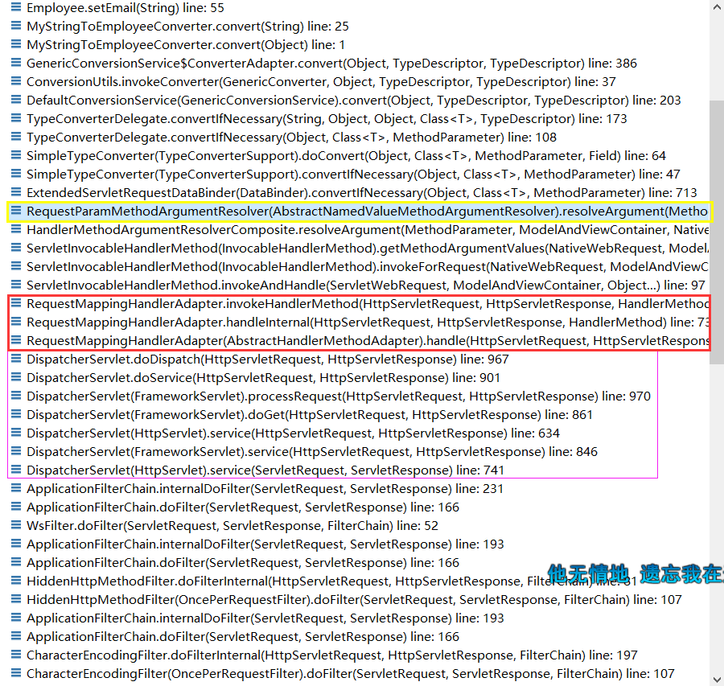
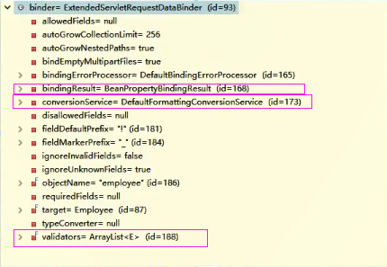
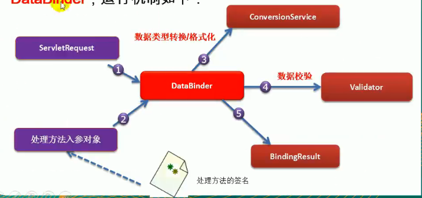
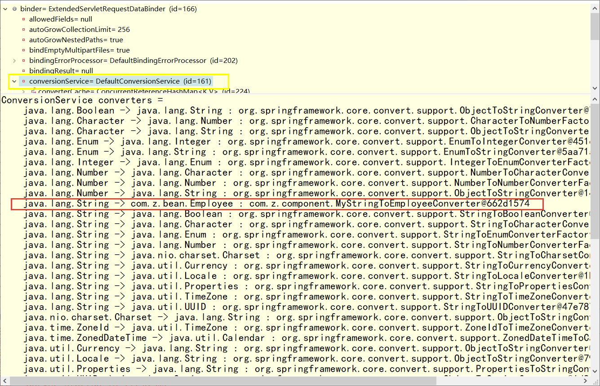
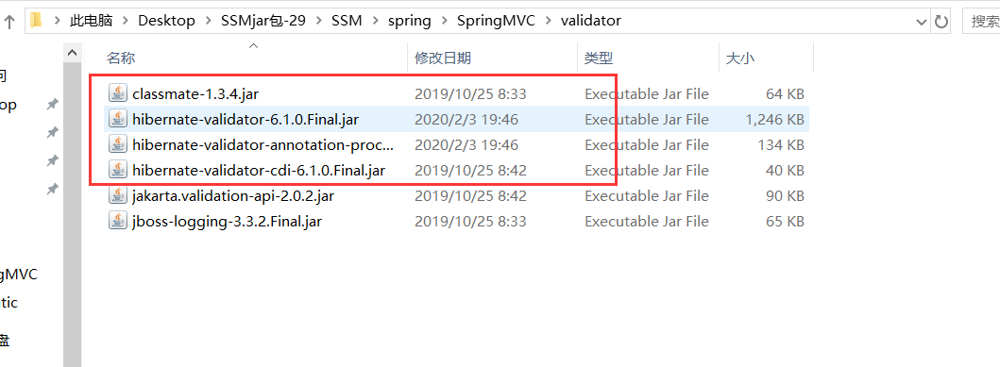

## 数据转换&数据格式化&数据校验

SpringMVC 封装 自定义类型对象 的时候怎么封装？

JavaBean 要和 页面提交的数据 进行一一绑定怎么做?

1. 页面提交的所有数据都是字符串吗？是文本


页面提交数据过来必然 牵扯到以下操作：

1. 数据绑定期间的 数据类型转换
   1. String -- Integer String -- Boolean，xxx
2. 数据绑定期间的数据格式化问题
   1. 比如提交的日期进行转换
   2. birth=2020-05-10 --》Date 2020/12/23 等等
3. 数据校验
   1. 我们提交的数据必须是合法的；
   2. 前端校验：js+正则表达式--》不够安全，能被绕过
   3. 后端校验：必须的；重要的数据更加有必要
      1. 校验成功！数据合法
      2. 校验失败


## 新的源码

在 `ModelAttributeMethodProcessor` 类中

实现了 `HandlerMethodArgumentResolver` 这个接口

### resolveArgument()

```java
public final Object resolveArgument(MethodParameter parameter, ModelAndViewContainer mavContainer,NativeWebRequest webRequest, WebDataBinderFactory binderFactory) throws Exception {

    String name = ModelFactory.getNameForParameter(parameter);
    Object attribute = (mavContainer.containsAttribute(name) ? mavContainer.getModel().get(name) :
                        createAttribute(name, parameter, binderFactory, webRequest));

    if (!mavContainer.isBindingDisabled(name)) {
        ModelAttribute ann = parameter.getParameterAnnotation(ModelAttribute.class);
        if (ann != null && !ann.binding()) {
            mavContainer.setBindingDisabled(name);
        }
    }


    // 手动标签
    WebDataBinder binder = binderFactory.createBinder(webRequest, attribute, name);
    if (binder.getTarget() != null) {
        if (!mavContainer.isBindingDisabled(name)) {
            
            // 手动标签
            // 绑定参数给对象的地方
            // 将页面提交过来的数据封装到 JavaBean 的属性中
            bindRequestParameters(binder, webRequest);
        }
        validateIfApplicable(binder, parameter);
        if (binder.getBindingResult().hasErrors() && isBindExceptionRequired(binder, parameter)) {
            throw new BindException(binder.getBindingResult());
        }
    }

    // Add resolved attribute and BindingResult at the end of the model
    Map<String, Object> bindingResultModel = binder.getBindingResult().getModel();
    mavContainer.removeAttributes(bindingResultModel);
    mavContainer.addAllAttributes(bindingResultModel);

    return binder.convertIfNecessary(binder.getTarget(), parameter.getParameterType(), parameter);
}
```


### 注意--很重要

想要追踪这个源码的话，需要在 `setXxx()` 方法上打断点，然后看方法调用栈

很明显，黄色框框就是上面的方法




## `WebDataBinder` ：

**绑定器** 负责数据的绑定工作

* 数据绑定 期间产生的 类型转换、格式化、数据校验等问题；





`ConversionService` 组件 ：负责数据类型的转换以及格式化功能

`validators` ：负责数据校验工作

`bindingResult` ：负责保存以及解析数据绑定期间数据校验产生的错误；


## 数据绑定流程

1. SpringMVC 主框架将 ServletRequest 对象及目标方法的入参实例传递给WebDataBinderFactory实例,以创
   建 **DataBinder** 实例对象
2. DataBinder 调用装配在 SpringMVC 上下文中的 **ConversionService** 组件进行 ==数据类型转换、数据格式化
   工作==。将 Servlet 中的请求信息填充到入参对象中
3. 调用 **Validator** 组件对已经绑定了 请求消息 的入参对象进行 数据合法性校验, ，并最终生成 数据绑定 结果BindingData 对象
4. Spring MVC 抽取 **BindingResult** 中的入参对象和 校验错误对象 ，将它们赋给处理方法的响应入参
5. SpringMVC 通过反射机制对目标处理方法进行解析 ，将请求消息 绑定到处理方法的 入参中 。数据绑定的核心部件是 DataBinder ，运行机制如下：





---


# 自定义类型转换器

## 步骤

1. `ConversionService` ：是一个接口
   1. 它里面有 `Convertor` （转换器）进行工作
   2. 这个 Converter 是 spring.core 包下的，别看错了
   3. `package org.springframework.core.convert.converter;`
2. 实现 `Converter` 接口 ，写一个自定义的类型转换器
3. Converter 是 ConversionService 中的组件
   1. 将写好的 自定义转换器 放入到 ConversionService 中
   2. 将 `WebDataBinder` 中的 `ConversionService` 设置成我们这个加了自定义 类型转换器 `ConversionService` 
4. 让SpringMVC 使用自定义转换器


加入容器

1. ==`ConversionService`== 是 Spring 类型转换体系的 核心接口
2. 可以利用 ==`ConversionServiceFactoryBean`== 在 Spring 的 IOC 容器中定义一个 `ConversionService` ，并在 Bean 属性配置及 SpringMVC 处理方法入参绑定等场合使用它进行数据绑定的转换
3. 可以通过 `ConversionServiceFactoryBean` 的 `converters` 属性注册自定义的 **类型转换器** 


### SpringMVC 支持的转换器：

Spring 定义了3种类型的转换器接口 ，实现任意一个转换器接口都可以作为 **自定义转换器** 注册到 `ConversionServiceFactoryBean` 中：

* `Converter<S,T>` ：将 S 类型对象转换为 T 类型对象
* `ConverterFactory` ：将相同系列多个 “同质” `Converter` 封装在一起
  * 如果希望将一种类型的对象 转换为 **另一种类型** 及其对象的 **子类的对象** ；例如：String--》Number及Number的子类(Integer Long Double) 等对象 ，可以使用该 **转换器工厂类**
* `GenericConverter` ：会根据源类对象及 目标类对象 所在的宿主类  中的上下文信息 进行 类型转换
* **第二 第三个** 没人用


## 流程

### index.jsp

```html

<form action="${ctp }/post">
<input name="empinfo" value="empadmin-admin@qq.com-1-101"/>
<input name="submit" value="submit"/>
</form>
```

### Controller

```java
Employee-->id,lastName,email,gender,department
@PostMapping("/post")
public String method1(@RequestParam("empinfo")Employee emp){
    System.out.println("封装" + emp); 
    employeeDao.save(emp);
    return "redirect:/emps";
}
```


### converter

三种自定义转换器方法中 选择了 实现`Converter` 这个方法

```java
public class MyStringToEmployeeConverter implements Converter<String,Employee> {
    
	@Autowire
    DepartmentDao dd;
    
    @Override
    public Employee convert(String source) {
        System.out.println("页面提交的将要转换的字符串" + source);
        if (source.contains("-")) {
            String[] split = source.split("-");
            employee.setLastName(split[0]);
            employee.setEmail(split[1]);
            employee.setGender(Integer.parseInt(split[2]));
            employee.setDepartment(dd.getDepartment(Integer.parseInt(split[3])));
        }
        return employee;
    }
}
```

### springmvc.xml

将 转换器 注册到 ioc 容器比一般的组件麻烦

1. 将 转换器 注册到 `ConversionServiceFactoryBean` 中
2. 将 `ConversionServiceFactoryBean` 注册到 `<mvc:annotation-driven>` 中

```xml
<bean id="conversionService" class="org.springframework.context.support.ConversionServiceFactoryBean">
    <!-- converters 转换器中加入自定义的转换器 -->
    <property name="converters">
        <!-- 因为ConversionServiceFactoryBean 中的 getConverters 方法的入参是Set<?> 所以要以这种方式注册 -->
        <!-- public void setConverters(Set<?> converters) { -->
        <set>
            <bean class="com.z.component.MyStringToEmployeeConverter"></bean>
        </set>
    </property>
</bean>

<mvc:annotation-driven conversion-service="conversionService"></mvc:annotation-driven>
扩展：
<!--
<mvc:annotation-driven>中有很多可选属性，看提示得出：
content-negotiation-manage :
enable-matrix-variables :
ignore-default-model-on-redirect :
message-codes-resolver :
validator :
-->

```


## 总结三步

1. 实现 `Converter` 接口 ，做一个自定义类型的 转换器
2. 将这个 `Conveter` 配置在 `ConversionService` 中
3. 告诉 SpringMVC 使用这个 `Converter`


# 源码追踪自定义转换器

在记录一次 ：在 POJO 的 `setXxx()` 打断点，看方法调用栈，就能找到这个流程了


`AbstractNamedValueMethodArgumentResolver` 这个类中的 `resolveArgument` 方法中，查看 `WebDataBinder binder`  ，发现转换器被替换了

看上面的 WebDataBinder 的笔记有一张图，当时框架默认的转换器是 `DefaultFormattingConversionService`  现在替换成了 `DefaultConversionService`


```java
public final Object resolveArgument(MethodParameter parameter, ModelAndViewContainer mavContainer,
                                    NativeWebRequest webRequest, WebDataBinderFactory binderFactory) throws Exception {

    NamedValueInfo namedValueInfo = getNamedValueInfo(parameter);
    MethodParameter nestedParameter = parameter.nestedIfOptional();

    Object resolvedName = resolveStringValue(namedValueInfo.name);
    if (resolvedName == null) {
        throw new IllegalArgumentException(
            "Specified name must not resolve to null: [" + namedValueInfo.name + "]");
    }

    Object arg = resolveName(resolvedName.toString(), nestedParameter, webRequest);
    if (arg == null) {
        if (namedValueInfo.defaultValue != null) {
            arg = resolveStringValue(namedValueInfo.defaultValue);
        }
        else if (namedValueInfo.required && !nestedParameter.isOptional()) {
            handleMissingValue(namedValueInfo.name, nestedParameter, webRequest);
        }
        arg = handleNullValue(namedValueInfo.name, arg, nestedParameter.getNestedParameterType());
    }
    else if ("".equals(arg) && namedValueInfo.defaultValue != null) {
        arg = resolveStringValue(namedValueInfo.defaultValue);
    }

    if (binderFactory != null) {
        
        // 手动标签
        WebDataBinder binder = binderFactory.createBinder(webRequest, null, namedValueInfo.name);
        try {
            arg = binder.convertIfNecessary(arg, parameter.getParameterType(), parameter);
        }
        catch (ConversionNotSupportedException ex) {
            throw new MethodArgumentConversionNotSupportedException(arg, ex.getRequiredType(),
                                                                    namedValueInfo.name, parameter, ex.getCause());
        }
        catch (TypeMismatchException ex) {
            throw new MethodArgumentTypeMismatchException(arg, ex.getRequiredType(),
                                                          namedValueInfo.name, parameter, ex.getCause());

        }
    }

    handleResolvedValue(arg, namedValueInfo.name, parameter, mavContainer, webRequest);

    return arg;
}
```


红框内就是自己注册的转换器





---


# 数据格式化


## 日期格式化

要求

1. 页面提交到数据格式如果不正确，就是400；
2. 日期格式 ：2020-5-12

`ConversionServiceFactoryBean`  ：创建的 `ConversionService` 组件是没有格式化器的

### 第一种方式

#### springmvc.xml

```xml
<!-- 	<bean id="conversionService" class="org.springframework.context.support.ConversionServiceFactoryBean"> -->
<!-- 以后写自定义类型转换器的时候，就使用 FormattingConversionServiceFactoryBean 来注册
  因为这个类 即具有 类型转换，又拥有 格式化功能
  -->
<bean id="conversionService" class="org.springframework.format.support.FormattingConversionServiceFactoryBean">
    <property name="converters">
        <set>
            <bean class="com.z.component.MyStringToEmployeeConverter"></bean>
        </set>
    </property>
</bean>
<mvc:annotation-driven conversion-service="conversionService"></mvc:annotation-driven>
```

#### Employee.java

```java
public class Employee{
    private String id;
    .....
	@DateTimeFormat(pattern="yyyy-MM-dd")
	private Date birth;
    .......
    private xxxx xxxx;
}
```

#### 总结

使用这种方式 ，使springmvc 能处理前端发来的 这种 `2020-5-12` 格式的日期 ，而其他格式的日期 `2020/5/12` 就不能处理，从而报错


## 数字格式化

在 POJO 的属性上加个注解就好了 

```java
public class Employee{
    private String id;
    .....
	@NumberFormat(pattern="#,###,###.##")
	private Double salary;
    .......
    private xxxx xxxx;
}
```


# 数据校验

只有前端校验是不安全的

重要数据一定要加上后端验证

## 第一种方式

1. 写程序 ，将每个数据取出来进行校验 ，如果失败 直接来到添加页面 ，提示重填；

## 第二种方式

SpringMVC 可以用 JSR 303 来做数据校验

1. JSR303 是一个规范，就像 JDBC 一样 会有第三方去实现这个功能
2. 实现产品 ：Hibernate Validator（第三方校验框架）

快速进行后端校验

导包--》加注解--》测试

### 导包



虽然不是 Hibernate Validator 里面的包，但是意思是一样的，带有 el 的包不能导入，因为 tomcat 里面有，会产生冲突

1. 如果现在的 tomcat 版本小于 7.0 那么就需要将 那几个 el 包放进 tomcat 的lib文件夹下
2. 注意是 tomcat 的 lib 文件夹 ，不用删除原来的，直接导入即可
3. 因为tomcat 7.0以上支持 servlet3.0 标准，servlet3.0标准开启了el 功能，7.0以上具有高级的EL 功能；
4. 而7.0一下不行


### 加注解


```java
public class Employee {
    private Integer id;

    @NotEmpty
    @Length(min = 6, max = 18)
    private String lastName;
	
    // 规定页面提交的日期格式
    // @Past ：必须是过去的时间
    // @Futrue ：必须是一个未来的时间
	@DateFormat(pattern="yyyy-MM-dd")
    private Date birth;
    
    @Email
    private String email;
    private Integer gender;
    @JsonIgnore
    private Department department;
}
```


### 注册

告诉 SpringMVC 封装对象的时候 ，这个 JavaBean 需要校验

`@validated` ：注解

BindingResult ：这个是接受校验结果的

BindingResult 一定要在 @validated 后面第一个 ，要不然会报错

```java
@RequestMapping(value = "/emp", method = RequestMethod.POST)
	public String addEmp(@Validated Employee employee, BindingResult result, Model model) {
		Map<String, Object> errorsMap = new HashMap<String, Object>();
		System.out.println("要添加的员工：" + employee);
		// 获取是否有校验错误
		boolean hasErrors = result.hasErrors();
		if (hasErrors) {
			List<FieldError> allErrors = result.getFieldErrors();
			for (FieldError e : allErrors) {
				errorsMap.put(e.getField(), e.getDefaultMessage());
			}
			model.addAttribute("errorInfo", errorsMap);
			System.out.println("有校验错误");
			return "add";
		} else {
			employeeDao.save(employee);

			// 直接重定向到查询所有员工请求；
			return "redirect:/emps";
		}

	}
```


### 显示错误信息

add.jsp

记得导入 spring 的标签

```jsp
// 这两行
<%@taglib prefix="c" uri="http://java.sun.com/jsp/jstl/core" %>
<%@taglib prefix="form" uri="http://www.springframework.org/tags/form" %>

<form:form action="${ctp }/emp" method="POST" modelAttribute="employee">
    <!-- path就是原来html-input标签的name：需要些 -->
    lastName:<form:input path="lastName" />
    // 回显报错信息
    --${errorInfo.lastName }
    <hr>
    email:<form:input path="email"/>
    <%-- <form:errors path="email"></form:errors> --%>
    --${errorInfo.lastName }
    <hr>
    gender:男：<form:radiobutton path="gender" value="1" />++女：
    <form:radiobutton path="gender" value="0"/>
    <hr>
    dept:
    <form:select path="department.id" items="${depts }"
                 itemLabel="departmentName" itemValue="id"
                 >

    </form:select>
    <hr>
    <input type="submit" value="submit"/>
</form:form>
```

两种回显方式 

直接通过spring的回显方式

```html
// 回显报错信息
<form:errors path="lastName"/>
```

通过原生 API 回显

在控制器加上

```java
boolean hasErrors = result.hasErrors();
		if (hasErrors) {
			List<FieldError> allErrors = result.getFieldErrors();
			for (FieldError e : allErrors) {
				errorsMap.put(e.getField(), e.getDefaultMessage());
			}
			model.addAttribute("errorInfo", errorsMap);
			System.out.println("有校验错误");
			return "add";
		} else {
			employeeDao.save(employee);

			// 直接重定向到查询所有员工请求；
			return "redirect:/emps";
		}
```


1. 判断有没有校验错误
2. 有错误--》获取所有错误
3. 将错误信息封装到 Model 中传回前端


前端取值

```html
lastName:<form:input path="lastName" />
    // 回显报错信息
    --${errorInfo.lastName }
    <hr>
```


### 自定义报错信息

每个注解都会有一个 `message` 属性，设置了就是报错信息

```java
@NotEmpty(message = "不能为空")
@Length(min = 6, max = 18)
private String lastName;
```


