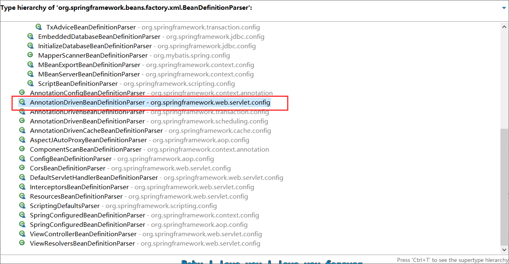
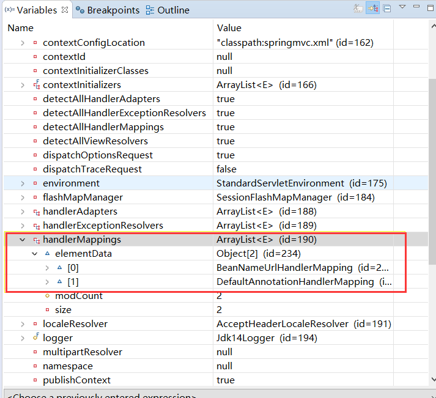
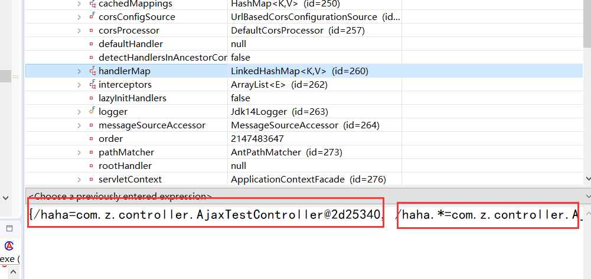
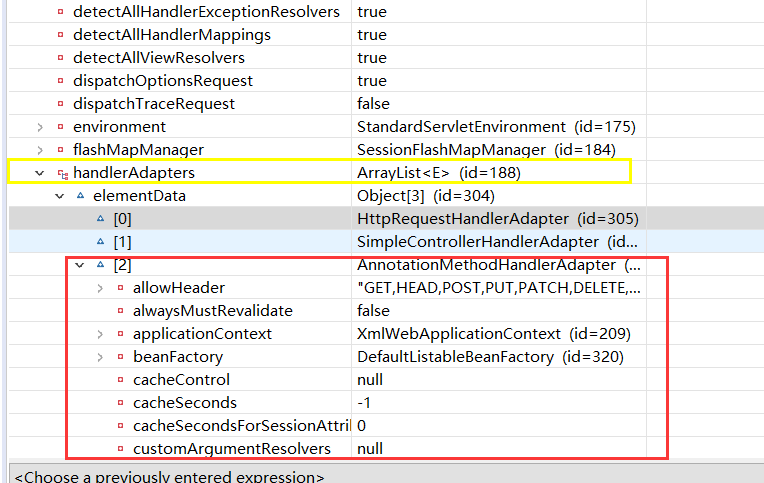
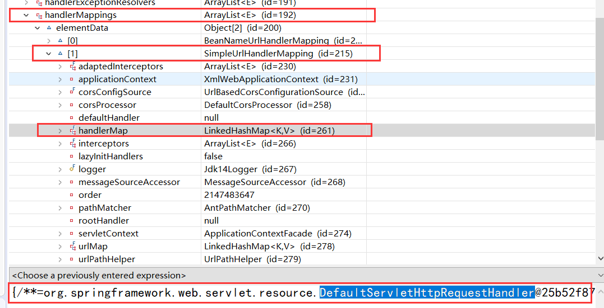
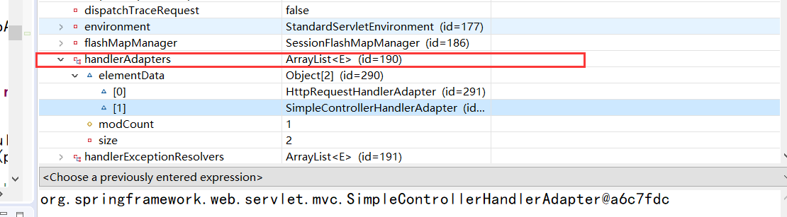
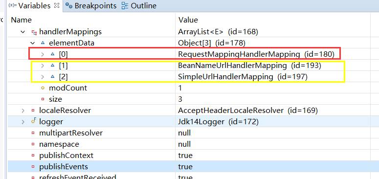
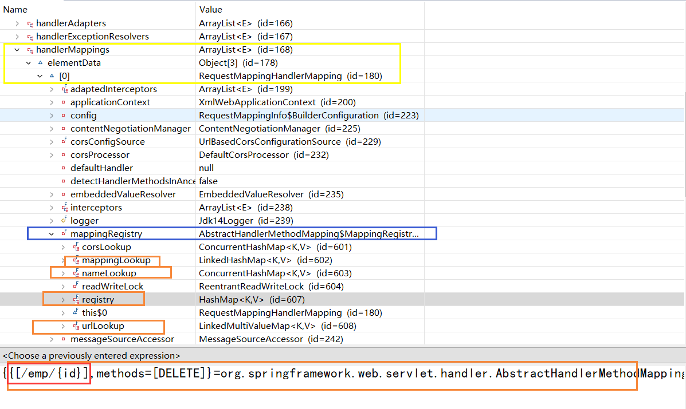
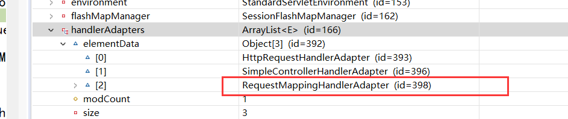

[TOC]


# `mvc:annotation-driven`

## 关于这个主题--也很重要

1. `<mvc:annotation-driven/>` 加上了
   1. `RequestMappingHandlerMapping`
   2. `RequestMappingHandlerAdapter`
   3. `ExceptionHandlerExceptionResolver`
   4. 自动注册以上这3个bean
2. 还提供了以下支持
   1. 支持使用 `ConversionService` 实例对表单参数进行类型转换
   2. 支持使用
      1. `@NumberFormatAnnotation`
      2. `@DateTimeFormat`
      3. 两个注解完成数据类型的 **格式化**
   3. 支持使用 `@Valid` 注解对 javaBean 实例进行 JSR 303 验证
   4. 支持使用 `@RequestBody` 和 `@ResponseBody` 注解
      1. 与 AJAX 有关




所以：`<mvc:annotation-driven>` 底层到底做了什么事情

那就看一下 `BeanDefinitionParser` 的子类 `AnnotationDrivenBeanDefinitionParser` 类中就是他的具体过程，看看上面的图

1. 解析这个标签 添加了好多东西，和注册了很多东西


源码：

`handlerAdapterDef.getPropertyValues().add()` ：加载了很多东西，开放了很多功能

`parserContext.registerComponent()`  ：又注册了很多组件


```java
public BeanDefinition parse(Element element, ParserContext parserContext) {
    Object source = parserContext.extractSource(element);
    XmlReaderContext readerContext = parserContext.getReaderContext();

    CompositeComponentDefinition compDefinition = new CompositeComponentDefinition(element.getTagName(), source);
    parserContext.pushContainingComponent(compDefinition);

    RuntimeBeanReference contentNegotiationManager = getContentNegotiationManager(element, source, parserContext);

    RootBeanDefinition handlerMappingDef = new RootBeanDefinition(RequestMappingHandlerMapping.class);
    handlerMappingDef.setSource(source);
    handlerMappingDef.setRole(BeanDefinition.ROLE_INFRASTRUCTURE);
    handlerMappingDef.getPropertyValues().add("order", 0);
    handlerMappingDef.getPropertyValues().add("contentNegotiationManager", contentNegotiationManager);

    if (element.hasAttribute("enable-matrix-variables")) {
        Boolean enableMatrixVariables = Boolean.valueOf(element.getAttribute("enable-matrix-variables"));
        handlerMappingDef.getPropertyValues().add("removeSemicolonContent", !enableMatrixVariables);
    }
    else if (element.hasAttribute("enableMatrixVariables")) {
        Boolean enableMatrixVariables = Boolean.valueOf(element.getAttribute("enableMatrixVariables"));
        handlerMappingDef.getPropertyValues().add("removeSemicolonContent", !enableMatrixVariables);
    }

    configurePathMatchingProperties(handlerMappingDef, element, parserContext);
    readerContext.getRegistry().registerBeanDefinition(HANDLER_MAPPING_BEAN_NAME , handlerMappingDef);

    RuntimeBeanReference corsConfigurationsRef = MvcNamespaceUtils.registerCorsConfigurations(null, parserContext, source);
    handlerMappingDef.getPropertyValues().add("corsConfigurations", corsConfigurationsRef);

    RuntimeBeanReference conversionService = getConversionService(element, source, parserContext);
    RuntimeBeanReference validator = getValidator(element, source, parserContext);
    RuntimeBeanReference messageCodesResolver = getMessageCodesResolver(element);

    RootBeanDefinition bindingDef = new RootBeanDefinition(ConfigurableWebBindingInitializer.class);
    bindingDef.setSource(source);
    bindingDef.setRole(BeanDefinition.ROLE_INFRASTRUCTURE);
    bindingDef.getPropertyValues().add("conversionService", conversionService);
    bindingDef.getPropertyValues().add("validator", validator);
    bindingDef.getPropertyValues().add("messageCodesResolver", messageCodesResolver);

    ManagedList<?> messageConverters = getMessageConverters(element, source, parserContext);
    ManagedList<?> argumentResolvers = getArgumentResolvers(element, parserContext);
    ManagedList<?> returnValueHandlers = getReturnValueHandlers(element, parserContext);
    String asyncTimeout = getAsyncTimeout(element);
    RuntimeBeanReference asyncExecutor = getAsyncExecutor(element);
    ManagedList<?> callableInterceptors = getCallableInterceptors(element, source, parserContext);
    ManagedList<?> deferredResultInterceptors = getDeferredResultInterceptors(element, source, parserContext);

    RootBeanDefinition handlerAdapterDef = new RootBeanDefinition(RequestMappingHandlerAdapter.class);
    handlerAdapterDef.setSource(source);
    handlerAdapterDef.setRole(BeanDefinition.ROLE_INFRASTRUCTURE);
    handlerAdapterDef.getPropertyValues().add("contentNegotiationManager", contentNegotiationManager);
    handlerAdapterDef.getPropertyValues().add("webBindingInitializer", bindingDef);
    handlerAdapterDef.getPropertyValues().add("messageConverters", messageConverters);
    addRequestBodyAdvice(handlerAdapterDef);
    addResponseBodyAdvice(handlerAdapterDef);

    if (element.hasAttribute("ignore-default-model-on-redirect")) {
        Boolean ignoreDefaultModel = Boolean.valueOf(element.getAttribute("ignore-default-model-on-redirect"));
        handlerAdapterDef.getPropertyValues().add("ignoreDefaultModelOnRedirect", ignoreDefaultModel);
    }
    else if (element.hasAttribute("ignoreDefaultModelOnRedirect")) {
        // "ignoreDefaultModelOnRedirect" spelling is deprecated
        Boolean ignoreDefaultModel = Boolean.valueOf(element.getAttribute("ignoreDefaultModelOnRedirect"));
        handlerAdapterDef.getPropertyValues().add("ignoreDefaultModelOnRedirect", ignoreDefaultModel);
    }

    if (argumentResolvers != null) {
        handlerAdapterDef.getPropertyValues().add("customArgumentResolvers", argumentResolvers);
    }
    if (returnValueHandlers != null) {
        handlerAdapterDef.getPropertyValues().add("customReturnValueHandlers", returnValueHandlers);
    }
    if (asyncTimeout != null) {
        handlerAdapterDef.getPropertyValues().add("asyncRequestTimeout", asyncTimeout);
    }
    if (asyncExecutor != null) {
        handlerAdapterDef.getPropertyValues().add("taskExecutor", asyncExecutor);
    }

    handlerAdapterDef.getPropertyValues().add("callableInterceptors", callableInterceptors);
    handlerAdapterDef.getPropertyValues().add("deferredResultInterceptors", deferredResultInterceptors);
    readerContext.getRegistry().registerBeanDefinition(HANDLER_ADAPTER_BEAN_NAME , handlerAdapterDef);

    String uriCompContribName = MvcUriComponentsBuilder.MVC_URI_COMPONENTS_CONTRIBUTOR_BEAN_NAME;
    RootBeanDefinition uriCompContribDef = new RootBeanDefinition(CompositeUriComponentsContributorFactoryBean.class);
    uriCompContribDef.setSource(source);
    uriCompContribDef.getPropertyValues().addPropertyValue("handlerAdapter", handlerAdapterDef);
    uriCompContribDef.getPropertyValues().addPropertyValue("conversionService", conversionService);
    readerContext.getRegistry().registerBeanDefinition(uriCompContribName, uriCompContribDef);

    RootBeanDefinition csInterceptorDef = new RootBeanDefinition(ConversionServiceExposingInterceptor.class);
    csInterceptorDef.setSource(source);
    csInterceptorDef.getConstructorArgumentValues().addIndexedArgumentValue(0, conversionService);
    RootBeanDefinition mappedCsInterceptorDef = new RootBeanDefinition(MappedInterceptor.class);
    mappedCsInterceptorDef.setSource(source);
    mappedCsInterceptorDef.setRole(BeanDefinition.ROLE_INFRASTRUCTURE);
    mappedCsInterceptorDef.getConstructorArgumentValues().addIndexedArgumentValue(0, (Object) null);
    mappedCsInterceptorDef.getConstructorArgumentValues().addIndexedArgumentValue(1, csInterceptorDef);
    String mappedInterceptorName = readerContext.registerWithGeneratedName(mappedCsInterceptorDef);

    RootBeanDefinition exceptionHandlerExceptionResolver = new RootBeanDefinition(ExceptionHandlerExceptionResolver.class);
    exceptionHandlerExceptionResolver.setSource(source);
    exceptionHandlerExceptionResolver.setRole(BeanDefinition.ROLE_INFRASTRUCTURE);
    exceptionHandlerExceptionResolver.getPropertyValues().add("contentNegotiationManager", contentNegotiationManager);
    exceptionHandlerExceptionResolver.getPropertyValues().add("messageConverters", messageConverters);
    exceptionHandlerExceptionResolver.getPropertyValues().add("order", 0);
    addResponseBodyAdvice(exceptionHandlerExceptionResolver);

    if (argumentResolvers != null) {
        exceptionHandlerExceptionResolver.getPropertyValues().add("customArgumentResolvers", argumentResolvers);
    }
    if (returnValueHandlers != null) {
        exceptionHandlerExceptionResolver.getPropertyValues().add("customReturnValueHandlers", returnValueHandlers);
    }

    String methodExceptionResolverName = readerContext.registerWithGeneratedName(exceptionHandlerExceptionResolver);

    RootBeanDefinition responseStatusExceptionResolver = new RootBeanDefinition(ResponseStatusExceptionResolver.class);
    responseStatusExceptionResolver.setSource(source);
    responseStatusExceptionResolver.setRole(BeanDefinition.ROLE_INFRASTRUCTURE);
    responseStatusExceptionResolver.getPropertyValues().add("order", 1);
    String responseStatusExceptionResolverName =
        readerContext.registerWithGeneratedName(responseStatusExceptionResolver);

    RootBeanDefinition defaultExceptionResolver = new RootBeanDefinition(DefaultHandlerExceptionResolver.class);
    defaultExceptionResolver.setSource(source);
    defaultExceptionResolver.setRole(BeanDefinition.ROLE_INFRASTRUCTURE);
    defaultExceptionResolver.getPropertyValues().add("order", 2);
    String defaultExceptionResolverName =
        readerContext.registerWithGeneratedName(defaultExceptionResolver);


    // 手动标签
// ************************************************************************
    parserContext.registerComponent(new BeanComponentDefinition(handlerMappingDef, HANDLER_MAPPING_BEAN_NAME));
    parserContext.registerComponent(new BeanComponentDefinition(handlerAdapterDef, HANDLER_ADAPTER_BEAN_NAME));
    parserContext.registerComponent(new BeanComponentDefinition(uriCompContribDef, uriCompContribName));
    parserContext.registerComponent(new BeanComponentDefinition(exceptionHandlerExceptionResolver, methodExceptionResolverName));
    parserContext.registerComponent(new BeanComponentDefinition(responseStatusExceptionResolver, responseStatusExceptionResolverName));
    parserContext.registerComponent(new BeanComponentDefinition(defaultExceptionResolver, defaultExceptionResolverName));
    parserContext.registerComponent(new BeanComponentDefinition(mappedCsInterceptorDef, mappedInterceptorName));

// ************************************************************************
    
    // Ensure BeanNameUrlHandlerMapping (SPR-8289) and default HandlerAdapters are not "turned off"
    MvcNamespaceUtils.registerDefaultComponents(parserContext, source);

    parserContext.popAndRegisterContainingComponent();

    return null;
}
```


# annotation-driven 的强大功能

1. 只要请求不好使 ，就召唤 mvc:annotation-driven ：
2. mvc 两个标配标签
   1. `<mvc:default-servlet-handler/><mvc:annotation-driven/>`
3. 配置两个标签的现象
   1. 如果这两个标签都没配置
      1. 动态资源（@RequestMapping映射的资源）能访问
      2. 静态资源（.hmlt、.js、.img）都不能访问
   2. 只是 配置了 `<mvc:default-servlet-handler/>`
      1. **能访问静态资源 ，但是动态资源处理不了**
   3. 两个标签都配置了
      1. 动态资源和静态资源都能访问
   4. 只配置了 `<mvc:annotation-driven/>` 
      1. 静态资源访问不了


## 解析

### 两个标签都没加的情况

#### HandlerMappings的变化

先看处理器映射

这些东西是在 this 里面




`handerMappings` 中是这样的，默认是 DefaultAnnotationxxx 在工作



 `handlerMappings` 中的 `handlerMap` 保存了哪个请求能被处理

请求一过来 ，spring回去 `handlerMappings` 中找哪个Mapping能处理这个请求，然后就处理

现象：

* 动态能访问
  * 因为 `DefaultAnnotationHandlerMapping` 中的 `handlerMap` 保存了每一个资源的映射信息
* 静态不能访问
  * 就是因为 `handlerMap` 中没有保存静态资源映射的请求 
  * 没有这种 `.js--->xxx`


#### HandlerAdapters 的变化

再看看处理器适配器





因为控制器是加了注解的，所以只有 `AnnotationMethodHandlerAdapter` 有用

1. 这个 适配器 帮我们执行目标方法


---


### 加了标签-default-servlet-handler


#### HandlerMappings的变化




然后 `DefaultAnnotationHandlerMapping` 没了 ，换了一个处理器映射

`SimpleUrlHandlerMapping` 的作用就是将所有请求交给tomcat

1. 猜测，那么我写原生的 servlet 是不是就能访问
   1. 这个猜测是对的

动态不能访问的原因；

* `DefaultAnnotationHandlerMapping` 没有了

静态能访问的原因：

* tomcat 处理了所有的静态请求


#### HandlerAdapters 的变化





可以看得出来

`AnnotationMethodHandlerAdapter` 没了 ，也就执行不了目标方法了


### 两个标签都加上

#### HandlerMappings 的变化




黄框的就是只加了 `default-servlet-handler` 的那两个 handlerMapping 嘛

然后多了一个 `RequestMappingHandlerMapping` 

`SimpleUrlHandlerMapping` ：将请求交给 tomcat ，有了这个，**静态资源就能访问了**

`RequestMappingHandlerMapping` ：



以前版本的 `RequestMappingHandlerMapping` 跟 4.3.9+ 的版本是不一样的

这些 xxxLookup 就是保存地址映射 处理器映射什么什么的地方，之前的版本是叫做 `urlMap` `handlerMethods` 之类的

`registry` 保存了每一个请求用哪个方法来处理


如果发的请求时动态的，

1. 会从第一个 handlerMapping 开始找，找到 `RequestMappingHandlerMapping ` 中的 `registry` 中 ，
2. 发现有能处理这个 **动态请求** 的方法，就处理；

那么如果是静态的，

1. `RequestMappingHandlerMapping` 就处理不了了
2. 就会进入下一个循环，找 `BeanNameUrlHandlerMapping` ，也处理不了；
3. 再找 `SimpleUrlHandlerMapping` ，发现能处理该请求的地方，就在这里处理；

所以 加上两个标签之后，springmvc 才能处理动态和静态的请求


#### HandlerAdapter 的变化





原来的 `AnnotationMethodHandlerAdapter` 被替换成了 `RequestMappingHandlerAdapter` 

确定参数都用解析器了 ，

相比于原来 `AnnotationMethodHandlerAdapter` 那一套处理流程

现在的 `RequestMappingHandlerAdapter` 的处理更加高度抽象化，代码的重构更加的美好(个屁)

