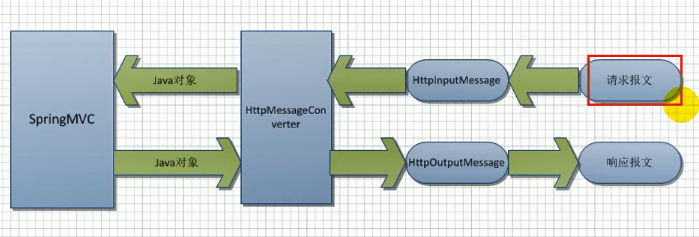

如何让 SpringMVC 快速完成 AJAX 功能

1. 返回数据还是 json 就 OK
2. 页面，$.ajax() 

原生的 JavaWeb 完成 AJAX 功能

1. 导入 `GSON` 包
2. 返回的数据用 `GSON` 转成 json
3. 给前端页面数据

# SpringMVC-AJAX

## 导包

jackson-annotations-2.10.1.jar
jackson-core-2.10.1.jar
jackson-databind-2.10.1.jar


## 写配置


## 测试


Employee.java

```java
// 将对象转成 json 数据的时候，自动将日期格式化成 pattern 的样子
@JsonFormat(pattern = "yyyy-MM-dd")
private Data birth;
```


controller

```java
/*
	 * 将返回的数据放在反应体中，
	 * 如果是对象，jackson包自动将对象转为json
	 * */
@ResponseBody()
@RequestMapping(value = "/getallajax")
public Collection<Employee> ajaxGetAll() {
    Collection<Employee> all = employeeDao.getAll();

    return all;
}


```


---

# AJAX获取所有员工

index.jsp

```xml
<%=new Date() %>
    <a href="">ajax获取所有员工</a>
    <hr>
        <div>
            <script type="text/javascript">
                $("a:first").click(function(){
                //发送ajax请求获取所有员工
                $.ajax({
                url:"${ctp}/getallajax",
                type:"GET",
                success:function(data){
                $.each(data,function(){
                var empInfo = this.lastName+"-->"
                +this.email+"-->"
                ;
                $("div").append(empInfo+".<br>");
                });
                }

                });
                return false;
                });
                </script>
```

Controller

```java
@ResponseBody()
@RequestMapping(value = "/getallajax")
public Collection<Employee> ajaxGetAll() {
    Collection<Employee> all = employeeDao.getAll();

    return all;
}
```


---


# @RequestBody


@ResponseBody将返回的数据放在响应体中


controller

```java
/*
	 * @ResponseBody():请求体：获取一个请求的请求体
	 * */
@RequestMapping(value = "/testRequestBody")
public String testRequestBody(@RequestBody String body) {
    System.out.println("请求体："+body);
    return "success";
}
```

html

```html
<a href="${ctp }/testRequestBody">ajax发送json数据</a>
<script type="text/javascript">
    $("a:first").click(function(){
        //点击发送ajax请求，请求带的数据是json
        var emp=
            {
                lastName : "张三",
                email : "aaa@qq.com",
                gender : 0
            };
        var empStr=JSON.stringify(emp);
        $.ajax({
            url : "${ctp }/testRequestBody",
            type : "post",
            data : empStr,
            success : function(data) {
                alert(data);
            }
        });
        return false;
    });
</script>
```


@RequestBody ：接受 json 数据 ，封装为对象


# HttpEntity\<String>

作用：

1. 如果参数位置写HttpEntity\<String>；
2. 比@RequestBody更强，可以拿到请求头 和 请求体；


Controller

```java
@RequestMapping(value = "/test02")
	public String test02(HttpEntity<String> str) {
		System.out.println("请求体："+str);
		return "success";
	}
```


# ResponseEntity\<String>

作用：

返回响应体、返回响应头都行

比如说设置 cookie 

`ResponseEntity<T>(T body,MultiValueMap<String,String> header,HttpStatus)`

```java
// ResponseEntity<String>:响应体中内容的类型；

// @ResponseBody
@RequestMapping(value = "/haha")
public ResponseEntity<String> haha() {
    System.out.println("haha....");
    // 响应体
    String body = "<h1>success</h1><hr>";
    // 响应头
    MultiValueMap<String, String> headers = new HttpHeaders();
    headers.add("Set-Cookie", "username=hahaha");
    return new ResponseEntity<String>(body, headers, HttpStatus.OK);
}
```


# 文件下载

这可能是唯一一个 `@ResponseEntity` 使用到的地方


```java
@RequestMapping(value = "/download")
public ResponseEntity<byte[]> download(HttpServletRequest req) throws IOException {
    // 1.得到要下载的文件的流；
    // 找到要下载的文件的真实路径
    ServletContext context = req.getServletContext();
    String location = context.getRealPath("/js/jquery-3.3.1.min.js");
    FileInputStream is = new FileInputStream(location);

    byte[] tmp = new byte[is.available()];
    is.read(tmp);
    is.close();
    // 2.将要下载的文件流返回
    HttpHeaders headers = new HttpHeaders();
    headers.set("Content-Disposition", "attachment;filename=" + "jquery-3.3.1.min.js");

    return new ResponseEntity<byte[]>(tmp, headers, HttpStatus.OK);
}
```


# HttpMessageConverter\<T>

文件下载处理流程，请求数据转换流程




---


# 文件上传

流程

```java
<!-- 文件上传
    1）、文件上传表单准备；enctype="multipart/form-data"
    2）、导包
    commons-fileupload-1.4.jar
    commons-io-2.6.jar
    3）、javaWeb中:
        创建工厂类：DiskFileItemFactory factory=new DiskFileItemFactory();
        创建解析器：ServletFileUpload upload=new ServletFileUpload(factory);
        使用解析器解析request对象：List<FileItem> list=upload.parseRequest(request);
    3）、SpringMVC中：
        只需要在SpringMVC配置文件中，写一个配置，配置文件上传解析器		
    4）、文件上传请求处理
    -->
javaWeb 中 的大致流程
// ********************************************
DiskFileItemFactory disk = new DiskFileItemFactory();
ServletUpload upload = new ServletUpload(disk);
request.setCharacterEncoding("utf-8");
// 设置临时文件区、设置缓冲区、缓冲区大小、文件总大小、单个文件大小
repo = new File("xxx");
disk.setSizeThreshold(1024*1024*3);
disk.setRepository(repo);
upload.setFileSizeMax(xxx);
upload.setSizeMax(xxx);
try{
    List<FileItem> files = upload.parseRequest(request);
    for(FileItem file:files) {
        if(是不是文件&&文件名是否为空) {
            // 获取上传到路径
            String path = request.getServletContext().getRealPath("/upload");
            file.write(new File(path,fileName));
        }
    }
```


## 导包

## 写配置


```xml
<!-- 配置文件上传解析器
  id 必须是multipartResolver 
  为什么？
  因为springmvc 九大组件初始化的时候，会根据bean的id找到 MultipartResolver;
  初始化过程可以去 DispatcherServlet 里面看，在 initMultipartResolver 中 
  是通过 xxx.getBean(resolverName,MultipartResolver.class) 获取的
  -->
<bean id="multipartResolver" class="org.springframework.web.multipart.commons.CommonsMultipartResolver">
    <property name="maxUploadSize" value="#{1024*1024*24}"></property>
    <property name="defaultEncoding" value="utf-8"></property>
</bean>
```

### 总结：

如果以后不知道某个bean应不应该配置 id ，id 应该配置什么；可以看一下这个 bean 的初始化或者加载流程；

如果是这种 `getBean(beanName,bean.class)` 方式获取 bean 的话，就需要将它的 beanName 写正确来；

如果是 `getBean(bean.class)` 这种（或许）不用


## 测试

只需要在处理器方法上写一个

`@RequestParam("inputName")MultipartFile file` 封装当前文件的信息 ，可以直接保存

### 单文件上传

index.jsp

```jsp
<%
pageContext.setAttribute("ctp", request.getContextPath());
%>
${msg }
<form action="${ctp }/upload01" enctype="multipart/form-data" method="post">
    <hr>
    Icon:<input type="file" name="headerimg"><hr>

    username:<input type="text" name="username"><hr>
    <input type="submit" value="submit"/><hr>
</form>
```


controller

```java
@RequestMapping(value = "/upload")
public String upload(
    @RequestParam(value = "username",required = false) String username,
    @RequestParam("headerimg") MultipartFile file, 
    Model model) 
{
    System.out.println("上传的文件信息");
    System.out.println("文件的名字：" + file.getName());
    System.out.println("文件的名字：" + file.getOriginalFilename());

    // 文件保存
    try {
        file.transferTo(new File("E:\\haha\\" + file.getOriginalFilename()));
        model.addAttribute("msg", "文件上传成功了！");
    } catch (IllegalStateException | IOException e) {
        // TODO Auto-generated catch block
        model.addAttribute("msg", "文件上传失败了！" + e.getMessage());
        e.printStackTrace();
    }

    return "forward:/index.jsp";
}
```

#### 注意：

`file.getName()` 获取到的是 前端的文件上传标签的 `name`  `<input type="file" name="xxx"/>'` 

`file.getOriginalFilename` 获取到的才是  真正文件的名字


### 多文件上传

index.jsp

```jsp
<%
pageContext.setAttribute("ctp", request.getContextPath());
%>
${msg }
<form action="${ctp }/upload01" enctype="multipart/form-data" method="post">
    <hr>
    Icon:<input type="file" name="headerimg"><hr>
    Icon:<input type="file" name="headerimg"><hr>
    Icon:<input type="file" name="headerimg"><hr>
    Icon:<input type="file" name="headerimg"><hr>
    username:<input type="text" name="username"><hr>
    <input type="submit" value="submit"/><hr>
</form>
```

controller

```java
@RequestMapping(value = "/upload01")
public String mulUpload(
    @RequestParam(value = "username", required = false) String username,
    @RequestParam("headerimg") MultipartFile[] file, 
    Model model) 
{
    System.out.println("上传的文件信息");
    for (MultipartFile multipartFile : file) {
        if (!multipartFile.isEmpty()) {
            // 文件保存
            try {
                multipartFile.transferTo(new File("E:\\haha\\" + multipartFile.getOriginalFilename()));
                model.addAttribute("msg", "文件上传成功了！");
            } catch (Exception e) {
                model.addAttribute("msg", "文件上传失败了！" + e.getMessage());
                e.printStackTrace();
            }
        }
    }
    return "forward:/index.jsp";
}
```


