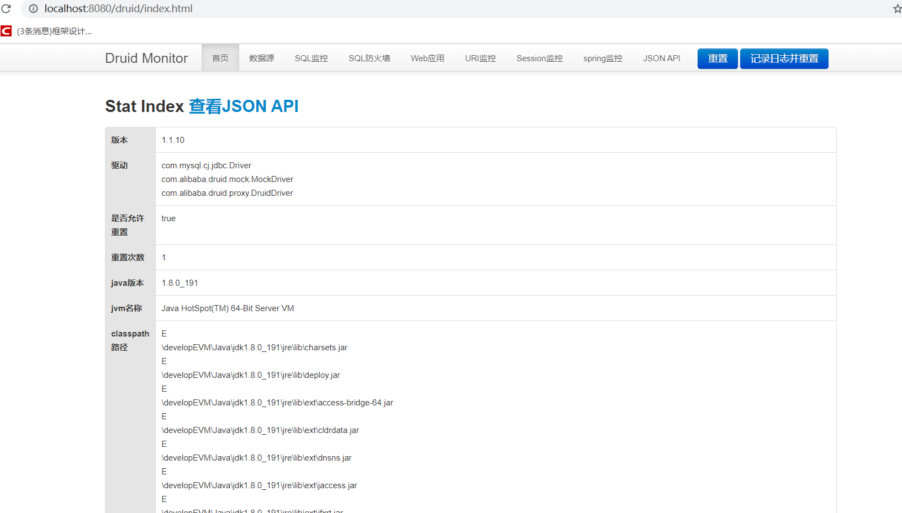
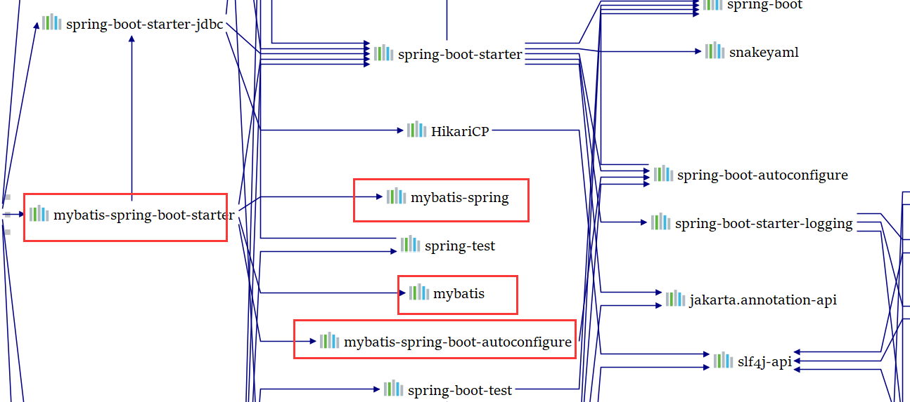

# 1、JDBC

## 1）导包

```xml
<dependency>
    <groupId>org.springframework.boot</groupId>
    <artifactId>spring-boot-starter-jdbc</artifactId>
</dependency>

<dependency>
    <groupId>mysql</groupId>
    <artifactId>mysql-connector-java</artifactId>
    <scope>runtime</scope>
</dependency>
```


配置

```yml
spring:
  datasource:
    username: root
    password: 123456
    url: jdbc:mysql://cs:3309/jdbc?serverTimezone=UTC
    driver-class-name: com.mysql.cj.jdbc.Driver
```

效果：

1. 默认使用 `com.zaxxer.hikari.HikariDataSource` 数据源
2. 各种配置都在 `DatasourceProperties` 文件中

原理

1. `org.springframework.boot.autoconfigure.jdbc`  默认数据源参考这个类 `DataSourceConfiguration` 

2.  2.x.x以后 默认使用 Hikari 数据源；还有下面的这几个

```java
org.apache.tomcat.jdbc.pool.DataSource
    com.zaxxer.hikari.HikariDataSource
org.apache.commons.dbcp2.BasicDataSource
```

3. 自定义数据源类型

```java
/**
	 * Generic DataSource configuration.
	 */
@Configuration(proxyBeanMethods = false)
@ConditionalOnMissingBean(DataSource.class)
@ConditionalOnProperty(name = "spring.datasource.type")
static class Generic {

    @Bean
    DataSource dataSource(DataSourceProperties properties) 
        // 使用 build 创建数据源，利用反射，创建响应type(数据源类型) 的数据源，并且绑定相关属性
        return properties.initializeDataSourceBuilder().build();
    }

}
```

4. `DataSourceInitializerInvoker` `ApplicationListener` 

   1. 作用：

      1. ```java
         this.dataSourceInitializer.initSchema();
         # initSchema()↓
             runScripts(scripts, username, password);
         ```

      2. 初始化数据库，然后调用这个 `runScripts()` ；运行建表语句

默认只需要将文件命名为 ：`schema-*.sql`  `data-*.sql` 

5. 操作数据库：
   1. 

# 2、配置Druid数据源

两种方式，一种是导入druid包，这种方式需要自己写 `druid.properties` 配置

第二种方式是：导入 `druid-spring-boot-starter` 包，这种方式可以直接在`application.yml` 文件中配置数据源；使用第二种

## 1）导包

```xml
<dependency>
    <groupId>com.alibaba</groupId>
    <artifactId>druid-spring-boot-starter</artifactId>
    <version>1.1.10</version>
</dependency>
```

## 2）写配置

```yml
spring:
  datasource:
    username: root
    password: 123456
    url: jdbc:mysql://cs:3309/jdbc?serverTimezone=UTC
    driver-class-name: com.mysql.cj.jdbc.Driver
    platform: mysql
    type: com.alibaba.druid.pool.DruidDataSource
    initialization-mode: always
    druid:
      initial-size: 5
      min-idle: 5
      max-active: 100
      max-wait: 6000000
      time-between-eviction-runs-millis: 60000
      min-evictable-idle-time-millis: 300000
      validation-query: select 'x'
      test-while-idle: true
      test-on-borrow: false
      test-on-return: false
      filters: config,wall,stat
      pool-prepared-statements: true
      max-pool-prepared-statement-per-connection-size: 20
      stat-view-servlet:
        login-username: root
        login-password: 123456

```

## 3）进入监控页面

```shell
localhost:8080/druid/index.html
```




# 3、整合 Mybatis

## 1）导包

```xml
<dependency>
    <groupId>org.mybatis.spring.boot</groupId>
    <artifactId>mybatis-spring-boot-starter</artifactId>
    <version>2.1.3</version>
</dependency>
```




## 2）准备

数据库 数据表 javabean

## 3）使用

### 3.1）注解版

```java
// 告诉mybatis这个一个操作数据库的mapper
public interface DepartmentMapper {

    @Select("select * from department where id = #{id}")
    public Department getDepById(Integer id);

    @Delete(("dlete from department where id = #{id}"))
    public int delDeptById(Integer id);

    @Options(useGeneratedKeys = true, keyProperty = "id")
    @Insert("insert into department(department_name) values(#{departmentName})")
    public int insertDept(Department department);

    @Update("update department set departmentName=#{departmentName} where id = #{id}")
    public int updateDempt(Department department);
}

```

自定义Mybatis配置规则：给容器中添加一个 `ConfigurationCustomizer` 

```java
public class MyBatisConfig {

    public ConfigurationCustomizer configurationCustomizer() {
        return new ConfigurationCustomizer(){
            @Override
            public void customize(Configuration configuration) {
                configuration.setMapUnderscoreToCamelCase(true);
            }
        };
    }
}

```

在主启动类上标注

```java
# 批量扫描 mapper 
@MapperScan(value = "com.sbproject.mapper")
```

### 3.2）配置版

只记了关键配置，`dao 、xxMapper.xml  mybatis-config.xml` 就不记了


在 `application.yml` 写参数，扫描 `mybatis` 的全局配置文件和映射文件

```yml
mybatis:
  config-location: classpath:mybatis/mybatis-config.xml
  mapper-locations: classpath:mybatis/mapper/*.xml

```

开启驼峰命名

```xml
<settings>
    <setting name="mapUnderscoreToCamelCase" value="true"/>
</settings>
```

在组配置类扫描dao

```java
@MapperScan("com.sbproject.mapper")
```


---


# 4、SpringData

简化数据访问

统一的Repository接口

提供数据访问模板类 xxxTemplate

1. MongoTemplate、RedisTemplate

## 1）整合 JPA

JAP ：ORM(Object Relational Mapping)

1. 编写javabean和数据表进行映射，并且配置好映射关系

### 1.1）编写实体类

```java
//使用JPA注解配置映射关系
// 告诉JPA这个一个实体类（与数据表映射的类）
@Entity
// @Table 指定哪个数据表对应 ；如果省略，默认表名就是类名小写
@Table(name = "tbl_user")
public class User {
    @Id // 这个一个组件
    @GeneratedValue(strategy = GenerationType.IDENTITY)
    private Integer id;
    // 这是和数据表对应的一个列
    @Column(name = "last_name", length = 50)
    private String lastName;
    // 省略列名就是用属性名
    @Column
    private String email;
}
```

### 1.2）编写Dao （Repository）

用来操作实体类对应的数据表

```java
// 继承 JpaRepository来完成数据库操作
public interface UserRepository extends JpaRepository<User, Integer> {

}

```

### 1.3）基本的配置

JpaProperties 里面有绑定属性

```yml
# 都是spring里面的配置
spring:
  datasource:
    url: jdbc:mysql://cs:3309/mybatis?serverTimezone=UTC
    username: root
    password: 123456
    driver-class-name: com.mysql.cj.jdbc.Driver
  jpa:
    hibernate:
      # 意思是更新或者创建数据表结构
      ddl-auto: update
    show-sql: true
```

### 1.4）启动主程序

jpa会帮助我们创建数据表，而且每次javabean改变的时候，数据库对应的数据表结构也会改变

### 1.5）使用

```java
@GetMapping("/user/{id}")
public User getUser(@PathVariable("id") Integer id) {
    Optional<User> u = userRepository.findById(id);
    System.out.println("-----------------------------------------------------");
    System.out.println(u);
    System.out.println("-----------------------------------------------------");
    User user = new User();
    // 如果没获取到东西，会报错
    return u.get();
}

@GetMapping("/user")
public User InsertUser(User user) {
    User save = userRepository.save(user);
    return save;
}
```


