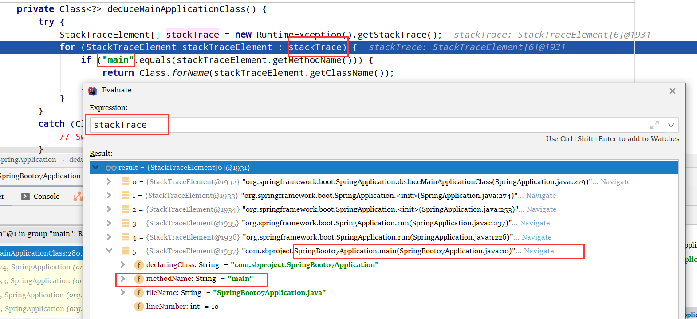

# 1、SB启动流程

## 1）创建 `SpringApplication` 对象


SB运行的时候，会先new一个这个类的，进行各种初始化

```java
public SpringApplication(ResourceLoader resourceLoader, Class<?>... primarySources) {
    this.resourceLoader = resourceLoader;
    Assert.notNull(primarySources, "PrimarySources must not be null");
    this.primarySources = new LinkedHashSet<>(Arrays.asList(primarySources));
    // 获取当前的web环境，serlvet reactive
    this.webApplicationType = WebApplicationType.deduceFromClasspath();
    // 从类路径下找到META-INF/spring.factories配置的所有 ApplicationContextInitializer，然后保存起来
    // 这些 ApplicationContextInitializer 可以提供给用户继承，然后重写
    setInitializers((Collection) getSpringFactoriesInstances(ApplicationContextInitializer.class));
    // 从类路径下找到 ApplicationListener 
    setListeners((Collection) getSpringFactoriesInstances(ApplicationListener.class));
    // 获取在main方法中被调用的的 springApplication
    this.mainApplicationClass = deduceMainApplicationClass();
}
```


```java
private Class<?> deduceMainApplicationClass() {
    // 是靠这个注解来识别的 @SpringBootApplication 如果标有这个注解，并且有 main 方法，就反射他
    try {
        StackTraceElement[] stackTrace = new RuntimeException().getStackTrace();
        for (StackTraceElement stackTraceElement : stackTrace) {
            if ("main".equals(stackTraceElement.getMethodName())) {
                return Class.forName(stackTraceElement.getClassName());
            }
        }
    }
    catch (ClassNotFoundException ex) {
        // Swallow and continue
    }
    return null;
}
```

跟踪 `stackTrace` 



可以看出来，他是想获取我们的主方法，然后通过反射获取我们的主程序类

## 2）运行程序


```java
public ConfigurableApplicationContext run(String... args) {
    // 相当于一个计时器
    StopWatch stopWatch = new StopWatch();
    stopWatch.start();
    // 初始化环境
    ConfigurableApplicationContext context = null;
    // 初始化异常报告器
    Collection<SpringBootExceptionReporter> exceptionReporters = new ArrayList<>();
    // 配置一些不重要的配置
    configureHeadlessProperty();
    // 获取运行监听器 SpringApplicationRunListeners ; 从类路径下META-INF/spring.factories
    SpringApplicationRunListeners listeners = getRunListeners(args);
    // 回调所有的获取 SpringApplicationRunListener.starting() 方法
    listeners.starting();
    try {
        // 运行携带过来的虚拟机参数，封装命令行参数
        ApplicationArguments applicationArguments = new DefaultApplicationArguments(args);
        // 准备环境
        ConfigurableEnvironment environment = prepareEnvironment(listeners, applicationArguments);
        configureIgnoreBeanInfo(environment);
        
        //创建环境完成后回调SPringApplicationRunListener.environmentPrepared(); 表示环境准备完成
        
        Banner printedBanner = printBanner(environment);
        
        
        // 配置一些环境，自动配置tomcat就是在这
        // 创建ApplicationContext，决定是创建web的ioc还是普通的ioc
        context = createApplicationContext();
        exceptionReporters = getSpringFactoriesInstances(SpringBootExceptionReporter.class,
                                                         new Class[] { ConfigurableApplicationContext.class }, context);
        
        //准备上下文环境
        //将envirenment保存到ioc中；并且applyInitializers();
        //applyInitializers() ：回调之前保存的所有ApplicationContextInitializer的initialize方法
        // 回调所有SpringApplicationRunListener的contextPrepared();
        prepareContext(context, environment, listeners, applicationArguments, printedBanner);
        
        // 刷新容器；IOC容器初始化（如果是web应用还会创建嵌入式的tomcat）；--》Spring注解版
        // 扫描--》创建--》加载所有组件；（配置类，组件，自动配置都加载）
        refreshContext(context);
        
        //从ioc容器中获取所有的ApplicationRunner和CommandLineRunner进行回调
        //ApplicationRunner先回调，CommandLineRunner在回调
        afterRefresh(context, applicationArguments);
        
        
        // 计时器停止，说明SpringBoot启动成功
        stopWatch.stop();
        if (this.logStartupInfo) {
            new StartupInfoLogger(this.mainApplicationClass).logStarted(getApplicationLog(), stopWatch);
        }
        listeners.started(context);
        callRunners(context, applicationArguments);
    }
    catch (Throwable ex) {
        handleRunFailure(context, ex, exceptionReporters, listeners);
        throw new IllegalStateException(ex);
    }

    try {
        listeners.running(context);
    }
    catch (Throwable ex) {
        handleRunFailure(context, ex, exceptionReporters, null);
        throw new IllegalStateException(ex);
    }
    return context;
}
```

## 3）配置监听机制

配置在 `META-INF/spring.factories` 

1.  `ApplicationContextInitializer ` 
2. `SpringApplicationRunListener` 

只需要在容器中加入

`ApplicationRuner` `CommandLineRunner` 

