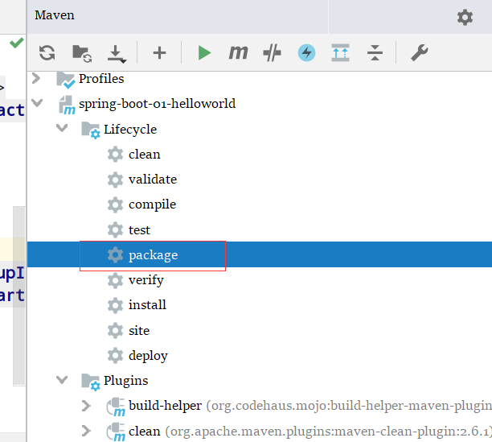

#写一个HelloWorld

##  1、创建一个Maven 工程

普通的工程就行了


## 2、导入 SB 相关的依赖


```xml
<parent>
    <groupId>org.springframework.boot</groupId>
    <artifactId>spring-boot-starter-parent</artifactId>
    <version>1.5.9.RELEASE</version>
</parent>
<dependencies>
    <dependency>
        <groupId>org.springframework.boot</groupId>
        <artifactId>spring-boot-starter-web</artifactId>
    </dependency>
</dependencies>
```


## 3、写一个主程序

```java
/**
 * SpringBootApplication 来标注主程序 ，说明这是一个 Spring Boot 应用
 */
@SpringBootApplication
public class HelloWorldMainApplication {
    public static void main(String[] args) {
        //Spring 应用启动起来
        SpringApplication.run(HelloWorldMainApplication.class, args);
    }
}
```


## 4、写一个controller

```java
@Controller
public class HelloController {

    @ResponseBody
    @RequestMapping("/hello")
    public String hello() {

        return "Hello World";
    }
}
```


## 5、运行

运行主方法，服务启动成功


## 6、简化部署

看官方文档提供的方案，在 `pom.xml` 导入插件

```xml
<!--这个插件，可以将应用打包成一个可执行的jar包-->
<build>
    <plugins>
        <plugin>
            <groupId>org.springframework.boot</groupId>
            <artifactId>spring-boot-maven-plugin</artifactId>
        </plugin>
    </plugins>
</build>
```


然后



将jar包放到服务器，通过

```shell
java -jar xxx.jar
```

运行项目

---


# 入门细节

## 1.pom文件

### 父项目


```xml
<parent>
    <groupId>org.springframework.boot</groupId>
    <artifactId>spring-boot-starter-parent</artifactId>
    <version>1.5.9.RELEASE</version>
</parent>

<!-- spring-boot-starter-parent 的父项目 -->
<parent>
    <groupId>org.springframework.boot</groupId>
    <artifactId>spring-boot-dependencies</artifactId>
    <version>1.5.9.RELEASE</version>
    <relativePath>../../spring-boot-dependencies</relativePath>
</parent>
这个父项目是真正管理 SPringBoot 应用里面的所有依赖版本；
```

SpringBoot 的版本仲裁中心；

以后我们导入依赖 默认 是不需要写版本的；（没有在 dependencies 里面管理的依赖自然需要声明版本号）


## 2. 导入的依赖


```xml
<dependency>
    <groupId>org.springframework.boot</groupId>
    <artifactId>spring-boot-starter-web</artifactId>
</dependency>
```

**spring-boot-starter** ==-web== ；

​	spring-boot-starter ：SpringBoot的场景启动器；帮我们导入了 WEB 模块正常运行所需要依赖的组件；


Spring Boot将所有的功能场景都抽取出来,做成一个个的starters (启动器) , 只需要在项目里面引入这些
starter相关场景的所有依赖都会导入进来。要用什么功能就导入什么场景的 **启动器** 


# 快速创建项目

默认生成的SpringBoot项目；

1. 主程序已经生成好了，我们只需要写业务逻辑就好了 
2. resources 文件夹中的目录结构
   1. static
      1. 保存所有的静态资源；js、css、images；
      2. 就像 WebContent 
   2. template
      1. 保存所有的模版页面；（SpringBoot默认jar包的方式，使用嵌入式的Tomcat，所以不支持jsp页面）；
      2. 但是可以使用模版引擎(freemarker、thymeleaf)；
   3. application.properties
      1. SpringBoot 的配置文件
      2. 大部分的默认配置都可以在这里改


