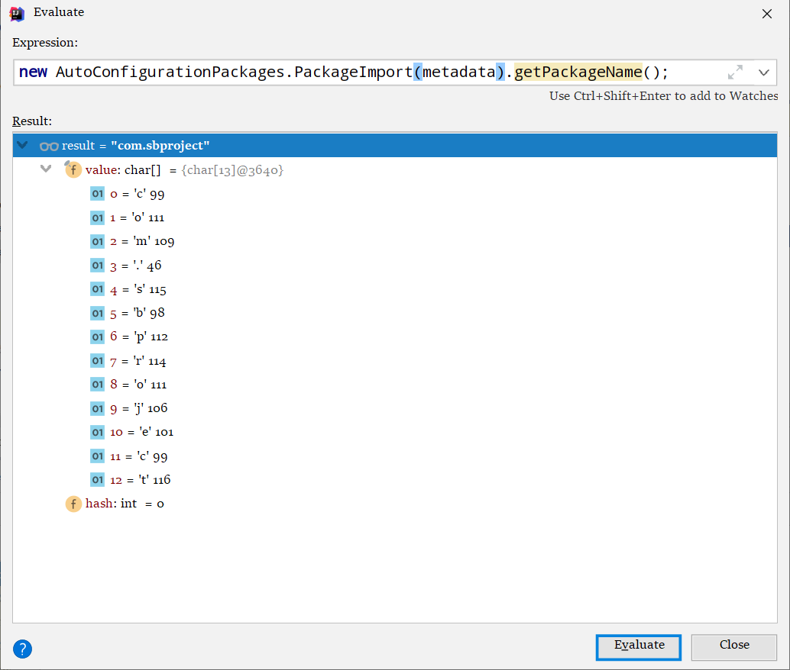
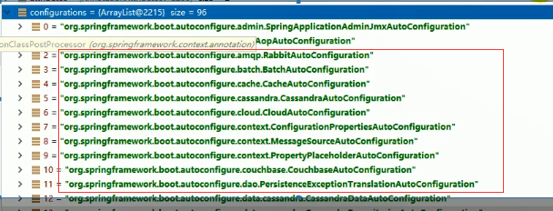
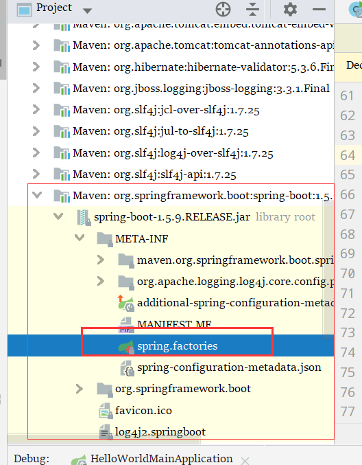
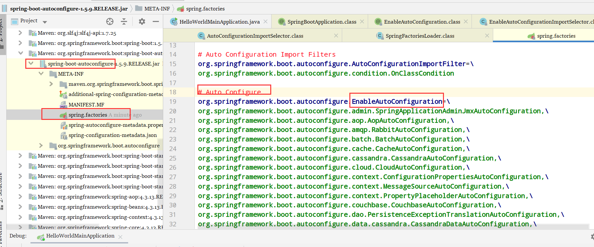

这个教程太残忍，入门先来个源码分析，看看自动配置的原理和流程；QAQ

# 主程序类

主入口类

```java
/**
 * SpringBootApplication 来标注主程序 ，说明这是一个 Spring Boot 应用
 */
@SpringBootApplication
public class HelloWorldMainApplication {
    public static void main(String[] args) {
        //Spring 应用启动起来
        SpringApplication.run(HelloWorldMainApplication.class, args);
    }
}

```

## @SpringBootApplication ：

Spring Boot 应用标注在某个类上，说明这个是SpringBoot的主配置类，SpringBoot 就应该运行这个类的 main 方法来启动 SpringBoot 

点开 ↓

```java
@Target({ElementType.TYPE})
@Retention(RetentionPolicy.RUNTIME)
@Documented
@Inherited
@SpringBootConfiguration
@EnableAutoConfiguration
@ComponentScan(
    excludeFilters = {
        @Filter(type = FilterType.CUSTOM,classes = {TypeExcludeFilter.class}), 
        @Filter(type = FilterType.CUSTOM,classes = {AutoConfigurationExcludeFilter.class} )})
public @interface SpringBootApplication {
```

### @SpringBootConfiguration

SpringBoot 的配置类；

1. 在某个类上，表示这是 SpringBoot的配置类
2. 里面有注解：

#### @Configuration 

配置类上应该标注的注解

1. 配置类就是一个个配置文件
2. 配置类也是容器中的一个组件，点开这个注解会发现他被标注了一个 `@Component` 

### `@EnableAutoConfiguratio` 

这是个 **开启自动配置** 功能的注解

1. 以前需要配置的 `xxx.xml` 文件，现在都不需要配置了

```java
@AutoConfigurationPackage
@Import({EnableAutoConfigurationImportSelector.class})
public @interface EnableAutoConfiguration {
```

#### `@AutoConfigrationPackage`

自动配置包

1. 点开来会发现他是依靠 `@Import({Registrar.class})` 来完成这个功能的，
2. 这个 `@Import` 是 Spring 的底层注解
3. 作用就是 ：给容器中导入一个组件

##### Registrar.class

`Registrar.class` 这个类的作用就是：

1. ==将主配置类(也就是 `@SpringBootApplication` 标注的类)所在的包以及下面所有 子包 里面的所有组件扫描到 SPring 容器中；== 


```java
static class Registrar implements ImportBeanDefinitionRegistrar, DeterminableImports {
    Registrar() {
    }
	// 手动标签，这个方法就是扫描所有包的方法，选中new ... getPackageName() --》右键--》Evaluate expression --》执行得到下图
    // 获取到了标注了 @SpringBootApplication 的类的信息
    public void registerBeanDefinitions(AnnotationMetadata metadata, BeanDefinitionRegistry registry) {
        AutoConfigurationPackages.register(registry, (new AutoConfigurationPackages.PackageImport(metadata)).getPackageName());
    }

    public Set<Object> determineImports(AnnotationMetadata metadata) {
        return Collections.singleton(new AutoConfigurationPackages.PackageImport(metadata));
    }
}
```





所以，如果将主方法的位置改变，比如说原来是在 `com.z` 下面，然后你把它放到 `com.z.start` 下

那么这个时候Spring就不能扫描到其他包，只会将 `com.z.start` 的所有子目录扫描

所以主方法一定要放在 `com.z` 目录下


#### @Import({EnableAutoConfigurationImportSelector.class})

```java
@Deprecated
public class EnableAutoConfigurationImportSelector extends AutoConfigurationImportSelector {
    public EnableAutoConfigurationImportSelector() {
    }

    protected boolean isEnabled(AnnotationMetadata metadata) {
        return this.getClass().equals(EnableAutoConfigurationImportSelector.class) ? (Boolean)this.getEnvironment().getProperty("spring.boot.enableautoconfiguration", Boolean.class, true) : true;
    }
}

```

他的父类的方法

```java
public String[] selectImports(AnnotationMetadata annotationMetadata) {
    if (!this.isEnabled(annotationMetadata)) {
        return NO_IMPORTS;
    } else {
        try {
            AutoConfigurationMetadata autoConfigurationMetadata = AutoConfigurationMetadataLoader.loadMetadata(this.beanClassLoader);
            AnnotationAttributes attributes = this.getAttributes(annotationMetadata);
            // 手动标签
            // configurations 里面的东西如下图
            // 接下来看看 getCandidateConfigurations() 方法怎么运行的
            List<String> configurations = this.getCandidateConfigurations(annotationMetadata, attributes);
            configurations = this.removeDuplicates(configurations);
            configurations = this.sort(configurations, autoConfigurationMetadata);
            Set<String> exclusions = this.getExclusions(annotationMetadata, attributes);
            this.checkExcludedClasses(configurations, exclusions);
            configurations.removeAll(exclusions);
            configurations = this.filter(configurations, autoConfigurationMetadata);
            this.fireAutoConfigurationImportEvents(configurations, exclusions);
            return (String[])configurations.toArray(new String[configurations.size()]);
        } catch (IOException var6) {
            throw new IllegalStateException(var6);
        }
    }
}
```


只有一个方法，但是他的父类，会判断将什么东西 import 进来

1. EnableAutoConfigurationImportSelector ：导入哪些组件的闲着器
2. 将所需要导入的组件以全类名的方式返回；
3. 最终的效果：会给容器中导入非常多的自动配置类（xxxAutoConfiguration）；就是给容器中导入这些 场景 需要的所有组件，并配置好这些组件
   1. 比如说 ：RedisAutoConfiguration  mybatisAutoConfiguration 等等




有了这些自动配置类，就免去了我们手动写 `xx.xml` 的工作

##### getCandidateConfigurations() 

```java
protected List<String> getCandidateConfigurations(AnnotationMetadata metadata, AnnotationAttributes attributes) {
    // 主要的方法在这里 loadFactoryNames
    List<String> configurations = SpringFactoriesLoader.loadFactoryNames(this.getSpringFactoriesLoaderFactoryClass(), this.getBeanClassLoader());
    Assert.notEmpty(configurations, "No auto configuration classes found in META-INF/spring.factories. If you are using a custom packaging, make sure that file is correct.");
    return configurations;
}
```

###### loadFactoryNames

Spring Boot 在启动的时候从类路径下的 `getResources("META-INF/spring.factories")` 获取到了 `EnableAutoConfiguration` 指定的值

将这些值作为自动配置类导入容器中，然后自动配置类就生效了

接下来就会进行自动配置工作

```java
public static List<String> loadFactoryNames(Class<?> factoryClass, ClassLoader classLoader) {
    String factoryClassName = factoryClass.getName();

    try {
        // 主要就是从这里获取 配置信息getResources("META-INF/spring.factories")
        Enumeration<URL> urls = classLoader != null ? classLoader.getResources("META-INF/spring.factories") : ClassLoader.getSystemResources("META-INF/spring.factories");
        ArrayList result = new ArrayList();

        while(urls.hasMoreElements()) {
            URL url = (URL)urls.nextElement();
            Properties properties = PropertiesLoaderUtils.loadProperties(new UrlResource(url));
            String factoryClassNames = properties.getProperty(factoryClassName);
            result.addAll(Arrays.asList(StringUtils.commaDelimitedListToStringArray(factoryClassNames)));
        }

        return result;
    } catch (IOException var8) {
        throw new IllegalArgumentException("Unable to load [" + factoryClass.getName() + "] factories from location [" + "META-INF/spring.factories" + "]", var8);
    }
}

```

 比如说 SpringBoot 就是在这里找的配置



进入 Spring boot autoconfiguration 包下 找到这样的信息，这些信息会被自动加载机制保存到上面的 `configurations` 数组里面 、




## WebMvcAutoConfiguration

先看一下里面的一个自动配置类，拿 WebMvcAutoConfiguration 举例

燕格版本的

```java
//
// Source code recreated from a .class file by IntelliJ IDEA
// (powered by Fernflower decompiler)
//

package org.springframework.boot.autoconfigure.web;
@Configuration
@ConditionalOnWebApplication
@ConditionalOnClass({Servlet.class, DispatcherServlet.class, WebMvcConfigurerAdapter.class})
@ConditionalOnMissingBean({WebMvcConfigurationSupport.class})
@AutoConfigureOrder(-2147483638)
@AutoConfigureAfter({DispatcherServletAutoConfiguration.class, ValidationAutoConfiguration.class})
public class WebMvcAutoConfiguration {
    public static final String DEFAULT_PREFIX = "";
    public static final String DEFAULT_SUFFIX = "";

    public WebMvcAutoConfiguration() {
    }

	// RESTFULL 风格的配置在这
    @Bean
    @ConditionalOnMissingBean({HiddenHttpMethodFilter.class})
    public OrderedHiddenHttpMethodFilter hiddenHttpMethodFilter() {
        return new OrderedHiddenHttpMethodFilter();
    }

		// 内部处理器
        public Object getHandlerInternal(HttpServletRequest request) throws Exception {
            Iterator var2 = this.getAcceptedMediaTypes(request).iterator();

            MediaType mediaType;
            do {
                if (!var2.hasNext()) {
                    return null;
                }

                mediaType = (MediaType)var2.next();
            } while(!mediaType.includes(MediaType.TEXT_HTML));

            return super.getHandlerInternal(request);
        }

        // RequestMappingHandlerAdapter 是不是很眼熟 这里配置了
        @Bean
        public RequestMappingHandlerAdapter requestMappingHandlerAdapter() {
            RequestMappingHandlerAdapter adapter = super.requestMappingHandlerAdapter();
            adapter.setIgnoreDefaultModelOnRedirect(this.mvcProperties == null ? true : this.mvcProperties.isIgnoreDefaultModelOnRedirect());
            return adapter;
        }

		// 什么数据校验器
        @Bean
        public Validator mvcValidator() {
            return !ClassUtils.isPresent("javax.validation.Validator", this.getClass().getClassLoader()) ? super.mvcValidator() : WebMvcValidator.get(this.getApplicationContext(), this.getValidator());
        }
		// 什么处理器映射
        protected RequestMappingHandlerMapping createRequestMappingHandlerMapping() {
            return this.mvcRegistrations != null && this.mvcRegistrations.getRequestMappingHandlerMapping() != null ? this.mvcRegistrations.getRequestMappingHandlerMapping() : super.createRequestMappingHandlerMapping();
        }

		// 什么转换器
        public void configureMessageConverters(List<HttpMessageConverter<?>> converters) {
            converters.addAll(this.messageConverters.getConverters());
        }

		// 什么视图解析器
        @Bean
        @ConditionalOnMissingBean
        public InternalResourceViewResolver defaultViewResolver() {
            InternalResourceViewResolver resolver = new InternalResourceViewResolver();
            // 获取前缀后缀
            resolver.setPrefix(this.mvcProperties.getView().getPrefix());
            resolver.setSuffix(this.mvcProperties.getView().getSuffix());
            return resolver;
        }

        @Bean
        @ConditionalOnProperty(
            // 一看这些就知道是定义了 properties 的格式
            prefix = "spring.mvc",
            name = {"date-format"}
        )
        // 什么数据给石化
        public Formatter<Date> dateFormatter() {
            return new DateFormatter(this.mvcProperties.getDateFormat());
        }   
}

```


所以 SpringBoot 的自动配置都在这里 `spring-boot-autoconfigure-1.5.9.RELEASE.jar ` 的这个包下`org.springframework.boot.autoconfigure`


