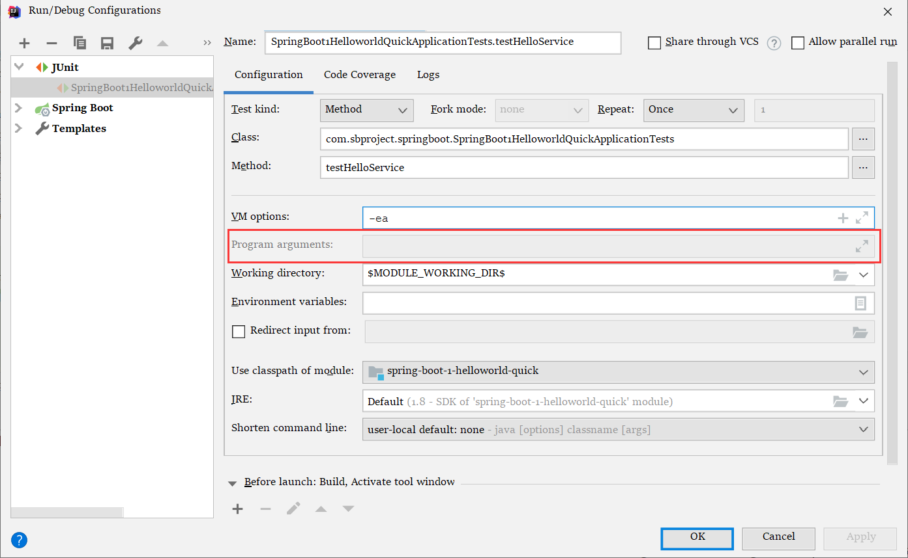
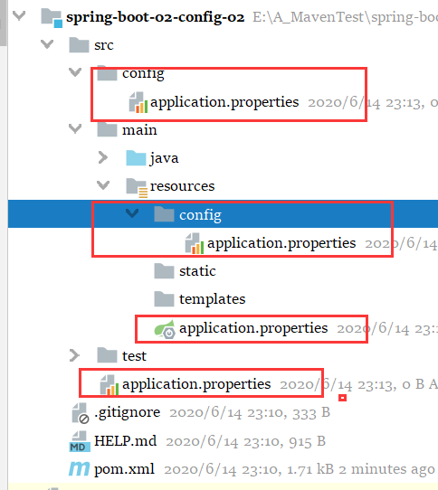

# 配置文件

SpringBoot默认使用两个全局配置文件

1. application.properties
2. application.yml
3. 名字是固定的

配置文件的作用，就是用来修改自动配置的默认值

## YML语言介绍

###  基本语法

K:空格v：表示一对键值对 

以空格的缩进控制层级关系；只要是左对齐的一列数据都是同一个层级；跟python一样 

属性和值大小写敏感； 

值的写法 

字面量；普通的值（数字，字符串，boolean） 

​	k:空格v：字面直接写； 

​		字符串默认不用加上引号； 

​		“”：双引号 

​			不会转义字符串里面的特殊字符； 

​			特殊字符会作为本身意义； 

​				name: "zhangshan \n lisi"-->输出：zhangshan 换行 lisi 

​		''：单引号 

​			会转义特殊字符，特殊字符最终只会作为普通的字符串输出 

​				name: "zhangshan '\n' lisi"-->输出：zhangshan \n lisi 

对象、Map(属性和值)(键值对)：  

​	k:空格v-->在下一行写对象和属性的关系，注意缩进 

​		对象还是k:v方式 

```yaml
friends:
    lastName: zhangshan
    age: 20
    
    对象的行内写法
friends: {lastName: zhangsan,age: 20}

/*Map也一样，同上*/
```

---

**数组（List、Set)：** 

​	**用-空格 值表示数组中的一个元素：**  

```yaml
pets:
    - cat
    - dog
    - pig
行内写法
pets: [cat,dog,pig]
```

----

### javaBean获取yml的值

​		**Javaben** 


ConfigurationProperties ：可以冲配置文件中获取对象的值

@Value ：也可以获取值 标注在属性上

1. 因为 xml 配置文件中是用 ${} 来获取 properties 文件的值，所以value也是用这种方法

```java
@Component
@ConfigurationProperties(prefix = "person")
public class Person {
	@Value("${lastName}")
    private String lastName;
    private String age;
    private Boolean boss;
    private Date birth;

    private Map<String,Object> maps;
    private List<Object> lists;
    private Dog dog;
```

---

​		**pom.xml**

```xml
<!--导入配置文件处理器，配置文件进行绑定就会有提示-->
<dependency>
    <groupId>org.springframework.boot</groupId>
    <artifactId>spring-boot-configuration-processor</artifactId>
    <optional>true</optional>
</dependency>
```

​	**application.yml**

```yacas
person:
  lastName: zhangsan
  age: 18
  boss: false
  birth: 2017/12/12
  maps: {k1: v1,k2: v2}
  lists:
    - lisi
    - zhaoliu
  dog:
    name: 小狗
    age: 2
```

### @Value 和 @ConfigurationProperties 的比较

|                | @ConfigurationProperties | @Value     |                  |
| -------------- | ------------------------ | ---------- | ---------------- |
| 功能上         | 批量注入配置文件的属性   | 一个个指定 |                  |
| 松散绑定       | 支持                     | 不支持     |                  |
| SpEL           | 不支持                   | 支持       | @Value("#{1*2}") |
| JSP303数据校验 | 支持                     | 不支持     |                  |
| 复杂类型封装   | 支持                     | 不支持     | 就像 person.map  |

#### 松散绑定：

属性命名匹配规则

1. person.firstName ：标准格式
2. person.first-name ：将大写的字母转成 -N 
3. person.first_name ：将大写字母转成 _N
4. PERSON_FITST_NAME:
   1. 系统属性推荐用这种写法

### 相同点

松散绑定的意思就是 上述任意一个规则都可以使用

配置文件 yml 还是 properties 都能获取值

如果要使用数据校验，必须使用 @ConfigurationProperties 注解

---

## @PropertySource

加载指定的配置文件

标注在需要读取配置文件的类上

```java
@PropertySource(value = {"classpath:person.property", "classpath:person.yml"})
public class Person {
}

```

## @ImportResource

导入 SPring 的配置文件，让配置文件里面的内容生效

 就算自己写了一个 Spring.xml ，SpringBoot 不会自动被扫描到，不会生效

想让Spring的配置文件生效，就需要这个注解

要在启动类加上

```java

@ImportResource(locations = {"classpath:beans.xml"})
@SpringBootApplication
public class SpringBoot1HelloworldQuickApplication {

    public static void main(String[] args) {
        SpringApplication.run(SpringBoot1HelloworldQuickApplication.class, args);
    }

```

咳咳，重点来了。看尚硅谷视频的SpringBoot的时候，他们用的版本需要加 @ImportResource ，现在我用的版本不需要这个注解，SpringBoot 也能自动加载 自己写的spring-config.xml 配置文件。

SpringBoot版本 ：2.3.1

---

SpringBoot 推荐给容器中添加组件的方式；

1. 配置类----》Spring 配置文件

后面的方式不用看了，直接写配置文件就好了

## 配置文件占位符

格式 ：${xxx}

这个占位符功能很强大 ，还可以调用方法

还可以调用之前定义好的属性

```properties
person.last-name=张三${random.uuid} ${random.int}
person.dog.name=${person.last-name}_2dog
person.dog.describe=${person.hello}-->如果没有定义person.hello 输出就会是 ${person.hello}
# 也可以设置默认值
person.dog.describe=${person.hello:defaultValue}
```


## Profile

用来做多环境支持的，可以方便的切换环境：什么开发环境、测试环境、生产环境等等

### 多Profile文件方式

我们在主配置文件编写的时候，文件名可以是 `application--{profile}.properties/yml` 

创建多个环境的配置文件 

1. `application-dev.properties` 
2. `application-prod.properties` 

在主配置文件配置 `application.properties`

```properties
spring.profiles.active=dev
```


### yml 代码块方式

跟上面的是一个意思

```yml
# 这个相当于主 application.properties 文件
spring:
  profiles:
    active: dev
---
# 这个相当于 application-dev.properties 文件
server:
  port: 8083
spring:
  profiles: dev
---
server:
  port: 8084
spring:
  profiles: prod # 指定使用哪个环境的
---
```


### 激活指定 profile 

在配置文件中指定 

```properties
spring.profiles.active=dev
```

命令行方式激活：

1. `--spring.profiles.active=dev` 



在这里写

也可以在 `VM options :` 里面写  

1. `-Dspring.profiles.active=prod`

也可以在

`java -jar xxx.jar --spring.profile.active=dev` 


---


## 配置文件的加载位置




SpringBoot 启动时，会扫描以下位置的 `application.properties` 或者 `application.yml` 文件作为 SpringBoot 的默认配置文件

1. `-file:./config` 
   1. src 下创建一个 config 文件夹，里面的配置文件，上图的第一个红框框
2. `-file:./` 
   1. src 下的配置文件，上图的第四个红框
3. `-classpath:/config/` 
   1. 类路径下的 config 文件夹下的配置文件 ，第二个红框
4. `-classpath:/` 
   1. 类路径下的配置文件，第三个红框

优先级由高到低，高优先级的配置会 ==覆盖== 低优先级的配置，而不是 ==叠加== 

1. 意思就是说 SpringBoot 会将这些 位置 都扫描一遍，从高到低

有一种 ==互补机制== 

高优先级和低优先级的都会被执行

## 外部配置的加载顺序

[千辛万苦找到的官方文档](https://docs.spring.io/spring-boot/docs/2.3.1.RELEASE/reference/htmlsingle/) 

命令行参数启动 `java -jar xxx.jar --server.port=8086 --server.context-path=/boot02` 


# SpringMVC自动配置

SpringBoot为SpringMVC提供了自动配置，它适用于大多数应用程序。

SpringBoot 对SPringMVC的默认配置：

- 载入`ContentNegotiatingViewResolver` 和`BeanNameViewResolver` beans。

  - 自动配置了 `viewResolver` (视图解析器 ：根据方法的返回值，得到视图对象(View) ，视图对象决定如何渲染(转发？重定向？)) 
  - ContentNegotiatingViewResolver ：组合所有的视图解析器的；
  - ==如何定制== ：我们可以给容器中添加一个视图解析器；这个 contentxxxResolver 就会自动将我写的视图解析器加载进来，详情请看这个类的 189行源码  (SpringBoot版本2.2.4)

  

- 支持服务静态资源，包括对WebJars的支持

- 静态`index.html`支持。

- 自定义 `Favicon` 支持(包括在内)[在本文档的后面](https://docs.spring.io/spring-boot/docs/2.3.1.RELEASE/reference/htmlsingle/#boot-features-spring-mvc-favicon)). 

- 以上都记过了

----

- 自动注册 `Converter`, `GenericConverter`，和`Formatter` bean。
  - `Converter` ：转换器；假设有一个方法
  - public String hello(User user){} 页面传过来的数据 `Converter` 就会自动将数据转换好，然后封装；比如说前端传来一个 18 是字符串，那么这个转换器就需要将 18 转成整型，然后再赋值
  - `Formatter` ：格式化器；页面带来的数据，2018-12-12==转成Date；类型
  - ==实现 Converter 接口，然后将实现类注册到容器中就可以完成自定义转换器== 


```java
在2.2.4 版本中， Formatter 的注入写的更加优美了(反正就是找不到，) 源码没了，
```


- 支持 `HttpMessageConverters` (包括在内)[在本文档的后面](https://docs.spring.io/spring-boot/docs/2.3.1.RELEASE/reference/htmlsingle/#boot-features-spring-mvc-message-converters)).
  - 这是 SpringMVC 用来转换 Http 请求和响应的
  - `HttpMessageConverters` ：是从容器中确定的；获取所有的HttpMessageConverter
  - ==自定义 `HttpMessageConverters` 只需要将自定义组件注册到容器中==
- 自动登记 `MessageCodesResolver` (包括在内)[在本文档的后面](https://docs.spring.io/spring-boot/docs/2.3.1.RELEASE/reference/htmlsingle/#boot-features-spring-message-codes)).
  - 这是拿来定义错误代码生成规则的
- 
- 自动使用 `ConfigurableWebBindingInitializer` bean(覆盖)[在本文档的后面](https://docs.spring.io/spring-boot/docs/2.3.1.RELEASE/reference/htmlsingle/#boot-features-spring-mvc-web-binding-initializer)).
  - ==这个也可自定义来替换默认的== 只需要添加到容器
  - 主要就是用来生成一个数据绑定器的

如果您想保留SpringBootMVC自定义并做更多[MVC定制](https://docs.spring.io/spring/docs/5.2.7.RELEASE/spring-framework-reference/web.html#mvc)(拦截器、格式化程序、视图控制器和其他特性)，您可以添加自己的`@Configuration`类型类`WebMvcConfigurer`但**无** `@EnableWebMvc`.

如果您想提供`RequestMappingHandlerMapping`, `RequestMappingHandlerAdapter`，或`ExceptionHandlerExceptionResolver`，并且仍然保留SpringBootMVC自定义，您可以声明一个类型的bean`WebMvcRegistrations`并使用它提供这些组件的自定义实例。

如果您想完全控制SpringMVC，可以添加您自己的`@Configuration`带注释`@EnableWebMvc`，或者添加您自己的`@Configuration`-附加说明`DelegatingWebMvcConfiguration`的Javadoc中所描述的`@EnableWebMvc`.

## 扩展SpringMVC

假设：想要扩展这些组件

```xml
<mvc:view-controller path="/hello" view-name="success"/>
<mvc:interceptors>
    <mvc:interceptor>
        <mvc:mapping path="/hello"/>
        <bean></bean>
    </mvc:interceptor>
</mvc:interceptors>
```

==编写一个配置类 （被`@Configuration` ）标注的类，是 `WebMvcConfigurer` 这个类型的但是不能标注 `@EnableWebMvc` 注解== 

这样子配置的话，既保留了所有自动配置，也能用我们扩展的配置；

```java
// 使用 WebMvcConfiguration 可以扩展 SpringMVC 的功能
@Configuration
public class MyMvcConfig implements WebMvcConfigurer {
    @Override
    public void addInterceptors(InterceptorRegistry registry) {
        registry.addInterceptor()
    }

    @Override
    public void addViewControllers(ViewControllerRegistry registry) {
        // 效果 ：浏览器发送 /myconfig 请求，也来到 success 页面
        registry.addViewController("/myconfig").setViewName("success");
    }
}
```

### 原理

1. `WebMvcAutoConfiguration` 是 `SpringMVC` 的自动配置类
2. 在做其他自动配置时，会导入 `@Import(EnableWebMvcConfiguration.class)` 

也是在自动配置类里面的方法

复习： `@Autowired` 标注在方法上，方法的参数要从容器中获取

```java
@Configuration(proxyBeanMethods = false)
	public static class EnableWebMvcConfiguration extends DelegatingWebMvcConfiguration implements ResourceLoaderAware {
// 下面这两段代码是他的父类 DelegatingWebMvcConfiguration 里面的前面几行
private final WebMvcConfigurerComposite configurers = new WebMvcConfigurerComposite();

	// 这句话的作用是：从容器中获取所有的 webmvcConfiguration 
	@Autowired(required = false)
	public void setConfigurers(List<WebMvcConfigurer> configurers) {
		if (!CollectionUtils.isEmpty(configurers)) {
			this.configurers.addWebMvcConfigurers(configurers);
		}
	}
```

`DelegatingWebMvcConfiguration` 这个类里面有很多注册组件的方法

```java
@Override
protected void addViewControllers(ViewControllerRegistry registry) {
    this.configurers.addViewControllers(registry);
}

// addViewControllers 点进这里，发现其实自定义的组件注册后都会来到这里被遍历加载
// 将所有的 WebMvcConfigurer 相关的配置都一起调用
@Override
public void addViewControllers(ViewControllerRegistry registry) {
    for (WebMvcConfigurer delegate : this.delegates) {
        delegate.addViewControllers(registry);
    }
}
```

3. 容器中所有的 WebMvcConfigurer 都会一起起作用
4. 自定义的配置类 也会被调用
   1. 效果 ：SpringMVC 的自动配置  和  自定义的扩展配置 都会起作用

## 全面接管 SpringMVC

SpringBoot 对 SpringMVC 的自动配置不需要了，所有的配置都要我们自己配置

只需要在自己写的配置类中加 `@EnableWebMvc` 

SpringMVC 所有的配置都失效了

==不要SpringBoot给我们配置== 

```java
// 使用 WebMvcConfiguration 可以扩展 SpringMVC 的功能
@EnableWebMvc
@Configuration
public class MyMvcConfig implements WebMvcConfigurer {
    @Override
    public void addViewControllers(ViewControllerRegistry registry) {
        // 效果 ：浏览器发送 /myconfig 请求，也来到 success 页面
        registry.addViewController("/myconfig").setViewName("success");
    }
}
```

### 原理：

@EnableWebMvc 的核心在这

```java
// 这个 @Import
@Import(DelegatingWebMvcConfiguration.class)
public @interface EnableWebMvc {
}
```

很明显，这个就是上面那个东东

```java
@Configuration(proxyBeanMethods = false)
public class DelegatingWebMvcConfiguration extends WebMvcConfigurationSupport {

```


```java
@Configuration(proxyBeanMethods = false)
@ConditionalOnWebApplication(type = Type.SERVLET)
@ConditionalOnClass({ Servlet.class, DispatcherServlet.class, WebMvcConfigurer.class })
// 非常重要；判断容器中没有这个组件的时候，这个自动配置类才会生效，然而之前
@ConditionalOnMissingBean(WebMvcConfigurationSupport.class)
@AutoConfigureOrder(Ordered.HIGHEST_PRECEDENCE + 10)
@AutoConfigureAfter({ DispatcherServletAutoConfiguration.class, TaskExecutionAutoConfiguration.class,
                     ValidationAutoConfiguration.class })
public class WebMvcAutoConfiguration {
```

@EnableWebMvc 把自定义的配置文件导入容器中，所有 `WebMvcAutoConfiguration` 上面的注解判断容器中有这个 `WebMvcConfigurationSupport` 组件，所以就不执行 `WebMvcAutoConfiguration`  中的配置

至于为什么 @EnableWebMvc 会导入那个什么 Support 类 ，那就点开这个标签，跟着 `@Import` 标签走下去就会看到 `WebMvcConfigurationSupport`  了


# 如何修改SpringBoot的默认配置

模式

1. SpringBoot 在自动配置很多组件的时候，
   1. 先看容器中有没有用户自己配置的组件，
   2. 如果有就用用户配置的；
   3. 如果没有才自动配置；
   4. 如果有些组件可以有多个（比如：ViewResolver），SpringBoot会将用户自定义的组件和默认的组件组合起来
2. 在 SpringBoot 中会有很多 `xxxConfiguration` 来帮助用户进行扩展配置；所以只要实现或者继承这种类，就可以实现对配置的扩展

3. 在SpringBoot 中会有很多 `xxxCustomizer` 来帮助我们进行定制配置；需要实现这种接口；例子看一下笔记7里面的 `Servlet` 容器定制


# 配置项目的访问路径

`server.context-path=/boot2`


