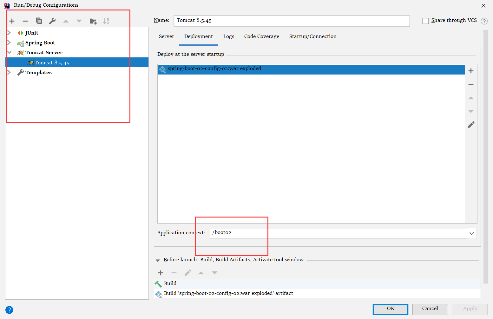
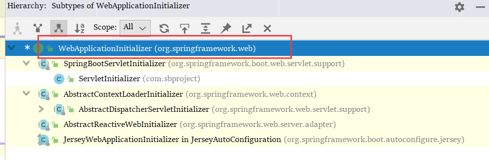

SpringBoot 2.3.1

java8

idea 2019.3

maven 3.6.x

# Quick Example

## 1.修改pom

将项目变成 war 打包方式。

将tomcat模块排除出web模块

导入 `servlet.api` `jsckson-dadabind` 

```xml
# 加上
<packaging>war</packaging>
<project>
    <packaging>war</packaging>
    <dependcies>
        <dependencies>
            <dependency>
                <groupId>org.springframework.boot</groupId>
                <artifactId>spring-boot-starter-web</artifactId>
                <exclusions>
                    <exclusion>
                        <groupId>org.springframework.boot</groupId>
                        <artifactId>spring-boot-starter-tomcat</artifactId>
                    </exclusion>
                </exclusions>
            </dependency>

            <dependency>
                <groupId>javax.servlet</groupId>
                <artifactId>javax.servlet-api</artifactId>
                <scope>provided</scope>
            </dependency>
            <dependency>
                <groupId>com.fasterxml.jackson.core</groupId>
                <artifactId>jackson-databind</artifactId>
            </dependency>
            
            </dependcies>
        </project>
```

## 2.添加web模块

在IDEA小配置里面有笔记

## 3.重写 `SpringBootServletInitializer` 里面的方法

必须编写一个 SpringBootServletInitializer 的子类，并调用 configure 方法

```java
public class ServletInitializer extends SpringBootServletInitializer {
    @Override
    protected SpringApplicationBuilder configure(SpringApplicationBuilder application) {
        // 这个传进去的类啊，就是这个项目的主程序
        return application.sources(OuttomcatApplication.class);
    }
}
```


## 4.修改视图解析器

在 `application.properties` 中

```properties
spring.mvc.view.prefix=/WEB-INF/
spring.mvc.view.suffix=.jsp
```


## 5.部署到tomcat



## 运行

# 启动原理

jar包打包方式的项目 ：直接执行 主类的方法，启动IOC容器，创建嵌入式的Servlet容器；

war包打包方式的项目：先启动服务器，**然后启动SB应用** 【SpringBootServletInitializer】，启动IOC容器

今天就来剖析 【SpringBootServletInitializer】

说起这个就要追溯到Servlet3.0 ：

1. 前提条件还要看 Spring注解版 QAQ 还要学 Servlet规范文档QAQ

规则：引用规范文档 `8.2.4 Shared libraries/runtimes pluggability` 

1. 服务器启动（Web应用）会创建当前 Web 应用里面，每一个 jar 包里面， SpringBootServletInitializer 的实例；
2. SpringBootServletInitializer 这个类的实现，
   1. 必须放在 JAR 包的 `META-INF/services` 文件夹下，
   2. 而且这个文件夹下还要有一个叫做 `javax.servlet.ServletContainerInitializer` 的文件；
   3. 文件中的内容就是指向 【SpringBootServletInitializer】的实现类的全类名
3. 还可以使用 `HandlesTypes` 注解，这个注解的作用是
   1. 在应用程序启动的时候，加载我们感兴趣的类


## 1）流程

1. 启动Tomcat ，
2. `org\springframework\spring-web\5.2.7.RELEASE\spring-web-5.2.7.RELEASE.jar!\META-INF\services\javax.servlet.ServletContainerInitializer` 在这个路径下的文件找到 SpringBootServletInitializer 的实现类位置
   1. 文件的内容 ：`org.springframework.web.SpringServletContainerInitializer` 
3. SpringBootServletInitializer 将 `@HandlesTypes({WebApplicationInitializer.class})` 标注的所有这个类型的类都传入到 `onStartup` 方法中的 `Set<Class<?>>` 中；为这些类【WebApplicationInitializer】类型的类创建实例
4. 每一个 WebApplicationInitializer 都调用自己的 `onStartup` 方法；
   1. 仔细看可以看得出，他的子类【`SpringBootServletInitializer`】的子类 就是我们自己写的，或者系统生成的 `ServletInitializer` 



5. 相当于，我们自己写的 `SpringBootServletInitializer` 会被创建对象，并执行 `onStartup` 
6. SpringBootServletInitializer 实例在执行 onStartup 的时候，会创建一个容器 createRootApplicationContext 

```java
protected WebApplicationContext createRootApplicationContext(ServletContext servletContext) {
    //1.创建 SpringApplicationBuilder
    SpringApplicationBuilder builder = createSpringApplicationBuilder();
    builder.main(getClass());
    ApplicationContext parent = getExistingRootWebApplicationContext(servletContext);
    if (parent != null) {
        this.logger.info("Root context already created (using as parent).");
        servletContext.setAttribute(WebApplicationContext.ROOT_WEB_APPLICATION_CONTEXT_ATTRIBUTE, null);
        builder.initializers(new ParentContextApplicationContextInitializer(parent));
    }
    builder.initializers(new ServletContextApplicationContextInitializer(servletContext));
    builder.contextClass(AnnotationConfigServletWebServerApplicationContext.class);
    // 调用 configure，子类重写了这个方法，传入了SB应用的主程序类
    builder = configure(builder);
    builder.listeners(new WebEnvironmentPropertySourceInitializer(servletContext));
    
    // 使用 builde 创建一个 Spring应用
    SpringApplication application = builder.build();
    if (application.getAllSources().isEmpty()
        && MergedAnnotations.from(getClass(), SearchStrategy.TYPE_HIERARCHY).isPresent(Configuration.class)) {
        application.addPrimarySources(Collections.singleton(getClass()));
    }
    Assert.state(!application.getAllSources().isEmpty(),
                 "No SpringApplication sources have been defined. Either override the "
                 + "configure method or add an @Configuration annotation");
    // Ensure error pages are registered
    if (this.registerErrorPageFilter) {
        application.addPrimarySources(Collections.singleton(ErrorPageFilterConfiguration.class));
    }
    application.setRegisterShutdownHook(false);
    // 就是启动应用，一到这一步就是之前熟悉的 SpringBoot 加载嵌入式tomcat的过程，也是Sping初始化的过程
    return run(application);
}
```

7. SPring的应用就启动了！`run(application);` 并且创建IOC容器

```java
public ConfigurableApplicationContext run(String... args) {
    StopWatch stopWatch = new StopWatch();
    stopWatch.start();
    ConfigurableApplicationContext context = null;
    Collection<SpringBootExceptionReporter> exceptionReporters = new ArrayList<>();
    configureHeadlessProperty();
    SpringApplicationRunListeners listeners = getRunListeners(args);
    listeners.starting();
    try {
        ApplicationArguments applicationArguments = new DefaultApplicationArguments(args);
        ConfigurableEnvironment environment = prepareEnvironment(listeners, applicationArguments);
        configureIgnoreBeanInfo(environment);
        Banner printedBanner = printBanner(environment);
        
        // 这里不就是判断需要调用什么类型(servlet/reactive)的服务器的方法；在笔记7有记录过
        context = createApplicationContext();
        exceptionReporters = getSpringFactoriesInstances(SpringBootExceptionReporter.class,
                                                         new Class[] { ConfigurableApplicationContext.class }, context);
        prepareContext(context, environment, listeners, applicationArguments, printedBanner);
        refreshContext(context);
        
        // 刷新IOC容器，创建对象各种过程
        afterRefresh(context, applicationArguments);
        stopWatch.stop();
        if (this.logStartupInfo) {
            new StartupInfoLogger(this.mainApplicationClass).logStarted(getApplicationLog(), stopWatch);
        }
        listeners.started(context);
        callRunners(context, applicationArguments);
    }
    catch (Throwable ex) {
        handleRunFailure(context, ex, exceptionReporters, listeners);
        throw new IllegalStateException(ex);
    }

    try {
        listeners.running(context);
    }
    catch (Throwable ex) {
        handleRunFailure(context, ex, exceptionReporters, null);
        throw new IllegalStateException(ex);
    }
    return context;
}
```

启动 Servlet 容器--》启动SB应用