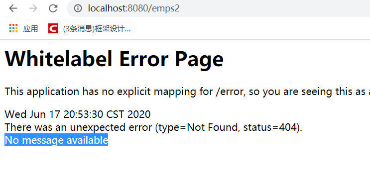
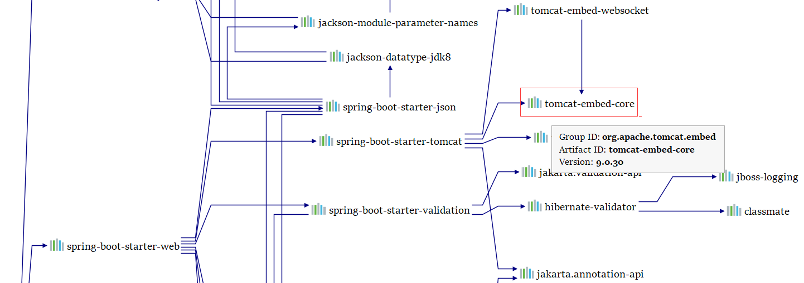
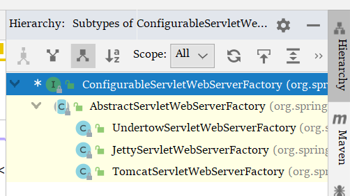
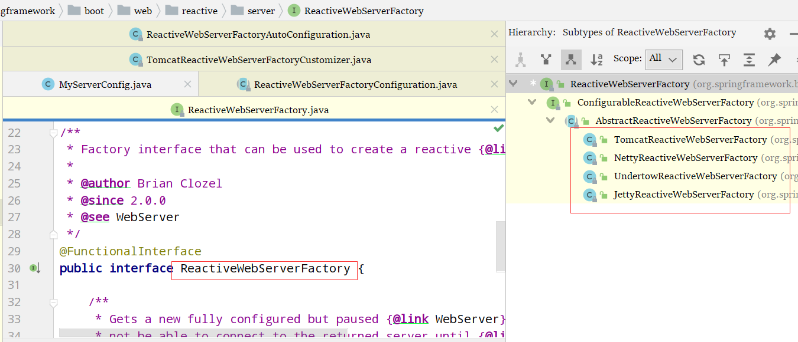
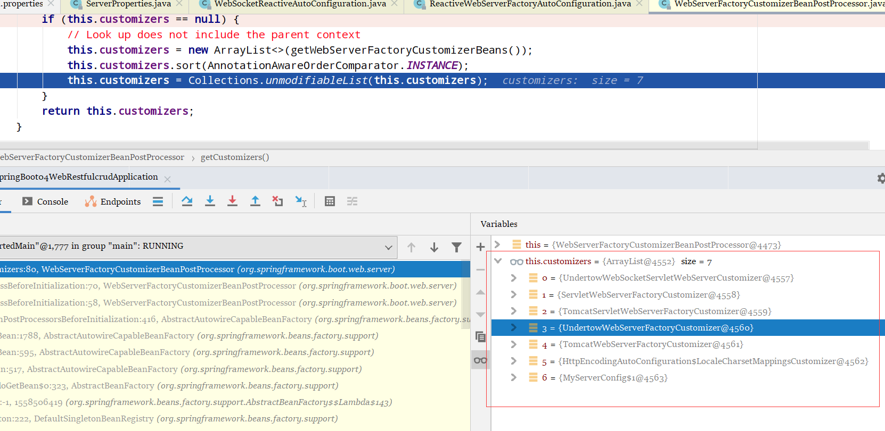

开发步骤

1. 创建sb项目，选中需要的模块
2. SPringBoot 已经默认将这些场景配置好了；只需要在配置文件中指定少量配置就可以运行起来
3. 自己编写业务代码

自动配置原理一定要清楚

1. 这个场景 SpringBoot 帮我们配置了什么？能不能修改？能修改哪些属性？能不能扩展

```
xxxAutoConfiguration ：将组件自动配置到容器中
xxxProperties ：配置类，封装配置文件的内容；定义了properties 里面能写什么，怎么写 
```


# 1、quick start

## 1）引入 Thymeleaf

模版引擎 不多多介绍了，无非就是将你再静态页面留下的占位符 `${xx}` ，按照一定规则替换成后端传过来的数据；


```xml
<dependency>
	<groupId>org.springframework.boot</groupId>
    <artifactId>spring-boot-starter-thymeleaf</artifactId>
    <version>xxxx</version>
</dependency>
```

## 2）登录

登录错误信息显示

```html
<p th:if="${not #strings.isEmpty(msg)}" style="color:red" th:text="${#strings.prepend(msg,'-')}"></p>

```

跳转到登陆成功页面之后，如果在该页面刷新，会提示重复提交表单。要避免表单重复提交就要使用重定向技术，这是一个例子

```java
@Override
public void addViewControllers(ViewControllerRegistry registry) {
    // 效果 ：浏览器发送 /myconfig 请求，也来到 success 页面
    registry.addViewController("/").setViewName("login");
    registry.addViewController("/main.html").setViewName("dashboard");
}
```

Controller

```java
@PostMapping(value = "user/login")
public String login(
    @RequestParam(value = "username", required = true, defaultValue = "123") String username,
    @RequestParam(value = "password", required = true) String password,
    Model model
) {
    if (!StringUtils.isEmpty(username) && "123456".equals(password)) {
        // 为了防止表单重复提交，重定向到主页
        return "redirect:/main.html";

    }else {
        model.addAttribute("msg", "用户名密码错误");
        return "login";
    }
}
```

这时候又引出了一个问题，`localhost:8080/main.html` 可以不通过登录进入到主页，这样是不对的 

所以引入了拦截器机制

### 2.1）拦截器

拦截器是进行登录检查的

```java
package intercepter;
/**3
 * 登录检查
 */
@Component
public class LoginHandlerIntercepter implements HandlerInterceptor {
    @Override
    public boolean preHandle(HttpServletRequest request, HttpServletResponse response, Object handler) throws Exception {
        Object user = request.getSession().getAttribute("loginUser");
        if (user == null) {
            // 未登录，返回登录页面
            request.setAttribute("msg", "没有权限，请先登录");
            request.getRequestDispatcher("/").forward(request, response);
            return false;
        } else {
            return true;
        }
    }
}

```

在自己的 webmvc 配置里面添加拦截器，注意 ：需要排除登录页面等必须的路径，还有排除静态资源 webjars 等

```java
@Configuration
public class MyMvcConfig implements WebMvcConfigurer {

    @Override
    public void addInterceptors(InterceptorRegistry registry) {
        // 静态资源：*.css ，*.js
        registry.addInterceptor(new LoginHandlerIntercepter())
                .addPathPatterns("/**")
                .excludePathPatterns("/", "/user/login", "/webjars/**");
    }

    @Override
    public void addViewControllers(ViewControllerRegistry registry) {
        // 效果 ：浏览器发送 /myconfig 请求，也来到 success 页面
        registry.addViewController("/").setViewName("login");
        registry.addViewController("/main.html").setViewName("dashboard");
    }

}
```

## 3）RESTFUL-CRUD

### 3.1项目源码

#### 1）前端

login.html

`/template/login.html`

```html
<form action="/login" th:action="@{/user/login}" method="post">
    id : <input type="text" name="id"/><br/>
    password : <input type="text" name="password"/><br/>
    <input type="submit" value="click"/>
    <p th:if="${not #strings.isEmpty(msg)}" style="color:red" th:text="${#strings.prepend(msg,'-')}"></p>
</form>
```

公用代码块-bar.html

`/templates/common/bar.html`

```html
<div th:fragment="head">
    用户 : <a href="#">[[${session.loginUser}]]</a>

    <hr/>
</div>
<div th:fragment="sideBar">
    <li> <a th:class="${activeUri=='main.html'?'nav-link active':'nav-link'}" th:href="@{/main.html}">首页</a></li>
    <li><a th:class="${activeUri=='emps'?'nav-link active':'nav-link'}" th:href="@{/emps}">员工管理</a></li>
    <li></li>
    <li></li>
</div>
```

全员列表-list.html

`/templates/emp/list.html` 

```html
<hr/>
<span th:replace="~{commons/bar::head}"></span>
<span th:replace="~{commons/bar::sideBar(activeUri='emps')}"></span>
<hr/>
<main role="main" class="col-md-9 ml-sm-auto col-lg-10 pt-3 px-4">
    <h2><a class="btn btn-sm btn-success" th:href="@{/emp}">添加</a></h2>
    <div class="table-responsive">

        <table class="table table-striped table-sm">
            <thead>
                <tr>
                    <th>#</th>
                    <th>lastName</th>
                    <th>email</th>
                    <th>gender</th>
                    <th>department</th>
                    <th>birth</th>
                    <th>操作</th>
                </tr>
            </thead>
            <tbody>
                <tr th:each="emp:${emps}">
                    <td th:text="${emp.id}"></td>
                    <td>[[${emp.lastName}]]</td>
                    <td>[[${emp.email}]]</td>
                    <td th:text="${emp.gender} == 1? '男':'女'"></td>
                    <td>[[${emp.department.departmentName}]]</td>
                    <td th:text="${#dates.format(emp.birth,'yyyy-MM-dd HH:mm:ss')}"></td>
                    <td>
                        <a th:href="@{/emp/} + ${emp.id}" class="btn btn-sm btn-primary">编辑</a>
                        <button th:attr="del_uri=@{/emp/} + ${emp.id}" class="btn btn-sm btn-danger deleteBtn">删除</button>
                    </td>
                </tr>
            </tbody>
        </table>
    </div>
</main>

<form id="deleteForm" method="post">
    <input type="hidden" name="_method" value="delete">
</form>
<script type="text/javascript" th:src="@{/webjars/jquery/3.3.1/jquery.js}"></script>
<script>
    $(".deleteBtn").click(function() {
        var del_uri = $(this).attr("del_uri");
        $("#deleteForm").attr("action", del_uri).submit();
        return false;
    });
</script>
```

添加员工-add.html

`/templates/emp/add.html` 

```html
<hr/>
<span th:replace="~{commons/bar::head}"></span>
<span th:replace="~{commons/bar::sideBar(activeUri='emps')}"></span>
<hr/>
<main role="main" class="col-md-9 ml-sm-auto col-lg-10 pt-3 px-4">
    <!-- 需要区分是员工修改还是添加 -->
    <form th:action="@{/emp}" method="POST">
        <input type="hidden" name="_method" value="PUT" th:if="${emp!=null}"/>
        <input type="hidden" name="id" th:value="${emp.id}" th:if="${emp!=null}"/>
        <div class="form-group">
            <label>LastName</label>
            <input name="lastName" type="text" class="form-control" placeholder="zhangshan"
                   th:value="${emp!=null}?${emp.lastName}">
        </div>
        <div class="form-group">
            <label>Email</label>
            <input name="email" type="text" class="form-control" placeholder="zhangshan@atguigu.com"
                   th:value="${emp!=null}?${emp.email}">
        </div>
        <div class="form-group">
            <label>Gender</label>
            <div class="form-check form-check-inline">
                <input type="radio" class="form-check-input" name="gender" value="1"
                       th:checked="${emp!=null}?${emp.gender==1}">
                <label class="form-check-label">男</label>
            </div>
            <div class="form-check form-check-inline">
                <input type="radio" class="form-check-input" name="gender" value="10"
                       th:checked="${emp!=null}?${emp.gender==0}">
                <label class="form-check-label">女</label>
            </div>

        </div>
        <div class="form-group">
            <label>department</label>
            <select th:name="department.id" class="form-control">
                <option
                        th:selected="${emp!=null}?${dept.id == emp.department.id}"
                        th:each="dept:${departments}"
                        th:text="${dept.departmentName}" th:value="${dept.id}"/>
            </select>
        </div>
        <div class="form-group"></div>
        <div class="form-group">
            <label>Birth</label>
            <input th:name="birth"
                   th:value="${emp!=null}?${#dates.format(emp.birth,'yyyy-MM-dd')}" type="text" class="form-control"
                   placeholder="yyyy-MM-dd">
        </div>
        <button class="btn-primary btn" type="submit" th:text="${emp!=null}?'修改':'添加'"></button>
    </form>
</main>
<div class="col-md-9 ml-sm-auto col-lg-10 pt-3 px-4">
    <hr>
```


首页(dashboard.html)

```html
<span th:replace="~{commons/bar::head}"></span>
<span th:replace="~{commons/bar::sideBar(activeUri='main.html')}"></span>
```


#### 2）后端

##### application.properties

```properties
spring.devtools.restart.enabled=true
logging.level.root=info
spring.thymeleaf.cache=false
spring.mvc.date-format=yyyy-MM-dd
spring.mvc.hiddenmethod.filter.enabled=true

```

##### 2.1）javabean

```java
Employee.java
-----------------------------------
    private Integer id;
    private String lastName;
    private String email;
    private Integer gender;
    private Department department;
    private Date birth;
-----------------------------------
Department
-----------------------------------
    private Integer id;
    private String departmentName;
```

##### 2.2）dao

```java
DepartmentDao
--------------------------------------
    private static Map<Integer, Department> departments = null;

    static {
        departments = new HashMap<>();
        departments.put(101, new Department(101, "D-AA"));
        departments.put(102, new Department(102, "D-BB"));
        departments.put(103, new Department(103, "D-CC"));
        departments.put(104, new Department(104, "D-DD"));
        departments.put(105, new Department(105, "D-EE"));
    }
    public Collection<Department> getDepartment() {
        return departments.values();
    }

    public Department getDepartment(Integer id) {
        return departments.get(id);
    }
---------------------------------------
EmployeeDao
---------------------------------------
    private static Map<Integer, Employee> employees = null;

@Autowired
private DepartmentDao departmentDao;

static {
    employees = new HashMap<Integer, Employee>();

    employees.put(1001, new Employee(1001, "E-AA", "aa@163.com", 1, new Department(101, "D-AA"),new Date()));
    employees.put(1002, new Employee(1002, "E-BB", "bb@163.com", 1, new Department(102, "D-BB"),new Date()));
    employees.put(1003, new Employee(1003, "E-CC", "cc@163.com", 0, new Department(103, "D-CC"),new Date()));
    employees.put(1004, new Employee(1004, "E-DD", "dd@163.com", 0, new Department(104, "D-DD"),new Date()));
    employees.put(1005, new Employee(1005, "E-EE", "ee@163.com", 1, new Department(105, "D-EE"),new Date()));
}

private static Integer initId = 1006;

public void save(Employee employee) {
    if (employee.getId() == null) {
        employee.setId(initId++);
    }
    employee.setDepartment(departmentDao.getDepartment(employee.getDepartment().getId()));
    employees.put(employee.getId(), employee);

}

public Collection<Employee> getAll() {
    return employees.values();
}

public Employee get(Integer id) {
    Employee employee = employees.get(id);
    return employee;

}

public void delete(Integer id) {
    employees.remove(id);
}
```

##### 2.3）Controller

employeeController

```java
@Autowired
EmployeeDao employeeDao;
@Autowired
DepartmentDao departmentDao;

// 查询所有员工，返回列表页面
@GetMapping(value = "/emps")
public String list(Model model) {
    Collection<Employee> all = employeeDao.getAll();
    model.addAttribute("emps", all);
    return "emp/list";
}

@GetMapping(value = "/emp")
public String toAddPage(Model model) {
    // 查出所有部门，在页面显示
    Collection<Department> departments = departmentDao.getDepartment();
    model.addAttribute("departments", departments);
    return "emp/add";
}

// SpringMVC 会自动绑定入参
@PostMapping("/emp")
public String addEmp(Employee employee) {
    employee.setDepartment(departmentDao.getDepartment(employee.getDepartment().getId()));
    employeeDao.save(employee);
    return "redirect:/emps";
}

@GetMapping(value = "/emp/{id}")
public String toEditPage(
    @PathVariable(value = "id") Integer id,
    Model model
) {
    Employee employee = employeeDao.get(id);
    model.addAttribute("emp", employee);
    Collection<Department> departments = departmentDao.getDepartment();
    model.addAttribute("departments", departments);
    return "emp/add";
}

@PutMapping(value = "/emp")
public String updateEmp(Employee employee) {
    employeeDao.save(employee);
    return "redirect:/emps";
}

@DeleteMapping(value = "/emp/{id}")
public String deleteEmp(@PathVariable("id")Integer id) {
    employeeDao.delete(id);
    return "redirect:/emps";
}
```

LoginController

```java
@PostMapping(value = "user/login")
public String login(
    @RequestParam(value = "username", required = true, defaultValue = "123") String username,
    @RequestParam(value = "password", required = true) String password,
    Model model,
    HttpSession session
) {
    if (!StringUtils.isEmpty(username) && "123456".equals(password)) {
        // 为了防止表单重复提交，重定向到主页
        session.setAttribute("loginUser", username);
        return "redirect:/main.html";

    }else {
        model.addAttribute("msg", "用户名密码错误");
        return "login";
    }
}
```

##### 2.4）Interceptor

用来检查用户是否登录的，没有登陆就不给登录，返回登录页面

```java
public class LoginHandlerIntercepter implements HandlerInterceptor {
    @Override
    public boolean preHandle(HttpServletRequest request, HttpServletResponse response, Object handler) throws Exception {
        Object user = request.getSession().getAttribute("loginUser");
        if (user == null) {
            // 未登录，返回登录页面
            request.setAttribute("msg", "没有权限，请先登录");
            request.getRequestDispatcher("/").forward(request, response);
            return false;
        } else {
            return true;
        }

    }

    @Override
    public void postHandle(HttpServletRequest request, HttpServletResponse response, Object handler, ModelAndView modelAndView) throws Exception {

    }

    @Override
    public void afterCompletion(HttpServletRequest request, HttpServletResponse response, Object handler, Exception ex) throws Exception {

    }
}
```

##### 2.5）自定义MVC配置文件

`@Configuration` 标签很重要，`WebMvcConfigurer` 很重要

用来配置一些自定义的组件的，比如说拦截器啊、视图控制器啊、视图解析器啊什么什么的

```java
@Configuration
public class MyMvcConfig implements WebMvcConfigurer {

    @Override
    public void addInterceptors(InterceptorRegistry registry) {
        // 静态资源：*.css ，*.js
        registry.addInterceptor(new LoginHandlerIntercepter())
            .addPathPatterns("/**")
            .excludePathPatterns("/", "/user/login", "/webjars/**");
    }

    @Override
    public void addViewControllers(ViewControllerRegistry registry) {
        // 效果 ：浏览器发送 /myconfig 请求，也来到 success 页面
        registry.addViewController("/").setViewName("login");
        registry.addViewController("/main.html").setViewName("dashboard");
    }
}
```


URI : /资源名称/资源标识符  HTTP请求方式区分对资源CRUD的操作

|      | 普通的CRUD      | RESTFUL         |
| ---- | --------------- | --------------- |
| 查询 | getEmp          | emp—GET         |
| 添加 | addEmp?xxx      | emp—POST        |
| 修改 | updateEmp?xxxxx | emp/{id}—PUT    |
| 删除 | deleteEmp?xxx   | emp/{id}—DELETE |

本次实验的请求架构

|                                    | URI      | 请求方式 |
| ---------------------------------- | -------- | -------- |
| 查询所有员工                       | emps     | GET      |
| 查询某个员工                       | emp/{id} | GET      |
| 去添加页面                         | emp      | GET      |
| 添加员工                           | emp      | POST     |
| 来到修改页面(查处员工进行信息回显) | emp/{id} | GET      |
| 修改员工                           | emp      | PUT      |
| 删除员工                           | emp/{id} | DELETE   |

员工列表

###  3）最容易引起的错误

提交的数据格式不对 ：--》比如生日，日期

2020-12-12  2020/12/12 2020.12.12

日期的格式化：SpringMVC 将页面提交的值需要转换成指定的类型

2020-12-12---Date；，需要转换格式就涉及到了类型转换功能，格式化功能

默认的日期是按照 `/` 分割的

```properties
# 解决
spring.mvc.date-format=yyyy-MM-dd
```

# 2、SpringBoot错误处理机制


##1）SpringBoot默认的错误处理机制

效果：

浏览器访问

访问一个不存在的页面–>返回默认的错误页面



---

如果是其他客户端访问，默认会响应一个json 数据

```json
{
    "timestamp": "2020-06-17T13:01:04.460+0000",
    "status": 404,
    "error": "Not Found",
    "message": "No message available",
    "path": "/aaa"
}
```

## 2）原理

可以参照 `ErrorMvcAutoConfiguration` 类

SB 给容器中添加了以下组件 

1. `DefaultErrorAttributes` \
2. `basicErrorController` 

```java
// 处理默认的 /error 请求
@Controller
@RequestMapping("${server.error.path:${error.path:/error}}")
public class BasicErrorController extends AbstractErrorController {
    

    // MediaType.TEXT_HTML_VALUE="text/html"
    // 这行代码用来产生html类型数据的
    @RequestMapping(produces = MediaType.TEXT_HTML_VALUE)
    public ModelAndView errorHtml(HttpServletRequest request, HttpServletResponse response) {
        HttpStatus status = getStatus(request);
        Map<String, Object> model = Collections
            .unmodifiableMap(getErrorAttributes(request, isIncludeStackTrace(request, MediaType.TEXT_HTML)));
        response.setStatus(status.value());
        ModelAndView modelAndView = resolveErrorView(request, response, status, model);
        return (modelAndView != null) ? modelAndView : new ModelAndView("error", model);
    }
    
    // 这一段是用来返回 json 数据的
    @RequestMapping
    public ResponseEntity<Map<String, Object>> error(HttpServletRequest request) {
        HttpStatus status = getStatus(request);
        if (status == HttpStatus.NO_CONTENT) {
            return new ResponseEntity<>(status);
        }
        Map<String, Object> body = getErrorAttributes(request, isIncludeStackTrace(request, MediaType.ALL));
        return new ResponseEntity<>(body, status);
    }
}
```


1. `ErrorPageCustomizer` 

```java
from ErrorProperties.java
/**
	 * Path of the error controller.
	 */
	@Value("${error.path:/error}")
	private String path = "/error";
# 系统出现错误，，就会启用这一段规则
```


1. `DefaultErrorViewResolverConfiguration` 

```java
@Override
public ModelAndView resolveErrorView(HttpServletRequest request, HttpStatus status, Map<String, Object> model) {
    ModelAndView modelAndView = resolve(String.valueOf(status.value()), model);
    if (modelAndView == null && SERIES_VIEWS.containsKey(status.series())) {
        modelAndView = resolve(SERIES_VIEWS.get(status.series()), model);
    }
    return modelAndView;
}

private ModelAndView resolve(String viewName, Map<String, Object> model) {
    //默认 SB 可以去找到一个页面--》error/404  error/5xx
    String errorViewName = "error/" + viewName;
    // 模版引擎可以解析这个页面地址，就会使用模版引擎解析
    TemplateAvailabilityProvider provider = this.templateAvailabilityProviders.getProvider(errorViewName,
                                                                                           this.applicationContext);
    if (provider != null) {
        // 模版引擎可以使用的情况下，返回 errorVieName 指定的视图地址
        return new ModelAndView(errorViewName, model);
    }
    // 模版引擎不可用；就在静态资源文件夹下，这个静态资源文件夹就是SB定义的那些，/static/** /resource/**
    // 
    return resolveResource(errorViewName, model);
}
```


1. 步骤：

一旦系统出现 4xx 5xx 之类的错误； `ErrorPageCustomizer` 就会生效（定制错误的响应规则）

就会来到 `/error` 被 `basicErrorController` 处理

1. 响应页面：去哪个页面，是由 `DefaultErrorAttributes`  决定的

```java
protected ModelAndView resolveErrorView(HttpServletRequest request, HttpServletResponse response, HttpStatus status,
                                        Map<String, Object> model) {
    for (ErrorViewResolver resolver : this.errorViewResolvers) {
        ModelAndView modelAndView = resolver.resolveErrorView(request, status, model);
        if (modelAndView != null) {
            return modelAndView;
        }
    }
    return null;
}
```


## 3）如何定制错误响应


1. 如何定制错误页面
   1. 有模版引擎的情况下，在模版引擎文件夹下 `templates`，创建一个 `error` 文件夹，然后写上对应的错误处理页面，比如这样 `404.html` `500.html` 等准确的状态码，也可以 `4xx.html` `5xx.html` 等模糊匹配的状态码
   2. 页面能获取的信息：
      1. 在 `DefaultErrorAttributes` 类中的 `getErrorAttributes` 方法中
      2. timestamp: 时间戳
      3. status ：状态码
      4. error ：错误提示
      5. exception ：异常对象信息
      6. message ：异常的消息
      7. errors ：JSR303 数据校验的错误
   3. 没有模版引擎，默认是在静态资源文件夹下找，`/static/**` `/resource/**` 
   4. 以上都没有错误页面，就来到SB的默认空白页面错误提示

如果是客户端，如何定制 json 数据

## 4）定制JSON数据

自定义一个错误

```java
public class UserNotExistException extends RuntimeException {
    public UserNotExistException() {
        super("用户不存在123");
    }
}
```

写一个控制逻辑

```java
@GetMapping("/user/login")
public String login1(@RequestParam("u")String value){
    if (StringUtils.equals(value, "aaa")){
        throw new UserNotExistException();
    }
    return "login";
}
```

写一个错误处理器

要点：在类上 `@ControllerAdvice` 在处理方法上标注 `@ExceptionHandle={要处理的异常}` 在处理方法上标注 `@ResponseBody` 为了返回json数据

```java
@ControllerAdvice
public class MyExceptionHandler {
	
    // 浏览器和客户端返回的都是 JSON 数据
    @ResponseBody
    @ExceptionHandler(value = {UserNotExistException.class})
    public Map<String, Object> handleException(Exception e) {
        Map<String, Object> map = new HashMap<>();
        map.put("code", "user.notexist");
        map.put("message", e.getMessage());
        return map;
    }
}
// 没有自适应效果
```

### 1、解决没有自适应效果的问题

 （浏览器返回页面，客户端返回json）

```java
@ControllerAdvice
public class MyExceptionHandler {

    @ExceptionHandler(value = {UserNotExistException.class})
    public String handleException(Exception e) {
        Map<String, Object> map = new HashMap<>();
        map.put("code", "user.notexist");
        map.put("message", e.getMessage());
        // 转发到 /error
        return "forward:/error";
    }
}
```

将定制数据携带出去 就是 `map` 里面的东西

出现错误以后，回来到 `/error` ，这个请求被 `BasicErrorController` 处理

而获取异常数据的是这个方法 `getErrorAttributes` 

```java
@RequestMapping
public ResponseEntity<Map<String, Object>> error(HttpServletRequest request) {
    HttpStatus status = getStatus(request);
    if (status == HttpStatus.NO_CONTENT) {
        return new ResponseEntity<>(status);
    }
    // 这里，看见没有，look look
    Map<String, Object> body = getErrorAttributes(request, isIncludeStackTrace(request, MediaType.ALL));
    return new ResponseEntity<>(body, status);
}
```

而这个 `getErrorAttributes` 方法是这样子的

```java
// from AbstractErrorController 是 BasicErrorController 的父类
protected Map<String, Object> getErrorAttributes(HttpServletRequest request, boolean includeStackTrace) {
    WebRequest webRequest = new ServletWebRequest(request);
    return this.errorAttributes.getErrorAttributes(webRequest, includeStackTrace);
}
```

## 5）自定义异常处理器

通过自定义异常处理器的方式，给返回的视图或者 JSON 数据返回自定义的错误信息

#### 5.1）方式一

想要自定义异常处理器，可以完全编写一个 `ErrorController` 的实现类【或者是编写继承AbstractErrorController】放在容器中，太复杂了

#### 5.2）方式二

页面上能用的数据，或者是 JSON 返回的数据都是通过 `errorAttributes.getErrorAttributes` 得到的

相当于 容器中 `DefaultErrorAttributes.getErrorAttribute()` 来默认进行错误信息的处理；

所以只需要继承 `DefaultErrorAttributes` ，在错误信息获取层面插入自定义的错误信息即可

```java
// 需要把这个组件加到容器中才能实现这个功能
@Component
public class MyErrorAttributes extends DefaultErrorAttributes {
    @Override
    public Map<String, Object> getErrorAttributes(WebRequest webRequest, boolean includeStackTrace) {
        Map<String, Object> map = super.getErrorAttributes(webRequest, includeStackTrace);
        // 自定义错误信息的添加
        map.put("company", "best");
        return map;
    }
}
```

如何将自定义异常处理器的错误信息也传出去？这样来做

MyExceptionHandler.java

```java
@ControllerAdvice
public class MyExceptionHandler {
    @ExceptionHandler(value = {UserNotExistException.class})
    public String handleException(Exception e, HttpServletRequest request) {
        Map<String, Object> map = new HashMap<>();
        request.setAttribute("javax.servlet.error.status_code", 400);
        map.put("code", "user.notexist");
        map.put("message", "用户出错了23232323
		// 将自定义的错误信息，通过 request 传给自定义的 MyErrorAttributes
        request.setAttribute("error_msg", map);
        return "forward:/error";
    }
}
```

在上 上面的代码上加上

```java
@Override
public Map<String, Object> getErrorAttributes(WebRequest webRequest, boolean includeStackTrace) {
    Map<String, Object> map = super.getErrorAttributes(webRequest, includeStackTrace);
// ***********************************************
    // WebRequest.getAttribute(String name, int scope);
    // scope 的意思是要从什么域内取值，可以点开方法看一下；0--request 1--session
    webRequest.getAttribute("error_msg", 0);
// ***************************************
    // 自定义错误信息的添加
    map.put("company", "best");
    return map;
}
```

自定义错误页面+错误信息流程总结：

编写自定义异常类(extends RuntimeException) --》编写自定义异常处理类(注意注解的使用)--》编写自定义错误属性类(extends DefaultErrorAttributes)--》将自定义错误属性类注册到容器中(就是加个Component注解)--》编写错误显示页面

细节：

1. 自定义异常类可以加上异常信息
2. 自定义异常处理类 将自定义的错误信息通过 request.setAttribute 的方式传给 错误属性类
3. 错误属性类将传过来的错误信息加到(`map.putAll`) map 中，传给前端；
4. 前端可以通过 `request` 域获取错误信息，`${error_message}` 

# 3、配置嵌入式Servlet 容器

## 0）2.x.x 的改动

在sb主程序运行的时候，会判断当前环境，如果是 serlvet 环境，就创建 调用servelt的自动配置，如果是reactive 的环境中，就调用 reactive 的配置。原来只是有 默认 和 servlet 现在多了个 reactive

坐标 ：org.springframework.boot.SpringApplication 

```java
public class SpringApplication {

    public ConfigurableApplicationContext run(String... args) {
        StopWatch stopWatch = new StopWatch();
        stopWatch.start();
        ConfigurableApplicationContext context = null;
        Collection<SpringBootExceptionReporter> exceptionReporters = new ArrayList<>();
        configureHeadlessProperty();
        SpringApplicationRunListeners listeners = getRunListeners(args);
        listeners.starting();
        try {
            ApplicationArguments applicationArguments = new DefaultApplicationArguments(args);
            ConfigurableEnvironment environment = prepareEnvironment(listeners, applicationArguments);
            configureIgnoreBeanInfo(environment);
            Banner printedBanner = printBanner(environment);
            // 这里就是分支，确定到底是创建 servlet服务还是 reactive 服务，姑且称他们为服务
            context = createApplicationContext();
            exceptionReporters = getSpringFactoriesInstances(SpringBootExceptionReporter.class,
                                                             new Class[] { ConfigurableApplicationContext.class }, context);
            prepareContext(context, environment, listeners, applicationArguments, printedBanner);
            // 创建IOC容器
            refreshContext(context);
            afterRefresh(context, applicationArguments);
            stopWatch.stop();
            if (this.logStartupInfo) {
                new StartupInfoLogger(this.mainApplicationClass).logStarted(getApplicationLog(), stopWatch);
            }
            listeners.started(context);
            callRunners(context, applicationArguments);
        }
        catch (Throwable ex) {
            handleRunFailure(context, ex, exceptionReporters, listeners);
            throw new IllegalStateException(ex);
        }

        try {
            listeners.running(context);
        }
        catch (Throwable ex) {
            handleRunFailure(context, ex, exceptionReporters, null);
            throw new IllegalStateException(ex);
        }
        return context;
    }

    
    public static final String DEFAULT_SERVLET_WEB_CONTEXT_CLASS = "org.springframework.boot."
			+ "web.servlet.context.AnnotationConfigServletWebServerApplicationContext";

	/**
	 * The class name of application context that will be used by default for reactive web
	 * environments.
	 */
	public static final String DEFAULT_REACTIVE_WEB_CONTEXT_CLASS = "org.springframework."
			+ "boot.web.reactive.context.AnnotationConfigReactiveWebServerApplicationContext";

    public static final String DEFAULT_CONTEXT_CLASS = "org.springframework.context."
			+ "annotation.AnnotationConfigApplicationContext";
	
    // 来了，重要分支，服务器创建的重要分支
    protected ConfigurableApplicationContext createApplicationContext() {
        Class<?> contextClass = this.applicationContextClass;
        if (contextClass == null) {
            try {
                switch (this.webApplicationType) {
                    case SERVLET:
                        contextClass = Class.forName(DEFAULT_SERVLET_WEB_CONTEXT_CLASS);
                        break;
                    case REACTIVE:
                        contextClass = Class.forName(DEFAULT_REACTIVE_WEB_CONTEXT_CLASS);
                        break;
                    default:
                        contextClass = Class.forName(DEFAULT_CONTEXT_CLASS);
                }
            }
            catch (ClassNotFoundException ex) {
                throw new IllegalStateException(
                    "Unable create a default ApplicationContext, please specify an ApplicationContextClass", ex);
            }
        }
        return (ConfigurableApplicationContext) BeanUtils.instantiateClass(contextClass);
    }
}
```

如果是Servlet 环境的话，就走这一条路 ；

```java
abstract class AbstractConfigurable WebServerFactory implements ConfigurableWebServerFactory -->
    // **************就这里不同，其实大家主要还是为了创建 TomcatWebServer**************************
abstract class Abstract Servlet WebServerFactory extends AbstractConfigurableWebServerFactory 
    implements ConfigurableServletWebServerFactory--------------------------------------------->
class TomcatServletWebServerFactory extends AbstractServletWebServerFactory
		implements ConfigurableTomcatWebServerFactory, ResourceLoaderAware--------------------->
	getWebServer();
// **************就这里不同，其实大家主要还是为了创建 TomcatWebServer**************************
public class TomcatWebServer implements WebServer---------------------------------------------->
	initialize-->this.tomcat.start();

```

如果是Reactive 环境的话，就走这一条路

```java
abstract class AbstractConfigurable WebServerFactory implements ConfigurableWebServerFactory -->
// **************就这里不同，其实大家主要还是为了创建 TomcatWebServer**************************
abstract class Abstract Reactive WebServerFactory extends AbstractConfigurableWebServerFactory
		implements ConfigurableReactiveWebServerFactory---------------------------------------->
class TomcatReactiveWebServerFactory extends AbstractReactiveWebServerFactory
		implements ConfigurableTomcatWebServerFactory ----------------------------------------->
	getWebServer();
// **************就这里不同，其实大家主要还是为了创建 TomcatWebServer**************************
public class TomcatWebServer implements WebServer---------------------------------------------->
	initialize-->this.tomcat.start();
```

由于想象力不够丰富，所以源码研究的是 reactive ，但其实环境是 servlet 。这两个环境大体上都是一样的，基本上就是换了个单词，

`WebSocketReactiveAutoConfiguration` `WebSocketServletAutoConfiguration` ，两个自动配置类，都惊人的相似。

### 0.1）关键

突然明白，2.x.x 以后，就不分什么嵌入式什么鬼了，全部实现 `WebServerFactory` 这个接口。然后通过环境判断是 `servlet` 还是 `reactive` 

然后会调用一个 `xxxWebServerFactory` ，通过这个类获取工程中的服务器；

1. 这个接口捏，如果导入了嵌入式的服务器，那么系统就会自动获取，如果禁用了嵌入式的，那么外部的就会被创建；
2. 怎么说，一句话总结 ：外部服务器和嵌入式服务器都继承了 `WebServerFactory` ，有什么就加载什么 

关键类

```java
// 这个类是2.x.x 以前的，看看就行 
ConfigurableEmbeddedServletContainer
WebServerFactoryCustomizer<ConfigurableServletWebServerFactory>
注册Servlet、Filter、Listener
    ServletRegistrationBean
    FilterRegistrationBean
    ServletListenerRegistrationBean
使用其他Servlet容器
    Jetty（适合长连接的开发，连接时间久）
    Undertow（不支持JSP）
```

看一下pom.xml 的依赖关系  右键--》Diagram--》xxx Dependency

##1）SpringBoot默认使用 Tomcat 作为嵌入式的Servlet容器




## 2）使用嵌入式Servlet容器，需要考虑以下的几个问题

### 2.1）如何定制和修改Servlet容器的相关配置；

#### 1）修改和Server有关的配置

在aplication.properties中(在ServerProperties里面)

```properties
server.servlet.context-path=8088
// 通用的Servlet容器设置
server.xxx
// tomcat的设置
server.tomcat.xxx
```

#### 2）通过代码方式自定义

##### 2.1）方式1

1. 编写一个 `WebServerFactoryCustomizer<ConfigurableServletWebServerFactory>` ：嵌入式的Servlet容器的定制器

   1. 也可以通过这种方式修改Serlvet的配置
   2. 这是 2.x.x 的写法 ，跟1.x.x 有很大区别，直接就把这个接口类个换了。

   来自官方文档的描述

   ```java
   If you need to programmatically configure your embedded servlet container, you can register a Spring bean that implements the WebServerFactoryCustomizer interface.
   WebServerFactoryCustomizer provides access to the ConfigurableServletWebServerFactory, which includes numerous customization setter methods. The following example shows programmatically setting the port:
   英语渣渣的手动翻译：
       如果你需要通过编码的方式配置你的嵌入式Servlet容器，你可以实现 WebServerFactoryCustomizer 接口，并且将这个类加入到SpringBean 中。WebServerFactoryCustomizer 需要提供获取 ConfigurableServletWebServerFactory 类，这个类提供了多个 可以自定义的 setter 方法。下面是例子（下面没有例子，下面是我跟着尚硅谷写的例子）
   ```

   

```java
// 在 MyConfig implements WebMvcConfigurer {} 中
@Bean
public WebServerFactoryCustomizer<ConfigurableServletWebServerFactory> webServerFactoryCustomizer() {
    return new WebServerFactoryCustomizer<ConfigurableServletWebServerFactory>() {

        @Override
        public void customize(ConfigurableServletWebServerFactory factory) {
            factory.setPort(8555);
        }
    };
}
```

##### 2.2）方式二

来自官方文档的推荐

```java
If the preceding customization techniques are too limited, 
you can register the 
TomcatServletWebServerFactory, JettyServletWebServerFactory, or UndertowServletWebServerFactory 
bean yourself.
来了来了：
    如果前面的自定义技术不够用，你可以注册这三个类，例子如下
```


```java
@Bean
public ConfigurableServletWebServerFactory webServerFactory() {
    TomcatServletWebServerFactory factory = new TomcatServletWebServerFactory();
    factory.setPort(9000);
    // 经过试验，用前面的方法自定义配置，是没有 sessionTimeout 这个属性的，说明前面的方法跟现在这个方法还是有些许差距
    factory.setSessionTimeout(10, TimeUnit.MINUTES);
    factory.addErrorPages(new ErrorPage(HttpStatus.NOT_FOUND, "/notfound.html"));
    return factory;
}

```

##### 2.3）来个总结

像这种 xxxCustomizer 类，很明显就是提供给用户实现的接口，然后可以通过实现这个接口完成自定义配置的操作；记住了哈


## 3）三大组件注册

由于SpringBoot默认是以jar包的方式启动嵌入式的Servlet容器来启动SpringBoot 的 Web 应用，但是SB 项目没有 web.xml 文件。所以需要用以下方式注册到嵌入式的Servlet容器中

Servlet

写一个Servlet

```java
public class MyServlet extends HttpServlet {
    @Override
    protected void doGet(HttpServletRequest req, HttpServletResponse resp) throws ServletException, IOException {
        doPost(req, resp);
    }

    @Override
    protected void doPost(HttpServletRequest req, HttpServletResponse resp) throws ServletException, IOException {
        resp.getWriter().write("Hello MyServlet");
    }
}
```

写一个Filter

```java
public class MyFilter implements Filter {
    @Override
    public void init(FilterConfig filterConfig) throws ServletException {

    }

    @Override
    public void doFilter(ServletRequest request, ServletResponse response, FilterChain chain) throws IOException, ServletException {
        System.out.println("myFilter is invoke!~~~~");
        chain.doFilter(request, response);
    }

    @Override
    public void destroy() {

    }
}
```


写一个Listener

```java
public class MyListener implements ServletContextListener {
    @Override
    public void contextInitialized(ServletContextEvent sce) {
        System.out.println("~~~~~~~~~~initialized~~~~");
    }

    @Override
    public void contextDestroyed(ServletContextEvent sce) {
        System.out.println("~~~~~~~~~~~~~~~~~~~~~~d~~estroy!!!!!!!!!!!");
    }
}

```


将 这三个组件写入配置中

将全部服务器的配置写成一个服务器配置类

```java
@Configuration
public class MyServerConfig {
    // 注册三大组件
    @Bean
    public ServletRegistrationBean<MyServlet> myServletServletRegistrationBean() {
        // 通过这个注册类注册serlvetl ，并且与 /myservlet 映射
        ServletRegistrationBean<MyServlet> mys = new ServletRegistrationBean<>(new MyServlet(), "/myservlet");
        return mys;
    }
    @Bean
    public FilterRegistrationBean<Filter> myFilterFilterRegistrationBean() {
        FilterRegistrationBean<Filter> myfilter = new FilterRegistrationBean<>();
        myfilter.setFilter(new MyFilter());
        myfilter.setUrlPatterns(Arrays.asList("/hello", "/myservlet"));
        return myfilter;
    }
    @Bean
    public ServletListenerRegistrationBean<ServletContextListener> serListener() {
        ServletListenerRegistrationBean<ServletContextListener> mylis = new ServletListenerRegistrationBean<>(new MyListener());
        return mylis;
    }
    
    // 配置嵌入式 Servlet 容器
    @Bean
    public WebServerFactoryCustomizer<ConfigurableServletWebServerFactory> webServerFactoryCustomizer() {
        return new WebServerFactoryCustomizer<ConfigurableServletWebServerFactory>() {

            @Override
            public void customize(ConfigurableServletWebServerFactory factory) {
                factory.setPort(8555);
            }
        };
    }
}
```

在 sb 底层的 `DispatcherServletAutoConfiguration` 也能看到 `DispatcherServlet` 的注册，也是这个样子的

```java
@Bean(name = DEFAULT_DISPATCHER_SERVLET_REGISTRATION_BEAN_NAME)
@ConditionalOnBean(value = DispatcherServlet.class, name = DEFAULT_DISPATCHER_SERVLET_BEAN_NAME)
public DispatcherServletRegistrationBean dispatcherServletRegistration(DispatcherServlet dispatcherServlet,
                                                                       WebMvcProperties webMvcProperties, ObjectProvider<MultipartConfigElement> multipartConfig) 
    // new 了一个注册器，
    DispatcherServletRegistrationBean registration = new DispatcherServletRegistrationBean(dispatcherServlet,
// 默认拦截 ：/ 请求；包括静态资源，但是不拦截jsp；//*会拦截jsp */                                                                   webMvcProperties.getServlet().getPath());
    registration.setName(DEFAULT_DISPATCHER_SERVLET_BEAN_NAME);
    registration.setLoadOnStartup(webMvcProperties.getServlet().getLoadOnStartup());
    multipartConfig.ifAvailable(registration::setMultipartConfig);
    return registration;
}
```

## 4）切换其他嵌入式Servlet容器

SpringBoot 能不能支持其他的Servlet容器？肯定能啊



默认支持这三个容器；

tomcat（默认使用）

Jetty

undertow

### 4.1）切换jetty

只需要对 `pom.xml` 修改，就可以达到无缝衔接的效果

```xml
<!--引入Web模块-->
<dependency>
    <groupId>org.springframework.boot</groupId>
    <artifactId>spring-boot-starter-web</artifactId>
    <exclusions>
        <exclusion>
            <artifactId>spring-boot-starter-tomcat</artifactId>
            <groupId>org.springframework.boot</groupId>
        </exclusion>
    </exclusions>
</dependency>
<dependency>
    <groupId>com.fasterxml.jackson.core</groupId>
    <artifactId>jackson-core</artifactId>
</dependency>

<!-- 引入其他的Servlet容器 -->
<dependency>
    <groupId>org.springframework.boot</groupId>
    <artifactId>spring-boot-starter-jetty</artifactId>
</dependency>
```

同理，其他 Servlet 容器也是一样

## 5）嵌入式容器自动配置原理


2.x.x 版本 嵌入式容器自动配置类结构已经变化，这个是自己蒙的，看不懂就算了，以后可能会懂

### 5.0）最大的配置类

服务器自动加载就是从这里开始

* 从下面的翻译就可以看出来，这个类就是加载嵌入式servlet容器的自动配置类；他会判断，如果有tomcat，就会用tomcat ，如果没有呢

```java
/**
 * Auto configuration for WebSocket reactive server in Tomcat, Jetty or Undertow. Requires
 * the appropriate WebSocket modules to be on the classpath.
 手动翻译：自动配置的WebSocket反应服务器在Tomcat, Jetty或Undertow。但是要求类路径上有适当的WebSocket模块。
 * <p>
 * If Tomcat's WebSocket support is detected on the classpath we add a customizer that
 * installs the Tomcat WebSocket initializer.
 *如果在类路径上检测到Tomcat的WebSocket支持，我们就添加一个定制器来安装Tomcat WebSocket初始化器。
 * @author Brian Clozel
 * @since 2.0.0
 */
@Configuration(proxyBeanMethods = false)
@ConditionalOnClass({ Servlet.class, ServerContainer.class })
@ConditionalOnWebApplication(type = Type.REACTIVE)
// 手动重点，真的很重点
// 这个代码的意思是，在运行自动配置之前，先运行 Reactivexxx 类，我猜里面就是要判断有没有自定义的服务器配置
@AutoConfigureBefore(ReactiveWebServerFactoryAutoConfiguration.class)
public class WebSocketReactiveAutoConfiguration {

    @Configuration(proxyBeanMethods = false)
    @ConditionalOnClass({ Tomcat.class, WsSci.class })
    // 你看，整个自动配置方法就只有一个 tomcat ，而且这个类还是在 webMvc 自动配置类体系中的，说明了只要导入 s-b-starter-web 模块，sb 就会自动提供嵌入式tomcat服务器
    static class TomcatWebSocketConfiguration {

        @Bean
        @ConditionalOnMissingBean(name = "websocketReactiveWebServerCustomizer")
        TomcatWebSocketReactiveWebServerCustomizer websocketReactiveWebServerCustomizer() {
            return new TomcatWebSocketReactiveWebServerCustomizer();
        }

    }

}
```

### 5.1）提前运行的类

`@AutoConfigureBefore(ReactiveWebServerFactoryAutoConfiguration.class)` 

类里面的 

import `ReactiveWebServerFactoryConfiguration.EmbeddedTomcat.class` 

路径 `package org.springframework.boot.autoconfigure.web.reactive;` 

```java
// 高优先级喔，highest_precedence
@AutoConfigureOrder(Ordered.HIGHEST_PRECEDENCE)
@Configuration(proxyBeanMethods = false)
@ConditionalOnClass(ReactiveHttpInputMessage.class)
@ConditionalOnWebApplication(type = ConditionalOnWebApplication.Type.REACTIVE)
// 应该是表示从哪里获取配置的参数
@EnableConfigurationProperties(ServerProperties.class)
// 这段代码强行理解一下：等于是在项目中找到哪个服务器就用哪个服务器，就算导入了多个服务器；由于写了tomcat的方法，所以也是tomcat优先使用，除非卸载tomcat
@Import({ ReactiveWebServerFactoryAutoConfiguration.BeanPostProcessorsRegistrar.class,
		ReactiveWebServerFactoryConfiguration.EmbeddedTomcat.class,
		ReactiveWebServerFactoryConfiguration.EmbeddedJetty.class,
		ReactiveWebServerFactoryConfiguration.EmbeddedUndertow.class,
		ReactiveWebServerFactoryConfiguration.EmbeddedNetty.class })
public class ReactiveWebServerFactoryAutoConfiguration {
    @Bean
	@ConditionalOnClass(name = "org.apache.catalina.startup.Tomcat")
	public TomcatReactiveWebServerFactoryCustomizer tomcatReactiveWebServerFactoryCustomizer(
			ServerProperties serverProperties) {
		return new TomcatReactiveWebServerFactoryCustomizer(serverProperties);
	}
```

以 `ReactiveWebServerFactoryConfiguration.EmbeddedTomcat.class` 为例

```java
@Configuration(proxyBeanMethods = false)
// 判断用户是否自定义了嵌入式的容器工厂；如果没有自定义的话就自动生成一个；而这个类里面有3个服务器的实现类
@ConditionalOnMissingBean(ReactiveWebServerFactory.class)
// 判断当前是否引入了外部的tomcat
@ConditionalOnClass({ org.apache.catalina.startup.Tomcat.class })
static class EmbeddedTomcat {
```

ReactiveWebServerFactory ：自适应的web服务工厂

* 上面这个类的 `@ConditionalOnMissingBean(ReactiveWebServerFactory.class)` 注解



这个接口下有众多实现类，就拿 tomcat 的为例

### 5.2）真正创建服务器的地方

`TomcatReactiveWebServerFactory` 

```java
public class TomcatReactiveWebServerFactory extends AbstractReactiveWebServerFactory
    implements ConfigurableTomcatWebServerFactory {
    // 这个类主要就看这个重写的方法，可以看到注册的过程中做了什么
    @Override
    public WebServer getWebServer(HttpHandler httpHandler) {
        if (this.disableMBeanRegistry) {
            Registry.disableRegistry();
        }
        // 创建一个 tomcat 
        Tomcat tomcat = new Tomcat();
        // 配置Tomcat 的基本环境
        File baseDir = (this.baseDirectory != null) ? this.baseDirectory : createTempDir("tomcat");
        tomcat.setBaseDir(baseDir.getAbsolutePath());
        // 链接器
        Connector connector = new Connector(this.protocol);
        connector.setThrowOnFailure(true);
        tomcat.getService().addConnector(connector);
        customizeConnector(connector);
        tomcat.setConnector(connector);
        tomcat.getHost().setAutoDeploy(false);
        configureEngine(tomcat.getEngine());
        for (Connector additionalConnector : this.additionalTomcatConnectors) {
            tomcat.getService().addConnector(additionalConnector);
        }
        TomcatHttpHandlerAdapter servlet = new TomcatHttpHandlerAdapter(httpHandler);
        
        // 将配置好的 Tomcat 传进去
        prepareContext(tomcat.getHost(), servlet);
        // 返回一个嵌入式的 WebServelt;并且启动一个tomcat服务器
        // TomcatWebServer.initialize() 里面
        return new TomcatWebServer(tomcat, getPort() >= 0);
    }
}
```

### 5.3）我们对嵌入式容器的配置修改怎么生效？

```java
修改ServerProperties里面的东西
实现 WebServerFactoryCustomizer<ConfigurableServletWebServerFactory>
```


### 5.4）WebServerFactoryCustomizer原理

研究他是怎么被识别并且导入变成配置文件的

看一下 `ReactiveWebServerFactoryAutoConfiguration` 中的 `@Import` 标签；

ReactiveWebServerFactoryAutoConfiguration.BeanPostProcessorsRegistrar.class,

`BeanPostProcessorsRegistrar` 这个类

这个类的作用就是 ：

1. Spring 注解版；给容器中导入一些组件
2. 导入了 `WebServerFactoryCustomizerBeanPostProcessor` 后置处理器
   1. 这处理器的作用
   2. bean 初始化前后（创建完对象，还没有给属性赋值的时候）执行一些初始化操作
   3. 这个类的前缀 `WebServerFactoryCustomizer` 正好就是我们要自定义服务器配置的时候要实现的那个接口，所以顾名思义，这个类就是用来处理我们自定义或者系统的 `WebServerFactoryCustomizer` 家族类的东西；
   4. 获取所有自定义配置类，遍历，循环执行每个配置类的 `customizer` 方法

```java
public class WebServerFactoryCustomizerBeanPostProcessor implements BeanPostProcessor, BeanFactoryAware {
    //...
    // 1.初始化之前执行的操作
    @SuppressWarnings("unchecked")
    private void postProcessBeforeInitialization(WebServerFactory webServerFactory) {
        // 1.1调用所有集合中的 customizer 方法
        LambdaSafe.callbacks(WebServerFactoryCustomizer.class, getCustomizers(), webServerFactory)
            .withLogger(WebServerFactoryCustomizerBeanPostProcessor.class)
            // 1.2
            .invoke((customizer) -> customizer.customize(webServerFactory));
    }
    // 1.1将WebServerFactoryCustomizer 的所有实现类保存到集合中，并且排序
    private Collection<WebServerFactoryCustomizer<?>> getCustomizers() {
        // 1.1.2
        // 判断，如果集合中没有，就去容器中找
        if (this.customizers == null) {
            // Look up does not include the parent context
            // 1.1.3这里就是去容器中找到，然后存到集合中
            this.customizers = new ArrayList<>(getWebServerFactoryCustomizerBeans());
            // 1.1.4
            this.customizers.sort(AnnotationAwareOrderComparator.INSTANCE);
            // 1.1.5 暂时没看懂
            this.customizers = Collections.unmodifiableList(this.customizers);
        }
        return this.customizers;
    }
    // 1.1.3
    @SuppressWarnings({ "unchecked", "rawtypes" })
    // 找到WebServerFactoryCustomizer所有实现类，封装成一个集合，然后返回
    private Collection<WebServerFactoryCustomizer<?>> getWebServerFactoryCustomizerBeans() {
        return (Collection) this.beanFactory.getBeansOfType(WebServerFactoryCustomizer.class, false, false).values();
    }
    /....
}
```

效果图，




### 创建嵌入服务器步骤：

1. SB 根据导入的依赖(tomcat/jetty) ，给容器中添加相应的 ==响应式Web服务器工厂== (嵌入式容器工厂) `ReactiveWebServerFactory` 【`TomcatReactiveWebServerFactory`】 
2. 容器中某个组件要创建对象就会被后置处理器发现 `BeanPostProcessorsRegistrar` 【`WebServerFactoryCustomizerBeanPostProcessor`】
   1. 只要是嵌入式的 Servlet 容器工厂，后置处理器就会工作
   2. 后置处理器，从spring容器中，获取所有的 `WebServerFactoryCustomizer` ，调用定制器的定制方法
   3. 所有的 定制器 ，都会依赖 `ServerProperties` ，所以修改 `properties` 文件可以修改服务器的配置


### 5.5）嵌入式Servlet容器启动原理

断点应该打在 ：org.springframework.boot.web.embedded.tomcat.TomcatWebServer 的 this.tomcat.start() 上

什么时候创建嵌入式的servlet工厂【`TomcatReactiveWebServerFactory`】？什么时候获取嵌入式的Servlet并启动Tomcat；

获取嵌入式的Servlet容器工厂：

1. SB应用启动运行 RUN 方法

2. ```java
   refreshContext(context); SB刷新IOC容器【创建IOC容器对象并初始化容器，创建容器中的每一个组件】
       如果是ServletWeb应用，创建的是 `AnnotationConfigServletWebServerApplicationContext` 
       如果是ReactiveWeb应用，创建的是 AnnotationConfigReactiveWebServerApplicationContext
       否则 AnnotationConfigApplicationContext
   ```

3. `refresh(context)` ：刷新上一步创建好的容器。

4. onRefresh()；web的IOC容器重写了onRefresh() 方法

5. ```java
   // 这个就是在上面创建出来的 容器 ，他重写了 onRefresh() 方法，
   // onRefresh方法本来就是给子类来重写的 相当于一个钩子方法 hook method
   class ServletWebServerApplicationContext{
   
       @Override
       protected void onRefresh() {
           super.onRefresh();
           try {
               // 是不是很清晰明了，这里就是创建嵌入式服务器的地方
               createWebServer();
           }
           catch (Throwable ex) {
               throw new ApplicationContextException("Unable to start web server", ex);
           }
       }
   }
   ```

6. ```java
   // 根据当前已导入的服务器判断应该创建什么服务器
   private void createWebServer() {
       WebServer webServer = this.webServer;
       ServletContext servletContext = getServletContext();
       if (webServer == null && servletContext == null) {
           // 点开方法会看到，这个工厂是从IOC容器里面获取的
           ServletWebServerFactory factory = getWebServerFactory();
           // 工厂创建服务器
           this.webServer = factory.getWebServer(getSelfInitializer());
       }
       else if (servletContext != null) {
           try {
               getSelfInitializer().onStartup(servletContext);
           }
           catch (ServletException ex) {
               throw new ApplicationContextException("Cannot initialize servlet context", ex);
           }
       }
       initPropertySources();
   }
   ```

7. 获取嵌入式serlvetl容器 ` this.webServer = factory.getWebServer(getSelfInitializer());` 

8. 嵌入式的 Servlet容器创建对象，并启动Servlet容器

**SB会先将Servlet容器创建出来，再将IOC容器中没有创建出来的对象创建**

## 6）嵌入式Serlvet容器的优缺点

优点 ：简单，便携

缺点：默认不支持 JSP、优化定制比较复杂（使用定制器【ServerProperties】【WebServerFactoryCustomizer】【ConfigurableServletWebServerFactory】，自己编写xxxWebServerFactory；


# 4、外置的Servlet容器

第一步，生成 `\webapp\WEB-INF\web.xml` 


