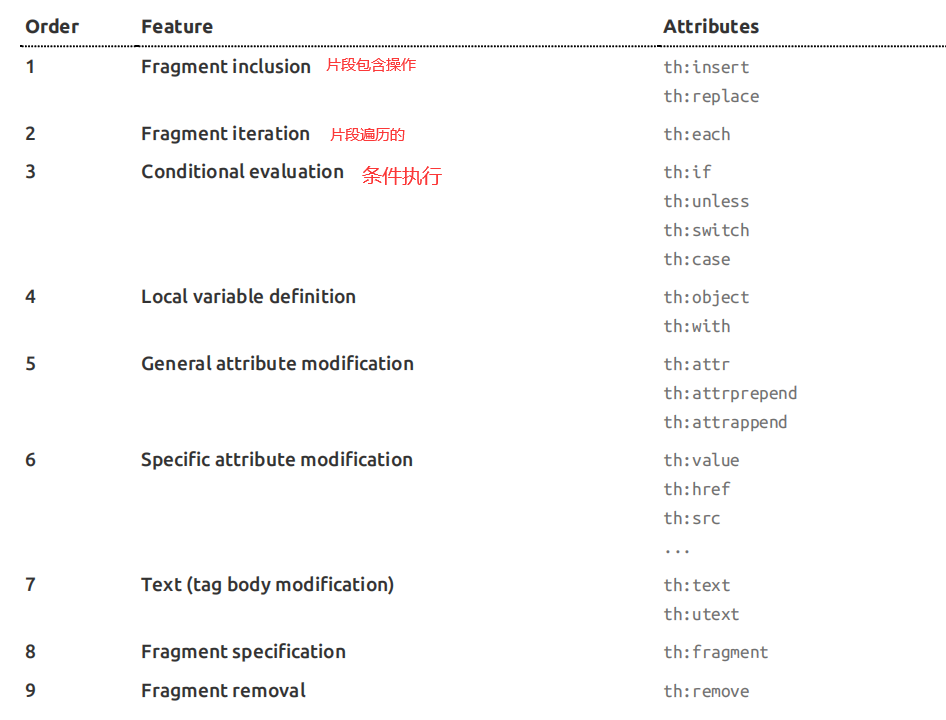

# Thymeleaf 使用和语法

## 导入

`ThymeleafProperties` 

```java
@ConfigurationProperties(prefix = "spring.thymeleaf")
public class ThymeleafProperties {

	private static final Charset DEFAULT_ENCODING = StandardCharsets.UTF_8;
	// 这里不就是SpringMVC视图解析器的拼串功能嘛，前缀后缀
	public static final String DEFAULT_PREFIX = "classpath:/templates/";

	public static final String DEFAULT_SUFFIX = ".html";
```

所以，只要我们把 html 页面放到 templates 里面，就会被自动渲染

## 导入名称空间

```html
<!DOCTYPE html>
<html lang="en" xmlns:th="http://www.thymeleaf.org">

```

## 语法规则



第一个 ：类似于 `jsp:include` 

第二个 ：类似于 `c:forEach` 
第三个 ：`c:if` 

第四个 ：生命变量用的 `c:set` 

第五个 ：任意属性修改操作，支持 `prepend` 在前面添加   ---  `append` 在后面添加内容

第六个 ：修改标签的指定属性的默认值

第七个 ：可以修改标签体内容 ：`utext` 是不转义的意思

第八个 ：声明片段的 ，

### ${} 里面能写什么表达式


```properties
Simple expressions: --------------------------------------（表达式语法）
    Variable Expressions: ${...}-------------------------------------- 用来获取变量值； 
    	1、获取对象的属性，还能调用方法，牛逼啊
    	2、使用内置的基本对象：
    		#ctx : the context object. 
    		#vars: the context variables. 
    		#locale : the context locale. 
    		#request : (only in Web Contexts) the HttpServletRequest object. 
    		#response : (only in Web Contexts) the HttpServletResponse object.
            #session : (only in Web Contexts) the HttpSession object. 
            #servletContext : (only in Web Contexts) the ServletContext object.
            ${application.foo}
		3、内置的一些工具对象；
			#execInfo : information about the template being processed. 
			#messages : methods for obtaining externalized messages inside variables expressions, in the 					same way as they would be obtained using 
			#{…} syntax. 
			#uris : methods for escaping parts of URLs/URIs Page 20 of 106
			#conversions : methods for executing the configured conversion service (if any). #dates : 						methods for java.util.Date objects: formatting, component extraction, etc. 
			#calendars : analogous to 
			#dates , but for java.util.Calendar objects. 
			#numbers : methods for formatting numeric objects. 
			#strings : methods for String objects: contains, startsWith, prepending/appending, etc.
            #objects : methods for objects in general. 
            #bools : methods for boolean evaluation.
            #arrays : methods for arrays. 
            #lists : methods for lists. 
            #sets : methods for sets. 
            #maps : methods for maps. 
            #aggregates : methods for creating aggregates on arrays or collections. 
            #ids : methods for dealing with id attributes that might be repeated (for example, as a result 					of an iteration).
    Selection Variable Expressions: *{...} ：----------------------------选择表达式；和 ${} 在功能上是一样的
    	1、补充 ：配合 th:object="${session.user}" 使用
    	<div th:object="${session.user}"> 
    	<p>Name: <span th:text="*{firstName}">Sebastian</span>.</p> 
    	<p>Surname: <span th:text="*{lastName}">Pepper</span>.</p>
        <p>Nationality: <span th:text="*{nationality}">Saturn</span>.</p> 
        </div>
        2、*{} 相当于${session.user} 这个对象，
    Message Expressions: #{...} ：--------------------------------------获取国际化内容的
    Link URL Expressions: @{...} ：--------------------------------------用来定义 URL 链接 的
    	1、xxx/project/hello?u=1&b=2 ---> @{xxx/project/hello(u=${u},b=2)}
    	2、相当于省去了 ？ 和 & ；并且在 url 总能够使用 ${} 表达式
    	3、如果不用 @{} 的话，直接这样写是不对的
    		xxx/project/hello?u=${u}
    	4、高级 ：可以直接写访问路径   @{/hello(u=${u})} 省去了主机名和端口号
    Fragment Expressions: ~{...} 
Literals --------------------------------------(字面量)
    Text literals: 'one text' , 'Another one!' ,… 
    Number literals: 0 , 34 , 3.0 , 12.3 ,… 
    Boolean literals: true , false 
    Null literal: null 
    Literal tokens: one , sometext , main ,… 
Text operations: --------------------------------------(文本操作)
    String concatenation: + 
    Literal substitutions: |The name is ${name}| 
Arithmetic operations: -------------------------------------- (数学运算)
    Binary operators: + , - , * , / , % 
    Minus sign (unary operator): - 
Boolean operations: --------------------------------------（布尔运算）
    Binary operators: and , or 
    Boolean negation (unary operator): ! , not 
Comparisons and equality: --------------------------------------（比较运算）
    Comparators: > , < , >= , <= ( gt , lt , ge , le ) 
    Equality operators: == , != ( eq , ne ) 
Conditional operators: --------------------------------------（条件运算）
    If-then: (if) ? (then) 
    If-then-else: (if) ? (then) : (else) --------------------------------------（三元运算）
    Default: (value) ?: (defaultvalue)
```


## 语法

### th:text

1. 将 获取后端数据，赋值

```html
<!DOCTYPE html>
<html xmlns:th="http://www.thymeleaf.org">
    <head>
        <meta charset="UTF-8">
        <title>Title</title>
    </head>
    <body>
        <h1>成功！</h1>
        <!--/*@thymesVar id="user" type="com.z.controller.HelloController"*/-->
        <div th:text="${user}"> nihao </div>
    </body>
</html>
```

#### 行内写法

```html
<div>
    [[icon]] ---》相当于 th:text="${icon}"
    [(icon)] ---》相当于th:utext="${icon}"
</div>
```

### th ：each

```html
<div th:each="user : ${users}">
    <span th:text="${user}"></span>
</div>
```

# 前端公共页面抽取

抽取公共代码片段

```html
<div th:fragment="commonFrag">
    这是一段可以被其他 .html 使用的片段
</div>
```

引用片段

QAQ 模版就是 html 网页的名字，

比如上面的网页名字叫做 template.html 那么  

下面就应该写 `~{template::commonFrag}`

模版名会使用 thymeleaf 的前后缀规则进行解析，也就是说  

如果上面的页面路径是  `classpath:tempates/second/template.html`  

那么下面引用的时候就应该这样写 `~{second/template::commonFrag}` 

```html
语法一、
~{templatename::selector} --> 模版名：：选择器
语法二、
~{templatename::fragmentname} --> 模版名::片段名
QAQ
<div th:insert="~{footer::commonFrag}">
    
</div>
```

通过id将片段获取

index_nav.html

```html
<html>
    <nav th:id="index_nav"></nav>
    xxxxxx
</html>
```

index.html

```html
<div th:insert="~{index_nav.html::#index_nav}">
    
</div>
```

## 三种方式的区别

将片段引入有三种方式，他们之间还是有区别的

1. `th:insert`
2. `th:replace` 
3. `th:include` 

看官方的示例

```html
<footer th:fragment="copy"> &copy; 2011 The Good Thymes Virtual Grocery </footer>
```

引入

```html
<body> ... 
<div th:insert="footer :: copy"></div> 
<div th:replace="footer :: copy"></div>
<div th:include="footer :: copy"></div>
</body>
```

效果

```html
<body> ... 
    <div> 
        <footer> &copy; 2011 The Good Thymes Virtual Grocery </footer> 
    </div> 
    
    <footer> &copy; 2011 The Good Thymes Virtual Grocery </footer>
    
    <div> &copy; 2011 The Good Thymes Virtual Grocery </div> 
</body>
```

总结一下 ：

1.  `th:insert` ：将被标记的片段插入，作为 `insert` 标签的子元素；
   1. `insert` 说 ：我想当你爸爸
   2.  `fragment` 变成了 `insert` 的儿子
2.  `th:replace` ：将被标记了 `replace` 的标签 ==完全替换== 成 标记了 `fragment` 的标签
   1. 我要变成你
   2. `replace` 变成了 `fragment` 
3.  `th:include` ：将被标记了 `include` 的标签里面的 ==内容== ，替换成 `fragment` 标签的 ==内容== 。
   1. 我不想当你爸爸，也不想变成你，我要你的子子孙孙
   2. `include` 获取了 `fragment` 的内容（子元素）

---

## 公共页面的动态高亮

引入片段的时候，传入参数

公共代码片段 `/templates/commons/bar.html` 

```html
<div th:fragment="sideBar">
    // 通过窜回来的值判断，如果是首页调用了这个代码片段，那么首页会传进来一个 activeUri=main.html ，通过这个判断设置高亮
    <li> <a th:class="${activeUri=='main.html'?'nav-link active':'nav-link'}" th:href="@{/main.html}">首页</a></li>
    <li><a th:class="${activeUri=='emps'?'nav-link active':'nav-link'}" th:href="@{/emps}">员工管理</a></li>
    <li></li>
    <li></li>
</div>
```

main.html

首页引用代码段，传一个参数

也可以传入多个参数 就像这样 `th:replace="~{commons/bar::sideBar(activeUri='main.html,second='value2')}"`

```html
<span th:replace="~{commons/bar::sideBar(activeUri='main.html')}"></span>
```

list.html

```html
<span th:replace="~{commons/bar::sideBar(activeUri='emps')}"></span>
```


# 日期格式化

如下所示，需要什么就用什么，懒得解释了

```shell
/** ====================================================================== * See javadoc API for class org.thymeleaf.expression.Dates * ====================================================================== */ /** Format date with the standard locale format * Also works with arrays, lists or sets */ ${#dates.format(date)} 
${#dates.arrayFormat(datesArray)} 
${#dates.listFormat(datesList)} 
${#dates.setFormat(datesSet)} 
/** Format date with the ISO8601 format * Also works with arrays, lists or sets */ 
${#dates.formatISO(date)} 
${#dates.arrayFormatISO(datesArray)} 
${#dates.listFormatISO(datesList)} 
${#dates.setFormatISO(datesSet)} 
/** Format date with the specified pattern * Also works with arrays, lists or sets */ 
${#dates.format(date, 'dd/MMM/yyyy HH:mm')} 
${#dates.arrayFormat(datesArray, 'dd/MMM/yyyy HH:mm')} 
${#dates.listFormat(datesList, 'dd/MMM/yyyy HH:mm')} 
${#dates.setFormat(datesSet, 'dd/MMM/yyyy HH:mm')} 
/** Obtain date properties * Also works with arrays, lists or sets */ 
${#dates.day(date)} 
// also arrayDay(...), listDay(...), etc. 
${#dates.month(date)} 
// also arrayMonth(...), listMonth(...), etc. 
${#dates.monthName(date)} 
// also arrayMonthName(...), listMonthName(...), etc. 
${#dates.monthNameShort(date)} 
// also arrayMonthNameShort(...), listMonthNameShort(...), etc. ${#dates.year(date)} 
// also arrayYear(...), listYear(...), etc. 
${#dates.dayOfWeek(date)} 
// also arrayDayOfWeek(...), listDayOfWeek(...), etc. 
${#dates.dayOfWeekName(date)}
// also arrayDayOfWeekName(...), listDayOfWeekName(...), etc. 
${#dates.dayOfWeekNameShort(date)} 
// also arrayDayOfWeekNameShort(...), listDayOfWeekNameShort(...), etc. 
${#dates.hour(date)} 
// also arrayHour(...), listHour(...), etc. 
${#dates.minute(date)} // also arrayMinute(...), listMinute(...), etc. ${#dates.second(date)} 
// also arraySecond(...), listSecond(...), etc. 
${#dates.millisecond(date)} 
// also arrayMillisecond(...), listMillisecond(...), etc. 
/** Create date (java.util.Date) objects from its components */ 
${#dates.create(year,month,day)} ${#dates.create(year,month,day,hour,minute)} 
${#dates.create(year,month,day,hour,minute,second)} ${#dates.create(year,month,day,hour,minute,second,millisecond)} 
/** Create a date (java.util.Date) object for the current date and time */ 
${#dates.createNow()} 
${#dates.createNowForTimeZone()} 
/** Create a date (java.util.Date) object for the current date (time set to 00:00)
```


# 动态处理单选框

这个 input 标签的类型是 radio（单选框） ，

需要实现的功能：数据从后端传回来的时候，会自动勾选之前选中的值

主要起作用就是这一句 `th:checked="${emp.gender==1}"` ，`th:checked` 如果表达式中的内容为真，radio 就会赋予 checked 属性

```html
<div class="form-group">
    <label>Gender</label>
    <div class="form-check form-check-inline">
        <input type="radio" class="form-check-input" name="gender" value="1"
               th:checked="${emp.gender==1}">
        <label class="form-check-label">男</label>
    </div>
    <div class="form-check form-check-inline">
        <input type="radio" class="form-check-input" name="gender" value="10"
               th:checked="${emp.gender==0}">
        <label class="form-check-label">女</label>
    </div>
</div>
```


# 动态处理下拉框

需要的功能：数据从后端回显的时候，检查下拉框应该选择什么，前端不是很精通，很难描述。用到的时候多看几遍代码吧。

```html
<div class="form-group">
    <label>department</label>
    <select th:name="department.id" class="form-control">
        <option
                th:selected="${dept.id == emp.department.id}"
                th:each="dept:${departments}"
                th:text="${dept.departmentName}" th:value="${dept.id}"/>
    </select>
</div>
```


# 给标签自定义属性

使用

`th:arrt="field=${value},field2=${value2}"` 

使用场景

配合 `js`/`jq` 使用，在 js 中获取这个属性值做一些操作

目前的理解就是，这个东西就是用来给js获取标签的特定属性值的，意义重大

```html
<tr>
    <td th:each="$emp:{emps}">
        <button th:attr="del_uri=@{/emp/} + ${emp.id}" class="btn btn-sm btn-danger deleteBtn">删除</button>
    </td>
</tr>
<form method="post" id="deleteForm">
    <input type="hidden" name="_method" value="delete"/>
</form>
<script>
// 通过 class 获取 button ，因为button有很多个并且是遍历自动生成的，所以不能为他们设置id ，
$(".deleteBtn").click(function() {
    // 获取自定义的标签属性值
    var del_uri = $("this").attr("del_uri");
    $("deleteForm").attr("action", del_uri).submit();
    // 禁用 btn 的默认行为，虽然这里没有默认行为
    return false;
})
</script>        
```


