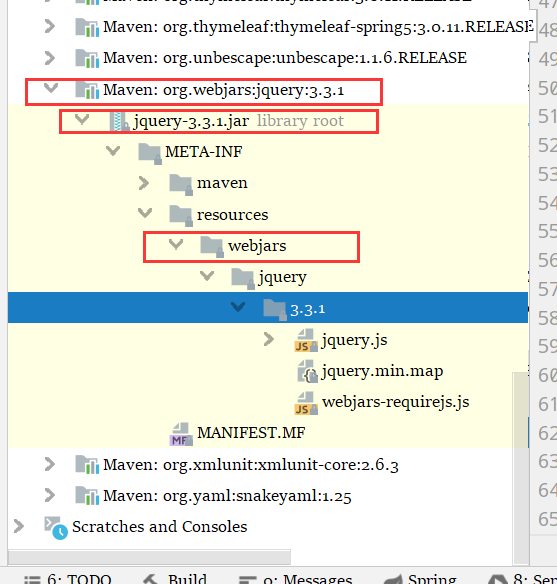

跟踪自动配置文件

C- 表示类，M-表示方法 F-表示字段

路径  C-WebMvcAutoConfiguration--》M-addResourceHandlers --》C-WebMvcProperties--》stathcPathPattern

```java
@ConfigurationProperties(prefix = "spring.resources", ignoreUnknownFields = false)
public class ResourceProperties {
// 可以设置和静态资源有关的参数，比如说缓存时间等
```


# `WebMvcAutoConfiguration`   

下的方法

添加资源处理器

```java
@Override
public void addResourceHandlers(ResourceHandlerRegistry registry) {
    if (!this.resourceProperties.isAddMappings()) {
        logger.debug("Default resource handling disabled");
        return;
    }
    Duration cachePeriod = this.resourceProperties.getCache().getPeriod();
    CacheControl cacheControl = this.resourceProperties.getCache().getCachecontrol().toHttpCacheControl();
    if (!registry.hasMappingForPattern("/webjars/**")) {
        // 手动重要
        customizeResourceHandlerRegistration(registry.addResourceHandler("/webjars/**")
                                             .addResourceLocations("classpath:/META-INF/resources/webjars/")
                                             .setCachePeriod(getSeconds(cachePeriod)).setCacheControl(cacheControl));
    }
    String staticPathPattern = this.mvcProperties.getStaticPathPattern();
    if (!registry.hasMappingForPattern(staticPathPattern)) {
        // 手动标签
        customizeResourceHandlerRegistration(registry.addResourceHandler(staticPathPattern)
                                             .addResourceLocations(getResourceLocations(this.resourceProperties.getStaticLocations()))
                                             .setCachePeriod(getSeconds(cachePeriod)).setCacheControl(cacheControl));
    }
}
```


所有 `/webjars/**` 下的请求都去 :`classpath:/META-INF/resources/webjars/` 这里找资源


staticPathPattern ：这个属性的值是 `/**` 

1. 在 `WebMvcProperties` 类中
2. 表示  可以访问当前项目任何资源，


```java
@ConfigurationProperties(prefix = "spring.resources", ignoreUnknownFields = false)
public class ResourceProperties {

	private static final String[] CLASSPATH_RESOURCE_LOCATIONS = { "classpath:/META-INF/resources/",
			"classpath:/resources/", "classpath:/static/", "classpath:/public/" };

	/**
	 * Locations of static resources. Defaults to classpath:[/META-INF/resources/,
	 * /resources/, /static/, /public/].
	 */
	private String[] staticLocations = CLASSPATH_RESOURCE_LOCATIONS;
```

这几个表示静态资源的文件夹：SpringBoot会自动在这些地方找静态资源，如果找不到那就没有，所以静态资源别放错位置了 

## 映射

```java
{ "classpath:/META-INF/resources/",
、"classpath:/resources/", 
 "classpath:/static/", 
 "classpath:/public/" };
"/"  当前项目的根路径
```


## 自定义静态资源映射

application.properties

```properties
spring.resources.static-locations=classpath:/custom,classpath:/mystatic
```

注意，如果有多个静态资源路径，要用逗号隔开


# 欢迎页

路径 ：C-WebMvcAutoconfiguration--》M-WelcomePageHandlerMapping--》C-getWelcome--》

欢迎页 ：静态资源文件夹下所有的 index.html 都会被 `/**` 映射 ；

```java
@Bean
public WelcomePageHandlerMapping welcomePageHandlerMapping(ApplicationContext applicationContext,
                                                           FormattingConversionService mvcConversionService, ResourceUrlProvider mvcResourceUrlProvider) {
    WelcomePageHandlerMapping welcomePageHandlerMapping = new WelcomePageHandlerMapping(
        new TemplateAvailabilityProviders(applicationContext), applicationContext, getWelcomePage(),
        this.mvcProperties.getStaticPathPattern());
    welcomePageHandlerMapping.setInterceptors(getInterceptors(mvcConversionService, mvcResourceUrlProvider));
    return welcomePageHandlerMapping;
}
```


加载在 `staticPathPattern` 这些路径下的，第一个 index.html

```java
private Optional<Resource> getWelcomePage() {
			String[] locations = getResourceLocations(this.resourceProperties.getStaticLocations());
    		// 据我猜测，findFirst() 就是找第一个的意思
			return Arrays.stream(locations).map(this::getIndexHtml).filter(this::isReadable).findFirst();
		}

		private Resource getIndexHtml(String location) {
			return this.resourceLoader.getResource(location + "index.html");
		}
```

例如 ： `localhost:8080j/` 就会在众多默认静态资源路径中找 index.html  ，找到就显示，没找到就404


# 图标


# 什么是 webjars

以jar包的方式提供前端的资源

去哪里找 ：https://www.webjars.org/ 





只需要引入依赖

就可以通过这种方式 `http://localhost:8080/boot04/webjars/jquery/3.3.1/jquery.js` 访问资源


