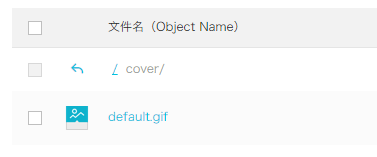
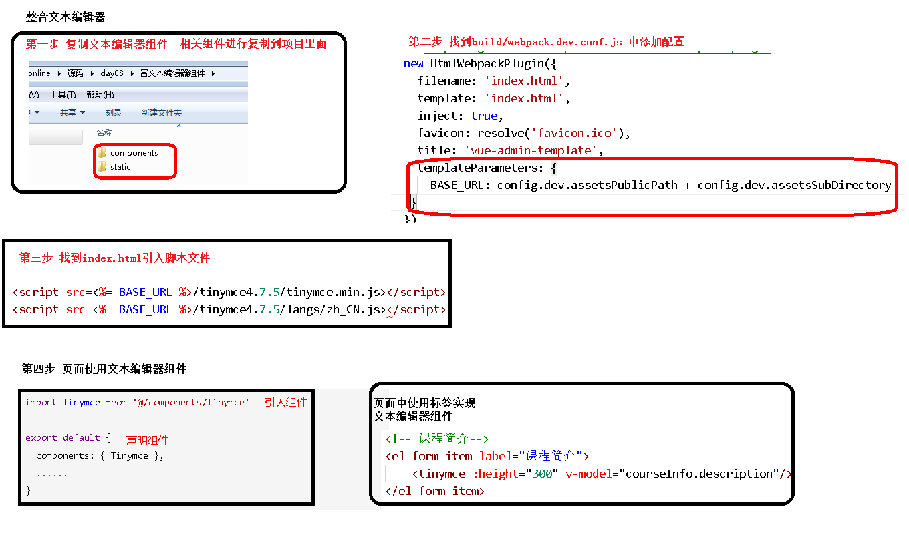

# 1.二级联动实现

vue+element ui 实现

由于数据结构不一定相同 所以给前端的记一下就好了    想不起来就看项目


## 组件


```vue
<!-- 所属分类 TODO -->
<el-form-item label="课程分类">
    <el-select v-model="courseInfo.subjectParentId" placeholder="一级分类" @change="getTwoList">
        <el-option
                   <!-- 遍历  看得懂吧 -->
                   v-for="subject in subjectOneList"
                   :key="subject.id"
                   :label="subject.title"
                   :value="subject.id"
                   ></el-option>
    </el-select>

    <el-select v-model="courseInfo.subjectId" placeholder="二级分类">
        <el-option
                   v-for="subject in subjectTwoList"
                   :key="subject.id"
                   :label="subject.title"
                   :value="subject.id"
                   ></el-option>
    </el-select>
</el-form-item>
```


获取二级分类的多种方法

1. 通过监听一级分类的 **改变事件** ，从数据库中查询出当前一级分类下的 二级分类  
2. 如果数据结构设计得好的话  ，可以直接在前端获取当前 一级 的 二级 如下

```js
// 获取二级分类列表
getTwoList(value) {
    this.courseInfo.subjectId = "";
    // 遍历所有分类中有1级分类的分类
    for (var i = 0; i < this.subjectOneList.length; i++) {
        if (this.subjectOneList[i].id == value) {
            this.subjectTwoList = this.subjectOneList[i].children;
        }
    }
},
    // 查询所有的一级分类
    getOneSubject() {
        subject.getSubjectList().then((res) => {
            this.subjectOneList = res.data.list;
        });
    },
```


# 2.文件上传


## 一、整合上传组件

参考 http://element-cn.eleme.io/#/zh-CN/component/upload 用户头像上传

### 1、上传默认封面

创建文件夹cover，上传默认的课程封面



### 2、定义默认封面

 

```
const defaultForm = {
  ......,
  cover: process.env.OSS_PATH + '/cover/default.gif',
  ......
}
```

### 3、定义data数据

 // 这个很重要  主要是没见过。

作用是获取配置文件中配置好的 `localhost:8080` 这一段

```
BASE_API: process.env.BASE_API // 接口API地址
```

### 4、组件模板

在info.vue中添加上传组件模板

 

```js
<!-- 课程封面-->
<el-form-item label="课程封面">
  <el-upload
    :show-file-list="false"
    :on-success="handleAvatarSuccess"
    :before-upload="beforeAvatarUpload"
    :action="BASE_API+'/admin/oss/file/upload?host=cover'"
    class="avatar-uploader">
    
  </el-upload>
</el-form-item>
```

### 5、结果回调

 

```js
handleAvatarSuccess(res, file) {
  console.log(res)// 上传响应
  console.log(URL.createObjectURL(file.raw))// base64编码
    // 将返回的 url 保存起来
  this.courseInfo.cover = res.data.url
},
beforeAvatarUpload(file) {
  const isJPG = file.type === 'image/jpeg'
  const isLt2M = file.size / 1024 / 1024 < 2
  if (!isJPG) {
    this.$message.error('上传头像图片只能是 JPG 格式!')
  }
  if (!isLt2M) {
    this.$message.error('上传头像图片大小不能超过 2MB!')
  }
  return isJPG && isLt2M
}
```

## 二、修改后端api

### 1、修改上传controller

添加host可选参数

 

```js
/**
     * 文件上传
     *
     * @param file
     */
@ApiOperation(value = "文件上传")
@PostMapping("upload")
public R upload(
    @ApiParam(name = "file", value = "文件", required = true)
    @RequestParam("file") MultipartFile file,
    @ApiParam(name = "host", value = "文件上传路径", required = false)) {
    String uploadUrl = fileService.upload(file);
    //返回r对象
    return R.ok().message("文件上传成功").data("url", uploadUrl);
}
```

### 2、综合测试


---

# 3.富文本编辑器


## 一、Tinymce可视化编辑器

参考

效果图在这

https://panjiachen.gitee.io/vue-element-admin/#/components/tinymce

https://panjiachen.gitee.io/vue-element-admin/#/example/create 

## 二、组件初始化

Tinymce是一个传统javascript插件，默认不能用于Vue.js因此需要做一些特殊的整合步骤

### 1、复制脚本库

将脚本库复制到项目的static目录下（在vue-element-admin-master的static路径下）

### 2、配置html变量

在 guli-admin/build/webpack.dev.conf.js 中添加配置

使在html页面中可是使用这里定义的BASE_URL变量

 

```
new HtmlWebpackPlugin({
    ......,
    templateParameters: {
        BASE_URL: config.dev.assetsPublicPath + config.dev.assetsSubDirectory
    }
})
```

### 3、引入js脚本

在guli-admin/index.html 中引入js脚本

 

```html
<script src=<%= BASE_URL %>/tinymce4.7.5/tinymce.min.js></script>
<script src=<%= BASE_URL %>/tinymce4.7.5/langs/zh_CN.js></script>
```


做完这步如果报错，重启一下服务器 `npm run dev` 


## 三、组件引入


为了让Tinymce能用于Vue.js项目，vue-element-admin-master对Tinymce进行了封装，下面我们将它引入到我们的课程信息页面

### 1、复制组件

src/components/Tinymce

### 2、引入组件

课程信息组件中引入 Tinymce

 

```
import Tinymce from '@/components/Tinymce'
export default {
  components: { Tinymce },
  ......
}
```

### 3、组件模板

 

```
<!-- 课程简介-->
<el-form-item label="课程简介">
    <tinymce :height="300" v-model="courseInfo.description"/>
</el-form-item>
```

### 4、组件样式

在info.vue文件的最后添加如下代码，调整上传图片按钮的高度

 

```
<style scoped>
.tinymce-container {
  line-height: 29px;
}
</style>
```

### 5、图片的base64编码

Tinymce中的图片上传功能直接存储的是图片的base64编码，因此无需图片服务器

## 步骤



---

# 3.vue框架获取 router传过来的参数

比如这种，在路由中以这种形式传过来的 

`/father/son/:id` 

取值

```js
// 先判断路由跳转中是否有参数过来，如果有就获取，没有就不获取
if (this.$route.params && this.$route.params.id) {
    this.id = this.$route.params.id
}
```

举一反三：

如果路径是这样  `/father/son/:username` 

那么获取username 是否可以这样写？

```js
this.param = this.$route.params.id
```


---

# 4.下拉列表的回显问题

## 当前项目场景：

 课程分类 属于两级联动

课程添加的时候 课程分类在初始化的时候获取，并且通过监听 一级分类 改变事件`@change` 来动态获取二级分类

但是

添加当添加课程这个页面被返回时候，需要数据回显

这时候就会出现这样的问题

一级分类能够获取，但是二级分类不能够获取

## 解决：

info.vue

```js
export default{
    data() {
        return {}
    },
    created() {
        // 获取路由中的id，路由中有传id，表示是更新操作，需要回显
        if (this.$route.params && this.$route.params.id) {
            this.courseId = this.$route.params.id;
            this.getInfo(this.courseId);
        } else {
            // 路由中没有id，表示是添加操作。不需要回显
            // 初始化所有讲师
            this.getListTeacher();
            this.getOneSubject();
        }
    },
    methods: {
        // 根据课程id查询信息,回显时候被调用
        getInfo() {
            course.getCourseInfo(this.courseId).then((res) => {
                this.courseInfo = res.data.courseInfoVo;

                // 1.查询出所有的课程分类
                subject.getSubjectList()
                    .then(res => {
                    // 获取所有的一级分类
                    this.subjectOneList = res.data.list

                    // 3.把所有一级分类的数组，进行遍历，比较当前 courseInfo 里面的一级分类id和所有的id比较
                    for (var i = 0; i < this.subjectOneList.length; i++) {
                        // 获取里面的每个一级分类
                        var oneSubject = this.subjectOneList[i];

                        // 比较当前的 id
                        if (this.courseInfo.subjectParentId == oneSubject.id) {
                            // 获取一级分类中的所有二级分类
                            this.subjectTwoList = oneSubject.children
                        }
                    }
                })
            });
        },
    }
}
```

## 总结

这种属于  数组回显问题   ，关键在于用什么办法将回显时的数组数据处理好


---

# 5.回显后，路由状态变化 页面刷新问题

## 情景：

表单的数据被回显，但是路由修改之后回显的数据并没有被清楚


## 解决：


思路：

监听路由变化，当路由变化时，通过判断，决定是初始化表单数据还是回显数据


```js
export default{
    data() {
        return {}
    },
    created() {
        this.init()
    },
    watch() {
        $.route(to, from) {
            this.init()
        }
    },
    methods: {
        init() {
            if (this.$route.params && this.$route.params.id) {
                // 如果当前路由有id属性，就做这个
                this.id = this.$route.params.id
            } else {
                // 如果没有，就这个
                this.getInfo();
            }
        }
    }
}
```


---


# 6.拦截器实现

作用：拦截前端的axios请求，做一些操作

比如：

判断是否存在 xx token ，如果存在就干嘛干嘛 如果不存在  就干嘛干嘛

```js
import axios from 'axios'
import cookie from 'js-cookie'
// 创建axios实例
const service = axios.create({
    baseURL: 'http://localhost:9001', // api的base_url
    timeout: 20000 // 请求超时时间
})
// 使用拦截器
service.interceptors.request.use(
    config => {
        //debugger
        if (cookie.get('guli_token')) {
            // 把获取的token放到header里面
            config.headers['token'] = cookie.get('guli_token');
        }
        return config
    },
    err => {
        return Promise.reject(err);
    }
)
```


---


# 7.get方式取值

`localhost:3000/api?token=xxx` 

如何获取到url后面的 token 的值？

环境：vue router


```js
this.$route.query.token
```


---


# 8.VUE图表插件


## 一、ECharts

### 1、简介

ECharts是百度的一个项目，后来百度把Echart捐给apache，用于图表展示，提供了常规的[折线图](https://echarts.baidu.com/option.html#series-line)、[柱状图](https://echarts.baidu.com/option.html#series-line)、[散点图](https://echarts.baidu.com/option.html#series-scatter)、[饼图](https://echarts.baidu.com/option.html#series-pie)、[K线图](https://echarts.baidu.com/option.html#series-candlestick)，用于统计的[盒形图](https://echarts.baidu.com/option.html#series-boxplot)，用于地理数据可视化的[地图](https://echarts.baidu.com/option.html#series-map)、[热力图](https://echarts.baidu.com/option.html#series-heatmap)、[线图](https://echarts.baidu.com/option.html#series-lines)，用于关系数据可视化的[关系图](https://echarts.baidu.com/option.html#series-graph)、[treemap](https://echarts.baidu.com/option.html#series-treemap)、[旭日图](https://echarts.baidu.com/option.html#series-sunburst)，多维数据可视化的[平行坐标](https://echarts.baidu.com/option.html#series-parallel)，还有用于 BI 的[漏斗图](https://echarts.baidu.com/option.html#series-funnel)，[仪表盘](https://echarts.baidu.com/option.html#series-gauge)，并且支持图与图之间的混搭。

官方网站：https://echarts.baidu.com/

### 2、基本使用

入门参考：官网->文档->教程->5分钟上手ECharts

（1）创建html页面：柱图.html

（2）引入ECharts

 

```jsx
<!-- 引入 ECharts 文件 -->
<script src="echarts.min.js"></script>
```

（3）定义图表区域

 

```html
<!-- 为ECharts准备一个具备大小（宽高）的Dom -->
<div id="main" style="width: 600px;height:400px;"></div> 
```

（4）渲染图表

 

```js
<script type="text/javascript">
    // 基于准备好的dom，初始化echarts实例
    var myChart = echarts.init(document.getElementById('main'));
    // 指定图表的配置项和数据
    var option = {
        title: {
            text: 'ECharts 入门示例'
        },
        tooltip: {},
        legend: {
            data:['销量']
        },
        xAxis: {
            data: ["衬衫","羊毛衫","雪纺衫","裤子","高跟鞋","袜子"]
        },
        yAxis: {},
        series: [{
            name: '销量',
            type: 'bar',
            data: [5, 20, 36, 10, 10, 20]
        }]
    };
    // 使用刚指定的配置项和数据显示图表。
    myChart.setOption(option);
</script>
```

### 3、折线图

实例参考：官网->实例->官方实例 https://echarts.baidu.com/examples/

折线图.html

 

```js
<script>
    var myChart = echarts.init(document.getElementById('main'));
    var option = {
        //x轴是类目轴（离散数据）,必须通过data设置类目数据
        xAxis: {
            type: 'category',
            data: ['Mon', 'Tue', 'Wed', 'Thu', 'Fri', 'Sat', 'Sun']
        },
        //y轴是数据轴（连续数据）
        yAxis: {
            type: 'value'
        },
        //系列列表。每个系列通过 type 决定自己的图表类型
        series: [{
            //系列中的数据内容数组
            data: [820, 932, 901, 934, 1290, 1330, 1320],
            //折线图
            type: 'line'
        }]
    };
    myChart.setOption(option);
</script>
```

## 二、项目中集成ECharts

### 1、安装ECharts

 

```shell
npm install --save echarts@4.1.0
```

### 2、增加路由

src/router/index.js

在统计分析路由中增加子路由

 

```js
{
    path: 'chart',
    name: 'StatisticsDayChart',
    component: () => import('@/views/statistics/daily/chart'),
    meta: { title: '统计图表' }
}  
```

### 3、创建组件

src/views/statistics/daily/chart.vue

**模板**

 

```js
<template>
  <div class="app-container">
    <!--表单-->
    <el-form :inline="true" class="demo-form-inline">
      <el-form-item>
        <el-select v-model="searchObj.type" clearable placeholder="请选择">
          <el-option label="学员登录数统计" value="login_num"/>
          <el-option label="学员注册数统计" value="register_num"/>
          <el-option label="课程播放数统计" value="video_view_num"/>
          <el-option label="每日课程数统计" value="course_num"/>
        </el-select>
      </el-form-item>
      <el-form-item>
        <el-date-picker
          v-model="searchObj.begin"
          type="date"
          placeholder="选择开始日期"
          value-format="yyyy-MM-dd" />
      </el-form-item>
      <el-form-item>
        <el-date-picker
          v-model="searchObj.end"
          type="date"
          placeholder="选择截止日期"
          value-format="yyyy-MM-dd" />
      </el-form-item>
      <el-button
        :disabled="btnDisabled"
        type="primary"
        icon="el-icon-search"
        @click="showChart()">查询</el-button>
    </el-form>
    <div class="chart-container">
      <div id="chart" class="chart" style="height:500px;width:100%" />
    </div>
  </div>
</template>
```

**js：暂时显示临时数据**

 

```js
<script>
import echarts from 'echarts'
export default {
  data() {
    return {
      searchObj: {
        type: '',
        begin: '',
        end: ''
      },
      btnDisabled: false,
      chart: null,
      title: '',
      xData: [],
      yData: []
    }
  },
  methods: {
    showChart() {
      this.initChartData()
      this.setChart()
    },
    // 准备图表数据
    initChartData() {
    },
    // 设置图标参数
    setChart() {
      // 基于准备好的dom，初始化echarts实例
      this.chart = echarts.init(document.getElementById('chart'))
      // console.log(this.chart)
      // 指定图表的配置项和数据
      var option = {
        // x轴是类目轴（离散数据）,必须通过data设置类目数据
        xAxis: {
          type: 'category',
          data: ['Mon', 'Tue', 'Wed', 'Thu', 'Fri', 'Sat', 'Sun']
        },
        // y轴是数据轴（连续数据）
        yAxis: {
          type: 'value'
        },
        // 系列列表。每个系列通过 type 决定自己的图表类型
        series: [{
          // 系列中的数据内容数组
          data: [820, 932, 901, 934, 1290, 1330, 1320],
          // 折线图
          type: 'line'
        }]
      }
      this.chart.setOption(option)
    }
  }
}
</script>
```

## 三、完成后端业务

### 1、controller

 

```java
@GetMapping("show-chart/{begin}/{end}/{type}")
public R showChart(@PathVariable String begin,@PathVariable String end,@PathVariable String type){
    Map<String, Object> map = dailyService.getChartData(begin, end, type);
    return R.ok().data(map);
}
```

### 2、service

**接口**

 

```js
Map<String, Object> getChartData(String begin, String end, String type);
```

**实现**

 

```js
@Override
public Map<String, Object> getChartData(String begin, String end, String type) {
    QueryWrapper<Daily> dayQueryWrapper = new QueryWrapper<>();
    dayQueryWrapper.select(type, "date_calculated");
    dayQueryWrapper.between("date_calculated", begin, end);
    List<Daily> dayList = baseMapper.selectList(dayQueryWrapper);
    Map<String, Object> map = new HashMap<>();
    List<Integer> dataList = new ArrayList<Integer>();
    List<String> dateList = new ArrayList<String>();
    map.put("dataList", dataList);
    map.put("dateList", dateList);
    for (int i = 0; i < dayList.size(); i++) {
        Daily daily = dayList.get(i);
        dateList.add(daily.getDateCalculated());
        switch (type) {
            case "register_num":
                dataList.add(daily.getRegisterNum());
                break;
            case "login_num":
                dataList.add(daily.getLoginNum());
                break;
            case "video_view_num":
                dataList.add(daily.getVideoViewNum());
                break;
            case "course_num":
                dataList.add(daily.getCourseNum());
                break;
            default:
                break;
        }
    }
    return map;
}
```

## 四、前后端整合

### 1、创建api

src/api/statistics/daily.js中添加方法

 

```js
showChart(searchObj) {
    return request({
        url: `${api_name}/show-chart/${searchObj.begin}/${searchObj.end}/${searchObj.type}`,
        method: 'get'
    })
}
```

### 2、chart.vue中引入api模块

 

```js
import daily from '@/api/statistics/daily'
......
```

### 3、修改initChartData方法

 

```js
showChart() {
  this.initChartData()
  // this.setChart()//放在initChartData回调中执行
},
// 准备图表数据
initChartData() {
  daily.showChart(this.searchObj).then(response => {
    // 数据
    this.yData = response.data.dataList
    // 横轴时间
    this.xData = response.data.dateList
    // 当前统计类别
    switch (this.searchObj.type) {
      case 'register_num':
        this.title = '学员注册数统计'
        break
      case 'login_num':
        this.title = '学员登录数统计'
        break
      case 'video_view_num':
        this.title = '课程播放数统计'
        break
      case 'course_num':
        this.title = '每日课程数统计'
        break
    }
    this.setChart()
  })
},
```

### 4、修改options中的数据

 

```js
xAxis: {
    type: 'category',
    data: this.xData//-------绑定数据
},
// y轴是数据轴（连续数据）
yAxis: {
    type: 'value'
},
// 系列列表。每个系列通过 type 决定自己的图表类型
series: [{
    // 系列中的数据内容数组
    data: this.yData,//-------绑定数据
    // 折线图
    type: 'line'
}],
```

## 五、样式调整

参考配置手册：https://echarts.baidu.com/option.html#title

### 1、显示标题

 

```js
title: {
    text: this.title
},
```

### 2、x坐标轴触发提示

 

```js
tooltip: {
    trigger: 'axis'
},
```

### 3、区域缩放

 

```js
dataZoom: [{
  show: true,
  height: 30,
  xAxisIndex: [
    0
  ],
  bottom: 30,
  start: 10,
  end: 80,
  handleIcon: 'path://M306.1,413c0,2.2-1.8,4-4,4h-59.8c-2.2,0-4-1.8-4-4V200.8c0-2.2,1.8-4,4-4h59.8c2.2,0,4,1.8,4,4V413z',
  handleSize: '110%',
  handleStyle: {
    color: '#d3dee5'
  },
  textStyle: {
    color: '#fff'
  },
  borderColor: '#90979c'
},
{
  type: 'inside',
  show: true,
  height: 15,
  start: 1,
  end: 35
}]
```


