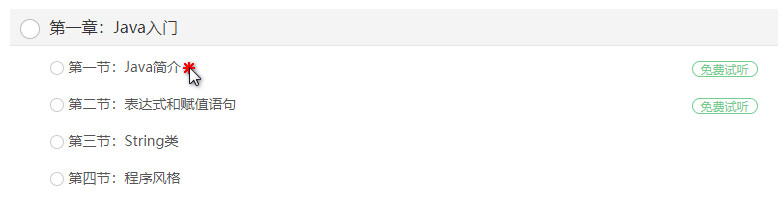

# maven导包

2020-7-25 ：aliyun-sdk-vod-upload 还没有开源，需要手动将 这个jar 包 安装包本地仓库 。。。。。。

```xml
<dependencies>
    <dependency>
        <groupId>com.aliyun</groupId>
        <artifactId>aliyun-java-sdk-core</artifactId>
    </dependency>
    <dependency>
        <groupId>com.aliyun.oss</groupId>
        <artifactId>aliyun-sdk-oss</artifactId>
    </dependency>
    <dependency>
        <groupId>com.aliyun</groupId>
        <artifactId>aliyun-java-sdk-vod</artifactId>
    </dependency>
    <dependency>
        <groupId>com.aliyun</groupId>
        <artifactId>aliyun-sdk-vod-upload</artifactId>
    </dependency>
    <dependency>
        <groupId>com.alibaba</groupId>
        <artifactId>fastjson</artifactId>
    </dependency>
    <dependency>
        <groupId>org.json</groupId>
        <artifactId>json</artifactId>
    </dependency>
    <dependency>
        <groupId>com.google.code.gson</groupId>
        <artifactId>gson</artifactId>
    </dependency>

    <dependency>
        <groupId>joda-time</groupId>
        <artifactId>joda-time</artifactId>
    </dependency>
</dependencies>
```


# application.properties 配置

```properties
# 服务端口
server.port=8003
# 服务名
spring.application.name=service-vod

# 环境设置：dev、test、prod
spring.profiles.active=dev

#阿里云 vod
#不同的服务器，地址不同
aliyun.oss.file.keyid=LTAI4G7sfchisWeEzf2GxvLA
aliyun.oss.file.keysecret=VvY8UYu4bRwxO2RlPHe52vnIYRIZ7c

# 最大上传单个文件大小：默认1M
spring.servlet.multipart.max-file-size=1024MB
# 最大置总上传的数据大小 ：默认10M
spring.servlet.multipart.max-request-size=1024MB
```


```java
public class TestVod {


    private static String accessKeyId = "LTAI4G7sfchisWeEzf2GxvLA";
    private static String accessKeySecret = "VvY8UYu4bRwxO2RlPHe52vnIYRIZ7c";
    private static String fileName;
    private static String title;

// 这是上传文件的
    public static void main(String[] args) throws ClientException {
        fileName = "F:\\java_Stu\\尚硅谷谷粒学院项目视频教程\\项目资料\\1-阿里云上传测试视频\\001.mp4";
        title = "test1";
        UploadVideoRequest request = new UploadVideoRequest(accessKeyId, accessKeySecret, title, fileName);
        /* 可指定分片上传时每个分片的大小，默认为2M字节 */
        request.setPartSize(2 * 1024 * 1024L);
        /* 可指定分片上传时的并发线程数，默认为1，(注：该配置会占用服务器CPU资源，需根据服务器情况指定）*/
        request.setTaskNum(1);


        UploadVideoImpl uploader = new UploadVideoImpl();
        UploadVideoResponse response = uploader.uploadVideo(request);
        System.out.print("RequestId=" + response.getRequestId() + "\n");  //请求视频点播服务的请求ID
        if (response.isSuccess()) {
            System.out.print("VideoId=" + response.getVideoId() + "\n");
        } else {
            /* 如果设置回调URL无效，不影响视频上传，可以返回VideoId同时会返回错误码。其他情况上传失败时，VideoId为空，此时需要根据返回错误码分析具体错误原因 */
            System.out.print("VideoId=" + response.getVideoId() + "\n");
            System.out.print("ErrorCode=" + response.getCode() + "\n");
            System.out.print("ErrorMessage=" + response.getMessage() + "\n");
        }
    }

    // // 获取aliyun vod 中视频的 凭证
    public static void getPlayAuth() throws ClientException {
        DefaultAcsClient client = InitObject.initVodClient("LTAI4G7sfchisWeEzf2GxvLA", "VvY8UYu4bRwxO2RlPHe52vnIYRIZ7c");

        GetVideoPlayAuthRequest req = new GetVideoPlayAuthRequest();
        GetVideoPlayAuthResponse resp = null;

        req.setVideoId("f16b04b43a51418b93f07249111822da");

        resp = client.getAcsResponse(req);

        System.out.println(resp.getPlayAuth());
        System.out.println(resp.getVideoMeta().getTitle());
        System.out.println(resp.getVideoMeta().getCoverURL());
    }

    // 获取aliyun vod 中视频的 id
    public static void getPlayUrl() throws ClientException {
        DefaultAcsClient client = null;
        // 1.根据视频id，获取播放地址
        try {
            // 创建初始化对象
            client = InitObject.initVodClient("LTAI4G7sfchisWeEzf2GxvLA", "VvY8UYu4bRwxO2RlPHe52vnIYRIZ7c");
        } catch (ClientException e) {
            e.printStackTrace();
        }

        // 创建获取视频地址request和response
        GetPlayInfoRequest request = new GetPlayInfoRequest();

        GetPlayInfoResponse response = new GetPlayInfoResponse();

        // 想request对象里面设置视频id
        request.setVideoId("f16b04b43a51418b93f07249111822da");

        // 调用初始化对象里面的方法，传递request，获取数据
        response = client.getAcsResponse(request);


        List<GetPlayInfoResponse.PlayInfo> playInfoList = response.getPlayInfoList();
        //播放地址
        for (GetPlayInfoResponse.PlayInfo playInfo : playInfoList) {
            System.out.print("PlayInfo.PlayURL = " + playInfo.getPlayURL() + "\n");
        }
        //Base信息
        System.out.print("VideoBase.Title = " + response.getVideoBase().getTitle() + "\n");
    }
}

```


# 上传视频示例


```java
@Override
public String uploadVideoAly(MultipartFile file) {
    try {
        InputStream inputStream = null;

        String fileName = file.getOriginalFilename();

        String title = fileName.substring(0, fileName.lastIndexOf("."));

        inputStream = file.getInputStream();

        UploadStreamRequest request = new UploadStreamRequest(
            // 这个是。。看得懂就行了
            ConstantVodUtils.KEY_ID,
            ConstantVodUtils.KEY_SECRET,
            title, fileName, inputStream);

        UploadVideoImpl uploader = new UploadVideoImpl();
        UploadStreamResponse response = uploader.uploadStream(request);
        String videoId = "";


        if (response.isSuccess()) {
            videoId = response.getVideoId();
        } else {
            //如果设置回调URL无效，不影响视频上传，可以返回VideoId同时会返回错误码。其他情况上传失败时，VideoId为空，此时需要根据返回错误码分析具体错误原因
            videoId = response.getVideoId();
        }
        return videoId;
    } catch (IOException e) {
        e.printStackTrace();
        return null;
    }

}
```

这个方法，在controller调用一下就可以了


---


# 前端视频播放


## 一、获取播放地址播放

### 获取播放地址

参考文档：[https://help.aliyun.com/document_detail/61064.html](https://help.aliyun.com/document_detail/61064.html?spm=a2c4g.11186623.6.828.554d58fcATFiz3#h2--div-id-getplayinfo-div-)

前面的 03-使用服务端SDK 介绍了如何获取非加密视频的播放地址。直接使用03节的例子获取加密视频播放地址会返回如下错误信息

Currently only the AliyunVoDEncryption stream exists, you must use the Aliyun player to play or set the value of ResultType to Multiple.

目前只有AliyunVoDEncryption流存在，您必须使用Aliyun player来播放或将ResultType的值设置为Multiple。

因此在testGetPlayInfo测试方法中添加 ResultType 参数，并设置为true

 

```
privateParams.put("ResultType", "Multiple");
```

此种方式获取的视频文件不能直接播放，必须使用阿里云播放器播放

## **二、视频播放器**

参考文档：[https://help.aliyun.com/document_detail/61109.html](https://help.aliyun.com/document_detail/61109.html?spm=a2c4g.11186623.6.975.9ea624d8CwyqYN)

### 1、视频播放器介绍

阿里云播放器SDK（ApsaraVideo Player SDK）是阿里视频服务的重要一环，除了支持点播和直播的基础播放功能外，深度融合视频云业务，如支持视频的加密播放、安全下载、清晰度切换、直播答题等业务场景，为用户提供简单、快速、安全、稳定的视频播放服务。

### 2、集成视频播放器

参考文档：https://help.aliyun.com/document_detail/51991.html

参考 【**播放器简单使用说明】**一节

引入脚本文件和css文件

 

```
<link rel="stylesheet" href="https://g.alicdn.com/de/prismplayer/2.8.1/skins/default/aliplayer-min.css" />
<script charset="utf-8" type="text/javascript" src="https://g.alicdn.com/de/prismplayer/2.8.1/aliplayer-min.js"></script>
```

初始化视频播放器

 

```
<body>
    <div  class="prism-player" id="J_prismPlayer"></div>
    <script>
        var player = new Aliplayer({
            id: 'J_prismPlayer',
            width: '100%',
            autoplay: false,
            cover: 'http://liveroom-img.oss-cn-qingdao.aliyuncs.com/logo.png',  
            //播放配置
        },function(player){
            console.log('播放器创建好了。')
        });
    </script>
</body>
```

### **3、播放地址播放**

在Aliplayer的配置参数中添加如下属性

 

```
//播放方式一：支持播放地址播放,此播放优先级最高，此种方式不能播放加密视频
source : '你的视频播放地址',
```

启动浏览器运行，测试视频的播放

### 4、播放凭证播放（推荐）

阿里云播放器支持通过播放凭证自动换取播放地址进行播放，接入方式更为简单，且安全性更高。播放凭证默认时效为100秒（最大为3000秒），只能用于获取指定视频的播放地址，不能混用或重复使用。如果凭证过期则无法获取播放地址，需要重新获取凭证。

 

```
encryptType:'1',//如果播放加密视频，则需设置encryptType=1，非加密视频无需设置此项
vid : '视频id',
playauth : '视频授权码',
```

注意：播放凭证有过期时间，默认值：100秒 。取值范围：**100~3000**。

设置播放凭证的有效期

在获取播放凭证的测试用例中添加如下代码

 

```
request.setAuthInfoTimeout(200L);
```

在线配置参考：[https://player.alicdn.com/aliplayer/setting/setting.html](https://player.alicdn.com/aliplayer/setting/setting.html?spm=a2c4g.11186623.2.16.242c6782Kdc4Za)


## **三、后端获取播放凭证**

### 1、VideoController

service-vod微服务中创建 VideoController.java

controller中创建 getVideoPlayAuth 接口方法

 

```
package com.guli.vod.controller;
@Api(description="阿里云视频点播微服务")
@CrossOrigin //跨域
@RestController
@RequestMapping("/vod/video")
public class VideoController {
    @GetMapping("get-play-auth/{videoId}")
    public R getVideoPlayAuth(@PathVariable("videoId") String videoId) throws Exception {
        //获取阿里云存储相关常量
        String accessKeyId = ConstantPropertiesUtil.ACCESS_KEY_ID;
        String accessKeySecret = ConstantPropertiesUtil.ACCESS_KEY_SECRET;
        //初始化
        DefaultAcsClient client = AliyunVodSDKUtils.initVodClient(accessKeyId, accessKeySecret);
        //请求
        GetVideoPlayAuthRequest request = new GetVideoPlayAuthRequest();
        request.setVideoId(videoId);
        //响应
        GetVideoPlayAuthResponse response = client.getAcsResponse(request);
        //得到播放凭证
        String playAuth = response.getPlayAuth();
        //返回结果
        return R.ok().message("获取凭证成功").data("playAuth", playAuth);
    }   
}
```

### **2、Swagger测试**

## **四、前端播放器整合**

### 1、点击播放超链接

course/_id.vue

修改课时目录超链接



 

```
<a
   :href="'/player/'+video.videoSourceId"
   :title="video.title"
   target="_blank">
```

### 2、layout

因为播放器的布局和其他页面的基本布局不一致，因此创建新的布局容器 layouts/video.vue

 

```
<template>
  <div class="guli-player">
    <div class="head">
      <a href="#" title="谷粒学院">
        
    </a></div>
    <div class="body">
      <div class="content"><nuxt/></div>
    </div>
  </div>
</template>
<script>
export default {}
</script>
<style>
html,body{
  height:100%;
}
</style>
<style scoped>
.head {
  height: 50px;
  position: absolute;
  top: 0;
  left: 0;
  width: 100%;
}
.head .logo{
  height: 50px;
  margin-left: 10px;
}
.body {
  position: absolute;
  top: 50px;
  left: 0;
  right: 0;
  bottom: 0;
  overflow: hidden;
}
</style>
```

### 3、api

创建api模块 api/vod.js，从后端获取播放凭证

 

```
import request from '@/utils/request'
const api_name = '/vod/video'
export default {
  getPlayAuth(vid) {
    return request({
      url: `${api_name}/get-play-auth/${vid}`,
      method: 'get'
    })
  }
}
```

### 4、播放组件**相关文档**

**集成文档：**https://help.aliyun.com/document_detail/51991.html?spm=a2c4g.11186623.2.39.478e192b8VSdEn

**在线配置：**https://player.alicdn.com/aliplayer/setting/setting.html 

**功能展示：**https://player.alicdn.com/aliplayer/presentation/index.html

### 5、创建播放页面

创建 pages/player/_vid.vue

（1）引入播放器js库和css样式

 

```
<template>
  <div>
    <!-- 阿里云视频播放器样式 -->
    <link rel="stylesheet" href="https://g.alicdn.com/de/prismplayer/2.8.1/skins/default/aliplayer-min.css" >
    <!-- 阿里云视频播放器脚本 -->
    <script charset="utf-8" type="text/javascript" src="https://g.alicdn.com/de/prismplayer/2.8.1/aliplayer-min.js" />
    <!-- 定义播放器dom -->
    <div id="J_prismPlayer" class="prism-player" />
  </div>
</template>
```

（2）获取播放凭证

 

```
<script>
import vod from '@/api/vod'
export default {
    
  layout: 'video',//应用video布局
  asyncData({ params, error }) {
    return vod.getPlayAuth(params.vid).then(response => {
      // console.log(response.data.data)
      return {
        vid: params.vid,
        playAuth: response.data.data.playAuth
      }
    })
  }
}
</script>
```

（3）创建播放器

 

```
 /**
 * 页面渲染完成时：此时js脚本已加载，Aliplayer已定义，可以使用
 * 如果在created生命周期函数中使用，Aliplayer is not defined错误
 */
mounted() {
    
    new Aliplayer({
        id: 'J_prismPlayer',
        vid: this.vid, // 视频id
        playauth: this.playAuth, // 播放凭证
        encryptType: '1', // 如果播放加密视频，则需设置encryptType=1，非加密视频无需设置此项
        width: '100%',
        height: '500px'
    }, function(player) {
        console.log('播放器创建成功')
    })
}
```

（4）其他常见的可选配置

 

```
// 以下可选设置
cover: 'http://guli.shop/photo/banner/1525939573202.jpg', // 封面
qualitySort: 'asc', // 清晰度排序
mediaType: 'video', // 返回音频还是视频
autoplay: false, // 自动播放
isLive: false, // 直播
rePlay: false, // 循环播放
preload: true,
controlBarVisibility: 'hover', // 控制条的显示方式：鼠标悬停
useH5Prism: true, // 播放器类型：html5
```

### 6、加入播放组件

**功能展示：**https://player.alicdn.com/aliplayer/presentation/index.html


