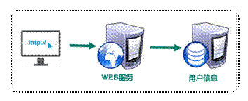
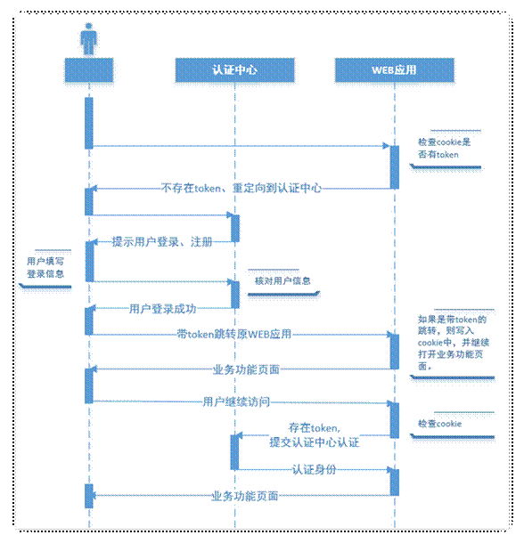

# 1.  用户登录业务介绍

## 1.1. 单一服务器模式

早期单一服务器，用户认证。

**适用于一台服务器的应用系统**



缺点：单点性能压力，无法扩展

 之前都是用这种方式QAQ

### 实现方式

1. 使用 `session` 对象实现
   1. 登录成功之后，将用户数据放到session里面
   2. 在应用页面中 通过 session 判断用户是否登录，并且获取用户数据
2. 


---


## 1.2. SSO(single sign on)模式

分布式，SSO(single sign on)模式


**优点 ：** 

用户身份信息独立管理，更好的分布式管理。

 可以自己扩展安全策略

**缺点：**

   认证服务器访问压力较大。

## 1.3. Token模式

业务流程图{用户访问业务时，必须登录的流程}



**优点：**

无状态： token无状态，session有状态的

基于标准化: 你的API可以采用标准化的 JSON Web Token (JWT)

**缺点：**

占用带宽

无法在服务器端销毁

注：基于微服务开发，选择token的形式相对较多，因此我使用token作为用户认证的标准

 


---


# 2、使用JWT进行跨域身份验证

## 1、传统用户身份验证


Internet服务无法与用户身份验证分开。一般过程如下：


1. 用户向服务器发送用户名和密码。
2. 验证服务器后，相关数据（如用户角色，登录时间等）将保存在当前会话中。
3. 服务器向用户返回session_id，session信息都会写入到用户的Cookie。
4. 用户的每个后续请求都将通过在Cookie中取出session_id传给服务器。
5. 服务器收到session_id并对比之前保存的数据，确认用户的身份。


这种模式最大的问题是，没有分布式架构，无法支持横向扩展。

## **2、解决方案**


1. session广播
2. 将透明令牌存入cookie，将用户身份信息存入redis


**另外一种灵活的解决方案：**

使用自包含令牌，通过客户端保存数据，而服务器不保存会话数据。 JWT是这种解决方案的代表。

# 3、JWT令牌

## 1、访问令牌的类型


## 2、JWT的组成

典型的，一个JWT看起来如下图：


该对象为一个很长的字符串，字符之间通过"."分隔符分为三个子串。

每一个子串表示了一个功能块，总共有以下三个部分：JWT头、有效载荷和签名

**JWT头**

JWT头部分是一个描述JWT元数据的JSON对象，通常如下所示。

 

```
{
  "alg": "HS256",
  "typ": "JWT"
}
```

在上面的代码中，alg属性表示签名使用的算法，默认为HMAC SHA256（写为HS256）；typ属性表示令牌的类型，JWT令牌统一写为JWT。最后，使用Base64 URL算法将上述JSON对象转换为字符串保存。

**有效载荷**

有效载荷部分，是JWT的主体内容部分，也是一个JSON对象，包含需要传递的数据。 JWT指定七个默认字段供选择。

 

```
iss：发行人
exp：到期时间
sub：主题
aud：用户
nbf：在此之前不可用
iat：发布时间
jti：JWT ID用于标识该JWT
```

除以上默认字段外，我们还可以自定义私有字段，如下例：

 

```
{
  "sub": "1234567890",
  "name": "Helen",
  "admin": true
}
```

请注意，默认情况下JWT是未加密的，任何人都可以解读其内容，因此不要构建隐私信息字段，存放保密信息，以防止信息泄露。

JSON对象也使用Base64 URL算法转换为字符串保存。

**签名哈希**

签名哈希部分是对上面两部分数据签名，通过指定的算法生成哈希，以确保数据不会被篡改。

首先，需要指定一个密码（secret）。该密码仅仅为保存在服务器中，并且不能向用户公开。然后，使用标头中指定的签名算法（默认情况下为HMAC SHA256）根据以下公式生成签名。

 

```
HMACSHA256(base64UrlEncode(header) + "." + base64UrlEncode(claims), secret)
```

在计算出签名哈希后，JWT头，有效载荷和签名哈希的三个部分组合成一个字符串，每个部分用"."分隔，就构成整个JWT对象。

**Base64URL算法**

如前所述，JWT头和有效载荷序列化的算法都用到了Base64URL。该算法和常见Base64算法类似，稍有差别。

作为令牌的JWT可以放在URL中（例如api.example/?token=xxx）。 Base64中用的三个字符是"+"，"/"和"="，由于在URL中有特殊含义，因此Base64URL中对他们做了替换："="去掉，"+"用"-"替换，"/"用"_"替换，这就是Base64URL算法。

## 3、JWT的原则

JWT的原则是在服务器身份验证之后，将生成一个JSON对象并将其发送回用户，如下所示。

 

```
{
  "sub": "1234567890",
  "name": "Helen",
  "admin": true
}
```

之后，当用户与服务器通信时，客户在请求中发回JSON对象。服务器仅依赖于这个JSON对象来标识用户。为了防止用户篡改数据，服务器将在生成对象时添加签名。

服务器不保存任何会话数据，即服务器变为无状态，使其更容易扩展。

## 4、JWT的用法

客户端接收服务器返回的JWT，将其存储在Cookie或localStorage中。

此后，客户端将在与服务器交互中都会带JWT。如果将它存储在Cookie中，就可以自动发送，但是不会跨域，因此一般是将它放入HTTP请求的Header Authorization字段中。当跨域时，也可以将JWT被放置于POST请求的数据主体中。

## 5、JWT问题和趋势

- JWT不仅可用于认证，还可用于信息交换。善用JWT有助于减少服务器请求数据库的次数。
- 生产的token可以包含基本信息，比如id、用户昵称、头像等信息，避免再次查库
- 存储在客户端，不占用服务端的内存资源


- JWT默认不加密，但可以加密。生成原始令牌后，可以再次对其进行加密。
- 当JWT未加密时，一些私密数据无法通过JWT传输。
- JWT的最大缺点是服务器不保存会话状态，所以在使用期间不可能取消令牌或更改令牌的权限。也就是说，一旦JWT签发，在有效期内将会一直有效。
- JWT本身包含认证信息，token是经过base64编码，所以可以解码，因此token加密前的对象不应该包含敏感信息，一旦信息泄露，任何人都可以获得令牌的所有权限。为了减少盗用，JWT的有效期不宜设置太长。对于某些重要操作，用户在使用时应该每次都进行进行身份验证。
- 为了减少盗用和窃取，JWT不建议使用HTTP协议来传输代码，而是使用加密的HTTPS协议进行传输。


# 4、整合JWT令牌

## 1、在common_utils模块中添加jwt工具依赖

在pom中添加

 

```
<dependencies>
    <!-- JWT-->
    <dependency>
        <groupId>io.jsonwebtoken</groupId>
        <artifactId>jjwt</artifactId>
    </dependency>
</dependencies>
```

## 2、创建JWT工具类

 

```
import io.jsonwebtoken.Claims;
import io.jsonwebtoken.Jws;
import io.jsonwebtoken.Jwts;
import io.jsonwebtoken.SignatureAlgorithm;
import org.springframework.util.StringUtils;
import javax.servlet.http.HttpServletRequest;
import java.util.Date;
/**
 * @author
 */
public class JwtUtils {
    public static final long EXPIRE = 1000 * 60 * 60 * 24;
    public static final String APP_SECRET = "ukc8BDbRigUDaY6pZFfWus2jZWLPHO";
    public static String getJwtToken(String id, String nickname){
        String JwtToken = Jwts.builder()
                .setHeaderParam("typ", "JWT")
                .setHeaderParam("alg", "HS256")
                .setSubject("guli-user")
                .setIssuedAt(new Date())
                .setExpiration(new Date(System.currentTimeMillis() + EXPIRE))
                .claim("id", id)
                .claim("nickname", nickname)
                .signWith(SignatureAlgorithm.HS256, APP_SECRET)
                .compact();
        return JwtToken;
    }
    /**
     * 判断token是否存在与有效
     * @param jwtToken
     * @return
     */
    public static boolean checkToken(String jwtToken) {
        if(StringUtils.isEmpty(jwtToken)) return false;
        try {
            Jwts.parser().setSigningKey(APP_SECRET).parseClaimsJws(jwtToken);
        } catch (Exception e) {
            e.printStackTrace();
            return false;
        }
        return true;
    }
    /**
     * 判断token是否存在与有效
     * @param request
     * @return
     */
    public static boolean checkToken(HttpServletRequest request) {
        try {
            String jwtToken = request.getHeader("token");
            if(StringUtils.isEmpty(jwtToken)) return false;
            Jwts.parser().setSigningKey(APP_SECRET).parseClaimsJws(jwtToken);
        } catch (Exception e) {
            e.printStackTrace();
            return false;
        }
        return true;
    }
    /**
     * 根据token获取会员id
     * @param request
     * @return
     */
    public static String getMemberIdByJwtToken(HttpServletRequest request) {
        String jwtToken = request.getHeader("token");
        if(StringUtils.isEmpty(jwtToken)) return "";
        Jws<Claims> claimsJws = Jwts.parser().setSigningKey(APP_SECRET).parseClaimsJws(jwtToken);
        Claims claims = claimsJws.getBody();
        return (String)claims.get("id");
    }
}
```


---


# 登录功能前端实现

## 一、在nuxt环境中安装插件

### 1、安装element-ui 和 vue-qriously

（1）执行命令安装

npm install element-ui

# 重点微信支付用的

插件

npm install vue-qriously

2、修改配置文件 nuxt-swiper-plugin.js，使用插件

nuxt-swiper-plugin.js

 

```js
import Vue from 'vue'
import VueAwesomeSwiper from 'vue-awesome-swiper/dist/ssr'
import VueQriously from 'vue-qriously'
import ElementUI from 'element-ui' //element-ui的全部组件
import 'element-ui/lib/theme-chalk/index.css'//element-ui的css
Vue.use(ElementUI) //使用elementUI
Vue.use(VueQriously)
Vue.use(VueAwesomeSwiper)
```

## 二、用户注册功能前端整合

### 1、在api文件夹中创建注册的js文件，定义接口


**register.js**

 

```js
import request from '@/utils/request'
export default {
  //根据手机号码发送短信
  getMobile(mobile) {
    return request({
      url: `/edumsm/send/${mobile}`,
      method: 'get'
    })
  },
  //用户注册
  submitRegister(formItem) {
    return request({
      url: `/ucenterservice/apimember/register`,
      method: 'post',
      data: formItem
    })
  }
}
```

**2****、在pages文件夹中创建注册页面，调用方法**

**（1）在layouts创建布局页面**

**sign.vue**

 

```html
<template>
  <div class="sign">
    <!--标题-->
    <div class="logo">
      
    </div>
    <!--表单-->
    <nuxt/>
  </div>
</template>
```

（2）创建注册页面

修改layouts文件夹里面default.vue页面，修改登录和注册超链接地址


在pages文件夹下，创建注册和登录页面


**register.vue**

 

```js
<template>
  <div class="main">
    <div class="title">
      <a href="/login">登录</a>
      <span>·</span>
      <a class="active" href="/register">注册</a>
    </div>
    <div class="sign-up-container">
      <el-form ref="userForm" :model="params">
        <el-form-item class="input-prepend restyle" prop="nickname" :rules="[{ required: true, message: '请输入你的昵称', trigger: 'blur' }]">
          <div>
            <el-input type="text" placeholder="你的昵称" v-model="params.nickname"/>
            <i class="iconfont icon-user"/>
          </div>
        </el-form-item>
        <el-form-item class="input-prepend restyle no-radius" prop="mobile" :rules="[{ required: true, message: '请输入手机号码', trigger: 'blur' },{validator: checkPhone, trigger: 'blur'}]">
          <div>
            <el-input type="text" placeholder="手机号" v-model="params.mobile"/>
            <i class="iconfont icon-phone"/>
          </div>
        </el-form-item>
        <el-form-item class="input-prepend restyle no-radius" prop="code" :rules="[{ required: true, message: '请输入验证码', trigger: 'blur' }]">
          <div style="width: 100%;display: block;float: left;position: relative">
            <el-input type="text" placeholder="验证码" v-model="params.code"/>
            <i class="iconfont icon-phone"/>
          </div>
          <div class="btn" style="position:absolute;right: 0;top: 6px;width: 40%;">
            <a href="javascript:" type="button" @click="getCodeFun()" :value="codeTest" style="border: none;background-color: none">{{codeTest}}</a>
          </div>
        </el-form-item>
        <el-form-item class="input-prepend" prop="password" :rules="[{ required: true, message: '请输入密码', trigger: 'blur' }]">
          <div>
            <el-input type="password" placeholder="设置密码" v-model="params.password"/>
            <i class="iconfont icon-password"/>
          </div>
        </el-form-item>
        <div class="btn">
          <input type="button" class="sign-up-button" value="注册" @click="submitRegister()">
        </div>
        <p class="sign-up-msg">
          点击 “注册” 即表示您同意并愿意遵守简书
          <br>
          <a target="_blank" href="http://www.jianshu.com/p/c44d171298ce">用户协议</a>
          和
          <a target="_blank" href="http://www.jianshu.com/p/2ov8x3">隐私政策</a> 。
        </p>
      </el-form>
      <!-- 更多注册方式 -->
      <div class="more-sign">
        <h6>社交帐号直接注册</h6>
        <ul>
          <li><a id="weixin" class="weixin" target="_blank" href="http://huaan.free.idcfengye.com/api/ucenter/wx/login"><i
            class="iconfont icon-weixin"/></a></li>
          <li><a id="qq" class="qq" target="_blank" href="#"><i class="iconfont icon-qq"/></a></li>
        </ul>
      </div>
    </div>
  </div>
</template>
<script>
  import '~/assets/css/sign.css'
  import '~/assets/css/iconfont.css'
  import registerApi from '@/api/register'
  export default {
    layout: 'sign',
    data() {
      return {
        params: {
          mobile: '',
          code: '',
          nickname: '',
          password: ''
        },
        sending: true,      //是否发送验证码
        second: 60,        //倒计时间
        codeTest: '获取验证码'
      }
    },
    methods: {
      getCodeFun() {
        //sending = false
        //his.sending原为true,请求成功，!this.sending == true，主要是防止有人把disabled属性去掉，多次点击；
        if (!this.sending)
          return;
        //debugger
        // prop 换成你想监听的prop字段
        this.$refs.userForm.validateField('mobile', (errMsg) => {
          if (errMsg == '') {
            registerApi.getMobile(this.params.mobile).then(res => {
              this.sending = false;
              this.timeDown();
            });
          }
        })
      },
      timeDown() {
        let result = setInterval(() => {
          --this.second;
          this.codeTest = this.second
          if (this.second < 1) {
            clearInterval(result);
            this.sending = true;
            //this.disabled = false;
            this.second = 60;
            this.codeTest = "获取验证码"
          }
        }, 1000);
      },
      submitRegister() {
        this.$refs['userForm'].validate((valid) => {
          if (valid) {
            registerApi.submitRegister(this.params).then(response => {
              //提示注册成功
              this.$message({
                type: 'success',
                message: "注册成功"
              })
              this.$router.push({path: '/login'})
            })
          }
        })
      },
      checkPhone (rule, value, callback) {
        //debugger
        if (!(/^1[34578]\d{9}$/.test(value))) {
          return callback(new Error('手机号码格式不正确'))
        }
        return callback()
      }
    }
  }
</script>
```

# 

## 三、用户登录功能前端整合

### 1、在api文件夹中创建登录的js文件，定义接口


**login.js**

 

```js
import request from '@/utils/request'
export default {
  //登录
  submitLogin(userInfo) {
    return request({
      url: `/ucenterservice/apimember/login`,
      method: 'post',
      data: userInfo
    })
  },
  //根据token获取用户信息
  getLoginInfo() {
    return request({
      url: `/ucenterservice/apimember/auth/getLoginInfo`,
      method: 'get',
     // headers: {'token': cookie.get('guli_token')}
    })
    //headers: {'token': cookie.get('guli_token')} 
  }
}
```

**2、在pages文件夹中创建登录页面，调用方法**


**（1）安装js-cookie插件**

npm install js-cookie

**（2）login.vue**

 

```js
<template>
  <div class="main">
    <div class="title">
      <a class="active" href="/login">登录</a>
      <span>·</span>
      <a href="/register">注册</a>
    </div>
    <div class="sign-up-container">
      <el-form ref="userForm" :model="user">
        <el-form-item class="input-prepend restyle" prop="mobile" :rules="[{ required: true, message: '请输入手机号码', trigger: 'blur' },{validator: checkPhone, trigger: 'blur'}]">
          <div >
            <el-input type="text" placeholder="手机号" v-model="user.mobile"/>
            <i class="iconfont icon-phone" />
          </div>
        </el-form-item>
        <el-form-item class="input-prepend" prop="password" :rules="[{ required: true, message: '请输入密码', trigger: 'blur' }]">
          <div>
            <el-input type="password" placeholder="密码" v-model="user.password"/>
            <i class="iconfont icon-password"/>
          </div>
        </el-form-item>
        <div class="btn">
          <input type="button" class="sign-in-button" value="登录" @click="submitLogin()">
        </div>
      </el-form>
      <!-- 更多登录方式 -->
      <div class="more-sign">
        <h6>社交帐号登录</h6>
        <ul>
          <li><a id="weixin" class="weixin" target="_blank" href="http://qy.free.idcfengye.com/api/ucenter/weixinLogin/login"><i class="iconfont icon-weixin"/></a></li>
          <li><a id="qq" class="qq" target="_blank" href="#"><i class="iconfont icon-qq"/></a></li>
        </ul>
      </div>
    </div>
  </div>
</template>
<script>
  import '~/assets/css/sign.css'
  import '~/assets/css/iconfont.css'
  import cookie from 'js-cookie'
  import loginApi from '@/api/login'
  export default {
    layout: 'sign',
    data () {
      return {
        user:{
          mobile:'',
          password:''
        },
        loginInfo:{}
      }
    },
    methods: {
      submitLogin(){
            loginApi.submitLogin(this.user).then(response => {
              if(response.data.success){
                //把token存在cookie中、也可以放在localStorage中
                cookie.set('guli_token', response.data.data.token, { domain: 'localhost' })
                //登录成功根据token获取用户信息
                loginApi.getLoginInfo().then(response => {
                  
                  this.loginInfo = response.data.data.item
                  //将用户信息记录cookie
                  cookie.set('guli_ucenter', this.loginInfo, { domain: 'localhost' })
                  //跳转页面
                  window.location.href = "/";
                })
              }
            })
      },
      checkPhone (rule, value, callback) {
        //debugger
        if (!(/^1[34578]\d{9}$/.test(value))) {
          return callback(new Error('手机号码格式不正确'))
        }
        return callback()
      }
    }
  }
</script>
<style>
   .el-form-item__error{
    z-index: 9999999;
  }
</style>
```

**3、在request.js添加拦截器，用于传递token信息**

 

```js
import axios from 'axios'
import { MessageBox, Message } from 'element-ui'
import cookie from 'js-cookie'
// 创建axios实例
const service = axios.create({
   //baseURL: 'http://qy.free.idcfengye.com/api', // api 的 base_url
  //baseURL: 'http://localhost:8210', // api 的 base_url
  baseURL: 'http://localhost:9001',
  timeout: 15000 // 请求超时时间
  
})
// http request 拦截器
service.interceptors.request.use(
  config => {
  //debugger
  if (cookie.get('guli_token')) {
    config.headers['token'] = cookie.get('guli_token');
  }
    return config
  },
  err => {
  return Promise.reject(err);
})
// http response 拦截器
service.interceptors.response.use(
  response => {
    //debugger
    if (response.data.code == 28004) {
        console.log("response.data.resultCode是28004")
        // 返回 错误代码-1 清除ticket信息并跳转到登录页面
        //debugger
        window.location.href="/login"
        return
    }else{
      if (response.data.code !== 20000) {
        //25000：订单支付中，不做任何提示
        if(response.data.code != 25000) {
          Message({
            message: response.data.message || 'error',
            type: 'error',
            duration: 5 * 1000
          })
        }
      } else {
        return response;
      }
    }
  },
  error => {
    return Promise.reject(error.response)   // 返回接口返回的错误信息
});
export default service
```

4**、修改layouts中的default.vue页面**

**（1）显示登录之后的用户信息**

 

```js
<script>
import "~/assets/css/reset.css";
import "~/assets/css/theme.css";
import "~/assets/css/global.css";
import "~/assets/css/web.css";
import cookie from 'js-cookie'
import userApi from '@/api/login'
export default {
  data() {
    return {
      token: '',
      loginInfo: {
        id: '',
        age: '',
        avatar: '',
        mobile: '',
        nickname: '',
        sex: ''
      }
    }
  },
  created() {
    this.showInfo()
  },
  methods: {
    showInfo() {
      //debugger
      var jsonStr = cookie.get("guli_ucenter");
      //alert(jsonStr)
      if (jsonStr) {
        this.loginInfo = JSON.parse(jsonStr)
      }
    },
    logout() {
      //debugger
      cookie.set('guli_ucenter', "", {domain: 'localhost'})
      cookie.set('guli_token', "", {domain: 'localhost'})
      //跳转页面
      window.location.href = "/"
    }
  }
}
</script>
```

**（2）\**default.vue页面\**显示登录之后的用户信息**

 

```html
 <!-- / nav -->
<ul class="h-r-login">
    <li v-if="!loginInfo.id" id="no-login">
        <a href="/login" title="登录">
            <em class="icon18 login-icon">&nbsp;</em>
            <span class="vam ml5">登录</span>
        </a>
        |
        <a href="/register" title="注册">
            <span class="vam ml5">注册</span>
        </a>
    </li>
    <li v-if="loginInfo.id" id="is-login-one" class="mr10">
        <a id="headerMsgCountId" href="#" title="消息">
            <em class="icon18 news-icon">&nbsp;</em>
        </a>
        <q class="red-point" style="display: none">&nbsp;</q>
    </li>
    <li v-if="loginInfo.id" id="is-login-two" class="h-r-user">
        <a href="/ucenter" title>
            
            <span id="userName" class="vam disIb">{{ loginInfo.nickname }}</span>
        </a>
        <a href="javascript:void(0);" title="退出" @click="logout()" class="ml5">退出</a>
    </li>
    <!-- /未登录显示第1 li；登录后显示第2，3 li -->
</ul>
```